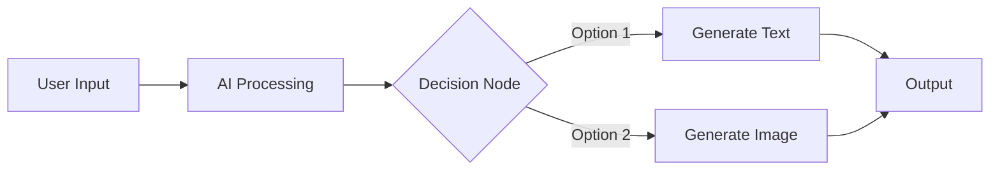
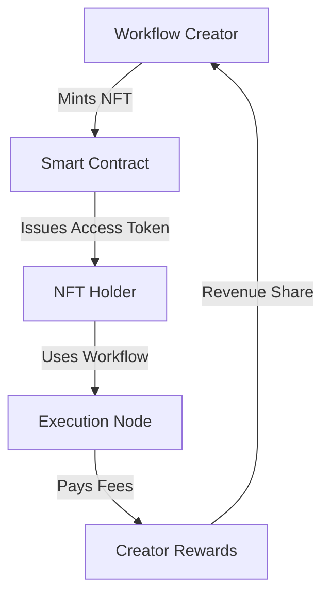

import { Card, CardHeader, CardTitle, CardDescription } from '@site/src/components/Card';
import { Callout } from '@site/src/components/Callout';
import { Features, Feature } from '@site/src/components/Features';
import { CollapsibleCodeBlock, InlineCodeCard } from '@site/src/components/CodeBlock';
import Tabs from '@theme/Tabs';
import TabItem from '@theme/TabItem';


# NeuraLabs Platform Overview

NeuraLabs is a revolutionary platform that democratizes access to AI capabilities through blockchain technology, enabling users to create, share, and monetize AI workflows in a decentralized manner.

## Core Vision

<Callout type="info">
  **Our Mission**: To make advanced AI accessible to everyone by removing centralized gatekeepers and enabling a community-driven ecosystem of AI tools and workflows.
</Callout>

## Key Features

###  Visual Workflow Builder

Create complex AI pipelines using an intuitive drag-and-drop interface:



###  NFT-Based Access Control

Each workflow is protected by NFT ownership:
- **Create Once**: Design your workflow
- **Mint NFT**: Create access tokens
- **Distribute**: Sell or share access
- **Monetize**: Earn from your creations

###  Zero-Knowledge Authentication

Privacy-first authentication using SUI's zkLogin:
- No passwords required
- Privacy preserved
- Seamless Web3 experience
- OAuth integration support

###  Decentralized Storage

Leverage Walrus for distributed data:
- Redundant storage
- Censorship resistant
- Cost effective
- High availability

## Platform Components

<div className="grid grid-cols-1 md:grid-cols-3 gap-4 mt-6">
  <div className="card padding--md">
    <h3>Frontend Application</h3>
    <ul>
      <li>React-based UI</li>
      <li>Visual flow editor</li>
      <li>Wallet integration</li>
      <li>Real-time chat interface</li>
    </ul>
  </div>
  
  <div className="card padding--md">
    <h3>Backend Services</h3>
    <ul>
      <li>FastAPI REST API</li>
      <li>WebSocket support</li>
      <li>JWT authentication</li>
      <li>Redis caching</li>
    </ul>
  </div>
  
  <div className="card padding--md">
    <h3>Blockchain Layer</h3>
    <ul>
      <li>SUI smart contracts</li>
      <li>NFT minting/trading</li>
      <li>Access verification</li>
      <li>Seal encryption</li>
    </ul>
  </div>
</div>

## Workflow Types

NeuraLabs supports various AI workflow patterns:

### 1. Simple AI Chat
Basic conversational AI with customizable prompts and models.

### 2. Multi-Model Pipeline
Chain multiple AI models together for complex tasks:
```
Text Input → LLM Analysis → Image Generation → Final Output
```

### 3. Conditional Workflows
Dynamic flows based on AI responses:
```
User Query → Classification → Route to Appropriate Model → Response
```

### 4. Data Processing Pipelines
Process and transform data using AI:
```
Data Input → AI Extraction → Transformation → Storage
```

## Supported AI Providers

<Tabs>
  <TabItem value="text" label="Text Models" default>
    - **Anthropic Claude**: Advanced reasoning and analysis
    - **DeepSeek**: Cost-effective general purpose
    - **OpenAI GPT**: Wide compatibility
    - **Local Models**: Privacy-focused options
  </TabItem>
  <TabItem value="image" label="Image Models">
    - **DALL-E**: High-quality generation
    - **Stable Diffusion**: Open-source option
    - **Midjourney**: Artistic styles
  </TabItem>
  <TabItem value="specialized" label="Specialized">
    - **Whisper**: Speech-to-text
    - **Code Models**: Programming assistance
    - **Translation**: Multi-language support
  </TabItem>
</Tabs>

## Use Cases

### For Developers
- Build and monetize AI tools
- Create reusable components
- Integrate with existing apps
- Access multiple AI providers

### For Businesses
- Automate workflows
- Process documents
- Customer service bots
- Data analysis pipelines

### For Creators
- Generate content
- Design assistants
- Creative tools
- Collaborative workflows

## Economic Model



### Revenue Streams
1. **NFT Sales**: One-time purchase for access
2. **Usage Fees**: Pay-per-use model
3. **Subscriptions**: Monthly access plans
4. **Custom Development**: Enterprise solutions

## Security & Privacy

<Callout type="warning">
  NeuraLabs prioritizes security and privacy at every level of the platform.
</Callout>

### Security Features
- **Encrypted Storage**: All sensitive data encrypted
- **Access Control**: Blockchain-verified permissions
- **Audit Trail**: Immutable transaction history
- **Rate Limiting**: Protection against abuse

### Privacy Guarantees
- **zkLogin**: No password storage
- **Local Execution**: Option for sensitive data
- **Data Ownership**: Users control their data
- **GDPR Compliance**: Right to deletion

## Getting Started

Ready to explore NeuraLabs? Here's your journey:

1. **[Set Up Your Environment](./getting-started)** - Install prerequisites
2. **[Understand the Architecture](./architecture)** - Learn system design
3. **[Create Your First Flow](../implementation/02-frontend/flow-builder)** - Build an AI workflow
4. **[Deploy Smart Contracts](../implementation/05-smart-contracts/deployment)** - Go on-chain
5. **[Launch Your Creation](./ai-workflow-design)** - Share with the world

## Community & Ecosystem

Join the NeuraLabs community:

<div className="flex gap-4 mt-6">
  <a href="https://discord.gg/neuralabs" className="button button--primary">
    Discord Community
  </a>
  <a href="https://github.com/neuralabs" className="button button--secondary">
    GitHub
  </a>
  <a href="https://forum.neuralabs.org" className="button button--secondary">
    Developer Forum
  </a>
</div>

## What's Next?

- Deep dive into the [System Architecture](./architecture)
- Learn about [Blockchain Integration](./blockchain-integration)
- Explore [Security Model](./security-model)
- Start building with our [Implementation Guides](../implementation/01-database/setup)