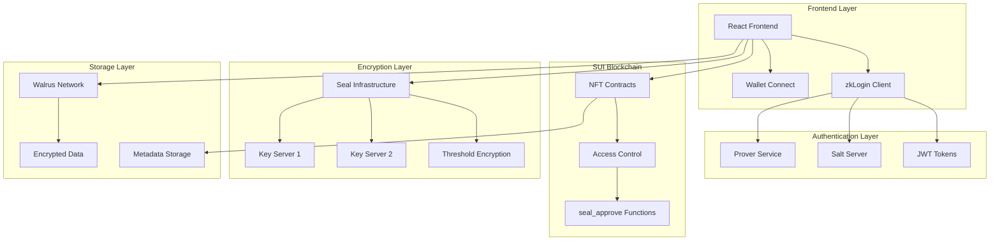
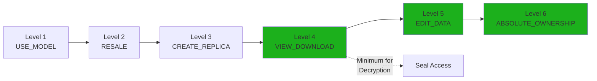
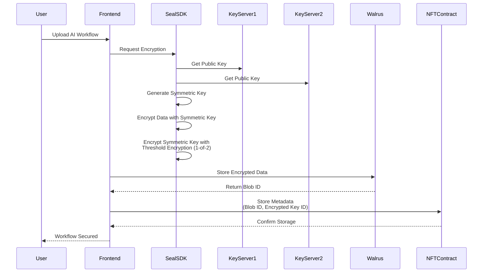
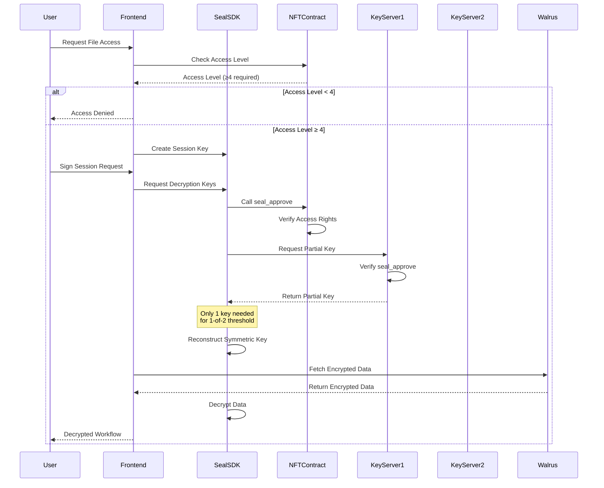
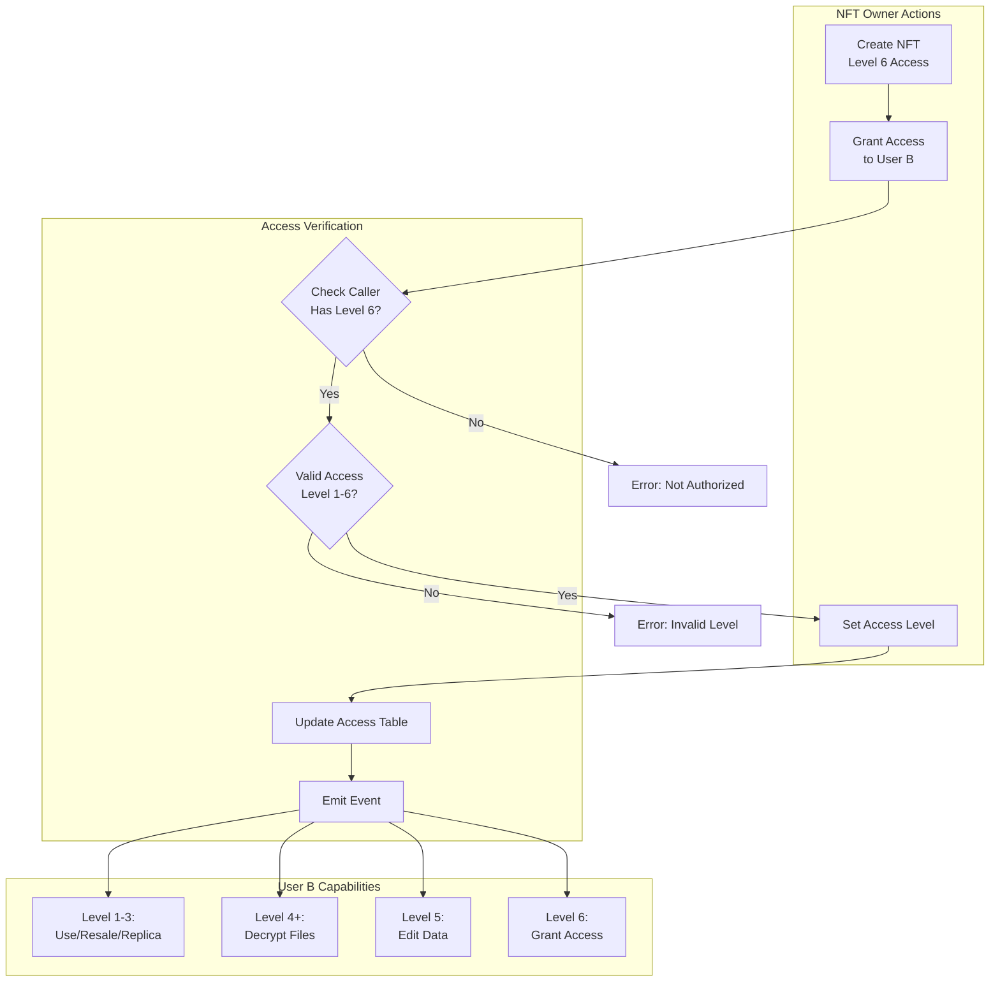
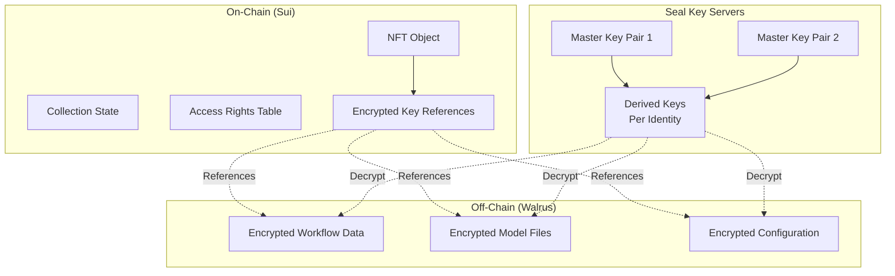
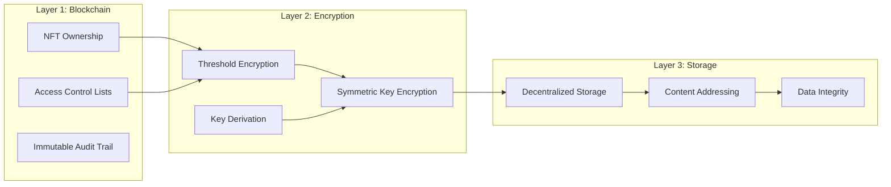
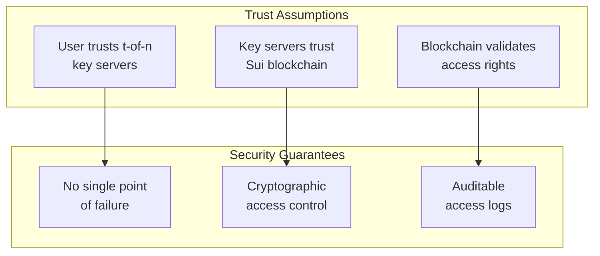
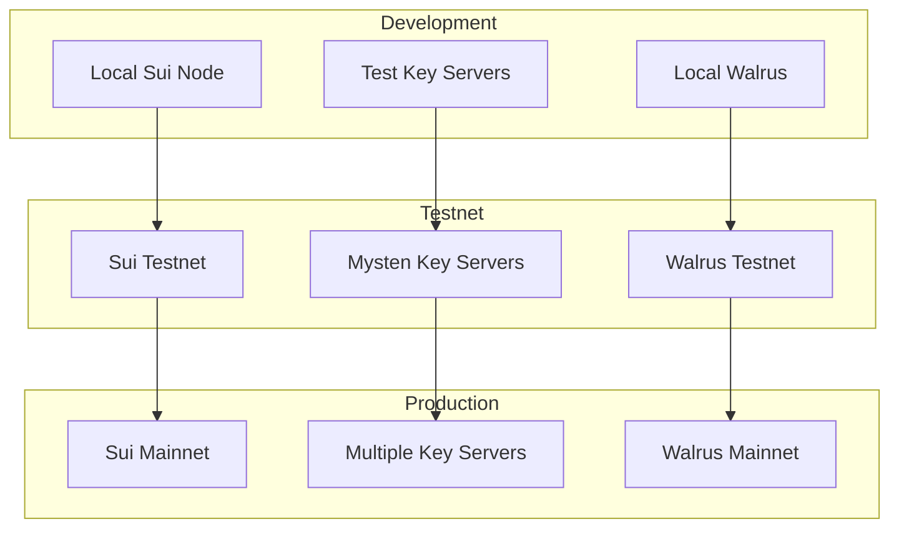

import { Card, CardHeader, CardTitle, CardDescription } from '@site/src/components/Card';
import { CollapsibleCodeBlock, InlineCodeCard } from '@site/src/components/CodeBlock';

# Blockchain Architecture

Comprehensive overview of the NeuraLabs blockchain architecture built on SUI, featuring NFT-based access control, Seal threshold encryption, and Walrus decentralized storage.

## System Architecture Overview

The NeuraLabs platform leverages SUI's advanced blockchain technologies to create a secure, decentralized AI workflow platform with multiple integrated components working together seamlessly.

## NFT-Based Access Control Architecture

The system uses NFTs to represent AI workflows with 6 levels of hierarchical access control, where each level builds upon the previous one's capabilities.

  <h3>Access Level Details</h3>
  
  - **Level 1-3**: Basic usage, resale, and replication rights
  - **Level 4+**: File decryption capabilities (minimum for Seal)
  - **Level 5**: Data modification rights  
  - **Level 6**: Absolute ownership and admin controls

## Seal Threshold Encryption Flow

### Data Encryption Process

The encryption process involves multiple steps to ensure secure data storage with threshold-based access control.

### Data Decryption Process

The decryption process validates access rights before allowing data retrieval, ensuring only authorized users can access encrypted content.

## Access Grant and Management Workflow

The system provides flexible access management capabilities allowing NFT owners to grant and revoke permissions dynamically.

## Data Storage Architecture

The platform uses a hybrid approach combining on-chain metadata with off-chain encrypted storage for optimal performance and security.

## Security Model

### Multi-Layer Security Architecture

The platform implements multiple security layers to ensure comprehensive protection of user data and assets.

### Trust Model and Assumptions

The security model is built on well-defined trust assumptions and cryptographic guarantees.

## Smart Contract Architecture

The NeuraLabs smart contracts are designed with modularity and extensibility in mind, consisting of four core modules.

### Contract Module Structure

  <Card>
    <CardHeader>
      <CardTitle>
        NFT Module
      </CardTitle>
      <CardDescription>
        Core NFT creation and management functionality with access control integration
      </CardDescription>
    </CardHeader>
  </Card>

  <Card>
    <CardHeader>
      <CardTitle>
        Access Module
      </CardTitle>
      <CardDescription>
        6-level access control system with granular permission management
      </CardDescription>
    </CardHeader>
  </Card>

  <Card>
    <CardHeader>
      <CardTitle>
        Storage Module
      </CardTitle>
      <CardDescription>
        Walrus integration for encrypted data storage and retrieval
      </CardDescription>
    </CardHeader>
  </Card>

  <Card>
    <CardHeader>
      <CardTitle>
        Utils Module
      </CardTitle>
      <CardDescription>
        Helper functions and utilities for contract operations
      </CardDescription>
    </CardHeader>
  </Card>

## Integration Points

### Frontend Integration Architecture

The frontend integration involves multiple components working together to provide a seamless user experience.

<InlineCodeCard
  title="Frontend Integration Points"
  description="Key integration points in React application"
  language="javascript"
  code={`// Key integration points in React app
const integrationFlow = {
  wallet: "Sui Wallet / zkLogin",
  encryption: "@mysten/seal SDK",
  storage: "Walrus SDK", 
  blockchain: "@mysten/sui.js"
};

// Wallet Connection
import { WalletProvider } from '@mysten/wallet-adapter-react';
import { SuiWalletAdapter } from '@mysten/wallet-adapter-sui';

// Seal Integration
import { SealClient } from '@mysten/seal';

// Sui Blockchain
import { SuiClient, getFullnodeUrl } from '@mysten/sui.js/client';

const client = new SuiClient({ 
  url: getFullnodeUrl('testnet') 
});`}
/>

### Backend Integration Architecture

The backend services provide API endpoints and business logic for the platform.

<InlineCodeCard
  title="Backend Integration Points"
  description="Key integration points in Python backend"
  language="python"
  code={`# Key integration points in Python backend
integration_points = {
    "blockchain": "sui-py SDK",
    "database": "PostgreSQL + Redis",
    "ai_execution": "Custom Workflow Engine",
    "authentication": "JWT + zkLogin"
}

# Sui Python SDK Integration
from sui_python_sdk import SuiClient
from sui_python_sdk.types import TransactionBlock

# Database Integration
import asyncpg
import redis.asyncio as redis

# AI Workflow Engine
from workflow_engine import WorkflowExecutor`}
/>

## Deployment Architecture

The platform supports multiple deployment environments with different configurations for development, testing, and production.

## Performance and Scalability

### Expected Performance Metrics

The platform is designed to handle significant throughput while maintaining security and decentralization.

| Operation | Expected Time | Throughput | Gas Usage |
|-----------|---------------|------------|-----------|
| NFT Creation | < 2 seconds | 10-20 TPS | ~0.01 SUI |
| Access Grant/Revoke | < 1 second | 20-30 TPS | ~0.005 SUI |
| File Encryption | Variable | 10+ MB/s | Client-side |
| File Decryption | Variable | 15+ MB/s | Client-side |
| Walrus Upload | Variable | 5+ MB/s | Storage fees |

### Scalability Considerations

  <h3>Horizontal Scaling</h3>
  <ul>
    <li><strong>Key Servers:</strong> Support for multiple independent key servers</li>
    <li><strong>Storage Nodes:</strong> Walrus network provides distributed storage</li>
    <li><strong>API Endpoints:</strong> Load balancing across multiple backend instances</li>
    <li><strong>Caching:</strong> Redis for session management and performance optimization</li>
  </ul>

## Best Practices and Recommendations

### Smart Contract Development

1. **Modular Design**: Separate concerns into distinct modules
2. **Access Control**: Implement comprehensive permission systems  
3. **Gas Optimization**: Minimize transaction costs through efficient code
4. **Upgradeability**: Design for future enhancements and fixes

### Security Recommendations

1. **Key Management**: Use 1-of-2 threshold for testing, 2-of-3+ for production
2. **Access Control**: Start with minimal access and grant incrementally
3. **Audit Trail**: Maintain comprehensive logs of all access changes
4. **Regular Reviews**: Periodic security audits and penetration testing

### Integration Guidelines

1. **Error Handling**: Implement robust error handling and recovery
2. **Rate Limiting**: Protect against abuse and spam
3. **Monitoring**: Comprehensive logging and alerting systems
4. **Documentation**: Maintain up-to-date API and integration docs

## Conclusion

The NeuraLabs blockchain architecture represents a sophisticated integration of SUI's capabilities with modern encryption and storage technologies. By leveraging NFT-based access control, Seal threshold encryption, and Walrus decentralized storage, the platform provides a secure, scalable foundation for decentralized AI workflow management.

The modular design ensures flexibility and extensibility while maintaining security and performance. The multi-layer approach to data protection, combined with transparent on-chain governance, creates a robust platform for the future of decentralized AI applications.