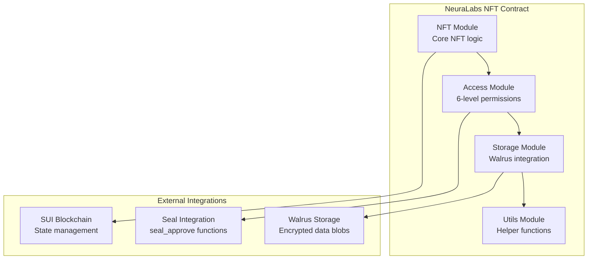

import { Card, CardHeader, CardTitle, CardDescription } from '@site/src/components/Card';

# Smart Contracts Overview

Understanding the NeuraLabs smart contract architecture for NFT-based access control with Seal integration and Walrus storage.

## Architecture Overview

The NeuraLabs smart contract system implements a sophisticated NFT-based access control mechanism with 6 permission levels, integrated with Seal threshold encryption for secure data management. The contract architecture consists of 4 modular components for easy maintenance and extensibility.

## Contract Architecture



## Contract Modules

### 1. NFT Module (`nft.move`)
Core NFT functionality with access control integration.

**Key Functions:**
- `create_nft`: Mint new NFTs with specific access levels
- `transfer_nft`: Transfer ownership with access level preservation
- `burn_nft`: Destroy NFTs and clean up access permissions

### 2. Access Module (`access.move`)
Implements 6-level access control system:

<div className="grid grid-cols-2 md:grid-cols-3 gap-4 mt-4">
  <Card>
    <CardHeader>
      <CardTitle>Level 1: USE_MODEL</CardTitle>
      <CardDescription>Basic usage rights</CardDescription>
    </CardHeader>
  </Card>
  
  <Card>
    <CardHeader>
      <CardTitle>Level 2: RESALE</CardTitle>
      <CardDescription>Can resell the NFT</CardDescription>
    </CardHeader>
  </Card>
  
  <Card>
    <CardHeader>
      <CardTitle>Level 3: CREATE_REPLICA</CardTitle>
      <CardDescription>Can create copies</CardDescription>
    </CardHeader>
  </Card>
  
  <Card>
    <CardHeader>
      <CardTitle>Level 4: VIEW_DOWNLOAD</CardTitle>
      <CardDescription>Can decrypt files (Seal minimum)</CardDescription>
    </CardHeader>
  </Card>
  
  <Card>
    <CardHeader>
      <CardTitle>Level 5: EDIT_DATA</CardTitle>
      <CardDescription>Can modify encrypted data</CardDescription>
    </CardHeader>
  </Card>
  
  <Card>
    <CardHeader>
      <CardTitle>Level 6: ABSOLUTE_OWNERSHIP</CardTitle>
      <CardDescription>Full control and admin rights</CardDescription>
    </CardHeader>
  </Card>
</div>

**Key Functions:**
- `grant_access`: Grant access level to users
- `revoke_access`: Remove access permissions
- `check_access`: Verify user access levels
- `update_access_level`: Modify existing permissions

### 3. Storage Module (`storage.move`)
Manages encrypted data storage with Walrus integration.

**Key Functions:**
- `store_encrypted_data`: Store encrypted blobs on Walrus
- `retrieve_data_metadata`: Get data access information
- `update_storage_reference`: Update Walrus blob references

### 4. Utils Module (`utils.move`)
Helper functions for the contract system.

**Key Functions:**
- `verify_signature`: Validate user signatures
- `generate_access_key`: Create deterministic access keys
- `validate_access_level`: Check access level constraints

## Access Control Logic

The access control system follows a hierarchical model where higher levels include all permissions of lower levels:

```move
// Example access control check
public fun check_minimum_access(user_level: u8, required_level: u8): bool {
    user_level >= required_level
}

// Seal integration requires minimum level 4
public fun can_decrypt_data(user_level: u8): bool {
    user_level >= 4  // VIEW_DOWNLOAD or higher
}
```

## Seal Integration

The contracts include `seal_approve` functions that follow Seal's conventions for threshold encryption:

```move
// Example seal_approve function signature
entry fun seal_approve(
    id: vector<u8>,
    nft: &NFT,
    ctx: &TxContext
) {
    // Verify caller has sufficient access level
    let caller = tx_context::sender(ctx);
    let access_level = get_user_access_level(caller, object::id(nft));
    
    // Require level 4 or above for file decryption
    assert!(access_level >= 4, EInsufficientAccess);
    
    // Additional access control logic...
}
```

## Security Features

<div className="card padding--md mt-4" style={{ borderLeft: '4px solid #28a745' }}>
  <h3>Built-in Security</h3>
  <ul>
    <li><strong>Access Control:</strong> Hierarchical permission system with 6 levels</li>
    <li><strong>Input Validation:</strong> All user inputs are validated and sanitized</li>
    <li><strong>Ownership Verification:</strong> Only authorized users can modify permissions</li>
    <li><strong>Gas Optimization:</strong> Efficient operations to minimize transaction costs</li>
    <li><strong>Upgrade Safety:</strong> Modular design for safe contract upgrades</li>
  </ul>
</div>

## Performance Characteristics

| Operation | Gas Cost | Time Complexity | Notes |
|-----------|----------|-----------------|-------|
| NFT Creation | ~0.001 SUI | O(1) | Fixed cost per NFT |
| Access Grant | ~0.0005 SUI | O(1) | Single permission update |
| Access Check | ~0.0001 SUI | O(1) | Read-only operation |
| Seal Approve | ~0.0003 SUI | O(1) | Verification + approval |

## Contract State Management

The contracts maintain state efficiently using SUI's object model:

- **NFT Objects**: Individual NFTs with embedded access levels
- **Access Registry**: Centralized mapping of user permissions
- **Storage References**: Links to Walrus blob storage
- **Event Logs**: On-chain audit trail for all access changes

## Next Steps

1. **[Deployment Guide](./deployment)** - Deploy contracts to testnet
2. **[Testing Guide](./testing)** - Comprehensive testing strategies
3. **[Integration Guide](./integration)** - Frontend and backend integration
4. **[Seal Integration](../encryption/seal)** - Configure threshold encryption

## References

- [SUI Move Documentation](https://docs.sui.io/concepts/sui-move)
- [Move Language Reference](https://move-language.github.io/move/)
- [SUI Smart Contract Examples](https://github.com/MystenLabs/sui/tree/main/sui_programmability/examples)