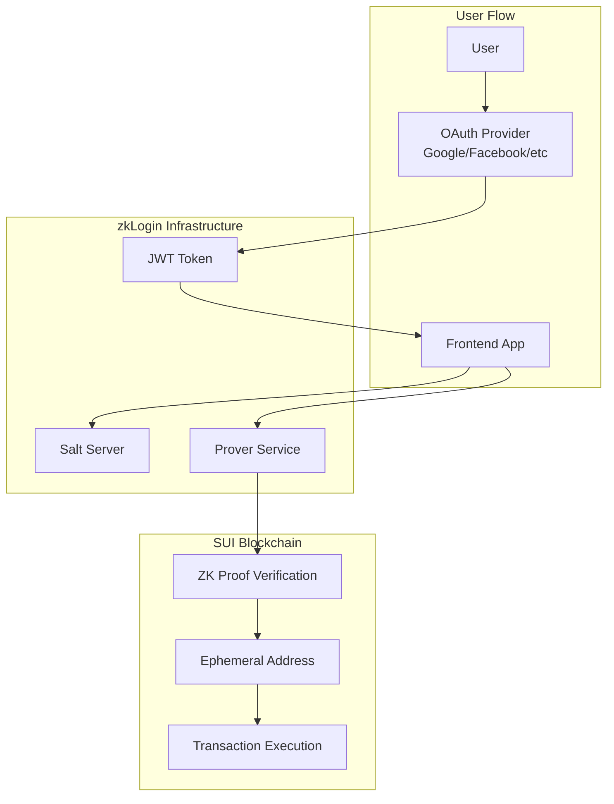

import { Card, CardHeader, CardTitle, CardDescription } from '@site/src/components/Card';

# zkLogin Authentication

Zero-knowledge authentication setup for passwordless user experience using OAuth providers and SUI's zkLogin technology.

## Overview

zkLogin enables users to authenticate to SUI applications using familiar OAuth providers (Google, Facebook, Apple, etc.) without exposing their Web2 credentials to the blockchain. The system uses zero-knowledge proofs to verify authentication while maintaining privacy.

## Architecture



## Components

### 1. Salt Server

The salt server provides deterministic randomness for address generation while preventing rainbow table attacks.

<div className="card padding--md mt-4">
  <h3>Salt Server Purpose</h3>
  <p>The salt server ensures that the same OAuth identity always maps to the same SUI address, while preventing attackers from pre-computing address mappings for known identities.</p>
</div>

### 2. Prover Service Reference

The zkLogin system requires a prover service to generate zero-knowledge proofs. For testnet, we run a custom prover service since no public testnet prover is available.

See the **[Prover Service](./prover-service)** section for detailed setup instructions.

## Setup Instructions

### 1. OAuth Provider Configuration

#### Google OAuth Setup

1. Go to [Google Cloud Console](https://console.cloud.google.com/)
2. Create a new project or select existing one
3. Enable Google+ API
4. Configure OAuth consent screen
5. Create OAuth 2.0 credentials

```bash
# Example OAuth configuration
GOOGLE_CLIENT_ID=your-client-id.apps.googleusercontent.com
GOOGLE_CLIENT_SECRET=your-client-secret
REDIRECT_URI=http://localhost:3000/auth/callback
```

#### Facebook OAuth Setup

1. Go to [Facebook Developers](https://developers.facebook.com/)
2. Create a new app
3. Add Facebook Login product
4. Configure valid OAuth redirect URIs

```bash
# Example Facebook configuration
FACEBOOK_APP_ID=your-app-id
FACEBOOK_APP_SECRET=your-app-secret
```

### 2. Frontend Integration

#### Install Dependencies

```bash
npm install @mysten/sui.js @mysten/zklogin
```

#### zkLogin Client Setup

```typescript
import { SuiClient } from '@mysten/sui.js/client';
import { ZkLoginClient } from '@mysten/zklogin';

const suiClient = new SuiClient({
  url: 'https://fullnode.testnet.sui.io:443'
});

const zkLoginClient = new ZkLoginClient({
  suiClient,
  // Configuration options
});
```

#### Authentication Flow

```typescript
// 1. Initiate OAuth flow
const authUrl = await zkLoginClient.getAuthUrl({
  provider: 'google',
  clientId: process.env.REACT_APP_GOOGLE_CLIENT_ID,
  redirectUri: process.env.REACT_APP_REDIRECT_URI,
});

// Redirect user to authUrl

// 2. Handle OAuth callback
const handleCallback = async (authCode: string) => {
  try {
    // Exchange auth code for JWT
    const jwtToken = await exchangeAuthCode(authCode);
    
    // Generate ephemeral key pair
    const ephemeralKeyPair = Ed25519Keypair.generate();
    
    // Get salt from salt server
    const salt = await getSalt(jwtToken);
    
    // Generate zkLogin signature
    const zkLoginSignature = await zkLoginClient.generateSignature({
      jwtToken,
      ephemeralKeyPair,
      salt,
    });
    
    // Store for transaction signing
    localStorage.setItem('zkLoginSignature', JSON.stringify(zkLoginSignature));
    localStorage.setItem('ephemeralKeyPair', JSON.stringify(ephemeralKeyPair));
    
  } catch (error) {
    console.error('zkLogin authentication failed:', error);
  }
};
```

### 3. Salt Server Integration

#### Salt Server Configuration

```typescript
// Salt server integration
const getSalt = async (jwtToken: string): Promise<string> => {
  const response = await fetch('/api/salt', {
    method: 'POST',
    headers: {
      'Content-Type': 'application/json',
      'Authorization': `Bearer ${jwtToken}`,
    },
    body: JSON.stringify({
      jwt: jwtToken,
    }),
  });
  
  if (!response.ok) {
    throw new Error('Failed to get salt');
  }
  
  const { salt } = await response.json();
  return salt;
};
```

#### Backend Salt Server Setup

```python
# Python Flask example for salt server
from flask import Flask, request, jsonify
import jwt
import hashlib
import os

app = Flask(__name__)
SALT_SECRET = os.getenv('SALT_SECRET', 'your-secret-key')

@app.route('/api/salt', methods=['POST'])
def get_salt():
    try:
        jwt_token = request.json.get('jwt')
        
        # Verify JWT token (simplified)
        # In production, verify signature and claims
        decoded = jwt.decode(jwt_token, options={"verify_signature": False})
        
        # Generate deterministic salt
        identity = f"{decoded['iss']}:{decoded['sub']}"
        salt = hashlib.sha256(f"{identity}:{SALT_SECRET}".encode()).hexdigest()
        
        return jsonify({'salt': salt})
        
    except Exception as e:
        return jsonify({'error': str(e)}), 400

if __name__ == '__main__':
    app.run(debug=True)
```

### 4. Transaction Signing

#### Sign and Execute Transactions

```typescript
const executeTransaction = async (transactionBlock: TransactionBlock) => {
  try {
    // Get stored zkLogin components
    const zkLoginSignature = JSON.parse(localStorage.getItem('zkLoginSignature'));
    const ephemeralKeyPair = JSON.parse(localStorage.getItem('ephemeralKeyPair'));
    
    // Sign transaction with ephemeral key
    const signature = await transactionBlock.sign({
      signer: ephemeralKeyPair,
    });
    
    // Combine with zkLogin signature
    const finalSignature = zkLoginClient.combineSignatures(
      signature,
      zkLoginSignature
    );
    
    // Execute transaction
    const result = await suiClient.executeTransactionBlock({
      transactionBlock,
      signature: finalSignature,
      options: {
        showEffects: true,
        showEvents: true,
      },
    });
    
    return result;
    
  } catch (error) {
    console.error('Transaction execution failed:', error);
    throw error;
  }
};
```

## Configuration Examples

### Environment Variables

```bash
# Frontend (.env)
REACT_APP_SUI_NETWORK=testnet
REACT_APP_GOOGLE_CLIENT_ID=your-google-client-id
REACT_APP_FACEBOOK_APP_ID=your-facebook-app-id
REACT_APP_SALT_SERVER_URL=http://localhost:5000
REACT_APP_PROVER_SERVICE_URL=http://localhost:8080

# Backend (.env)
SALT_SECRET=your-secret-salt-key
JWT_SECRET=your-jwt-secret
GOOGLE_CLIENT_SECRET=your-google-client-secret
FACEBOOK_APP_SECRET=your-facebook-app-secret
```

### Docker Configuration

```yaml
# docker-compose.yml
version: '3.8'
services:
  salt-server:
    build: ./salt-server
    ports:
      - "5000:5000"
    environment:
      - SALT_SECRET=${SALT_SECRET}
      - JWT_SECRET=${JWT_SECRET}
    
  prover-service:
    image: mysten/zklogin:prover-stable
    ports:
      - "8080:8080"
    environment:
      - ZKEY=/app/binaries/zkLogin.zkey
    volumes:
      - ./zkLogin-main.zkey:/app/binaries/zkLogin.zkey
```

## Security Considerations

<div className="card padding--md mt-4" style={{ borderLeft: '4px solid #ff6b6b' }}>
  <h3>Security Best Practices</h3>
  <ul>
    <li><strong>Salt Security</strong>: Keep salt generation secret secure and never expose it</li>
    <li><strong>JWT Validation</strong>: Always verify JWT signatures and claims server-side</li>
    <li><strong>Ephemeral Keys</strong>: Generate new ephemeral keys for each session</li>
    <li><strong>HTTPS Only</strong>: Use HTTPS for all OAuth redirects and API calls</li>
    <li><strong>Token Storage</strong>: Store sensitive tokens securely (consider secure storage APIs)</li>
  </ul>
</div>

## Testing & Validation

### 1. Test OAuth Flow

```bash
# Test Google OAuth
curl -X POST http://localhost:5000/api/salt \
  -H "Content-Type: application/json" \
  -d '{"jwt": "your-test-jwt-token"}'
```

### 2. Validate Address Generation

```typescript
// Test address generation consistency
const testAddressGeneration = async () => {
  const jwtToken = "test-jwt-token";
  const salt1 = await getSalt(jwtToken);
  const salt2 = await getSalt(jwtToken);
  
  console.assert(salt1 === salt2, "Salt should be deterministic");
  
  const address1 = generateAddress(jwtToken, salt1);
  const address2 = generateAddress(jwtToken, salt2);
  
  console.assert(address1 === address2, "Addresses should be identical");
};
```

## Troubleshooting

### Common Issues

1. **Salt Generation Inconsistency**
   - Check secret key configuration
   - Verify JWT token format
   - Ensure deterministic hashing

2. **OAuth Redirect Errors**
   - Verify redirect URI configuration
   - Check OAuth client credentials
   - Ensure HTTPS for production

3. **Signature Verification Failures**
   - Validate ephemeral key generation
   - Check zkLogin signature format
   - Verify prover service connectivity

## Integration with NeuraLabs

### Frontend Integration

```typescript
// NeuraLabs specific zkLogin integration
import { NeuraLabsAuth } from './auth/NeuraLabsAuth';

const auth = new NeuraLabsAuth({
  suiClient,
  zkLoginClient,
  saltServerUrl: process.env.REACT_APP_SALT_SERVER_URL,
  proverServiceUrl: process.env.REACT_APP_PROVER_SERVICE_URL,
});

// Use in React components
const { user, login, logout } = useNeuraLabsAuth();
```

### Backend Integration

```python
# NeuraLabs backend zkLogin integration
from neuralabs.auth import ZkLoginAuth

auth = ZkLoginAuth(
    salt_secret=os.getenv('SALT_SECRET'),
    sui_network='testnet'
)

@app.route('/api/verify-user')
def verify_user():
    jwt_token = request.headers.get('Authorization')
    user_address = auth.get_user_address(jwt_token)
    return jsonify({'address': user_address})
```

## Next Steps

1. **Complete [Prover Service Setup](./prover-service)** for zkLogin functionality
2. **Deploy [Smart Contracts](./smart-contracts)** for NFT access control
3. **Configure [Seal Integration](./seal)** for encryption
4. **Test end-to-end authentication flow**

## References

- [SUI zkLogin Documentation](https://docs.sui.io/concepts/cryptography/zklogin)
- [zkLogin SDK Reference](https://sdk.mystenlabs.com/typescript/zklogin)
- [OAuth 2.0 Specification](https://tools.ietf.org/html/rfc6749)
- [NeuraLabs Authentication Guide](https://github.com/neuralabs/neuralabs-sui/docs/auth)