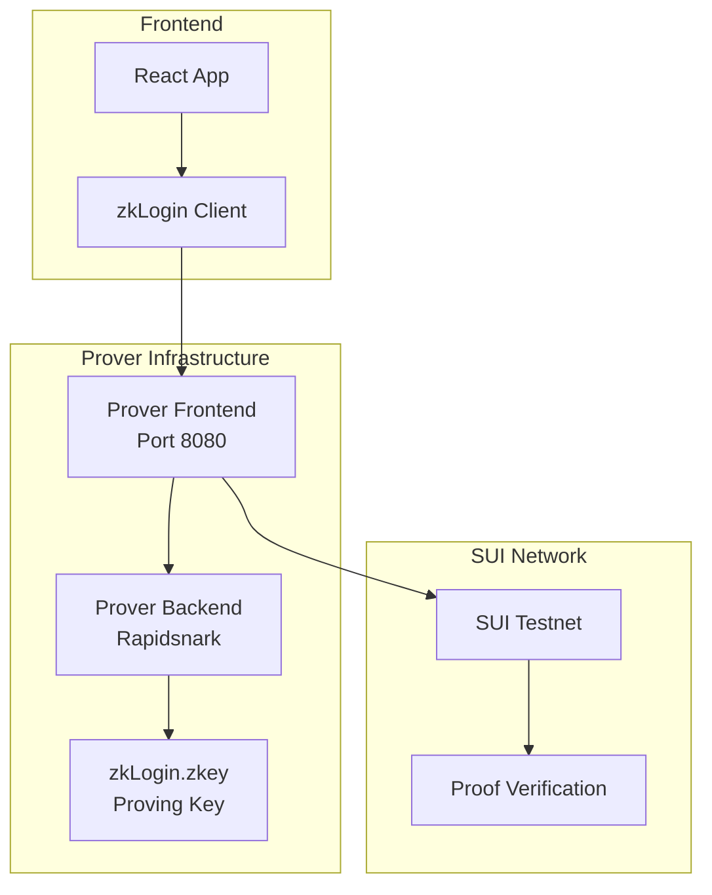

import { Card, CardHeader, CardTitle, CardDescription } from '@site/src/components/Card';

# Prover Service Setup

Custom zkLogin prover service deployment for testnet functionality, enabling zero-knowledge proof generation for authentication.

## Overview

The prover service is a critical component of the zkLogin infrastructure that generates zero-knowledge proofs to verify OAuth authentication without revealing sensitive information. Since no public testnet prover service is available, NeuraLabs runs its own prover service.

<div className="card padding--md mt-4">
  <h3>Why Custom Prover Service?</h3>
  <p>We need to run our own prover service because there was no prover service available for testnet. This enables us to provide zkLogin functionality to our users during development and testing phases.</p>
  <p><strong>Prover Service URL:</strong> <code>https://prover.neuralabs.io</code></p>
</div>

## Architecture



## Prerequisites

### System Requirements

<div className="card padding--md mt-4">
  <h3>Minimum Hardware Requirements</h3>
  <ul>
    <li><strong>CPU:</strong> 16 cores minimum (compute-heavy)</li>
    <li><strong>RAM:</strong> 16GB minimum</li>
    <li><strong>Storage:</strong> 50GB for zkey files and containers</li>
    <li><strong>Network:</strong> Stable internet connection</li>
  </ul>
</div>

<div className="card padding--md mt-4" style={{ borderLeft: '4px solid #ff6b6b' }}>
  <h3>Performance Warning</h3>
  <p>The backend service (mysten/zklogin:prover-stable) is compute-heavy. Using weaker instances can lead to timeout errors with the message "Call to rapidsnark service took longer than 15s".</p>
</div>

### Software Dependencies

```bash
# Install Git Large File Storage (required for zkey files)
curl -s https://packagecloud.io/install/repositories/github/git-lfs/script.deb.sh | sudo bash
sudo apt-get install git-lfs

# Install Docker and Docker Compose
sudo apt-get update
sudo apt-get install docker.io docker-compose-plugin

# Verify installations
git lfs version
docker --version
docker compose version
```

## Installation Steps

### 1. Download Proving Keys

Download the Groth16 proving key zkey file. There are different keys for different networks:

#### For Mainnet and Testnet (Main zkey)
```bash
cd prover-service
wget -O - https://raw.githubusercontent.com/sui-foundation/zklogin-ceremony-contributions/main/download-main-zkey.sh | bash
```

#### For Devnet (Test zkey)
```bash
wget -O - https://raw.githubusercontent.com/sui-foundation/zklogin-ceremony-contributions/main/download-test-zkey.sh | bash
```

### 2. Verify Download Integrity

To verify the download contains the correct zkey file, check the Blake2b hash:

```bash
b2sum zkLogin-main.zkey
```

#### Expected Hash Values

| Network          | zkey file name      | Blake2b Hash |
| ---------------- | ------------------- | ------------ |
| Mainnet, Testnet | `zkLogin-main.zkey` | `060beb961802568ac9ac7f14de0fbcd55e373e8f5ec7cc32189e26fb65700aa4e36f5604f868022c765e634d14ea1cd58bd4d79cef8f3cf9693510696bcbcbce` |
| Devnet           | `zkLogin-test.zkey` | `686e2f5fd969897b1c034d7654799ee2c3952489814e4eaaf3d7e1bb539841047ae8ee5fdcdaca5f4ddd76abb5a8e8eb77b44b693a2ba9d4be57e94292b26ce2` |

### 3. Docker Compose Configuration

Create `docker-compose.yml` for the prover service:

```yaml
services:
  backend:
    image: mysten/zklogin:prover-stable
    volumes:
      # The ZKEY environment variable must be set to the path of the zkey file
      - ${ZKEY}:/app/binaries/zkLogin.zkey
    environment:
      - ZKEY=/app/binaries/zkLogin.zkey
      - WITNESS_BINARIES=/app/binaries
      - PROVER_TIMEOUT=30  # Adjust timeout as needed

  frontend:
    image: mysten/zklogin:prover-fe-stable
    command: '8080'
    ports:
      # The PROVER_PORT environment variable must be set to the desired port
      - '${PROVER_PORT}:8080'
    environment:
      - PROVER_URI=http://backend:8080/input
      - NODE_ENV=production
      - DEBUG=zkLogin:info,jwks
      # Increase timeout for stronger instances if needed
      - PROVER_TIMEOUT=30
    depends_on:
      - backend
```

### 4. Environment Configuration

Create `.env` file:

```bash
# Set the path to your zkey file
ZKEY=/path/to/zkLogin-main.zkey
# Set the port for the prover service
PROVER_PORT=8080
```

### 5. Deploy the Service

```bash
# Start the prover service
ZKEY=/path/to/zkLogin-main.zkey PROVER_PORT=8080 docker compose up -d

# Check service status
docker compose ps

# View logs
docker compose logs -f
```

## Service Endpoints

### Health Check Endpoint

Test if the service is running:

```bash
curl http://localhost:8080/ping
# Expected response: pong
```

### Proof Generation Endpoint

The main endpoint for proof generation:

```bash
curl -X POST http://localhost:8080/v1 \
  -H "Content-Type: application/json" \
  -d '{
    "jwt": "your-jwt-token",
    "ephemeralPublicKey": "your-ephemeral-public-key",
    "maxEpoch": 1000,
    "jwtRandomness": "your-jwt-randomness",
    "salt": "your-salt",
    "keyClaimName": "sub"
  }'
```

## Configuration Options

### Environment Variables

| Variable | Description | Default | Required |
|----------|-------------|---------|----------|
| `ZKEY` | Path to zkLogin.zkey file | - | Yes |
| `PROVER_PORT` | Port for frontend service | 8080 | Yes |
| `PROVER_TIMEOUT` | Timeout in seconds | 15 | No |
| `NODE_ENV` | Node environment | production | No |
| `DEBUG` | Debug logging level | zkLogin:info,jwks | No |

### Performance Tuning

For better performance on high-end hardware:

```yaml
# docker-compose.override.yml
services:
  backend:
    deploy:
      resources:
        limits:
          cpus: '16'
          memory: 16G
        reservations:
          cpus: '8'
          memory: 8G
    environment:
      - PROVER_TIMEOUT=60  # Increase for complex proofs
```

## Production Deployment

### 1. SSL/TLS Configuration

For production, use a reverse proxy with SSL:

```nginx
# nginx.conf
server {
    listen 443 ssl http2;
    server_name prover.neuralabs.io;
    
    ssl_certificate /path/to/cert.pem;
    ssl_certificate_key /path/to/key.pem;
    
    location / {
        proxy_pass http://localhost:8080;
        proxy_set_header Host $host;
        proxy_set_header X-Real-IP $remote_addr;
        proxy_set_header X-Forwarded-For $proxy_add_x_forwarded_for;
        proxy_set_header X-Forwarded-Proto $scheme;
        
        # Increase timeout for proof generation
        proxy_read_timeout 120s;
        proxy_connect_timeout 120s;
        proxy_send_timeout 120s;
    }
}
```

### 2. Process Management

Use systemd for service management:

```ini
# /etc/systemd/system/zklogin-prover.service
[Unit]
Description=zkLogin Prover Service
Requires=docker.service
After=docker.service

[Service]
Type=oneshot
RemainAfterExit=yes
WorkingDirectory=/opt/zklogin-prover
ExecStart=/usr/bin/docker compose up -d
ExecStop=/usr/bin/docker compose down
TimeoutStartSec=0

[Install]
WantedBy=multi-user.target
```

Enable and start the service:

```bash
sudo systemctl enable zklogin-prover.service
sudo systemctl start zklogin-prover.service
```

### 3. Monitoring and Logging

Set up monitoring with Docker logging:

```yaml
# docker-compose.prod.yml
services:
  backend:
    logging:
      driver: "json-file"
      options:
        max-size: "100m"
        max-file: "5"
  
  frontend:
    logging:
      driver: "json-file"
      options:
        max-size: "100m"
        max-file: "5"
```

## Integration with NeuraLabs

### Frontend Integration

Update your frontend configuration to use the custom prover:

```typescript
// zkLogin configuration
const zkLoginConfig = {
  proverUrl: 'https://prover.neuralabs.io',
  network: 'testnet',
  timeout: 30000, // 30 seconds
};

// Initialize zkLogin client
const zkLoginClient = new ZkLoginClient({
  suiClient,
  proverUrl: zkLoginConfig.proverUrl,
  // other configuration
});
```

### Backend Configuration

Configure your backend to use the prover service:

```python
# Python backend configuration
ZKLOGIN_PROVER_URL = "https://prover.neuralabs.io"
ZKLOGIN_TIMEOUT = 30

# FastAPI configuration
@app.post("/auth/zklogin")
async def zklogin_auth(request: ZkLoginRequest):
    prover_response = await call_prover_service(
        url=ZKLOGIN_PROVER_URL,
        data=request.dict(),
        timeout=ZKLOGIN_TIMEOUT
    )
    return prover_response
```

## Troubleshooting

### Common Issues

#### 1. Timeout Errors

**Error:** "Call to rapidsnark service took longer than 15s"

**Solutions:**
- Increase `PROVER_TIMEOUT` environment variable
- Use stronger hardware (minimum 16 cores, 16GB RAM)
- Check system load and available resources

```bash
# Increase timeout
export PROVER_TIMEOUT=60
docker compose up -d
```

#### 2. Memory Issues

**Error:** Out of memory during proof generation

**Solutions:**
- Increase available RAM
- Set Docker memory limits
- Monitor memory usage

```bash
# Monitor memory usage
docker stats

# Set memory limits in docker-compose.yml
deploy:
  resources:
    limits:
      memory: 16G
```

#### 3. Network Connectivity

**Error:** Connection refused or timeout

**Solutions:**
- Check firewall settings
- Verify port configuration
- Test network connectivity

```bash
# Test connectivity
curl -v http://localhost:8080/ping

# Check port binding
netstat -tlnp | grep 8080

# Check Docker networks
docker network ls
```

### Debug Mode

Enable detailed logging for troubleshooting:

```bash
# Set debug environment
export DEBUG=*
docker compose up

# Or in docker-compose.yml
environment:
  - DEBUG=*
```

## Security Considerations

<div className="card padding--md mt-4" style={{ borderLeft: '4px solid #ff6b6b' }}>
  <h3>Security Notes</h3>
  <ul>
    <li><strong>PII Logging:</strong> Setting <code>DEBUG=*</code> may log PII. Use <code>DEBUG=zkLogin:info,jwks</code> in production</li>
    <li><strong>Network Security:</strong> Use SSL/TLS for production deployments</li>
    <li><strong>Access Control:</strong> Implement rate limiting and access controls</li>
    <li><strong>Key Security:</strong> Protect zkey files from unauthorized access</li>
  </ul>
</div>

## Performance Benchmarks

| Hardware | Proof Generation Time | Throughput |
|----------|----------------------|------------|
| 16 cores, 16GB RAM | 5-10 seconds | 6-12 proofs/min |
| 32 cores, 32GB RAM | 2-5 seconds | 12-30 proofs/min |
| 64 cores, 64GB RAM | 1-3 seconds | 20-60 proofs/min |

## Next Steps

1. **Test the prover service** with sample zkLogin requests
2. **Configure [zkLogin](./zklogin)** to use your prover service
3. **Deploy [Smart Contracts](./smart-contracts)** for the full integration
4. **Set up monitoring** and alerting for production

## References

- [zkLogin Prover Documentation](https://docs.sui.io/concepts/cryptography/zklogin)
- [Mysten Labs zkLogin Repository](https://hub.docker.com/repository/docker/mysten/zklogin)
- [zkLogin Ceremony Contributions](https://github.com/sui-foundation/zklogin-ceremony-contributions)
- [RapidSNARK Documentation](https://github.com/MystenLabs/rapidsnark)