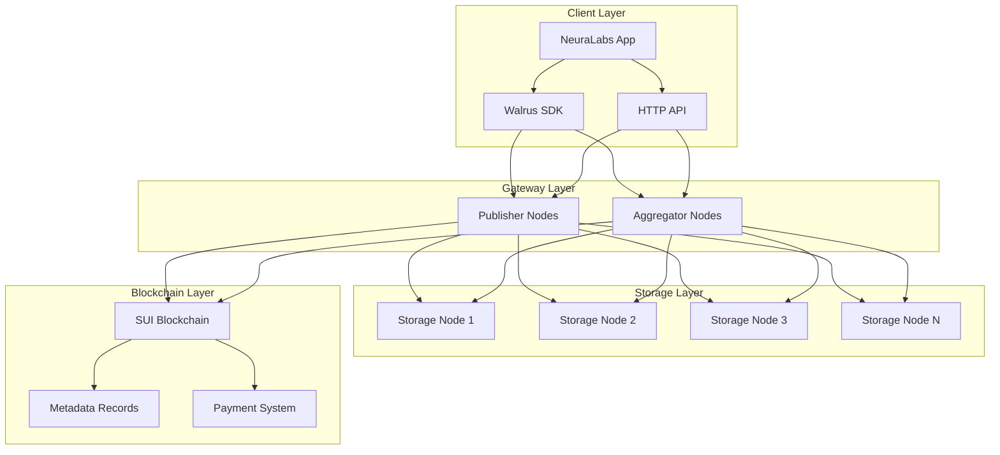
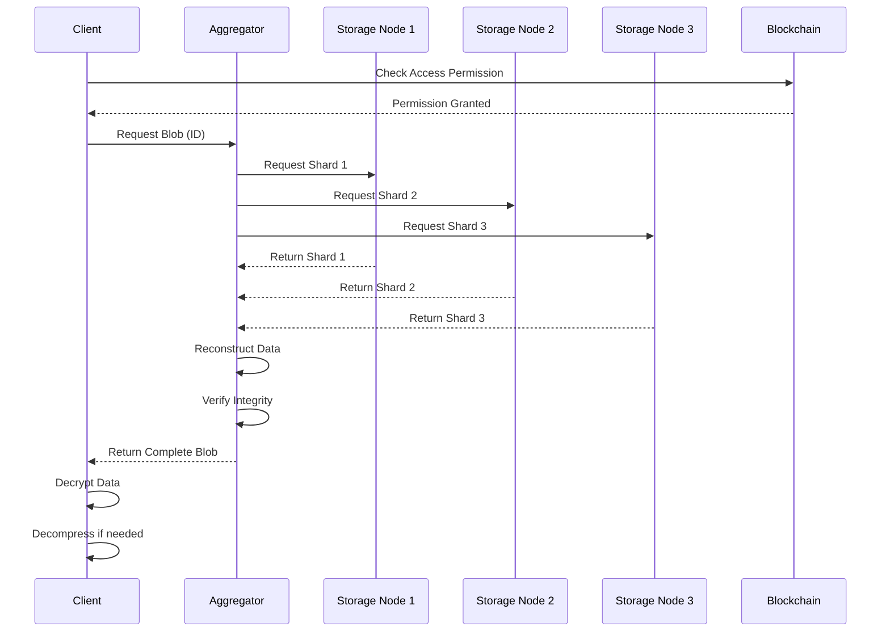
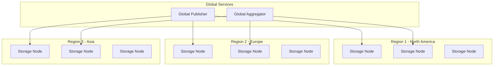
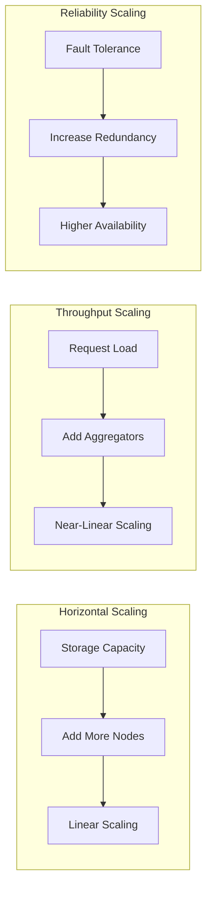
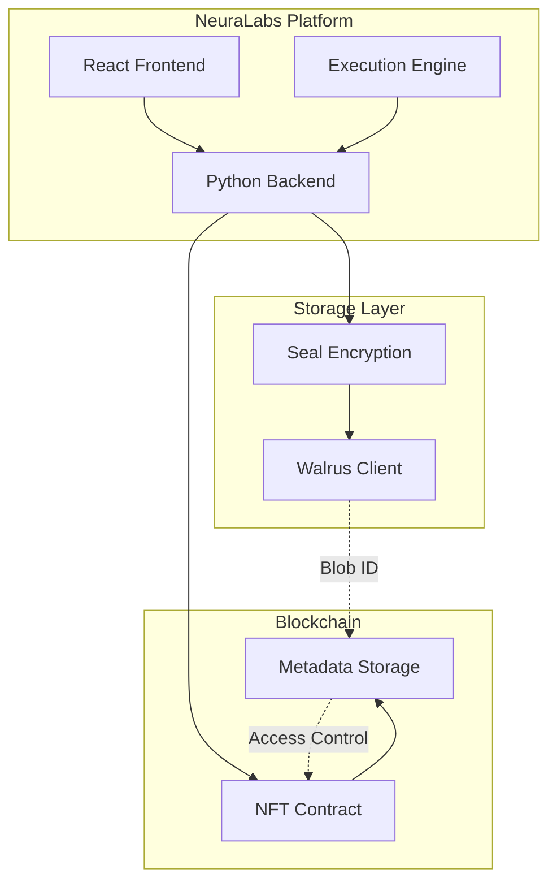

import { Card, CardHeader, CardTitle, CardDescription } from '@site/src/components/Card';
import {CollapsibleCodeBlock} from '@site/src/components/CodeBlock';

# Walrus Architecture

Understand the core architecture of Walrus decentralized storage and how it integrates with the NeuraLabs platform for secure, scalable AI workflow storage.

## Overview

Walrus is a decentralized storage network built on Byzantine fault-tolerant protocols, designed specifically for large blob storage with verifiable integrity. It provides a reliable foundation for storing encrypted AI workflow data while maintaining decentralization and cost-effectiveness.

<div className="card padding--md mt-4">
  <h3>Key Architecture Components</h3>
  <ul>
    <li><strong>Storage Nodes:</strong> Distributed nodes that store data shards with redundancy</li>
    <li><strong>Publisher Nodes:</strong> Entry points for uploading data to the network</li>
    <li><strong>Aggregator Nodes:</strong> Optimized retrieval points for downloading data</li>
    <li><strong>Metadata Layer:</strong> On-chain records on SUI blockchain for access control</li>
    <li><strong>Erasure Coding:</strong> Reed-Solomon encoding for fault tolerance</li>
  </ul>
</div>

## Network Architecture



## Data Flow Architecture

### Upload Flow

<div className="grid grid-cols-1 md:grid-cols-2 gap-4 mt-4">
  <Card>
    <CardHeader>
      <CardTitle>
        
        1. Client Preparation
      </CardTitle>
      <CardDescription>
        • Encrypt data using Seal<br/>
        • Compress if beneficial<br/>
        • Calculate content hash<br/>
        • Prepare metadata
      </CardDescription>
    </CardHeader>
  </Card>

  <Card>
    <CardHeader>
      <CardTitle>
        
        2. Publisher Processing
      </CardTitle>
      <CardDescription>
        • Accept data blob<br/>
        • Apply erasure coding<br/>
        • Create data shards<br/>
        • Generate blob ID
      </CardDescription>
    </CardHeader>
  </Card>

  <Card>
    <CardHeader>
      <CardTitle>
        
        3. Distribution
      </CardTitle>
      <CardDescription>
        • Distribute shards to nodes<br/>
        • Await confirmations<br/>
        • Update routing table<br/>
        • Return blob ID
      </CardDescription>
    </CardHeader>
  </Card>

  <Card>
    <CardHeader>
      <CardTitle>
        
        4. Blockchain Record
      </CardTitle>
      <CardDescription>
        • Store metadata on SUI<br/>
        • Record blob ID<br/>
        • Set access permissions<br/>
        • Log transaction
      </CardDescription>
    </CardHeader>
  </Card>
</div>

### Download Flow



## Storage Model

### Erasure Coding

Walrus uses Reed-Solomon erasure coding to ensure data availability even when some storage nodes are offline:

<CollapsibleCodeBlock
  title="Erasure Coding Example"
  description="How Walrus splits and reconstructs data using erasure coding"
  language="typescript"
  defaultCollapsed={false}
>
{`// Conceptual example of erasure coding
class ErasureCoding {
  private n: number; // Total shards
  private k: number; // Required shards for reconstruction
  
  constructor(n: number = 10, k: number = 7) {
    this.n = n; // Create 10 shards total
    this.k = k; // Need only 7 to reconstruct
  }
  
  encode(data: Uint8Array): Shard[] {
    // Split data into k data shards
    const dataShards = this.splitIntoShards(data, this.k);
    
    // Generate (n-k) parity shards
    const parityShards = this.generateParityShards(dataShards, this.n - this.k);
    
    // Combine all shards
    return [...dataShards, ...parityShards];
  }
  
  decode(availableShards: Shard[]): Uint8Array {
    // Need at least k shards to reconstruct
    if (availableShards.length < this.k) {
      throw new Error(\`Need at least \${this.k} shards, got \${availableShards.length}\`);
    }
    
    // Use Reed-Solomon to reconstruct original data
    return this.reconstructData(availableShards.slice(0, this.k));
  }
  
  // Fault tolerance calculation
  getFaultTolerance(): number {
    return this.n - this.k; // Can lose up to 3 nodes
  }
  
  // Storage overhead
  getStorageOverhead(): number {
    return this.n / this.k; // 1.43x overhead (10/7)
  }
}`}
</CollapsibleCodeBlock>

### Content Addressing

<div className="card padding--md mt-4">
  <h3>Content-Addressed Storage</h3>
  <p>Walrus uses content addressing where each blob is identified by its cryptographic hash:</p>
  <ul>
    <li><strong>Immutability:</strong> Content cannot be changed without changing the blob ID</li>
    <li><strong>Deduplication:</strong> Identical content always produces the same blob ID</li>
    <li><strong>Integrity:</strong> Any corruption is immediately detectable</li>
    <li><strong>Caching:</strong> Content can be cached indefinitely by blob ID</li>
  </ul>
</div>

## Network Topology

### Storage Node Distribution



### Node Types and Roles

<div className="grid grid-cols-1 md:grid-cols-3 gap-4 mt-4">
  <Card>
    <CardHeader>
      <CardTitle>
        
        Storage Nodes
      </CardTitle>
      <CardDescription>
        • Store data shards<br/>
        • Respond to retrieval requests<br/>
        • Maintain shard integrity<br/>
        • Report availability status<br/>
        • Participate in consensus
      </CardDescription>
    </CardHeader>
  </Card>

  <Card>
    <CardHeader>
      <CardTitle>
        
        Publisher Nodes
      </CardTitle>
      <CardDescription>
        • Accept client uploads<br/>
        • Perform erasure coding<br/>
        • Distribute shards<br/>
        • Handle payment verification<br/>
        • Issue storage certificates
      </CardDescription>
    </CardHeader>
  </Card>

  <Card>
    <CardHeader>
      <CardTitle>
        
        Aggregator Nodes
      </CardTitle>
      <CardDescription>
        • Optimize data retrieval<br/>
        • Cache popular content<br/>
        • Reconstruct from shards<br/>
        • Load balance requests<br/>
        • Monitor node health
      </CardDescription>
    </CardHeader>
  </Card>
</div>

## Consensus and Consistency

### Byzantine Fault Tolerance

Walrus implements Byzantine fault-tolerant consensus to ensure data integrity even with malicious nodes:

<CollapsibleCodeBlock
  title="BFT Consensus Model"
  description="How Walrus maintains consistency in a decentralized environment"
  language="typescript"
  defaultCollapsed={true}
>
{`// Simplified BFT consensus for storage confirmation
interface StorageConfirmation {
  nodeId: string;
  shardId: string;
  hash: string;
  timestamp: number;
  signature: string;
}

class BFTConsensus {
  private readonly f: number; // Maximum faulty nodes
  private readonly n: number; // Total nodes
  
  constructor(totalNodes: number) {
    this.n = totalNodes;
    this.f = Math.floor((totalNodes - 1) / 3); // Byzantine fault tolerance
  }
  
  // Verify storage across nodes
  async verifyStorage(
    blobId: string,
    confirmations: StorageConfirmation[]
  ): Promise<boolean> {
    // Need at least 2f + 1 confirmations
    const requiredConfirmations = 2 * this.f + 1;
    
    if (confirmations.length < requiredConfirmations) {
      return false;
    }
    
    // Group confirmations by hash
    const hashGroups = new Map<string, StorageConfirmation[]>();
    
    for (const conf of confirmations) {
      const group = hashGroups.get(conf.hash) || [];
      group.push(conf);
      hashGroups.set(conf.hash, group);
    }
    
    // Find majority agreement
    for (const [hash, confs] of hashGroups) {
      if (confs.length >= requiredConfirmations) {
        // Verify signatures
        const validSigs = await this.verifySignatures(confs);
        
        if (validSigs >= requiredConfirmations) {
          return true; // Consensus achieved
        }
      }
    }
    
    return false; // No consensus
  }
  
  private async verifySignatures(
    confirmations: StorageConfirmation[]
  ): Promise<number> {
    let valid = 0;
    
    for (const conf of confirmations) {
      if (await this.verifyNodeSignature(conf)) {
        valid++;
      }
    }
    
    return valid;
  }
  
  private async verifyNodeSignature(
    confirmation: StorageConfirmation
  ): Promise<boolean> {
    // Verify that the signature matches the node's public key
    // Implementation depends on cryptographic scheme
    return true; // Simplified
  }
}`}
</CollapsibleCodeBlock>

## Performance Characteristics

### Latency Analysis

<div className="card padding--md mt-4">
  <h3>Performance Metrics</h3>
  
  **Upload Performance:**
  - Small files (< 1MB): ~500ms - 1s
  - Medium files (1-10MB): ~1-3s
  - Large files (10-100MB): ~3-10s
  - Chunked uploads: ~2-5s per 5MB chunk
  
  **Download Performance:**
  - First byte latency: ~200-500ms
  - Throughput: ~10-50MB/s (depends on node proximity)
  - Parallel shard retrieval: 3-5x faster than sequential
  
  **Factors Affecting Performance:**
  - Geographic distribution of nodes
  - Network congestion
  - File size and compression
  - Number of concurrent requests
</div>

### Scalability Model



## Security Architecture

### Multi-Layer Security

<div className="grid grid-cols-1 md:grid-cols-2 gap-4 mt-4">
  <Card>
    <CardHeader>
      <CardTitle>
        
        Network Security
      </CardTitle>
      <CardDescription>
        • TLS encryption for all communications<br/>
        • Node authentication via certificates<br/>
        • DDoS protection at gateway layer<br/>
        • Rate limiting and access control
      </CardDescription>
    </CardHeader>
  </Card>

  <Card>
    <CardHeader>
      <CardTitle>
        
        Data Security
      </CardTitle>
      <CardDescription>
        • Client-side encryption (Seal)<br/>
        • Content integrity verification<br/>
        • Access control via NFTs<br/>
        • Immutable audit trail on SUI
      </CardDescription>
    </CardHeader>
  </Card>
</div>

### Threat Model

<CollapsibleCodeBlock
  title="Security Threat Analysis"
  description="Understanding and mitigating potential security threats"
  language="typescript"
  defaultCollapsed={true}
>
{`// Security considerations for Walrus integration
interface SecurityThreat {
  type: string;
  severity: 'low' | 'medium' | 'high';
  mitigation: string[];
}

const walrusThreats: SecurityThreat[] = [
  {
    type: 'Data Privacy',
    severity: 'high',
    mitigation: [
      'Always encrypt data before upload',
      'Use Seal threshold encryption',
      'Never store keys in Walrus',
      'Implement client-side encryption'
    ]
  },
  {
    type: 'Node Compromise',
    severity: 'medium',
    mitigation: [
      'Erasure coding provides redundancy',
      'BFT consensus prevents single point of failure',
      'Regular integrity checks',
      'Geographic distribution of shards'
    ]
  },
  {
    type: 'Denial of Service',
    severity: 'medium',
    mitigation: [
      'Rate limiting at gateway',
      'Multiple aggregator nodes',
      'Client-side retry logic',
      'Caching layer for popular content'
    ]
  },
  {
    type: 'Data Availability',
    severity: 'low',
    mitigation: [
      'Pay for sufficient epochs',
      'Monitor expiration dates',
      'Implement renewal system',
      'Backup critical data'
    ]
  }
];

// Security best practices implementation
class SecureWalrusClient {
  async secureStore(data: Uint8Array, nftId: string): Promise<string> {
    // 1. Encrypt data
    const encrypted = await this.encryptWithSeal(data, nftId);
    
    // 2. Add integrity check
    const hash = await this.calculateHash(encrypted);
    
    // 3. Store with metadata
    const result = await walrus.store(encrypted, {
      metadata: {
        contentHash: hash,
        encrypted: true,
        nftId: nftId,
        timestamp: Date.now()
      }
    });
    
    // 4. Verify storage
    if (result.success) {
      await this.verifyStorage(result.blobId, hash);
    }
    
    return result.blobId;
  }
  
  async secureRetrieve(blobId: string, nftId: string): Promise<Uint8Array> {
    // 1. Verify access permission
    const hasAccess = await this.verifyNFTAccess(nftId);
    if (!hasAccess) {
      throw new Error('Access denied');
    }
    
    // 2. Retrieve data
    const result = await walrus.retrieve(blobId);
    
    // 3. Verify integrity
    const metadata = result.metadata;
    const hash = await this.calculateHash(result.data);
    
    if (hash !== metadata.contentHash) {
      throw new Error('Data integrity check failed');
    }
    
    // 4. Decrypt data
    return await this.decryptWithSeal(result.data, nftId);
  }
}`}
</CollapsibleCodeBlock>

## Economic Model

### Storage Pricing

<div className="card padding--md mt-4">
  <h3>Walrus Economic Model</h3>
  
  **Cost Components:**
  - **Storage Cost:** Paid per byte per epoch
  - **Write Fee:** One-time fee for uploading
  - **Network Fee:** SUI gas for blockchain transactions
  
  **Pricing Formula:**
  ```
  Total Cost = (Data Size × Price per Byte × Epochs) + Write Fee + Gas
  ```
  
  **Example Costs (Testnet):**
  - 1MB for 30 epochs: ~0.1 WAL
  - 10MB for 30 epochs: ~1 WAL
  - 100MB for 30 epochs: ~10 WAL
</div>

## Integration Points

### NeuraLabs Integration Architecture



### Key Integration Benefits

<div className="grid grid-cols-1 md:grid-cols-3 gap-4 mt-4">
  <Card>
    <CardHeader>
      <CardTitle>Decentralization</CardTitle>
      <CardDescription>
        No single point of failure for AI workflow storage
      </CardDescription>
    </CardHeader>
  </Card>

  <Card>
    <CardHeader>
      <CardTitle>Cost Efficiency</CardTitle>
      <CardDescription>
        10-100x cheaper than traditional cloud storage
      </CardDescription>
    </CardHeader>
  </Card>

  <Card>
    <CardHeader>
      <CardTitle>Verifiable Storage</CardTitle>
      <CardDescription>
        Cryptographic proofs of data integrity
      </CardDescription>
    </CardHeader>
  </Card>
</div>

## Monitoring and Observability

### Health Monitoring

<CollapsibleCodeBlock
  title="Walrus Network Monitoring"
  description="Monitor the health and performance of Walrus integration"
  language="typescript"
  defaultCollapsed={true}
>
{`// Comprehensive monitoring for Walrus integration
class WalrusMonitor {
  private metrics = {
    uploads: new Map<string, UploadMetric>(),
    downloads: new Map<string, DownloadMetric>(),
    errors: new Map<string, ErrorMetric>(),
    nodeHealth: new Map<string, NodeHealth>()
  };
  
  // Track upload performance
  trackUpload(blobId: string, size: number, duration: number, success: boolean) {
    this.metrics.uploads.set(blobId, {
      timestamp: Date.now(),
      size,
      duration,
      success,
      throughput: size / (duration / 1000) // bytes/sec
    });
    
    // Alert on slow uploads
    if (duration > 10000) { // 10 seconds
      this.alert('Slow upload detected', { blobId, duration });
    }
  }
  
  // Monitor node availability
  async checkNodeHealth() {
    const nodes = [
      'https://publisher.walrus-testnet.walrus.space',
      'https://aggregator.walrus-testnet.walrus.space'
    ];
    
    for (const node of nodes) {
      const start = Date.now();
      try {
        const response = await fetch(\`\${node}/health\`);
        const latency = Date.now() - start;
        
        this.metrics.nodeHealth.set(node, {
          available: response.ok,
          latency,
          lastCheck: Date.now()
        });
      } catch (error) {
        this.metrics.nodeHealth.set(node, {
          available: false,
          latency: -1,
          lastCheck: Date.now(),
          error: error.message
        });
      }
    }
  }
  
  // Generate performance report
  generateReport(): PerformanceReport {
    const uploads = Array.from(this.metrics.uploads.values());
    const downloads = Array.from(this.metrics.downloads.values());
    
    return {
      period: { start: this.startTime, end: Date.now() },
      uploads: {
        total: uploads.length,
        successful: uploads.filter(u => u.success).length,
        averageSize: avg(uploads.map(u => u.size)),
        averageDuration: avg(uploads.map(u => u.duration)),
        averageThroughput: avg(uploads.map(u => u.throughput))
      },
      downloads: {
        total: downloads.length,
        successful: downloads.filter(d => d.success).length,
        averageLatency: avg(downloads.map(d => d.latency)),
        cacheHitRate: downloads.filter(d => d.cached).length / downloads.length
      },
      availability: this.calculateAvailability(),
      recommendations: this.generateRecommendations()
    };
  }
  
  private calculateAvailability(): number {
    const healthChecks = Array.from(this.metrics.nodeHealth.values());
    const available = healthChecks.filter(h => h.available).length;
    return available / healthChecks.length;
  }
  
  private generateRecommendations(): string[] {
    const recommendations = [];
    
    // Check upload performance
    const uploads = Array.from(this.metrics.uploads.values());
    const avgDuration = avg(uploads.map(u => u.duration));
    
    if (avgDuration > 5000) {
      recommendations.push('Consider implementing chunked uploads for better performance');
    }
    
    // Check error rate
    const errors = Array.from(this.metrics.errors.values());
    const errorRate = errors.length / (uploads.length + downloads.length);
    
    if (errorRate > 0.05) {
      recommendations.push('High error rate detected - review retry logic');
    }
    
    return recommendations;
  }
}`}
</CollapsibleCodeBlock>

## Future Roadmap

### Upcoming Features

<div className="card padding--md mt-4">
  <h3>Walrus Roadmap</h3>
  <ul>
    <li><strong>Mainnet Launch:</strong> Production-ready network with SLA guarantees</li>
    <li><strong>Advanced Queries:</strong> Search and filter capabilities for stored data</li>
    <li><strong>Streaming Support:</strong> Direct video/audio streaming from Walrus</li>
    <li><strong>IPFS Bridge:</strong> Interoperability with IPFS network</li>
    <li><strong>Enhanced Privacy:</strong> Zero-knowledge proofs for access control</li>
    <li><strong>CDN Integration:</strong> Global edge caching for improved performance</li>
  </ul>
</div>

## Best Practices Summary

<div className="grid grid-cols-1 md:grid-cols-2 gap-4 mt-4">
  <Card>
    <CardHeader>
      <CardTitle>
        
        Do's
      </CardTitle>
      <CardDescription>
        ✓ Encrypt sensitive data before storage<br/>
        ✓ Implement retry logic with backoff<br/>
        ✓ Monitor blob expiration dates<br/>
        ✓ Use compression for text data<br/>
        ✓ Batch small files together<br/>
        ✓ Cache frequently accessed data
      </CardDescription>
    </CardHeader>
  </Card>

  <Card>
    <CardHeader>
      <CardTitle>
        
        Don'ts
      </CardTitle>
      <CardDescription>
        ✗ Store unencrypted private data<br/>
        ✗ Rely on single aggregator node<br/>
        ✗ Ignore storage duration limits<br/>
        ✗ Upload without error handling<br/>
        ✗ Store frequently changing data<br/>
        ✗ Exceed rate limits
      </CardDescription>
    </CardHeader>
  </Card>
</div>

## Related Documentation

- [Walrus SDK Integration](/docs/sui-integration/storage/walrus-sdk)
- [Walrus HTTP API](/docs/sui-integration/storage/walrus-http-api)
- [Walrus CLI Usage](/docs/sui-integration/storage/walrus-cli)
- [Example Use Cases](/docs/sui-integration/storage/walrus-examples)
- [Seal Encryption](/docs/sui-integration/encryption/seal)