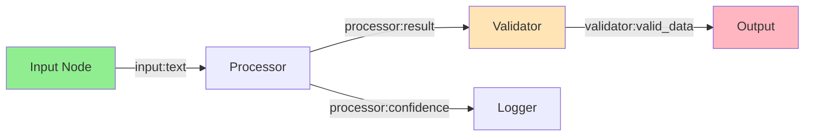

import { Card, CardHeader, CardTitle, CardDescription } from '@site/src/components/Card';
import { Callout } from '@site/src/components/Callout';
import { Features, Feature } from '@site/src/components/Features';
import { CollapsibleCodeBlock, InlineCodeCard } from '@site/src/components/CodeBlock';
import Tabs from '@theme/Tabs';
import TabItem from '@theme/TabItem';
import CodeBlock from '@theme/CodeBlock';

# Connections

Connections are the pathways through which data flows between nodes in the HPC Neura Execution Engine. They define the edges in your workflow's directed acyclic graph (DAG), determining both the execution order and how outputs from one node become inputs to another.

## Understanding Connections

### Connection Anatomy

Every connection consists of four key components:

<Card>
  <CardHeader>
    <CardTitle>Connection Structure</CardTitle>
  </CardHeader>
  <div style={{ padding: '1rem' }}>
    <table>
      <thead>
        <tr>
          <th>Property</th>
          <th>Format</th>
          <th>Description</th>
          <th>Required</th>
        </tr>
      </thead>
      <tbody>
        <tr>
          <td><code>from_id</code></td>
          <td><code>node_id</code></td>
          <td>Source node identifier</td>
          <td>Yes</td>
        </tr>
        <tr>
          <td><code>to_id</code></td>
          <td><code>node_id</code></td>
          <td>Target node identifier</td>
          <td>Yes</td>
        </tr>
        <tr>
          <td><code>from_output</code></td>
          <td><code>node_id:variable_name</code></td>
          <td>Specific output variable from source</td>
          <td>No*</td>
        </tr>
        <tr>
          <td><code>to_input</code></td>
          <td><code>node_id:variable_name</code></td>
          <td>Specific input variable on target</td>
          <td>No*</td>
        </tr>
        <tr>
          <td><code>connection_type</code></td>
          <td><code>"control" | "data" | "both"</code></td>
          <td>Purpose of the connection</td>
          <td>No (default: "both")</td>
        </tr>
      </tbody>
    </table>
    <p style={{ marginTop: '1rem', fontSize: '0.9em' }}>
      * When omitted, all outputs are passed to all matching inputs
    </p>
  </div>
</Card>

### Connection Types

<Tabs>
  <TabItem value="simple" label="Simple Connections" default>
    <div style={{ marginTop: '1rem' }}>
      <p>Pass all outputs from one node to another:</p>
      
      <CollapsibleCodeBlock
        title="Simple Connection"
        description="Connects all outputs to inputs"
        language="yaml"
      >
{`connections:
  - from_id: start_node
    to_id: input_processor
    
  # All outputs from start_node are available 
  # as inputs to input_processor`}
      </CollapsibleCodeBlock>
      
      <Callout type="info">
        Use simple connections when nodes have compatible schemas or when you want to pass entire data objects.
      </Callout>
    </div>
  </TabItem>
  
  <TabItem value="field" label="Field-Specific Connections">
    <div style={{ marginTop: '1rem' }}>
      <p>Map specific outputs to specific inputs:</p>
      
      <CollapsibleCodeBlock
        title="Field-Specific Connection"
        description="Maps individual variables between nodes"
        language="yaml"
      >
{`connections:
  - from_id: llm_generator
    to_id: text_analyzer
    from_output: "llm_generator:response"
    to_input: "text_analyzer:text"
    
  - from_id: llm_generator
    to_id: confidence_checker
    from_output: "llm_generator:confidence"
    to_input: "confidence_checker:score"`}
      </CollapsibleCodeBlock>
      
      <Callout type="tip">
        Field-specific connections provide precise control over data flow and are recommended for production flows.
      </Callout>
    </div>
  </TabItem>
  
  <TabItem value="multiple" label="Multiple Connections">
    <div style={{ marginTop: '1rem' }}>
      <p>Connect one node to multiple targets or multiple sources to one target:</p>
      
      <CollapsibleCodeBlock
        title="Fan-Out Pattern"
        description="One source to multiple targets"
        language="yaml"
      >
{`# Fan-out: One output feeds multiple nodes
connections:
  - from_id: data_source
    to_id: processor_1
    from_output: "data_source:data"
    to_input: "processor_1:input"
    
  - from_id: data_source
    to_id: processor_2
    from_output: "data_source:data"
    to_input: "processor_2:raw_data"
    
  - from_id: data_source
    to_id: validator
    from_output: "data_source:metadata"
    to_input: "validator:context"`}
      </CollapsibleCodeBlock>
      
      <CollapsibleCodeBlock
        title="Fan-In Pattern"
        description="Multiple sources to one target"
        language="yaml"
      >
{`# Fan-in: Multiple inputs to one node
connections:
  - from_id: user_profile
    to_id: ai_generator
    from_output: "user_profile:preferences"
    to_input: "ai_generator:context"
    
  - from_id: chat_history
    to_id: ai_generator
    from_output: "chat_history:messages"
    to_input: "ai_generator:history"
    
  - from_id: user_input
    to_id: ai_generator
    from_output: "user_input:prompt"
    to_input: "ai_generator:query"`}
      </CollapsibleCodeBlock>
    </div>
  </TabItem>
  
  <TabItem value="typed" label="Connection Purpose Types">
    <div style={{ marginTop: '1rem' }}>
      <p>Define the purpose of each connection - control flow, data flow, or both:</p>
      
      <Card>
        <CardHeader>
          <CardTitle>Connection Purpose Types</CardTitle>
        </CardHeader>
        <div style={{ padding: '1rem' }}>
          <table>
            <thead>
              <tr>
                <th>Type</th>
                <th>Purpose</th>
                <th>Behavior</th>
              </tr>
            </thead>
            <tbody>
              <tr>
                <td><code>control</code></td>
                <td>Execution order only</td>
                <td>Defines when to execute, no data transfer</td>
              </tr>
              <tr>
                <td><code>data</code></td>
                <td>Data dependency only</td>
                <td>Transfers data, doesn't trigger execution</td>
              </tr>
              <tr>
                <td><code>both</code></td>
                <td>Traditional connection</td>
                <td>Triggers execution AND transfers data (default)</td>
              </tr>
            </tbody>
          </table>
        </div>
      </Card>
      
      <CollapsibleCodeBlock
        title="Typed Connection Example"
        description="Using different connection types for precise flow control"
        language="yaml"
      >
{`connections:
  # Control flow: Execute B after A, but no data transfer
  - from_id: initializer
    to_id: api_caller
    connection_type: control
    
  # Data flow: B needs A's output but doesn't execute after A
  - from_id: config_loader
    to_id: processor
    from_output: "config_loader:settings"
    to_input: "processor:config"
    connection_type: data
    
  # Both: Traditional behavior (default)
  - from_id: processor
    to_id: formatter
    from_output: "processor:result"
    to_input: "formatter:data"
    connection_type: both  # or omit for default`}
      </CollapsibleCodeBlock>
      
      <Callout type="success" title="Benefits of Typed Connections">
        • **Clearer Intent**: Explicitly state whether a connection is for ordering or data
        • **Better Control**: Prevent unwanted executions in complex flows
        • **Efficient Execution**: Engine can optimize based on connection types
        • **Easier Debugging**: Understand flow behavior at a glance
      </Callout>
    </div>
  </TabItem>
</Tabs>

## Variable Naming Convention

The HPC Neura Execution Engine uses a specific format for variable references:

<Card>
  <CardHeader>
    <CardTitle>Variable Format: <code>node_id:variable_name</code></CardTitle>
  </CardHeader>
  <div style={{ padding: '1rem' }}>
    <p>This format ensures unique identification of variables across the flow:</p>
    <ul>
      <li><strong>node_id</strong>: The unique identifier of the node</li>
      <li><strong>variable_name</strong>: The specific variable within that node</li>
    </ul>
    
    <h4>Examples:</h4>
    <ul>
      <li><code>chat_input_001:chat_input</code> - The chat_input variable from node chat_input_001</li>
      <li><code>llm_processor:response</code> - The response variable from node llm_processor</li>
      <li><code>analyzer_node:sentiment.score</code> - Nested path to sentiment score</li>
    </ul>
  </div>
</Card>

## Connection Patterns

### Sequential Processing

Connect nodes in a linear sequence for step-by-step processing:

<CollapsibleCodeBlock
  title="Sequential Pattern"
  description="Linear data flow through multiple processing steps"
  language="yaml"
>
{`nodes:
  input: { type: chat_input }
  validator: { type: custom }
  processor: { type: llm_structured }
  formatter: { type: custom }
  output: { type: end }

connections:
  - from_id: input
    to_id: validator
    from_output: "input:chat_input"
    to_input: "validator:text"
    
  - from_id: validator
    to_id: processor
    from_output: "validator:validated_text"
    to_input: "processor:prompt"
    
  - from_id: processor
    to_id: formatter
    from_output: "processor:result"
    to_input: "formatter:data"
    
  - from_id: formatter
    to_id: output
    from_output: "formatter:formatted_output"
    to_input: "output:text_input"`}
</CollapsibleCodeBlock>

### Parallel Processing

Execute independent operations simultaneously:

<CollapsibleCodeBlock
  title="Parallel Pattern"
  description="Concurrent execution of independent nodes"
  language="yaml"
>
{`nodes:
  input: { type: chat_input }
  sentiment_analyzer: { type: llm_structured }
  entity_extractor: { type: llm_structured }
  intent_classifier: { type: llm_structured }
  aggregator: { type: merger }

connections:
  # All three analyzers run in parallel
  - from_id: input
    to_id: sentiment_analyzer
    from_output: "input:chat_input"
    to_input: "sentiment_analyzer:text"
    
  - from_id: input
    to_id: entity_extractor
    from_output: "input:chat_input"
    to_input: "entity_extractor:text"
    
  - from_id: input
    to_id: intent_classifier
    from_output: "input:chat_input"
    to_input: "intent_classifier:text"
    
  # Results converge at aggregator
  - from_id: sentiment_analyzer
    to_id: aggregator
    from_output: "sentiment_analyzer:sentiment"
    to_input: "aggregator:data1"
    
  - from_id: entity_extractor
    to_id: aggregator
    from_output: "entity_extractor:entities"
    to_input: "aggregator:data2"`}
</CollapsibleCodeBlock>

### Conditional Routing

Use case nodes to create conditional execution paths:

<CollapsibleCodeBlock
  title="Conditional Pattern"
  description="Different paths based on conditions"
  language="yaml"
>
{`nodes:
  classifier: { type: llm_structured }
  router: { type: case }
  simple_handler: { type: custom }
  complex_handler: { type: llm_text }
  
connections:
  - from_id: classifier
    to_id: router
    from_output: "classifier:complexity"
    to_input: "router:variables.complexity"
    
  # These connections are conditionally enabled by router
  - from_id: router
    to_id: simple_handler
    # Enabled when complexity < 0.5
    
  - from_id: router
    to_id: complex_handler
    # Enabled when complexity >= 0.5`}
</CollapsibleCodeBlock>

### Advanced Pattern: Cross-Path Dependencies

Using typed connections to handle complex scenarios where nodes in different execution paths need to share data:

<CollapsibleCodeBlock
  title="Cross-Path Dependency Pattern"
  description="Sharing data between conditional paths using typed connections"
  language="yaml"
>
{`nodes:
  start: { type: start }
  config_loader: { type: constants }
  case_router: { type: case }
  
  # Path A nodes
  path_a_processor: { type: llm_structured }
  path_a_transformer: { type: custom }
  path_a_validator: { type: custom }
  
  # Path B nodes  
  path_b_initializer: { type: custom }
  path_b_processor: { type: llm_text }
  # Note: path_b_processor needs data from path_a_transformer!
  
  merger: { type: merger }
  end: { type: end }

connections:
  # Setup connections
  - from_id: start
    to_id: config_loader
    connection_type: control
    
  - from_id: config_loader
    to_id: case_router
    connection_type: both
    
  # Path A - control flow
  - from_id: case_router
    to_id: path_a_processor
    connection_type: control  # Case enables this path
    
  - from_id: path_a_processor
    to_id: path_a_transformer
    connection_type: both
    
  - from_id: path_a_transformer
    to_id: path_a_validator
    connection_type: both
    
  # Path B - control flow  
  - from_id: case_router
    to_id: path_b_initializer
    connection_type: control  # Case enables this path
    
  - from_id: path_b_initializer
    to_id: path_b_processor
    connection_type: control
    
  # Cross-path data dependency
  - from_id: path_a_transformer
    to_id: path_b_processor
    from_output: "path_a_transformer:auth_token"
    to_input: "path_b_processor:authorization"
    connection_type: data  # Only data, no control flow
    
  # Convergence
  - from_id: path_a_validator
    to_id: merger
    connection_type: both
    
  - from_id: path_b_processor
    to_id: merger
    connection_type: both
    
  - from_id: merger
    to_id: end
    connection_type: both`}
</CollapsibleCodeBlock>

<Callout type="info" title="How Cross-Path Dependencies Work">
When Path B is selected:
1. **Control flow** follows: `case_router` → `path_b_initializer` → `path_b_processor`
2. When `path_b_processor` needs the auth token, it triggers **backtracking**
3. The engine executes only what's needed: `path_a_processor` → `path_a_transformer`
4. `path_a_transformer` provides the auth token via the **data connection**
5. `path_b_processor` continues with the required data
6. `path_a_validator` is never executed (no control path to it from Path B)
</Callout>

## Advanced Connection Techniques

### Nested Variable Access (Under Development)

Access nested properties in complex data structures:

<CollapsibleCodeBlock
  title="Nested Access Example"
  description="Accessing nested properties in connections"
  language="yaml"
>
{`# When a node outputs complex JSON:
# llm_output = {
#   "result": {
#     "summary": "...",
#     "details": {
#       "score": 0.95
#     }
#   }
# }

connections:
  - from_id: llm_processor
    to_id: score_checker
    from_output: "llm_processor:result.details.score"
    to_input: "score_checker:threshold_value"`}
</CollapsibleCodeBlock>

### Dynamic Connection Mapping

Some nodes can dynamically determine their connections:

<CollapsibleCodeBlock
  title="Dynamic Mapping"
  description="Flow select nodes choosing paths dynamically"
  language="yaml"
>
{`nodes:
  path_selector:
    type: flow_select
    flows_to_switch:
      - payment_flow
      - support_flow
      - general_flow

# The actual path is determined at runtime
connections:
  - from_id: intent_analyzer
    to_id: path_selector
    
  - from_id: path_selector
    to_id: payment_processor
    # Active only if payment_flow selected
    
  - from_id: path_selector
    to_id: support_handler
    # Active only if support_flow selected`}
</CollapsibleCodeBlock>

## Connection Validation

The engine performs several validation checks on connections:

<Features>
  <Feature title="Schema Compatibility" icon="/img/icons/success.svg">
    Input and output types must be compatible
  </Feature>
  <Feature title="Cycle Detection" icon="/img/icons/warning.svg">
    Connections cannot create circular dependencies
  </Feature>
  <Feature title="Required Inputs" icon="/img/icons/error.svg">
    All required inputs must have connections
  </Feature>
</Features>

### Common Validation Errors

<Tabs>
  <TabItem value="type" label="Type Mismatches" default>
    <div style={{ marginTop: '1rem' }}>
      <Callout type="error" title="Type Mismatch Error">
        Connection from node_a:number_output (type: int) to node_b:text_input (type: string) - incompatible types
      </Callout>
      
      <p><strong>Solution:</strong> Use a transformer node or ensure compatible types:</p>
      
      <CollapsibleCodeBlock
        title="Type Conversion Solution"
        language="yaml"
      >
{`# Add a converter node
nodes:
  converter:
    type: custom
    code: |
      output['text_value'] = str(inputs['number_value'])
      
connections:
  - from_id: node_a
    to_id: converter
    from_output: "node_a:number_output"
    to_input: "converter:number_value"
    
  - from_id: converter
    to_id: node_b
    from_output: "converter:text_value"
    to_input: "node_b:text_input"`}
      </CollapsibleCodeBlock>
    </div>
  </TabItem>
  
  <TabItem value="missing" label="Missing Connections">
    <div style={{ marginTop: '1rem' }}>
      <Callout type="error" title="Missing Required Input">
        Node llm_processor has required input 'prompt' with no incoming connection
      </Callout>
      
      <p><strong>Solution:</strong> Ensure all required inputs are connected:</p>
      
      <CollapsibleCodeBlock
        title="Complete Connections"
        language="yaml"
      >
{`# Check node's required inputs
llm_processor:
  input_schema:
    prompt:        # Required
      type: string
      required: true
    context:       # Optional
      type: list
      required: false
      
# Add missing connection
connections:
  - from_id: input_node
    to_id: llm_processor
    from_output: "input_node:user_text"
    to_input: "llm_processor:prompt"`}
      </CollapsibleCodeBlock>
    </div>
  </TabItem>
  
  <TabItem value="cycle" label="Circular Dependencies">
    <div style={{ marginTop: '1rem' }}>
      <Callout type="error" title="Circular Dependency Detected">
        Cycle detected: A → B → C → A
      </Callout>
      
      <p><strong>Solution:</strong> Restructure flow to eliminate cycles:</p>
      
      <CollapsibleCodeBlock
        title="Breaking Cycles"
        language="yaml"
      >
{`# Instead of circular:
# A → B → C → A

# Use parallel or sequential:
# A → B → D
#   ↘ C ↗

connections:
  - from_id: A
    to_id: B
  - from_id: A
    to_id: C
  - from_id: B
    to_id: D
  - from_id: C
    to_id: D`}
      </CollapsibleCodeBlock>
    </div>
  </TabItem>
</Tabs>

## Performance Optimization

### Connection Best Practices

<Features>
  <Feature title="Minimize Connections" icon="/img/icons/hpc.svg">
    Reduce unnecessary connections to improve execution speed
  </Feature>
  <Feature title="Use Specific Mappings" icon="/img/icons/settings.svg">
    Field-specific connections are more efficient than passing all data
  </Feature>
  <Feature title="Parallel When Possible" icon="/img/icons/network.svg">
    Design for parallel execution to maximize throughput
  </Feature>
</Features>

### Data Transfer Considerations

<Card>
  <CardHeader>
    <CardTitle>Data Size Guidelines</CardTitle>
  </CardHeader>
  <div style={{ padding: '1rem' }}>
    <table>
      <thead>
        <tr>
          <th>Data Size</th>
          <th>Recommendation</th>
          <th>Example</th>
        </tr>
      </thead>
      <tbody>
        <tr>
          <td>&lt; 1KB</td>
          <td>Direct connection</td>
          <td>Simple strings, numbers</td>
        </tr>
        <tr>
          <td>1KB - 1MB</td>
          <td>Consider selective fields</td>
          <td>JSON objects, small files</td>
        </tr>
        <tr>
          <td>&gt; 1MB</td>
          <td>Use reference/streaming</td>
          <td>Large datasets, files</td>
        </tr>
      </tbody>
    </table>
  </div>
</Card>

## Debugging Connections

### Connection Visualization

Use these techniques to understand and debug connection issues:



### Connection Logging

Enable detailed connection logging for debugging:

```
[2025-01-27 10:00:00] DEBUG: Connection: input_node → processor_node
[2025-01-27 10:00:00] DEBUG: Mapping: input_node:user_text → processor_node:prompt
[2025-01-27 10:00:00] DEBUG: Data transfer: "Hello, how can I help?" (string, 24 bytes)
[2025-01-27 10:00:01] DEBUG: Connection completed successfully
```

## Best Practices Summary

<Callout type="success" title="Connection Best Practices">
1. **Be Explicit**: Use field-specific connections for clarity
2. **Validate Early**: Check connections during flow design
3. **Plan for Scale**: Consider data size and parallel execution
4. **Document Connections**: Add comments explaining complex routing
5. **Test Thoroughly**: Verify all paths and edge cases
</Callout>

## Next Steps

<div style={{ display: 'grid', gridTemplateColumns: 'repeat(auto-fit, minmax(250px, 1fr))', gap: '1rem', marginTop: '1.5rem' }}>
  <Card>
    <CardHeader>
      <CardTitle>Data Flow</CardTitle>
      <CardDescription>
        Deep dive into how data moves through flows
      </CardDescription>
    </CardHeader>
    <div style={{ padding: '1rem', paddingTop: 0 }}>
      <a href="./data-flow" style={{ textDecoration: 'none' }}>
        Understand data flow →
      </a>
    </div>
  </Card>
  
  <Card>
    <CardHeader>
      <CardTitle>Building Flows</CardTitle>
      <CardDescription>
        Put it all together to create flows
      </CardDescription>
    </CardHeader>
    <div style={{ padding: '1rem', paddingTop: 0 }}>
      <a href="/docs/hpc-neura-execution-engine/building-flows" style={{ textDecoration: 'none' }}>
        Start building →
      </a>
    </div>
  </Card>
</div>