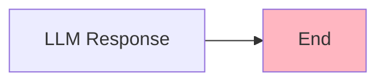
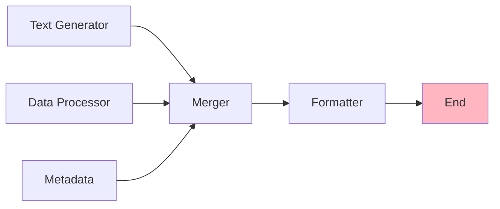
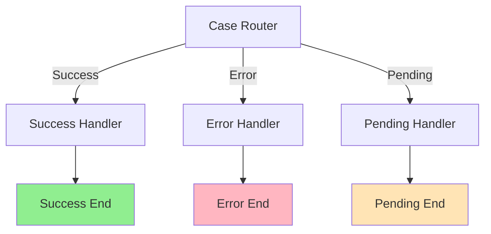
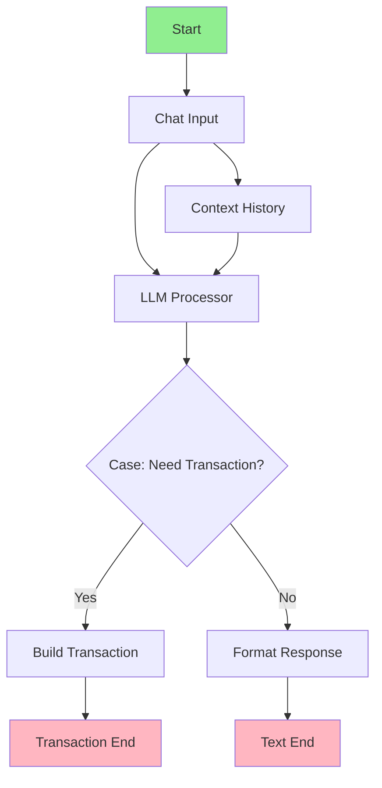

import { Card, CardHeader, CardTitle, CardDescription } from '@site/src/components/Card';
import { Callout } from '@site/src/components/Callout';
import { Features, Feature } from '@site/src/components/Features';
import { CollapsibleCodeBlock, InlineCodeCard } from '@site/src/components/CodeBlock';
import Tabs from '@theme/Tabs';
import TabItem from '@theme/TabItem';
import CodeBlock from '@theme/CodeBlock';

# End Element

The End element marks the termination point of a flow in the HPC Neura Execution Engine. It collects final outputs, including text responses and optional blockchain transactions, and returns them to the flow executor.

<Card>
  <CardHeader>
    <CardTitle>Element Overview</CardTitle>
  </CardHeader>
  

    <table>
      <tbody>
        <tr>
          <td><strong>Type</strong></td>
          <td><code>end</code></td>
        </tr>
        <tr>
          <td><strong>Category</strong></td>
          <td>Flow Control</td>
        </tr>
        <tr>
          <td><strong>Required Inputs</strong></td>
          <td><code>text_input</code> (string)</td>
        </tr>
        <tr>
          <td><strong>Optional Inputs</strong></td>
          <td><code>proposed_transaction</code> (json)</td>
        </tr>
        <tr>
          <td><strong>L2 Customizable</strong></td>
          <td>Name, description, processing message, tags, layer</td>
        </tr>
      </tbody>
    </table>
  

</Card>

## Purpose

<Features>
  <Feature title="Flow Termination" icon="/img/icons/success.svg">
    Marks the successful completion of a flow
  </Feature>
  <Feature title="Output Collection" icon="/img/icons/database.svg">
    Gathers final results for return to caller
  </Feature>
  <Feature title="Transaction Support" icon="/img/icons/blockchain.svg">
    Handles blockchain transaction proposals
  </Feature>
</Features>

## Element Schema

<CollapsibleCodeBlock
  title="Complete Element Definition"
  description="L1 element template for End"
  language="yaml"
  defaultCollapsed={false}
>
{`type: end
element_id: null  # Auto-generated at L2
name: null  # Set by L2
node_description: Exit point of a flow that collects final outputs including text and optional blockchain transactions
description: null  # Customizable by L2
input_schema:
  text_input:
    type: string
    description: Final text output of the flow
    required: true
  proposed_transaction:
    type: json
    description: Transaction data for blockchain interaction
    required: false
output_schema:
  text_output:
    type: string
    description: Final text output
    required: true
  proposed_transaction:
    type: json
    description: Final transaction payload
    required: false
parameter_schema_structure: {}  # No parameters
parameters: {}
processing_message: Completing flow...
tags:
  - flow-control
  - required
layer: null  # Set by L2
hyperparameters:
  type:
    access: fixed
  element_id:
    access: fixed
  name:
    access: edit
  description:
    access: edit
  input_schema:
    access: fixed
  output_schema:
    access: fixed
  processing_message:
    access: edit
  tags:
    access: append
  layer:
    access: edit`}
</CollapsibleCodeBlock>

## Key Characteristics

<Callout type="info">
The End element has **fixed input and output schemas**. It always expects a `text_input` and optionally accepts a `proposed_transaction` for blockchain operations.
</Callout>

### Input Requirements

| Input | Type | Required | Description |
|-------|------|----------|-------------|
| `text_input` | string | Yes | The final text output to return to the user |
| `proposed_transaction` | json | No | Transaction payload for blockchain execution |

### Output Structure

The End element outputs exactly what it receives:
- `text_output`: Same as `text_input`
- `proposed_transaction`: Same as input (if provided)

## Usage Examples

### Basic End Element

<CollapsibleCodeBlock
  title="Simple End Configuration"
  description="Basic text-only output"
  language="yaml"
>
{`flow_definition:
  nodes:
    response_generator:
      type: llm_text
      name: "Generate Response"
      # ... configuration
      
    flow_end:
      type: end
      element_id: flow_end
      name: "Return Response"
      description: "Returns the generated response to user"
      processing_message: "Finalizing response..."
      tags:
        - flow-control
        - required
        - output
      layer: "output"
      
  connections:
    - from_id: response_generator
      to_id: flow_end
      from_output: "response_generator:llm_output"
      to_input: "flow_end:text_input"`}
</CollapsibleCodeBlock>

### End with Transaction

<CollapsibleCodeBlock
  title="End with Blockchain Transaction"
  description="Returning both text and transaction"
  language="yaml"
>
{`flow_definition:
  nodes:
    transaction_builder:
      type: build_transaction_json
      name: "Build SUI Transaction"
      # ... configuration
      
    response_formatter:
      type: llm_text
      name: "Format Response"
      # ... configuration
      
    flow_end:
      type: end
      element_id: flow_end
      name: "Complete Transaction"
      description: "Returns response and transaction for execution"
      
  connections:
    # Text response
    - from_id: response_formatter
      to_id: flow_end
      from_output: "response_formatter:llm_output"
      to_input: "flow_end:text_input"
      
    # Transaction data
    - from_id: transaction_builder
      to_id: flow_end
      from_output: "transaction_builder:transaction_json"
      to_input: "flow_end:proposed_transaction"`}
</CollapsibleCodeBlock>

### Multiple End Elements

<CollapsibleCodeBlock
  title="Flow with Multiple Endpoints"
  description="Different paths leading to different ends"
  language="yaml"
>
{`flow_definition:
  nodes:
    case_router:
      type: case
      name: "Route by Type"
      parameters:
        cases:
          - success_case:
              variable1: status
              variable2: "success"
              compare: "=="
          - error_case:
              variable1: status
              variable2: "error"
              compare: "=="
              
    success_handler:
      type: llm_text
      name: "Success Response"
      
    error_handler:
      type: custom
      name: "Error Response"
      
    success_end:
      type: end
      element_id: success_end
      name: "Success Completion"
      description: "Returns successful result"
      
    error_end:
      type: end
      element_id: error_end
      name: "Error Completion"
      description: "Returns error message"
      
  connections:
    # Success path
    - from_id: case_router
      to_id: success_handler
      case_id: success_case
      
    - from_id: success_handler
      to_id: success_end
      from_output: "success_handler:llm_output"
      to_input: "success_end:text_input"
      
    # Error path
    - from_id: case_router
      to_id: error_handler
      case_id: error_case
      
    - from_id: error_handler
      to_id: error_end
      from_output: "error_handler:error_message"
      to_input: "error_end:text_input"`}
</CollapsibleCodeBlock>

## Output Patterns

<Tabs>
  <TabItem value="text-only" label="Text Only" default>
    

      <Card>
        <CardHeader>
          <CardTitle>Simple Text Output</CardTitle>
        </CardHeader>
        

          <CollapsibleCodeBlock
            title="Text-Only Response"
            description="Most common pattern"
            language="yaml"
          >
{`# Input to End element
end_input:
    text_input: "Your request has been processed successfully. The analysis shows positive trends."   

# Output from End element (to flow executor)
flow_output:
    text_output: "Your request has been processed successfully. The analysis shows positive trends."
    proposed_transaction: null

# What the user sees
"Your request has been processed successfully. The analysis shows positive trends."`}
          </CollapsibleCodeBlock>
        

      </Card>
    

  </TabItem>
  
  <TabItem value="with-transaction" label="With Transaction">
    

      <Card>
        <CardHeader>
          <CardTitle>Text + Transaction Output</CardTitle>
        </CardHeader>
        

          <CollapsibleCodeBlock
            title="Response with Blockchain Transaction"
            description="For blockchain interactions"
            language="yaml"
          >
{`# Input to End element
end_input:
  text_input: "Transaction prepared: Sending 100 SUI to recipient"
  proposed_transaction:
    to: "0x742d35Cc6634C0532925a3b844Bc9e7595f6E123"
    amount: "100000000000"  # 100 SUI in MIST
    gas_budget: "10000000"
    gas_price: "1000"

# Output from End element
flow_output:
  text_output: "Transaction prepared: Sending 100 SUI to recipient"
  proposed_transaction:
    to: "0x742d35Cc6634C0532925a3b844Bc9e7595f6E123"
    amount: "100000000000"
    gas_budget: "10000000"
    gas_price: "1000"

# User sees text + gets transaction to sign`}
          </CollapsibleCodeBlock>
        

      </Card>
    

  </TabItem>
  
  <TabItem value="error" label="Error Messages">
    

      <Card>
        <CardHeader>
          <CardTitle>Error Handling Output</CardTitle>
        </CardHeader>
        

          <CollapsibleCodeBlock
            title="Error Response Pattern"
            description="Graceful error handling"
            language="yaml"
          >
{`nodes:
  # Error handler produces structured error data
  error_handler:
    type: custom
    name: "Error Handler"
    code: |
      # Produces structured error output
      output['error_message'] = "Unable to process request: Invalid wallet address format"
      output['error_code'] = "INVALID_ADDRESS"
      output['suggestions'] = [
        "Check the wallet address format",
        "Ensure it starts with '0x'"
      ]
    output_schema:
      error_message:
        type: string
      error_code:
        type: string
      suggestions:
        type: list

  # Formatter node converts structured data to string
  error_formatter:
    type: custom
    name: "Error Message Formatter"
    code: |
      # Take structured error and format as user-friendly string
      error_msg = inputs.get('error_message', 'Unknown error')
      error_code = inputs.get('error_code', 'ERROR')
      suggestions = inputs.get('suggestions', [])
      
      # Format into nice string for End element
      formatted_text = f"""❌ Error: {error_msg}
      
Error Code: {error_code}

Please check:
{chr(10).join(f'• {s}' for s in suggestions)}"""
      
      output['formatted_error_text'] = formatted_text
    input_schema:
      error_message:
        type: string
      error_code:
        type: string
      suggestions:
        type: list
    output_schema:
      formatted_error_text:
        type: string

  # End element only accepts string
  error_end:
    type: end
    name: "Error Response End"
    input_schema:
      text_input:
        type: string
        required: true
      proposed_transaction:
        type: json
        required: false

connections:
  # Error handler outputs structured data
  - from_id: error_handler
    to_id: error_formatter
    from_output: "error_handler:error_message"
    to_input: "error_formatter:error_message"
    
  - from_id: error_handler
    to_id: error_formatter
    from_output: "error_handler:error_code"
    to_input: "error_formatter:error_code"
    
  - from_id: error_handler
    to_id: error_formatter
    from_output: "error_handler:suggestions"
    to_input: "error_formatter:suggestions"
    
  # Formatter outputs string to End element
  - from_id: error_formatter
    to_id: error_end
    from_output: "error_formatter:formatted_error_text"
    to_input: "error_end:text_input"`}
          </CollapsibleCodeBlock>
        

      </Card>
    

  </TabItem>
</Tabs>

## Connection Patterns

### Single Source to End

The most common pattern - one final processor connects to End:

### Multiple Sources (Merger Pattern)

Combining multiple outputs before End:

### Conditional Endings

Different paths leading to different End elements:

## Best Practices

<Callout type="success" title="End Element Best Practices">
✅ **Always Provide Text**: The `text_input` is required - never leave it empty
✅ **Clear Messages**: Provide user-friendly, actionable text outputs
✅ **Transaction Safety**: Validate transaction data before sending to End
✅ **Error Handling**: Use separate End elements for error paths
✅ **Metadata in Text**: Include relevant metadata in the text output when needed
</Callout>

## Common Patterns

### Pattern 1: Response Formatting

<CollapsibleCodeBlock
  title="Formatted Response Pattern"
  description="Format data nicely before End"
  language="yaml"
>
{`nodes:
  data_processor:
    type: llm_structured
    name: "Process Data"
    output_schema:
      summary:
        type: string
      details:
        type: json
      recommendations:
        type: list
        
  response_formatter:
    type: custom
    name: "Format Response"
    code: |
      summary = inputs['summary']
      details = inputs['details']
      recommendations = inputs['recommendations']
      
      # Format into nice text
      output['formatted_text'] = f"""
📊 Analysis Summary
{summary}

📋 Details:
• Total items: {details.get('count', 0)}
• Status: {details.get('status', 'Unknown')}

💡 Recommendations:
{chr(10).join(f'• {r}' for r in recommendations)}
"""
      
  flow_end:
    type: end
    name: "Return Formatted Response"
    
connections:
  - from_id: data_processor
    to_id: response_formatter
  - from_id: response_formatter
    to_id: flow_end
    from_output: "response_formatter:formatted_text"
    to_input: "flow_end:text_input"`}
</CollapsibleCodeBlock>

### Pattern 2: Transaction with Confirmation

<CollapsibleCodeBlock
  title="Transaction Confirmation Pattern"
  description="Build transaction with user confirmation text"
  language="yaml"
>
{`nodes:
  transaction_builder:
    type: build_transaction_json
    name: "Build Transfer"
    
  confirmation_text:
    type: custom
    name: "Generate Confirmation"
    code: |
      tx = inputs['transaction']
      amount = int(tx['amount']) / 1e9  # Convert from MIST
      
      output['confirmation'] = f"""
🔄 Transaction Ready

Sending: {amount} SUI
To: {tx['to'][:6]}...{tx['to'][-4:]}
Gas Budget: {int(tx['gas_budget']) / 1e9} SUI

Please review and confirm the transaction.
"""
      
  flow_end:
    type: end
    name: "Return with Transaction"
    
connections:
  - from_id: transaction_builder
    to_id: confirmation_text
    from_output: "transaction_builder:transaction_json"
    to_input: "confirmation_text:transaction"
    
  - from_id: confirmation_text
    to_id: flow_end
    from_output: "confirmation_text:confirmation"
    to_input: "flow_end:text_input"
    
  - from_id: transaction_builder
    to_id: flow_end
    from_output: "transaction_builder:transaction_json"
    to_input: "flow_end:proposed_transaction"`}
</CollapsibleCodeBlock>

### Pattern 3: Aggregated Results

<CollapsibleCodeBlock
  title="Result Aggregation Pattern"
  description="Combine multiple results before End"
  language="yaml"
>
{`nodes:
  parallel_analyzer_1:
    type: llm_structured
    name: "Sentiment Analysis"
    
  parallel_analyzer_2:
    type: llm_structured
    name: "Entity Extraction"
    
  parallel_analyzer_3:
    type: custom
    name: "Statistics"
    
  result_aggregator:
    type: custom
    name: "Aggregate Results"
    code: |
      sentiment = inputs.get('sentiment', {})
      entities = inputs.get('entities', [])
      stats = inputs.get('statistics', {})
      
      output['summary'] = f"""
📊 Complete Analysis Results

Sentiment: {sentiment.get('label', 'Unknown')} ({sentiment.get('score', 0):.2f})

Entities Found: {len(entities)}
{chr(10).join(f'• {e["type"]}: {e["value"]}' for e in entities[:5])}

Statistics:
• Word Count: {stats.get('word_count', 0)}
• Complexity: {stats.get('complexity', 'N/A')}
• Reading Time: {stats.get('reading_time', 'N/A')}
"""
      
  flow_end:
    type: end
    name: "Return Aggregated Results"`}
</CollapsibleCodeBlock>

## Error Handling

### Input Validation

<Callout type="warning" title="Required Input Validation">
The End element **requires** a `text_input`. If not provided, the flow will fail. Always ensure upstream nodes provide this required field.
</Callout>

<CollapsibleCodeBlock
  title="Safe End Connection"
  description="Ensure text_input is always provided"
  language="yaml"
>
{`nodes:
  safe_formatter:
    type: custom
    name: "Safe Formatter"
    code: |
      # Always provide a text output
      try:
          result = inputs.get('result', {})
          if result.get('success'):
              output['text'] = result.get('message', 'Operation completed successfully')
          else:
              output['text'] = result.get('error', 'An error occurred')
      except Exception as e:
          output['text'] = f'Unexpected error: {str(e)}'
          
  flow_end:
    type: end
    name: "Safe End"
    
connections:
  - from_id: safe_formatter
    to_id: flow_end
    from_output: "safe_formatter:text"
    to_input: "flow_end:text_input"`}
</CollapsibleCodeBlock>

### Transaction Validation

<CollapsibleCodeBlock
  title="Transaction Validation Before End"
  description="Validate transaction data structure"
  language="yaml"
>
{`nodes:
  transaction_validator:
    type: custom
    name: "Validate Transaction"
    code: |
      tx = inputs.get('transaction')
      
      # Validate required fields
      required_fields = ['to', 'amount', 'gas_budget']
      missing = [f for f in required_fields if f not in tx]
      
      if missing:
          output['valid'] = False
          output['text'] = f"Transaction invalid: Missing fields {missing}"
          output['transaction'] = None
      else:
          output['valid'] = True
          output['text'] = "Transaction validated and ready"
          output['transaction'] = tx
          
  flow_end:
    type: end
    name: "Return Validated Transaction"`}
</CollapsibleCodeBlock>

## Technical Details

### Execution Behavior

1. **Terminal Node**: No outgoing connections allowed
2. **Multiple Ends**: Flows can have multiple End elements for different paths
3. **Execution Completion**: Flow completes when any End element is reached
4. **Output Return**: Returns data to the flow executor/caller
5. **No Processing**: Pure output collection, no data transformation

### Performance Considerations

- **Lightweight**: Minimal processing overhead
- **Immediate Return**: No delays in returning results
- **Memory Efficient**: Releases all upstream data after completion

## Visual Flow Examples

### Complete Flow Example

## Related Elements

  <Card>
    <CardHeader>
      <CardTitle>Start Element</CardTitle>
      <CardDescription>
        Begin flow execution
      </CardDescription>
    </CardHeader>
    

      <a href="./01-start" style={{ textDecoration: 'none' }}>
        Learn about Start →
      </a>
    

  </Card>
  
  <Card>
    <CardHeader>
      <CardTitle>Case Element</CardTitle>
      <CardDescription>
        Route to different End elements
      </CardDescription>
    </CardHeader>
    

      <a href="./03-case" style={{ textDecoration: 'none' }}>
        Explore Case →
      </a>
    

  </Card>

## Summary

The End element is the essential termination point for flows, providing:
- **Required text output** for user communication
- **Optional transaction support** for blockchain operations
- **Multiple endpoints** for different flow paths
- **Clean completion** of flow execution

Remember: Always ensure your End elements receive proper `text_input` and validate any transaction data before passing it through.