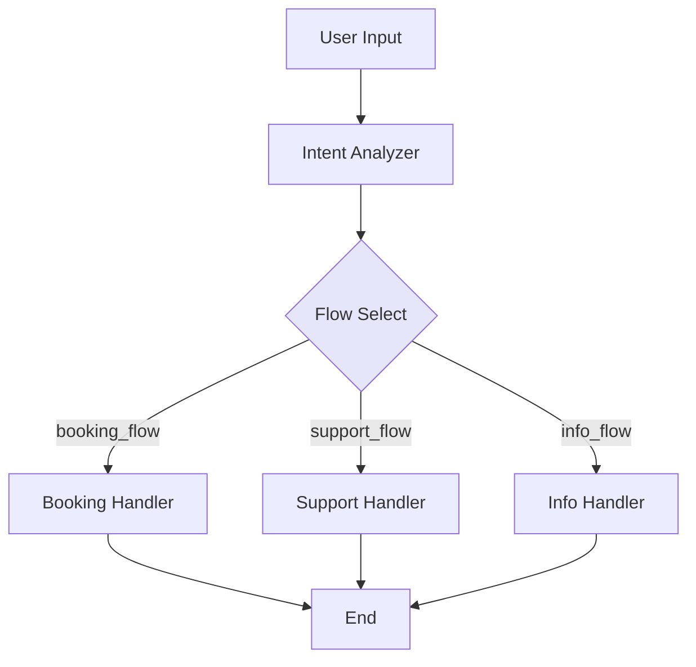
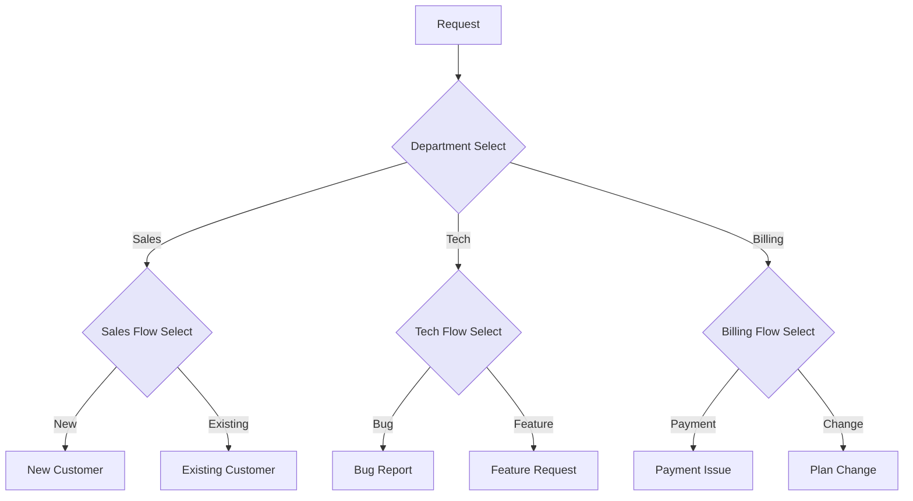

import { Card, CardHeader, CardTitle, CardDescription } from '@site/src/components/Card';
import { Callout } from '@site/src/components/Callout';
import { Features, Feature } from '@site/src/components/Features';
import { CollapsibleCodeBlock, InlineCodeCard } from '@site/src/components/CodeBlock';
import Tabs from '@theme/Tabs';
import TabItem from '@theme/TabItem';
import CodeBlock from '@theme/CodeBlock';

# Flow Select Element

The Flow Select element provides simple path selection in the HPC Neura Execution Engine. Unlike the Case element, it doesn't evaluate conditions - it simply activates one of several predefined execution paths.

<Card>
  <CardHeader>
    <CardTitle>Element Overview</CardTitle>
  </CardHeader>
  

    <table>
      <tbody>
        <tr>
          <td><strong>Type</strong></td>
          <td><code>flow_select</code></td>
        </tr>
        <tr>
          <td><strong>Category</strong></td>
          <td>Flow Control</td>
        </tr>
        <tr>
          <td><strong>Input</strong></td>
          <td>Any (passes through unchanged)</td>
        </tr>
        <tr>
          <td><strong>Output</strong></td>
          <td>Input data + <code>chosen_flow</code> (string)</td>
        </tr>
        <tr>
          <td><strong>Flow Control</strong></td>
          <td>Activates one selected path</td>
        </tr>
      </tbody>
    </table>
  

</Card>

## Purpose

<Features>
  <Feature title="Path Selection" icon="/img/icons/network.svg">
    Choose between multiple execution paths
  </Feature>
  <Feature title="No Conditions" icon="/img/icons/settings.svg">
    Simpler than Case - no condition evaluation
  </Feature>
  <Feature title="Data Pass-Through" icon="/img/icons/arrow-right.svg">
    All inputs flow to the selected path
  </Feature>
</Features>

## How Flow Select Works

<Callout type="info" title="Understanding Flow Select">
Flow Select is simpler than Case:
1. Receives any input data
2. Selects one path from `flows_to_switch`
3. Passes all data to the selected path
4. Adds `chosen_flow` to the output
5. Only the selected path executes

The selection mechanism can be:
- User choice (UI selection)
- Previous node decision
- Internal routing logic
</Callout>

## Element Schema

<CollapsibleCodeBlock
  title="Complete Element Definition"
  description="L1 element template for Flow Select"
  language="yaml"
  defaultCollapsed={false}
>
{`type: flow_select
element_id: null  # Auto-generated at L2
name: null  # Set by L2
node_description: Path selection element that chooses between multiple flow execution paths
description: null  # Customizable by L2
input_schema: {}  # Accepts any input
output_schema:
  chosen_flow:
    type: string
    description: ID of the selected flow
    required: true
  # Plus all input data passed through
parameter_schema_structure:
  flows_to_switch:
    type: list
    description: List of flow IDs representing possible paths
parameters:
    flows_to_switch: []  # Configured by L2
processing_message: Selecting execution path...
tags:
    - flow-control
    - routing
layer: null  # Set by L2
hyperparameters:
    type:
        access: fixed
    element_id:
        access: fixed
    name:
        access: edit
    description:
        access: edit
    input_schema:
        access: fixed
    output_schema:
        access: fixed
    parameters.flows_to_switch:
        access: edit
    processing_message:
        access: edit
    tags:
        access: append
    layer:
        access: edit
flow_control:
  type: flow_select
  enabled: true`}
</CollapsibleCodeBlock>

## Key Differences from Case

<Card>
  <CardHeader>
    <CardTitle>Case vs Flow Select</CardTitle>
  </CardHeader>
  

    <table>
      <thead>
        <tr>
          <th>Feature</th>
          <th>Case Element</th>
          <th>Flow Select Element</th>
        </tr>
      </thead>
      <tbody>
        <tr>
          <td><strong>Purpose</strong></td>
          <td>Conditional branching</td>
          <td>Simple path selection</td>
        </tr>
        <tr>
          <td><strong>Input</strong></td>
          <td>Specific variables dict</td>
          <td>Any data (flexible)</td>
        </tr>
        <tr>
          <td><strong>Decision</strong></td>
          <td>Evaluates conditions</td>
          <td>Selects from list</td>
        </tr>
        <tr>
          <td><strong>Output</strong></td>
          <td>Boolean results for each case</td>
          <td>Original data + chosen_flow</td>
        </tr>
        <tr>
          <td><strong>Paths</strong></td>
          <td>Multiple can be active</td>
          <td>Only one active path</td>
        </tr>
        <tr>
          <td><strong>Complexity</strong></td>
          <td>Complex logic possible</td>
          <td>Simple selection only</td>
        </tr>
      </tbody>
    </table>
  

</Card>

## Usage Examples

### Basic Flow Selection

<CollapsibleCodeBlock
  title="Simple Path Selection"
  description="Choose between processing paths"
  language="yaml"
>
{`flow_definition:
  nodes:
    intent_classifier:
      type: llm_structured
      name: "Classify User Intent"
      output_schema:
        intent:
          type: string
          enum: ["transaction", "support", "information"]
          
    flow_selector:
      type: flow_select
      element_id: flow_selector
      name: "Route by Intent"
      description: "Selects processing path based on intent"
      parameters:
        flows_to_switch:
          - transaction_flow
          - support_flow
          - information_flow
      processing_message: "Routing to appropriate handler..."
      
    # Path handlers
    transaction_handler:
      type: build_transaction_json
      name: "Transaction Processor"
      # Active only for transaction_flow
      
    support_handler:
      type: llm_text
      name: "Support AI"
      # Active only for support_flow
      
    info_handler:
      type: custom
      name: "Information Provider"
      # Active only for information_flow
      
  connections:
    # Intent goes to selector
    - from_id: intent_classifier
      to_id: flow_selector
      
    # Selector connects to all paths
    - from_id: flow_selector
      to_id: transaction_handler
      # Active when chosen_flow == "transaction_flow"
      
    - from_id: flow_selector
      to_id: support_handler
      # Active when chosen_flow == "support_flow"
      
    - from_id: flow_selector
      to_id: info_handler
      # Active when chosen_flow == "information_flow"`}
</CollapsibleCodeBlock>

### Dynamic Path Selection

<CollapsibleCodeBlock
  title="Path Selection with Logic"
  description="Determine path programmatically"
  language="yaml"
>
{`nodes:
  path_determiner:
    type: custom
    name: "Determine Processing Path"
    code: |
      # Analyze input to determine best path
      user_input = inputs.get('user_input', '')
      context = inputs.get('context', {})
      
      # Simple keyword-based routing
      if any(word in user_input.lower() for word in ['buy', 'sell', 'transfer']):
          selected_path = 'transaction_flow'
      elif any(word in user_input.lower() for word in ['help', 'issue', 'problem']):
          selected_path = 'support_flow'
      elif context.get('previous_path') == 'transaction_flow':
          selected_path = 'transaction_followup_flow'
      else:
          selected_path = 'general_flow'
          
      output['selected_path'] = selected_path
      output['user_input'] = user_input
      output['context'] = context
      
  path_router:
    type: flow_select
    name: "Execute Selected Path"
    parameters:
      flows_to_switch:
        - transaction_flow
        - support_flow
        - transaction_followup_flow
        - general_flow
        
connections:
  - from_id: path_determiner
    to_id: path_router
    # The path_router will use selected_path to choose`}
</CollapsibleCodeBlock>

### Multi-Stage Flow Selection

<CollapsibleCodeBlock
  title="Cascading Flow Selectors"
  description="Multiple levels of path selection"
  language="yaml"
>
{`nodes:
  # First level - Department selection
  department_selector:
    type: flow_select
    name: "Select Department"
    parameters:
      flows_to_switch:
        - sales_department
        - technical_department
        - billing_department
        
  # Sales sub-selector
  sales_flow_selector:
    type: flow_select
    name: "Sales Process Selection"
    parameters:
      flows_to_switch:
        - new_customer_flow
        - existing_customer_flow
        - enterprise_flow
        
  # Technical sub-selector  
  tech_flow_selector:
    type: flow_select
    name: "Technical Issue Type"
    parameters:
      flows_to_switch:
        - bug_report_flow
        - feature_request_flow
        - integration_help_flow
        
  # Billing sub-selector
  billing_flow_selector:
    type: flow_select
    name: "Billing Query Type"
    parameters:
      flows_to_switch:
        - payment_issue_flow
        - subscription_change_flow
        - invoice_request_flow`}
</CollapsibleCodeBlock>

## Input/Output Behavior

<Tabs>
  <TabItem value="passthrough" label="Data Pass-Through" default>
    

      <CollapsibleCodeBlock
        title="Complete Data Pass-Through"
        description="All input data flows to selected path"
        language="yaml"
      >
{`# Input to flow_select
flow_select_input:
  user_data:
    id: "user_123"
    name: "John Doe"
    tier: "premium"
  request:
    action: "transfer"
    amount: 100
    recipient: "0x742d35..."
  metadata:
    timestamp: "2025-01-27T10:00:00Z"
    session_id: "sess_456"
    
# Flow select adds chosen_flow
flow_select_output:
  user_data:
    id: "user_123"
    name: "John Doe"
    tier: "premium"
  request:
    action: "transfer"
    amount: 100
    recipient: "0x742d35..."
  metadata:
    timestamp: "2025-01-27T10:00:00Z"
    session_id: "sess_456"
  chosen_flow: "transaction_flow"  # Added by flow_select
  
# Selected handler receives everything
transaction_handler_input:
  # All the same data as flow_select_output`}
      </CollapsibleCodeBlock>
    

  </TabItem>
  
  <TabItem value="selection" label="Selection Mechanism">
    

      <Card>
        <CardHeader>
          <CardTitle>How Path Selection Works</CardTitle>
        </CardHeader>
        

          
The documentation doesn't specify exactly how the path is selected. Possible mechanisms:

          
          <h4>1. UI-Driven Selection</h4>
          <CollapsibleCodeBlock
            title="User Interface Selection"
            language="yaml"
          >
{`# User selects from UI
ui_selection:
  chosen_option: "Premium Support"
  
# Maps to flow
flow_mapping:
  "Premium Support": "premium_support_flow"
  "Standard Support": "standard_support_flow"
  "Self Service": "self_service_flow"`}
          </CollapsibleCodeBlock>
          
          <h4>2. Previous Node Decision</h4>
          <CollapsibleCodeBlock
            title="Programmatic Selection"
            language="yaml"
          >
{`# Previous node determines path
intent_analyzer_output:
  intent: "transaction"
  suggested_flow: "transaction_flow"
  
# Flow select uses suggested_flow
flow_select:
  chosen_flow: "transaction_flow"  # From suggested_flow`}
          </CollapsibleCodeBlock>
          
          <h4>3. Configuration-Based</h4>
          <CollapsibleCodeBlock
            title="Static Configuration"
            language="yaml"
          >
{`# Flow select with default selection
flow_select:
  parameters:
    flows_to_switch:
      - primary_flow
      - backup_flow
      - maintenance_flow
    default_selection: "primary_flow"
    selection_strategy: "round_robin"  # or "random", "weighted"`}
          </CollapsibleCodeBlock>
        

      </Card>
    

  </TabItem>
</Tabs>

## Common Patterns

### Pattern 1: Intent-Based Routing

<CollapsibleCodeBlock
  title="Route by User Intent"
  description="Common pattern for chatbot flows"
  language="yaml"
>
{`nodes:
  user_input:
    type: chat_input
    name: "User Message"
    
  intent_extractor:
    type: llm_structured
    name: "Extract Intent"
    output_schema:
      primary_intent:
        type: string
        enum: ["booking", "cancellation", "inquiry", "complaint"]
      confidence:
        type: float
      entities:
        type: json
        
  intent_router:
    type: flow_select
    name: "Route by Intent"
    parameters:
      flows_to_switch:
        - booking_flow
        - cancellation_flow
        - inquiry_flow
        - complaint_flow
        
  # Booking flow
  booking_handler:
    type: llm_structured
    name: "Handle Booking"
    # Only active for booking_flow
    
  # Cancellation flow
  cancellation_handler:
    type: custom
    name: "Process Cancellation"
    # Only active for cancellation_flow
    
  # Inquiry flow
  inquiry_handler:
    type: llm_text
    name: "Answer Inquiry"
    # Only active for inquiry_flow
    
  # Complaint flow
  complaint_handler:
    type: custom
    name: "Log Complaint"
    # Only active for complaint_flow`}
</CollapsibleCodeBlock>

### Pattern 2: Load Balancing

<CollapsibleCodeBlock
  title="Distribute Load Across Handlers"
  description="Balance processing across multiple paths"
  language="yaml"
>
{`nodes:
  load_balancer:
    type: custom
    name: "Load Balance Selector"
    code: |
      # Simple round-robin load balancing
      import hashlib
      
      request_id = inputs.get('request_id', '')
      available_handlers = ['handler_a', 'handler_b', 'handler_c']
      
      # Consistent hashing for same request
      hash_value = int(hashlib.md5(request_id.encode()).hexdigest(), 16)
      selected_index = hash_value % len(available_handlers)
      
      output['selected_handler'] = available_handlers[selected_index]
      output['request_data'] = inputs
      
  handler_router:
    type: flow_select
    name: "Route to Handler"
    parameters:
      flows_to_switch:
        - handler_a
        - handler_b
        - handler_c
        
  # Three identical handlers for load distribution
  handler_a:
    type: custom
    name: "Handler Instance A"
    
  handler_b:
    type: custom
    name: "Handler Instance B"
    
  handler_c:
    type: custom
    name: "Handler Instance C"`}
</CollapsibleCodeBlock>

### Pattern 3: A/B Testing

<CollapsibleCodeBlock
  title="A/B Test Different Flows"
  description="Test different implementations"
  language="yaml"
>
{`nodes:
  ab_test_selector:
    type: custom
    name: "A/B Test Assignment"
    code: |
      import random
      
      user_id = inputs.get('user_id', '')
      
      # Consistent assignment per user
      random.seed(user_id)
      test_group = random.choice(['control', 'variant_a', 'variant_b'])
      
      # Or percentage-based
      rand_value = random.random()
      if rand_value < 0.5:  # 50%
          flow_choice = 'original_flow'
      elif rand_value < 0.8:  # 30%
          flow_choice = 'experimental_flow_a'
      else:  # 20%
          flow_choice = 'experimental_flow_b'
          
      output['test_group'] = test_group
      output['selected_flow'] = flow_choice
      output['user_data'] = inputs
      
  ab_router:
    type: flow_select
    name: "A/B Test Router"
    parameters:
      flows_to_switch:
        - original_flow
        - experimental_flow_a
        - experimental_flow_b
        
  # Different implementations to test
  original_implementation:
    type: llm_text
    name: "Original Algorithm"
    parameters:
      model: "gpt-3.5"
      temperature: 0.7
      
  experimental_a:
    type: llm_text
    name: "Experimental A"
    parameters:
      model: "gpt-4"
      temperature: 0.5
      
  experimental_b:
    type: llm_structured
    name: "Experimental B"
    # Completely different approach`}
</CollapsibleCodeBlock>

## Best Practices

<Callout type="success" title="Flow Select Best Practices">
✅ **Clear Path Names**: Use descriptive flow IDs that indicate purpose
✅ **Document Selection Logic**: Explain how paths are chosen
✅ **Single Responsibility**: Each path should have a clear, distinct purpose
✅ **Consistent Data**: Ensure all paths can handle the input data structure
✅ **Default Path**: Consider having a fallback/default path
✅ **Path Validation**: Verify selected path exists in flows_to_switch
</Callout>

## Error Handling

### Invalid Path Selection

<CollapsibleCodeBlock
  title="Handle Invalid Path Selection"
  description="Gracefully handle unknown paths"
  language="yaml"
>
{`nodes:
  safe_path_selector:
    type: custom
    name: "Safe Path Selection"
    code: |
      requested_path = inputs.get('requested_flow', '')
      valid_paths = ['path_a', 'path_b', 'path_c', 'default_path']
      
      # Validate requested path
      if requested_path in valid_paths:
          selected = requested_path
      else:
          selected = 'default_path'
          print(f"Warning: Invalid path '{requested_path}', using default")
          
      output['selected_flow'] = selected
      output['original_request'] = requested_path
      output['data'] = inputs.get('data', {})
      
  safe_router:
    type: flow_select
    name: "Safe Flow Router"
    parameters:
      flows_to_switch:
        - path_a
        - path_b
        - path_c
        - default_path  # Always have a default`}
</CollapsibleCodeBlock>

### Missing Input Handling

<CollapsibleCodeBlock
  title="Handle Missing Inputs"
  description="Flow select with input validation"
  language="yaml"
>
{`nodes:
  input_validator:
    type: custom
    name: "Validate Before Routing"
    code: |
      # Check for required data
      if not inputs:
          output['has_data'] = False
          output['selected_flow'] = 'error_flow'
          output['error'] = "No input data provided"
      else:
          output['has_data'] = True
          output['selected_flow'] = 'process_flow'
          output['data'] = inputs
          
  validated_router:
    type: flow_select
    name: "Route Valid Data"
    parameters:
      flows_to_switch:
        - process_flow
        - error_flow
        
  process_handler:
    type: custom
    name: "Process Valid Data"
    
  error_handler:
    type: custom
    name: "Handle Invalid Input"`}
</CollapsibleCodeBlock>

## Visual Flow Examples

### Simple Flow Select

### Multi-Stage Selection

## Technical Details

### Execution Behavior

1. **Single Path Activation**: Only one downstream path executes
2. **Data Preservation**: All input data passes through unchanged
3. **Path Addition**: Adds `chosen_flow` to output
4. **No Conditions**: No evaluation logic, just selection
5. **Immediate Routing**: No processing delay

### Performance Considerations

- **Lightweight**: Minimal overhead, just path selection
- **No Computation**: No condition evaluation or data processing
- **Fast Routing**: Immediate path activation
- **Memory Efficient**: Simple pass-through operation

## Comparison with Other Routing Methods

<Card>
  <CardHeader>
    <CardTitle>When to Use Each Routing Method</CardTitle>
  </CardHeader>
  

    <table>
      <thead>
        <tr>
          <th>Use Case</th>
          <th>Recommended Element</th>
          <th>Why</th>
        </tr>
      </thead>
      <tbody>
        <tr>
          <td>Simple path choice</td>
          <td>Flow Select</td>
          <td>No conditions needed</td>
        </tr>
        <tr>
          <td>Conditional logic</td>
          <td>Case</td>
          <td>Evaluate conditions</td>
        </tr>
        <tr>
          <td>Complex routing</td>
          <td>Custom</td>
          <td>Full programmatic control</td>
        </tr>
        <tr>
          <td>User selection</td>
          <td>Flow Select</td>
          <td>Clean UI integration</td>
        </tr>
        <tr>
          <td>Multi-criteria</td>
          <td>Case</td>
          <td>Multiple conditions</td>
        </tr>
      </tbody>
    </table>
  

</Card>

## Related Elements

  <Card>
    <CardHeader>
      <CardTitle>Case Element</CardTitle>
      <CardDescription>
        For conditional branching logic
      </CardDescription>
    </CardHeader>
    

      <a href="./03-case" style={{ textDecoration: 'none' }}>
        Compare with Case →
      </a>
    

  </Card>
  
  <Card>
    <CardHeader>
      <CardTitle>Custom Element</CardTitle>
      <CardDescription>
        For complex routing logic
      </CardDescription>
    </CardHeader>
    

      <a href="../07-custom-elements/01-custom" style={{ textDecoration: 'none' }}>
        Advanced routing →
      </a>
    

  </Card>

## Summary

The Flow Select element provides simple, efficient path selection by:
- **Accepting any input** and passing it through unchanged
- **Selecting one path** from predefined options
- **Adding chosen_flow** to identify the selected path
- **Activating only the selected path** for execution

Use Flow Select when you need straightforward routing without conditional logic. For complex conditions, use the Case element instead.