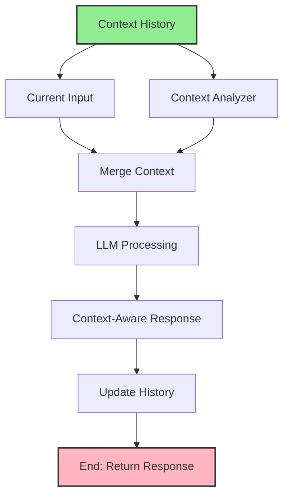

import { Card, CardHeader, CardTitle, CardDescription } from '@site/src/components/Card';
import { Callout } from '@site/src/components/Callout';
import { Features, Feature } from '@site/src/components/Features';
import { CollapsibleCodeBlock, InlineCodeCard } from '@site/src/components/CodeBlock';
import Tabs from '@theme/Tabs';
import TabItem from '@theme/TabItem';
import CodeBlock from '@theme/CodeBlock';

# Context History Element

The Context History element provides access to previous conversation messages and interaction history in the HPC Neura Execution Engine. It enables flows to maintain conversational context and build more intelligent, context-aware responses.

<Card>
  <CardHeader>
    <CardTitle>Element Overview</CardTitle>
  </CardHeader>
  

    <table>
      <tbody>
        <tr>
          <td><strong>Type</strong></td>
          <td><code>context_history</code></td>
        </tr>
        <tr>
          <td><strong>Category</strong></td>
          <td>Input Elements</td>
        </tr>
        <tr>
          <td><strong>Output</strong></td>
          <td><code>history</code> (list) - Array of previous messages</td>
        </tr>
        <tr>
          <td><strong>L2 Customizable</strong></td>
          <td>Name, description, max messages, format, processing message, tags, layer</td>
        </tr>
      </tbody>
    </table>
  

</Card>

## Purpose

<Features>
  <Feature title="Conversation Memory" icon="/img/icons/database.svg">
    Maintains chat history across interactions
  </Feature>
  <Feature title="Context Awareness" icon="/img/icons/ai-workflow.svg">
    Enables context-aware AI responses
  </Feature>
  <Feature title="State Tracking" icon="/img/icons/network.svg">
    Tracks conversation flow and user intent
  </Feature>
</Features>

## Element Schema

<CollapsibleCodeBlock
  title="Complete Element Definition"
  description="L1 element template for Context History"
  language="yaml"
  defaultCollapsed={false}
>
{`type: context_history
element_id: null  # Auto-generated at L2
name: null  # Set by L2
node_description: Provides access to conversation history and previous interactions
description: null  # Customizable by L2
input_schema: {}  # No inputs - retrieves from session
output_schema:
  history:
    type: list
    description: Array of previous conversation messages
    required: true
parameter_schema_structure:
  max_messages:
    type: int
    description: Maximum number of messages to retrieve
  include_system:
    type: bool
    description: Whether to include system messages
  format:
    type: string
    enum: ["full", "text_only", "structured"]
    description: Output format for messages
  filter_by_role:
    type: string
    enum: ["all", "user", "assistant", "system"]
    description: Filter messages by role
parameters:
  max_messages: 10
  include_system: false
  format: "full"
  filter_by_role: "all"
processing_message: Loading conversation history...
tags:
  - input
  - context
  - history
layer: null  # Set by L2
hyperparameters:
  type:
    access: fixed
  element_id:
    access: fixed
  name:
    access: edit
  description:
    access: edit
  input_schema:
    access: fixed
  output_schema:
    access: fixed
  parameters.max_messages:
    access: edit
  parameters.include_system:
    access: edit
  parameters.format:
    access: edit
  parameters.filter_by_role:
    access: edit
  processing_message:
    access: edit
  tags:
    access: append
  layer:
    access: edit`}
</CollapsibleCodeBlock>

## Key Characteristics

<Callout type="info">
The Context History element **retrieves data from the session context**, not from other nodes or user input. It provides automatic access to conversation history maintained by the execution engine.
</Callout>

### Message Structure

Each message in the history typically contains:
- **role**: "user", "assistant", or "system"
- **content**: The message text
- **timestamp**: When the message was created
- **metadata**: Additional context (optional)

## Usage Examples

### Basic Context Retrieval

<CollapsibleCodeBlock
  title="Simple History Access"
  description="Get recent conversation history"
  language="yaml"
>
{`flow_definition:
  nodes:
    conversation_history:
      type: context_history
      element_id: conversation_history
      name: "Get Chat History"
      description: "Retrieves last 5 messages"
      parameters:
        max_messages: 5
        include_system: false
        format: "full"
      processing_message: "Loading previous messages..."
      tags:
        - context
        - history
      layer: "input"
      
    current_input:
      type: chat_input
      name: "User Message"
      
    ai_responder:
      type: llm_text
      name: "Context-Aware Response"
      parameters:
        wrapper_prompt: |
          Previous conversation:
          {context}
          
          Current message: {prompt}
          
          Provide a contextual response:
      
  connections:
    - from_id: conversation_history
      to_id: ai_responder
      from_output: "conversation_history:history"
      to_input: "ai_responder:context"
      
    - from_id: current_input
      to_id: ai_responder
      from_output: "current_input:chat_input"
      to_input: "ai_responder:prompt"`}
</CollapsibleCodeBlock>

### Filtered History

<CollapsibleCodeBlock
  title="Role-Based Filtering"
  description="Get only user messages"
  language="yaml"
>
{`nodes:
  user_history:
    type: context_history
    element_id: user_history
    name: "User Messages Only"
    description: "Retrieves only user messages"
    parameters:
      max_messages: 10
      include_system: false
      format: "text_only"
      filter_by_role: "user"
      
  assistant_history:
    type: context_history
    element_id: assistant_history
    name: "Assistant Responses"
    description: "Retrieves only AI responses"
    parameters:
      max_messages: 10
      include_system: false
      format: "full"
      filter_by_role: "assistant"
      
  history_analyzer:
    type: llm_structured
    name: "Analyze Conversation"
    output_schema:
      topics_discussed:
        type: list
        description: "Main topics in conversation"
      user_sentiment:
        type: string
        enum: ["positive", "neutral", "negative"]
      needs_escalation:
        type: bool`}
</CollapsibleCodeBlock>

### Extended History Window

<CollapsibleCodeBlock
  title="Long Conversation Context"
  description="Retrieve extended history for complex interactions"
  language="yaml"
>
{`nodes:
  extended_history:
    type: context_history
    name: "Extended Context"
    parameters:
      max_messages: 50  # Large context window
      include_system: true  # Include all messages
      format: "structured"
      
  context_summarizer:
    type: llm_text
    name: "Summarize Long Context"
    parameters:
      wrapper_prompt: |
        Summarize this conversation history:
        {history}
        
        Key points:
        1. Main topics discussed
        2. User's primary goals
        3. Any unresolved issues
        4. Overall sentiment
        
  smart_responder:
    type: llm_text
    name: "Intelligent Response"
    parameters:
      wrapper_prompt: |
        Conversation summary:
        {summary}
        
        Recent messages:
        {recent_history}
        
        User: {current_message}
        
        Provide a helpful response:`}
</CollapsibleCodeBlock>

## Output Formats

<Tabs>
  <TabItem value="full" label="Full Format" default>
    

      <CollapsibleCodeBlock
        title="Complete Message Objects"
        description="Full message data including metadata"
        language="yaml"
      >
{`# Output with format: "full"
history:
  - role: "user"
    content: "Hello, I need help with my order"
    timestamp: "2025-01-27T10:00:00Z"
    metadata:
      message_id: "msg_123"
      session_id: "sess_456"
      
  - role: "assistant"
    content: "I'd be happy to help with your order. Can you provide your order number?"
    timestamp: "2025-01-27T10:00:15Z"
    metadata:
      message_id: "msg_124"
      model: "gpt-3.5"
      
  - role: "user"
    content: "It's ORDER-78945"
    timestamp: "2025-01-27T10:00:30Z"
    metadata:
      message_id: "msg_125"`}
      </CollapsibleCodeBlock>
    

  </TabItem>
  
  <TabItem value="text_only" label="Text Only">
    

      <CollapsibleCodeBlock
        title="Simple Text Format"
        description="Just the message content"
        language="yaml"
      >
{`# Output with format: "text_only"
history:
  - "User: Hello, I need help with my order"
  - "Assistant: I'd be happy to help with your order. Can you provide your order number?"
  - "User: It's ORDER-78945"
  - "Assistant: Let me look that up for you..."
  
# Useful for simple prompt construction`}
      </CollapsibleCodeBlock>
    

  </TabItem>
  
  <TabItem value="structured" label="Structured Format">
    

      <CollapsibleCodeBlock
        title="Structured Conversation Data"
        description="Organized for analysis"
        language="yaml"
      >
{`# Output with format: "structured"
history:
  conversation_id: "conv_789"
  session_count: 3
  messages:
    - index: 0
      role: "user"
      content: "Hello, I need help with my order"
      timestamp: "2025-01-27T10:00:00Z"
      turn: 1
      
    - index: 1
      role: "assistant"
      content: "I'd be happy to help..."
      timestamp: "2025-01-27T10:00:15Z"
      turn: 1
      tokens_used: 25
      
  statistics:
    total_messages: 6
    user_messages: 3
    assistant_messages: 3
    average_response_time: 15000  # ms
    total_tokens: 450`}
      </CollapsibleCodeBlock>
    

  </TabItem>
</Tabs>

## Common Patterns

### Pattern 1: Context-Aware Chatbot

<CollapsibleCodeBlock
  title="Intelligent Conversation Flow"
  description="Building conversational AI with memory"
  language="yaml"
>
{`nodes:
  # Get conversation context
  chat_context:
    type: context_history
    name: "Conversation Memory"
    parameters:
      max_messages: 10
      format: "full"
      
  # Current user input
  user_message:
    type: chat_input
    name: "User Input"
    
  # Analyze context for patterns
  context_analyzer:
    type: llm_structured
    name: "Analyze Context"
    output_schema:
      repeated_question:
        type: bool
        description: "Is user repeating a question?"
      topic_shift:
        type: bool
        description: "Has topic changed?"
      sentiment_trend:
        type: string
        enum: ["improving", "stable", "deteriorating"]
      key_entities:
        type: list
        description: "Important entities mentioned"
        
  # Generate contextual response
  smart_response:
    type: llm_text
    name: "Context-Aware Response"
    parameters:
      wrapper_prompt: |
        Conversation analysis:
        - Repeated question: {repeated_question}
        - Topic shift: {topic_shift}
        - Sentiment trend: {sentiment_trend}
        - Key entities: {key_entities}
        
        Previous messages:
        {context}
        
        User: {message}
        
        Provide an appropriate response considering the context:`}
</CollapsibleCodeBlock>

### Pattern 2: Conversation Summarization

<CollapsibleCodeBlock
  title="Progressive Summary Pattern"
  description="Summarize long conversations"
  language="yaml"
>
{`nodes:
  # Get full history
  full_history:
    type: context_history
    name: "Complete History"
    parameters:
      max_messages: 100  # Get all available
      include_system: true
      
  # Check if summary needed
  summary_checker:
    type: custom
    name: "Check Summary Need"
    code: |
      history = inputs['history']
      message_count = len(history)
      
      # Summarize every 20 messages
      needs_summary = message_count > 20
      
      output['needs_summary'] = needs_summary
      output['message_count'] = message_count
      output['history'] = history
      
  # Conditional summarization
  case_router:
    type: case
    name: "Summary Router"
    parameters:
      cases:
        - needs_summary:
            variable1: needs_summary
            variable2: true
            compare: "=="
            
  # Summarize if needed
  conversation_summarizer:
    type: llm_text
    name: "Create Summary"
    parameters:
      wrapper_prompt: |
        Summarize this conversation:
        {history}
        
        Include:
        - Main topics
        - Key decisions
        - Action items
        - Unresolved issues`}
</CollapsibleCodeBlock>

### Pattern 3: Multi-Turn Task Tracking

<CollapsibleCodeBlock
  title="Task Progress Tracking"
  description="Track multi-step processes"
  language="yaml"
>
{`nodes:
  # Get task-related history
  task_history:
    type: context_history
    name: "Task Context"
    parameters:
      max_messages: 20
      format: "structured"
      
  # Extract task state
  task_tracker:
    type: llm_structured
    name: "Track Task Progress"
    output_schema:
      task_type:
        type: string
        description: "Type of task being performed"
      steps_completed:
        type: list
        description: "Completed steps"
      current_step:
        type: string
        description: "Current step in process"
      remaining_steps:
        type: list
        description: "Steps still needed"
      blockers:
        type: list
        description: "Any blocking issues"
        
  # Guide next action
  task_assistant:
    type: llm_text
    name: "Task Guidance"
    parameters:
      wrapper_prompt: |
        Task: {task_type}
        Current step: {current_step}
        Completed: {steps_completed}
        Remaining: {remaining_steps}
        
        User message: {message}
        
        Guide the user to the next step:`}
</CollapsibleCodeBlock>

## Configuration Options

<Card>
  <CardHeader>
    <CardTitle>Parameter Reference</CardTitle>
  </CardHeader>
  

    <table>
      <thead>
        <tr>
          <th>Parameter</th>
          <th>Type</th>
          <th>Default</th>
          <th>Description</th>
        </tr>
      </thead>
      <tbody>
        <tr>
          <td><code>max_messages</code></td>
          <td>int</td>
          <td>10</td>
          <td>Maximum messages to retrieve</td>
        </tr>
        <tr>
          <td><code>include_system</code></td>
          <td>bool</td>
          <td>false</td>
          <td>Include system messages</td>
        </tr>
        <tr>
          <td><code>format</code></td>
          <td>string</td>
          <td>"full"</td>
          <td>Output format type</td>
        </tr>
        <tr>
          <td><code>filter_by_role</code></td>
          <td>string</td>
          <td>"all"</td>
          <td>Filter by message role</td>
        </tr>
      </tbody>
    </table>
  

</Card>

## Best Practices

<Callout type="success" title="Context History Best Practices">
✅ **Right-Size Context**: Use appropriate max_messages for your use case
✅ **Filter Wisely**: Use role filters to reduce noise
✅ **Format for Purpose**: Choose format based on downstream needs
✅ **Handle Empty History**: Account for new conversations
✅ **Privacy Aware**: Be mindful of sensitive data in history
✅ **Performance**: Larger histories increase processing time
</Callout>

## Advanced Usage

### Dynamic Context Window

<CollapsibleCodeBlock
  title="Adaptive Context Length"
  description="Adjust context based on conversation"
  language="yaml"
>
{`nodes:
  # Determine optimal context size
  context_sizer:
    type: custom
    name: "Calculate Context Size"
    code: |
      # Base context size
      base_size = 5
      
      # Adjust based on conversation type
      conversation_type = inputs.get('type', 'general')
      
      size_map = {
          'technical_support': 20,  # Need more context
          'simple_query': 3,        # Less context needed
          'multi_step_task': 15,    # Medium context
          'general': 10             # Default
      }
      
      output['context_size'] = size_map.get(conversation_type, base_size)
      
  # Dynamic history retrieval
  adaptive_history:
    type: context_history
    name: "Adaptive Context"
    # Note: In practice, max_messages would be set dynamically
    # This is conceptual - actual implementation may vary`}
</CollapsibleCodeBlock>

### Context Compression

<CollapsibleCodeBlock
  title="Compress Long Contexts"
  description="Reduce context size while preserving information"
  language="yaml"
>
{`nodes:
  # Get large history
  raw_history:
    type: context_history
    name: "Raw History"
    parameters:
      max_messages: 50
      
  # Compress context
  context_compressor:
    type: llm_text
    name: "Compress Context"
    parameters:
      max_tokens: 500
      wrapper_prompt: |
        Compress this conversation history while preserving key information:
        {history}
        
        Include:
        - User's main goal
        - Key facts and entities
        - Current state
        - Important decisions
        
        Output a concise summary (max 500 tokens).
        
  # Use compressed context
  efficient_responder:
    type: llm_text
    name: "Respond with Compressed Context"
    parameters:
      wrapper_prompt: |
        Context summary:
        {compressed_context}
        
        Recent message:
        {current_message}
        
        Response:`}
</CollapsibleCodeBlock>

## Error Handling

### Empty History

<CollapsibleCodeBlock
  title="Handle New Conversations"
  description="Gracefully handle no history"
  language="yaml"
>
{`nodes:
  history_checker:
    type: context_history
    name: "Check History"
    parameters:
      max_messages: 10
      
  history_handler:
    type: custom
    name: "Handle History State"
    code: |
      history = inputs.get('history', [])
      
      if not history:
          output['has_history'] = False
          output['greeting'] = "Hello! How can I help you today?"
          output['context_prompt'] = "This is a new conversation."
      else:
          output['has_history'] = True
          output['greeting'] = "Welcome back!"
          output['context_prompt'] = f"Continuing from {len(history)} previous messages."`}
</CollapsibleCodeBlock>

### History Overflow

<CollapsibleCodeBlock
  title="Handle Large Histories"
  description="Manage token limits"
  language="yaml"
>
{`nodes:
  token_counter:
    type: custom
    name: "Count History Tokens"
    code: |
      history = inputs['history']
      
      # Rough token estimation (1 token ≈ 4 chars)
      total_chars = sum(len(msg.get('content', '')) for msg in history)
      estimated_tokens = total_chars // 4
      
      # Token budget for context
      MAX_CONTEXT_TOKENS = 2000
      
      if estimated_tokens > MAX_CONTEXT_TOKENS:
          # Need to truncate or summarize
          output['needs_truncation'] = True
          output['keep_messages'] = MAX_CONTEXT_TOKENS // 100  # Rough estimate
      else:
          output['needs_truncation'] = False
          output['keep_messages'] = len(history)`}
</CollapsibleCodeBlock>

## Visual Flow Example

## Technical Details

### Execution Behavior

1. **Session Scoped**: Retrieves from current session
2. **Read-Only**: Cannot modify history
3. **Automatic Updates**: History updated after each interaction
4. **Ordered**: Messages in chronological order
5. **Persistent**: Maintained across flow executions

### Performance Considerations

- **Memory Usage**: Scales with max_messages
- **Processing Time**: Larger contexts take longer
- **Token Limits**: Consider LLM context windows
- **Caching**: History cached during execution

## Related Elements

  <Card>
    <CardHeader>
      <CardTitle>Chat Input</CardTitle>
      <CardDescription>
        Capture current user messages
      </CardDescription>
    </CardHeader>
    

      <a href="./01-chat-input" style={{ textDecoration: 'none' }}>
        Learn about input →
      </a>
    

  </Card>
  
  <Card>
    <CardHeader>
      <CardTitle>Metadata Element</CardTitle>
      <CardDescription>
        Access session and user context
      </CardDescription>
    </CardHeader>
    

      <a href="./05-metadata" style={{ textDecoration: 'none' }}>
        Explore metadata →
      </a>
    

  </Card>

## Summary

The Context History element enables sophisticated conversational flows by providing:
- **Automatic history access** from the session context
- **Flexible filtering** by role and message count
- **Multiple formats** for different use cases
- **Integration ready** for context-aware processing

Remember: Context History is essential for building conversational AI that maintains coherent, contextual interactions across multiple turns.