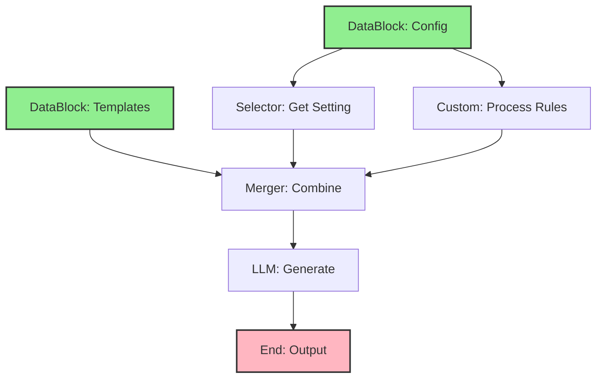

import { Card, CardHeader, CardTitle, CardDescription } from '@site/src/components/Card';
import { Callout } from '@site/src/components/Callout';
import { Features, Feature } from '@site/src/components/Features';
import { CollapsibleCodeBlock, InlineCodeCard } from '@site/src/components/CodeBlock';
import Tabs from '@theme/Tabs';
import TabItem from '@theme/TabItem';
import CodeBlock from '@theme/CodeBlock';

# DataBlocks Element

The DataBlocks element provides static data storage and retrieval in the HPC Neura Execution Engine. It allows L2 developers to embed structured data directly into flows, making it ideal for configuration, reference data, lookup tables, and predefined content.

<Card>
  <CardHeader>
    <CardTitle>Element Overview</CardTitle>
  </CardHeader>
  

    <table>
      <tbody>
        <tr>
          <td><strong>Type</strong></td>
          <td><code>datablock</code></td>
        </tr>
        <tr>
          <td><strong>Category</strong></td>
          <td>Input Elements</td>
        </tr>
        <tr>
          <td><strong>Output</strong></td>
          <td><code>data</code> (any) - The stored data</td>
        </tr>
        <tr>
          <td><strong>L2 Customizable</strong></td>
          <td>Name, description, data content, format, processing message, tags, layer</td>
        </tr>
      </tbody>
    </table>
  

</Card>

## Purpose

<Features>
  <Feature title="Static Data Storage" icon="/img/icons/database.svg">
    Store configuration and reference data
  </Feature>
  <Feature title="Lookup Tables" icon="/img/icons/docs.svg">
    Provide mapping and translation tables
  </Feature>
  <Feature title="Predefined Content" icon="/img/icons/settings.svg">
    Store templates, prompts, and static content
  </Feature>
</Features>

## Element Schema

<CollapsibleCodeBlock
  title="Complete Element Definition"
  description="L1 element template for DataBlocks"
  language="yaml"
  defaultCollapsed={false}
>
{`type: datablock
element_id: null  # Auto-generated at L2
name: null  # Set by L2
node_description: Stores and provides static data for use in flows
description: null  # Customizable by L2
input_schema: {}  # No inputs - data is embedded
output_schema:
  data:
    type: any
    description: The stored data in specified format
    required: true
parameter_schema_structure:
  data:
    type: any
    description: The actual data to store
  format:
    type: string
    enum: ["json", "csv", "text", "yaml"]
    description: Data format type
  parse_csv:
    type: bool
    description: Whether to parse CSV into objects
  csv_headers:
    type: list
    description: Custom headers for CSV data
parameters:
  data: null  # Set by L2
  format: "json"
  parse_csv: true
  csv_headers: null
processing_message: Loading data...
tags:
  - input
  - static-data
  - configuration
layer: null  # Set by L2
hyperparameters:
  type:
    access: fixed
  element_id:
    access: fixed
  name:
    access: edit
  description:
    access: edit
  input_schema:
    access: fixed
  output_schema:
    access: fixed
  parameters.data:
    access: edit
  parameters.format:
    access: edit
  parameters.parse_csv:
    access: edit
  parameters.csv_headers:
    access: edit
  processing_message:
    access: edit
  tags:
    access: append
  layer:
    access: edit`}
</CollapsibleCodeBlock>

## Key Characteristics

<Callout type="info">
DataBlocks **store data at L2 configuration time**, not runtime. The data is embedded in the flow definition and remains constant during execution. For dynamic data, use REST API or other input elements.
</Callout>

### Data Formats Supported

- **JSON**: Structured objects and arrays
- **CSV**: Tabular data with optional parsing
- **Text**: Plain text content
- **YAML**: Structured configuration data

## Usage Examples

### JSON Configuration Data

<CollapsibleCodeBlock
  title="Configuration DataBlock"
  description="Store application configuration"
  language="yaml"
>
{`flow_definition:
  nodes:
    app_config:
      type: datablock
      element_id: app_config
      name: "Application Configuration"
      description: "Core configuration settings"
      parameters:
        format: "json"
        data:
          api_endpoints:
            production: "https://api.example.com/v1"
            staging: "https://staging-api.example.com/v1"
            development: "http://localhost:3000/v1"
          rate_limits:
            free_tier: 100
            pro_tier: 1000
            enterprise_tier: 10000
          features:
            ai_enhanced: true
            blockchain_enabled: true
            analytics_dashboard: false
          supported_languages:
            - "en"
            - "es"
            - "fr"
            - "de"
      processing_message: "Loading configuration..."
      tags:
        - configuration
        - settings
      layer: "config"
      
    # Use configuration
    api_caller:
      type: rest_api
      name: "Call API"
      
  connections:
    - from_id: app_config
      to_id: api_caller
      from_output: "app_config:data.api_endpoints.production"
      to_input: "api_caller:base_url"`}
</CollapsibleCodeBlock>

### CSV Lookup Table

<CollapsibleCodeBlock
  title="CSV DataBlock with Parsing"
  description="Store and parse CSV data"
  language="yaml"
>
{`nodes:
  country_data:
    type: datablock
    element_id: country_data
    name: "Country Information"
    description: "Country codes and information lookup"
    parameters:
      format: "csv"
      parse_csv: true
      data: |
        code,name,region,currency
        US,United States,Americas,USD
        GB,United Kingdom,Europe,GBP
        FR,France,Europe,EUR
        JP,Japan,Asia,JPY
        AU,Australia,Oceania,AUD
        BR,Brazil,Americas,BRL
        IN,India,Asia,INR
      
  # Use parsed CSV data
  country_processor:
    type: custom
    name: "Process Country Data"
    code: |
      countries = inputs['countries']
      user_country = inputs['user_country_code']
      
      # Find country info
      country_info = next((c for c in countries if c['code'] == user_country), None)
      
      if country_info:
          output['country_name'] = country_info['name']
          output['currency'] = country_info['currency']
          output['region'] = country_info['region']
      else:
          output['error'] = f"Country code {user_country} not found"`}
</CollapsibleCodeBlock>

### Text Templates

<CollapsibleCodeBlock
  title="Text Template DataBlock"
  description="Store reusable text templates"
  language="yaml"
>
{`nodes:
  email_templates:
    type: datablock
    element_id: email_templates
    name: "Email Templates"
    description: "Predefined email templates"
    parameters:
      format: "json"
      data:
        welcome:
          subject: "Welcome to {company_name}!"
          body: |
            Dear {user_name},
            
            Welcome to {company_name}! We're excited to have you on board.
            
            Here's what you can do next:
            - Complete your profile
            - Explore our features
            - Join our community
            
            Best regards,
            The {company_name} Team
            
        password_reset:
          subject: "Password Reset Request"
          body: |
            Hi {user_name},
            
            We received a request to reset your password.
            Click here to reset: {reset_link}
            
            This link expires in 24 hours.
            
        order_confirmation:
          subject: "Order #{order_id} Confirmed"
          body: |
            Thank you for your order!
            
            Order details:
            - Order ID: {order_id}
            - Total: {total}
            - Estimated delivery: {delivery_date}
            
  # Use templates
  email_composer:
    type: custom
    name: "Compose Email"
    code: |
      templates = inputs['templates']
      template_type = inputs['type']
      variables = inputs['variables']
      
      template = templates.get(template_type)
      if template:
          # Replace variables in template
          subject = template['subject']
          body = template['body']
          
          for key, value in variables.items():
              subject = subject.replace(f'{{{key}}}', str(value))
              body = body.replace(f'{{{key}}}', str(value))
              
          output['email'] = {
              'subject': subject,
              'body': body
          }`}
</CollapsibleCodeBlock>

## Data Format Examples

<Tabs>
  <TabItem value="json" label="JSON Format" default>
    

      <CollapsibleCodeBlock
        title="JSON Data Examples"
        description="Various JSON structures"
        language="yaml"
      >
{`# Simple object
parameters:
  format: "json"
  data:
    name: "Product Catalog"
    version: "1.0"
    last_updated: "2025-01-27"
    
# Nested structure
parameters:
  format: "json"
  data:
    products:
      electronics:
        - id: "E001"
          name: "Laptop"
          price: 999.99
        - id: "E002"
          name: "Phone"
          price: 699.99
      clothing:
        - id: "C001"
          name: "T-Shirt"
          price: 19.99
          
# Configuration with arrays
parameters:
  format: "json"
  data:
    allowed_regions: ["US", "EU", "APAC"]
    supported_currencies: ["USD", "EUR", "GBP", "JPY"]
    feature_flags:
      beta_features: true
      new_ui: false`}
      </CollapsibleCodeBlock>
    

  </TabItem>
  
  <TabItem value="csv" label="CSV Format">
    

      <CollapsibleCodeBlock
        title="CSV Data Examples"
        description="Tabular data storage"
        language="yaml"
      >
{`# Basic CSV with headers
parameters:
  format: "csv"
  parse_csv: true
  data: |
    product_id,name,category,price,stock
    P001,Widget A,Hardware,29.99,150
    P002,Widget B,Hardware,39.99,75
    P003,Service X,Software,9.99,unlimited
    P004,Service Y,Software,19.99,unlimited
    
# CSV without parsing (raw text)
parameters:
  format: "csv"
  parse_csv: false
  data: |
    Date,Event,Location
    2025-01-27,Conference,New York
    2025-02-15,Workshop,London
    2025-03-10,Seminar,Tokyo
    
# Custom headers
parameters:
  format: "csv"
  parse_csv: true
  csv_headers: ["ID", "Description", "Priority", "Status"]
  data: |
    T001,Fix login bug,High,Open
    T002,Add new feature,Medium,In Progress
    T003,Update docs,Low,Done`}
      </CollapsibleCodeBlock>
    

  </TabItem>
  
  <TabItem value="text" label="Text Format">
    

      <CollapsibleCodeBlock
        title="Text Data Examples"
        description="Plain text storage"
        language="yaml"
      >
{`# Simple text
parameters:
  format: "text"
  data: |
    Welcome to our service!
    
    This is a multi-line text block that can contain
    any plain text content you need.
    
# Markdown content
parameters:
  format: "text"
  data: |
    # User Guide
    
    ## Getting Started
    1. Sign up for an account
    2. Verify your email
    3. Complete your profile
    
    ## Features
    - Real-time chat
    - File sharing
    - Video calls
    
# SQL queries
parameters:
  format: "text"
  data: |
    SELECT u.id, u.name, u.email, COUNT(o.id) as order_count
    FROM users u
    LEFT JOIN orders o ON u.id = o.user_id
    WHERE u.created_at > '2025-01-01'
    GROUP BY u.id, u.name, u.email
    ORDER BY order_count DESC`}
      </CollapsibleCodeBlock>
    

  </TabItem>
  
  <TabItem value="yaml" label="YAML Format">
    

      <CollapsibleCodeBlock
        title="YAML Data Examples"
        description="Structured configuration"
        language="yaml"
      >
{`# YAML configuration
parameters:
  format: "yaml"
  data: |
    application:
      name: MyApp
      version: 2.1.0
      environment: production
      
    database:
      host: db.example.com
      port: 5432
      name: myapp_prod
      
    features:
      - name: authentication
        enabled: true
        providers:
          - google
          - github
      - name: payments
        enabled: true
        providers:
          - stripe
          - paypal`}
      </CollapsibleCodeBlock>
    

  </TabItem>
</Tabs>

## Common Patterns

### Pattern 1: Prompt Library

<CollapsibleCodeBlock
  title="AI Prompt Storage"
  description="Store reusable prompts"
  language="yaml"
>
{`nodes:
  prompt_library:
    type: datablock
    name: "AI Prompts"
    parameters:
      format: "json"
      data:
        customer_service:
          greeting: |
            You are a friendly customer service representative.
            Always be polite, helpful, and solution-oriented.
            
          escalation: |
            The customer seems frustrated. Show empathy and offer
            to escalate to a supervisor if needed.
            
        technical_support:
          diagnosis: |
            Help diagnose technical issues by asking clarifying questions.
            Start with the most common problems.
            
          solution: |
            Provide step-by-step solutions that are easy to follow.
            Include screenshots or examples when helpful.
            
  prompt_selector:
    type: selector
    name: "Select Prompt"
    parameters:
      key: "customer_service.greeting"
      
  ai_responder:
    type: llm_text
    name: "Generate Response"
    parameters:
      wrapper_prompt: "{selected_prompt}\\n\\nUser: {user_message}\\nAssistant:"`}
</CollapsibleCodeBlock>

### Pattern 2: Multi-Language Support

<CollapsibleCodeBlock
  title="Internationalization Data"
  description="Store translations and localized content"
  language="yaml"
>
{`nodes:
  translations:
    type: datablock
    name: "Language Translations"
    parameters:
      format: "json"
      data:
        en:
          welcome: "Welcome"
          thank_you: "Thank you"
          error: "An error occurred"
          retry: "Please try again"
        es:
          welcome: "Bienvenido"
          thank_you: "Gracias"
          error: "Se produjo un error"
          retry: "Por favor, inténtelo de nuevo"
        fr:
          welcome: "Bienvenue"
          thank_you: "Merci"
          error: "Une erreur s'est produite"
          retry: "Veuillez réessayer"
          
  language_selector:
    type: custom
    name: "Get User Language"
    code: |
      translations = inputs['translations']
      user_lang = inputs.get('language', 'en')
      
      # Get translations for user's language
      user_translations = translations.get(user_lang, translations['en'])
      
      output['messages'] = user_translations
      output['language'] = user_lang`}
</CollapsibleCodeBlock>

### Pattern 3: Business Rules Engine

<CollapsibleCodeBlock
  title="Rules Configuration"
  description="Store business logic rules"
  language="yaml"
>
{`nodes:
  business_rules:
    type: datablock
    name: "Business Rules"
    parameters:
      format: "json"
      data:
        discount_rules:
          - name: "New Customer Discount"
            conditions:
              is_new_customer: true
              minimum_order: 50
            discount_percent: 10
            
          - name: "Bulk Order Discount"
            conditions:
              quantity_min: 100
            discount_percent: 15
            
          - name: "VIP Customer Discount"
            conditions:
              customer_tier: "VIP"
            discount_percent: 20
            
        shipping_rules:
          - name: "Free Shipping"
            conditions:
              order_total_min: 100
            shipping_cost: 0
            
          - name: "Express Shipping"
            conditions:
              shipping_type: "express"
            shipping_cost: 25
            
  rule_processor:
    type: custom
    name: "Apply Business Rules"
    code: |
      rules = inputs['rules']
      order_data = inputs['order']
      
      applied_discounts = []
      
      for rule in rules['discount_rules']:
          # Check if all conditions are met
          conditions_met = all(
              order_data.get(key) == value
              for key, value in rule['conditions'].items()
          )
          
          if conditions_met:
              applied_discounts.append(rule)
              
      output['applied_rules'] = applied_discounts`}
</CollapsibleCodeBlock>

## Best Practices

<Callout type="success" title="DataBlocks Best Practices">
✅ **Static Data Only**: Use for data that doesn't change during execution
✅ **Size Limits**: Keep data reasonable - large datasets may impact performance
✅ **Proper Format**: Choose the right format for your data structure
✅ **Version Control**: DataBlocks are part of your flow - version accordingly
✅ **Security**: Don't store sensitive data like API keys in DataBlocks
✅ **Documentation**: Use descriptions to explain data purpose and structure
</Callout>

## Advanced Usage

### Nested Data Access

<CollapsibleCodeBlock
  title="Accessing Nested Data"
  description="Work with complex data structures"
  language="yaml"
>
{`nodes:
  complex_data:
    type: datablock
    name: "Nested Configuration"
    parameters:
      format: "json"
      data:
        environments:
          production:
            database:
              host: "prod-db.example.com"
              port: 5432
              ssl: true
            cache:
              provider: "redis"
              ttl: 3600
          staging:
            database:
              host: "staging-db.example.com"
              port: 5432
              ssl: false
            cache:
              provider: "memory"
              ttl: 300
              
  # Direct nested access in connections
  db_config_selector:
    type: selector
    name: "Get DB Config"
    parameters:
      key: "environments.production.database"
      
  # Or use custom logic
  env_selector:
    type: custom
    name: "Select Environment"
    code: |
      all_config = inputs['config']
      env = inputs.get('environment', 'production')
      
      env_config = all_config['environments'].get(env)
      if not env_config:
          raise ValueError(f"Unknown environment: {env}")
          
      output['database'] = env_config['database']
      output['cache'] = env_config['cache']`}
</CollapsibleCodeBlock>

### Data Transformation

<CollapsibleCodeBlock
  title="Transform DataBlock Data"
  description="Process stored data"
  language="yaml"
>
{`nodes:
  raw_data:
    type: datablock
    name: "Raw Price Data"
    parameters:
      format: "csv"
      parse_csv: true
      data: |
        sku,base_price,category
        SKU001,29.99,electronics
        SKU002,49.99,electronics
        SKU003,19.99,accessories
        SKU004,99.99,premium
        
  price_calculator:
    type: custom
    name: "Calculate Final Prices"
    code: |
      products = inputs['products']
      tax_rate = inputs.get('tax_rate', 0.08)
      
      # Calculate prices with tax and markup
      processed_products = []
      
      for product in products:
          base = float(product['base_price'])
          
          # Category-based markup
          markup = {
              'electronics': 1.2,
              'accessories': 1.5,
              'premium': 1.1
          }.get(product['category'], 1.3)
          
          final_price = base * markup * (1 + tax_rate)
          
          processed_products.append({
              'sku': product['sku'],
              'base_price': base,
              'final_price': round(final_price, 2),
              'category': product['category']
          })
          
      output['products'] = processed_products`}
</CollapsibleCodeBlock>

### Dynamic Lookup Tables

<CollapsibleCodeBlock
  title="Efficient Lookups"
  description="Create lookup maps from data"
  language="yaml"
>
{`nodes:
  lookup_data:
    type: datablock
    name: "Code Mappings"
    parameters:
      format: "json"
      data:
        status_codes:
          "200": "Success"
          "201": "Created"
          "400": "Bad Request"
          "401": "Unauthorized"
          "404": "Not Found"
          "500": "Internal Server Error"
        error_messages:
          "AUTH001": "Invalid credentials"
          "AUTH002": "Session expired"
          "VAL001": "Missing required field"
          "VAL002": "Invalid format"
          
  code_translator:
    type: custom
    name: "Translate Codes"
    code: |
      mappings = inputs['mappings']
      code = str(inputs['code'])
      code_type = inputs.get('type', 'status_codes')
      
      lookup_table = mappings.get(code_type, {})
      translation = lookup_table.get(code, f"Unknown {code_type}: {code}")
      
      output['code'] = code
      output['description'] = translation
      output['found'] = code in lookup_table`}
</CollapsibleCodeBlock>

## Error Handling

### Invalid Data Format

<CollapsibleCodeBlock
  title="Handle Format Errors"
  description="Validate data format"
  language="yaml"
>
{`nodes:
  data_validator:
    type: custom
    name: "Validate DataBlock"
    code: |
      try:
          data = inputs['data']
          expected_type = inputs.get('expected_type', 'dict')
          
          if expected_type == 'dict' and not isinstance(data, dict):
              output['valid'] = False
              output['error'] = f"Expected dict, got {type(data).__name__}"
          elif expected_type == 'list' and not isinstance(data, list):
              output['valid'] = False
              output['error'] = f"Expected list, got {type(data).__name__}"
          else:
              output['valid'] = True
              output['data'] = data
              
      except Exception as e:
          output['valid'] = False
          output['error'] = str(e)`}
</CollapsibleCodeBlock>

### Missing Data Keys

<CollapsibleCodeBlock
  title="Safe Data Access"
  description="Handle missing keys gracefully"
  language="yaml"
>
{`nodes:
  safe_accessor:
    type: custom
    name: "Safe Data Access"
    code: |
      data = inputs.get('data', {})
      path = inputs.get('path', '').split('.')
      default = inputs.get('default', None)
      
      # Navigate through nested structure safely
      current = data
      for key in path:
          if isinstance(current, dict) and key in current:
              current = current[key]
          else:
              current = default
              break
              
      output['value'] = current
      output['found'] = current != default`}
</CollapsibleCodeBlock>

## Visual Flow Example

## Technical Details

### Execution Behavior

1. **Immediate Output**: No processing delay
2. **Static Data**: Data loaded at flow start
3. **Memory Resident**: Kept in memory during execution
4. **Immutable**: Cannot be modified during execution
5. **Type Preservation**: Maintains data types

### Performance Considerations

- **Load Time**: Large data impacts flow initialization
- **Memory Usage**: All data kept in memory
- **No Network Calls**: Instant data access
- **Serialization**: Data must be JSON-serializable

### Size Recommendations

| Data Size | Recommendation | Use Case |
|-----------|----------------|----------|
| < 1KB | Excellent | Configuration, settings |
| 1-10KB | Good | Lookup tables, templates |
| 10-100KB | Acceptable | Small datasets |
| > 100KB | Consider alternatives | Use external storage |

## Related Elements

  <Card>
    <CardHeader>
      <CardTitle>Constants Element</CardTitle>
      <CardDescription>
        For simple key-value pairs
      </CardDescription>
    </CardHeader>
    

      <a href="./06-constants" style={{ textDecoration: 'none' }}>
        Compare with Constants →
      </a>
    

  </Card>
  
  <Card>
    <CardHeader>
      <CardTitle>REST API Element</CardTitle>
      <CardDescription>
        For dynamic external data
      </CardDescription>
    </CardHeader>
    

      <a href="./04-rest-api" style={{ textDecoration: 'none' }}>
        Learn about APIs →
      </a>
    

  </Card>

## Summary

The DataBlocks element provides powerful static data storage by offering:
- **Multiple format support** for different data types
- **Embedded storage** keeping data with the flow
- **Efficient access** with no external dependencies
- **Flexible usage** from simple configs to complex structures

Remember: DataBlocks are for static data that doesn't change during execution. For dynamic data, use REST API or other input elements.