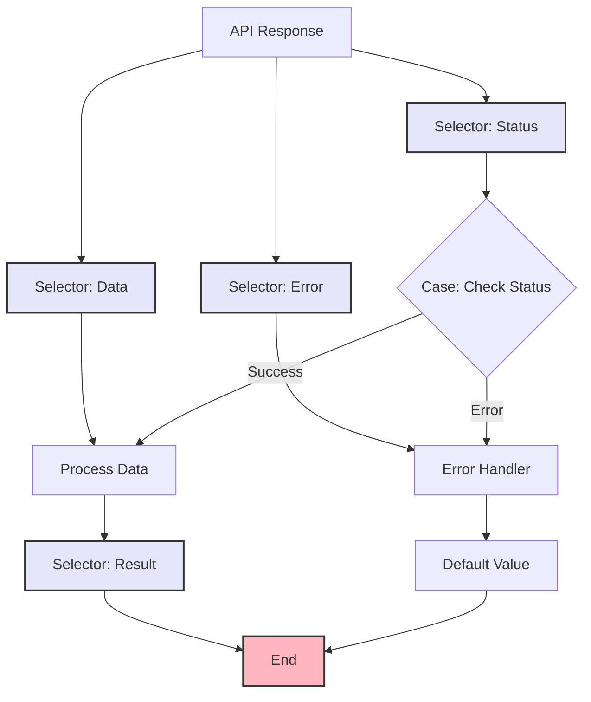

import { Card, CardHeader, CardTitle, CardDescription } from '@site/src/components/Card';
import { Callout } from '@site/src/components/Callout';
import { Features, Feature } from '@site/src/components/Features';
import { CollapsibleCodeBlock, InlineCodeCard } from '@site/src/components/CodeBlock';
import Tabs from '@theme/Tabs';
import TabItem from '@theme/TabItem';
import CodeBlock from '@theme/CodeBlock';

# Selector Element

The Selector element extracts specific values from complex data structures in the HPC Neura Execution Engine. It provides a powerful way to navigate through nested objects, arrays, and JSON data using path-based selection.

<Card>
  <CardHeader>
    <CardTitle>Element Overview</CardTitle>
  </CardHeader>
  

    <table>
      <tbody>
        <tr>
          <td><strong>Type</strong></td>
          <td><code>selector</code></td>
        </tr>
        <tr>
          <td><strong>Category</strong></td>
          <td>Utility Elements</td>
        </tr>
        <tr>
          <td><strong>Input</strong></td>
          <td><code>data</code> (any) - Data structure to select from</td>
        </tr>
        <tr>
          <td><strong>Output</strong></td>
          <td><code>selected_value</code> (any) - The extracted value</td>
        </tr>
        <tr>
          <td><strong>L2 Customizable</strong></td>
          <td>Selection path, default value, error handling</td>
        </tr>
      </tbody>
    </table>
  

</Card>

## Purpose

<Features>
  <Feature title="Data Extraction" icon="/img/icons/database.svg">
    Extract specific values from complex structures
  </Feature>
  <Feature title="Path Navigation" icon="/img/icons/network.svg">
    Navigate nested objects and arrays
  </Feature>
  <Feature title="Type Preservation" icon="/img/icons/docs.svg">
    Maintain original data types
  </Feature>
</Features>

## Element Schema

<CollapsibleCodeBlock
  title="Complete Element Definition"
  description="L1 element template for Selector"
  language="yaml"
  defaultCollapsed={false}
>
{`type: selector
element_id: null  # Auto-generated at L2
name: null  # Set by L2
node_description: Extracts specific values from data structures using path-based selection
description: null  # Customizable by L2
input_schema:
  data:
    type: any
    description: The data structure to select from
    required: true
output_schema:
  selected_value:
    type: any
    description: The extracted value
    required: true
  found:
    type: bool
    description: Whether the path was found
    required: false
  path_used:
    type: string
    description: The path that was used
    required: false
parameter_schema_structure:
  key:
    type: string
    description: Path to the desired value (dot notation)
  default_value:
    type: any
    description: Value to return if path not found
  multiple_paths:
    type: list
    description: List of paths to try in order
  error_on_missing:
    type: bool
    description: Throw error if path not found
parameters:
  key: ""
  default_value: null
  multiple_paths: []
  error_on_missing: false
processing_message: Selecting data...
tags:
  - utility
  - data-extraction
  - transformation
layer: null  # Set by L2
hyperparameters:
  type:
    access: fixed
  element_id:
    access: fixed
  name:
    access: edit
  description:
    access: edit
  input_schema:
    access: fixed
  output_schema:
    access: fixed
  parameters.key:
    access: edit
  parameters.default_value:
    access: edit
  parameters.multiple_paths:
    access: edit
  parameters.error_on_missing:
    access: edit
  processing_message:
    access: edit
  tags:
    access: append
  layer:
    access: edit`}
</CollapsibleCodeBlock>

## Key Characteristics

<Callout type="info">
The Selector element uses **dot notation** for path navigation (e.g., `user.profile.email`) and supports array indexing (e.g., `items[0].name`). It can handle any JSON-compatible data structure.
</Callout>

### Path Syntax

- **Object properties**: `object.property`
- **Nested properties**: `object.nested.property`
- **Array elements**: `array[0]` or `array[2]`
- **Combined**: `users[0].profile.settings.theme`
- **Dynamic paths**: Can use multiple paths as fallbacks

## Usage Examples

### Basic Property Selection

<CollapsibleCodeBlock
  title="Simple Object Selection"
  description="Extract values from objects"
  language="yaml"
>
{`flow_definition:
  nodes:
    api_response:
      type: rest_api
      name: "Get User Data"
      # Returns: { "user": { "id": 123, "email": "user@example.com", "profile": { "name": "John Doe" } } }
      
    email_selector:
      type: selector
      element_id: email_selector
      name: "Extract Email"
      description: "Gets user email from response"
      parameters:
        key: "user.email"
        default_value: "no-email@example.com"
      processing_message: "Extracting email..."
      tags:
        - email
        - extraction
      layer: "processing"
      
    name_selector:
      type: selector
      element_id: name_selector
      name: "Extract Name"
      parameters:
        key: "user.profile.name"
        error_on_missing: false
        
  connections:
    - from_id: api_response
      to_id: email_selector
      from_output: "api_response:response"
      to_input: "email_selector:data"
      
    - from_id: api_response
      to_id: name_selector
      from_output: "api_response:response"
      to_input: "name_selector:data"`}
</CollapsibleCodeBlock>

### Array Element Selection

<CollapsibleCodeBlock
  title="Array Navigation"
  description="Select elements from arrays"
  language="yaml"
>
{`nodes:
  order_data:
    type: datablock
    name: "Order List"
    parameters:
      format: "json"
      data:
        orders:
          - id: "ORD001"
            amount: 99.99
            status: "completed"
            items:
              - name: "Widget A"
                quantity: 2
              - name: "Widget B"
                quantity: 1
          - id: "ORD002"
            amount: 149.99
            status: "pending"
            
  first_order_selector:
    type: selector
    name: "Get First Order"
    parameters:
      key: "orders[0]"
      
  first_order_amount:
    type: selector
    name: "First Order Amount"
    parameters:
      key: "orders[0].amount"
      
  first_item_name:
    type: selector
    name: "First Item of First Order"
    parameters:
      key: "orders[0].items[0].name"
      
  pending_order_selector:
    type: selector
    name: "Find Pending Order"
    parameters:
      # Note: For complex filtering, use custom element
      key: "orders[1]"  # If you know the index`}
</CollapsibleCodeBlock>

### Multiple Path Fallbacks

<CollapsibleCodeBlock
  title="Fallback Paths"
  description="Try multiple paths until one succeeds"
  language="yaml"
>
{`nodes:
  user_data:
    type: metadata
    name: "User Information"
    
  name_extractor:
    type: selector
    element_id: name_extractor
    name: "Get User Name"
    description: "Extract name with multiple fallbacks"
    parameters:
      multiple_paths:
        - "user_name"           # Try this first
        - "profile.full_name"   # Then this
        - "display_name"        # Then this
        - "email"              # Finally use email
      default_value: "Anonymous User"
      
  # Alternative: Using primary key with fallback
  id_extractor:
    type: selector
    name: "Get User ID"
    parameters:
      key: "user_id"
      default_value: "anonymous_user"
      error_on_missing: false`}
</CollapsibleCodeBlock>

## Common Patterns

### Pattern 1: API Response Processing

<CollapsibleCodeBlock
  title="Extract API Response Data"
  description="Common pattern for API responses"
  language="yaml"
>
{`nodes:
  api_call:
    type: rest_api
    name: "Fetch Data"
    # Returns: { "status": "success", "data": { "results": [...], "meta": { "total": 100 } } }
    
  status_check:
    type: selector
    name: "Check Status"
    parameters:
      key: "status"
      
  results_extractor:
    type: selector
    name: "Get Results"
    parameters:
      key: "data.results"
      default_value: []
      
  total_count:
    type: selector
    name: "Get Total Count"
    parameters:
      key: "data.meta.total"
      default_value: 0
      
  # Process based on status
  status_router:
    type: case
    name: "Route by Status"
    parameters:
      cases:
        - success:
            variable1: status
            variable2: "success"
            compare: "=="
        - error:
            variable1: status
            variable2: "error"
            compare: "=="`}
</CollapsibleCodeBlock>

### Pattern 2: Configuration Selection

<CollapsibleCodeBlock
  title="Dynamic Configuration Access"
  description="Select config based on context"
  language="yaml"
>
{`nodes:
  config_store:
    type: datablock
    name: "Application Config"
    parameters:
      format: "json"
      data:
        environments:
          production:
            api_url: "https://api.example.com"
            timeout: 30
            retries: 3
          staging:
            api_url: "https://staging-api.example.com"
            timeout: 60
            retries: 5
          development:
            api_url: "http://localhost:3000"
            timeout: 120
            retries: 10
            
  env_metadata:
    type: metadata
    name: "Get Environment"
    
  # Build dynamic path
  path_builder:
    type: custom
    name: "Build Config Path"
    code: |
      env = inputs.get('environment', 'production')
      config_type = inputs.get('config_type', 'api_url')
      
      output['path'] = f"environments.{env}.{config_type}"
      
  # Select using dynamic path
  config_selector:
    type: selector
    name: "Get Config Value"
    # Note: In practice, the path would need to be set dynamically
    # This is a conceptual example`}
</CollapsibleCodeBlock>

### Pattern 3: Data Transformation Pipeline

<CollapsibleCodeBlock
  title="Multi-Step Data Extraction"
  description="Chain selectors for complex extraction"
  language="yaml"
>
{`nodes:
  complex_data:
    type: rest_api
    name: "Get Complex Data"
    # Returns nested structure with user, orders, preferences
    
  # Step 1: Extract user section
  user_section:
    type: selector
    name: "Get User Section"
    parameters:
      key: "response.user"
      
  # Step 2: Extract specific user fields
  user_id:
    type: selector
    name: "Get User ID"
    parameters:
      key: "id"
      
  user_preferences:
    type: selector
    name: "Get Preferences"
    parameters:
      key: "preferences"
      default_value: {}
      
  # Step 3: Extract nested preference
  theme_preference:
    type: selector
    name: "Get Theme"
    parameters:
      key: "ui.theme"
      default_value: "light"
      
  # Connect in sequence
  connections:
    - from_id: complex_data
      to_id: user_section
      from_output: "complex_data:response"
      to_input: "user_section:data"
      
    - from_id: user_section
      to_id: user_id
      from_output: "user_section:selected_value"
      to_input: "user_id:data"
      
    - from_id: user_section
      to_id: user_preferences
      from_output: "user_section:selected_value"
      to_input: "user_preferences:data"
      
    - from_id: user_preferences
      to_id: theme_preference
      from_output: "user_preferences:selected_value"
      to_input: "theme_preference:data"`}
</CollapsibleCodeBlock>

## Advanced Usage

### Dynamic Path Selection

<CollapsibleCodeBlock
  title="Conditional Path Selection"
  description="Select different paths based on conditions"
  language="yaml"
>
{`nodes:
  data_source:
    type: rest_api
    name: "Get Dynamic Data"
    
  path_determiner:
    type: custom
    name: "Determine Path"
    code: |
      data_type = inputs.get('data_type', 'user')
      version = inputs.get('api_version', 'v1')
      
      # Map data types to paths
      path_map = {
          ('user', 'v1'): 'data.user_info',
          ('user', 'v2'): 'response.users[0]',
          ('order', 'v1'): 'data.orders',
          ('order', 'v2'): 'response.order_list',
          ('product', 'v1'): 'data.products',
          ('product', 'v2'): 'response.catalog.products'
      }
      
      path = path_map.get((data_type, version), 'data')
      output['selection_path'] = path
      
  # Multiple selectors for different scenarios
  v1_selector:
    type: selector
    name: "V1 Data Selector"
    parameters:
      key: "data.user_info"
      
  v2_selector:
    type: selector
    name: "V2 Data Selector"
    parameters:
      key: "response.users[0]"`}
</CollapsibleCodeBlock>

### Safe Deep Selection

<CollapsibleCodeBlock
  title="Defensive Data Access"
  description="Handle potentially missing nested data"
  language="yaml"
>
{`nodes:
  uncertain_data:
    type: rest_api
    name: "External API"
    # May have varying response structures
    
  safe_selector:
    type: selector
    name: "Safe Deep Select"
    parameters:
      multiple_paths:
        - "data.user.profile.settings.notifications.email"
        - "user.notifications.email"
        - "settings.email_notifications"
        - "email_prefs"
      default_value:
        enabled: true
        frequency: "daily"
        
  # Validate selected data
  selection_validator:
    type: custom
    name: "Validate Selection"
    code: |
      selected = inputs.get('selected_value')
      found = inputs.get('found', False)
      
      if not found:
          output['valid'] = False
          output['reason'] = "No valid path found"
          output['use_default'] = True
      elif not isinstance(selected, dict):
          output['valid'] = False
          output['reason'] = f"Expected dict, got {type(selected)}"
          output['use_default'] = True
      else:
          output['valid'] = True
          output['notifications'] = selected`}
</CollapsibleCodeBlock>

### Array Operations

<CollapsibleCodeBlock
  title="Array Element Selection"
  description="Work with array data"
  language="yaml"
>
{`nodes:
  array_data:
    type: datablock
    name: "Array Source"
    parameters:
      format: "json"
      data:
        items:
          - id: 1
            name: "First"
            priority: "high"
            tags: ["urgent", "customer"]
          - id: 2
            name: "Second"
            priority: "medium"
            tags: ["internal"]
          - id: 3
            name: "Third"
            priority: "low"
            tags: ["optional"]
            
  # Select specific indices
  first_item:
    type: selector
    name: "First Item"
    parameters:
      key: "items[0]"
      
  last_item_workaround:
    type: selector
    name: "Third Item (Last)"
    parameters:
      key: "items[2]"  # Must know the index
      
  # Get all priorities (requires custom logic)
  priority_extractor:
    type: custom
    name: "Extract All Priorities"
    code: |
      items = inputs.get('items', [])
      priorities = [item.get('priority') for item in items]
      output['priorities'] = priorities
      output['high_priority_count'] = priorities.count('high')`}
</CollapsibleCodeBlock>

## Error Handling

### Missing Path Handling

<CollapsibleCodeBlock
  title="Handle Missing Paths"
  description="Graceful handling of missing data"
  language="yaml"
>
{`nodes:
  potentially_incomplete:
    type: rest_api
    name: "Unreliable API"
    
  required_field:
    type: selector
    name: "Get Required Field"
    parameters:
      key: "data.required_field"
      error_on_missing: true  # Will fail the node
      
  optional_field:
    type: selector
    name: "Get Optional Field"
    parameters:
      key: "data.optional_field"
      default_value: "N/A"
      error_on_missing: false
      
  # Handle the error from required_field
  error_handler:
    type: custom
    name: "Handle Missing Data"
    code: |
      if inputs.get('error'):
          output['fallback_data'] = {
              'required_field': 'DEFAULT_VALUE',
              'source': 'fallback'
          }
      else:
          output['data'] = inputs['selected_value']
          output['source'] = 'api'`}
</CollapsibleCodeBlock>

### Type Validation

<CollapsibleCodeBlock
  title="Validate Selected Types"
  description="Ensure selected data has expected type"
  language="yaml"
>
{`nodes:
  type_validator:
    type: custom
    name: "Type Check Selector"
    code: |
      data = inputs['data']
      path = inputs['path']
      expected_type = inputs['expected_type']
      
      # Simple path traversal
      try:
          value = data
          for part in path.split('.'):
              if '[' in part:
                  # Handle array index
                  key, index = part.split('[')
                  index = int(index.rstrip(']'))
                  value = value[key][index] if key else value[index]
              else:
                  value = value[part]
                  
          # Check type
          type_map = {
              'string': str,
              'number': (int, float),
              'boolean': bool,
              'array': list,
              'object': dict
          }
          
          expected = type_map.get(expected_type, type(None))
          if isinstance(value, expected):
              output['valid'] = True
              output['value'] = value
          else:
              output['valid'] = False
              output['error'] = f"Expected {expected_type}, got {type(value).__name__}"
              
      except (KeyError, IndexError, TypeError):
          output['valid'] = False
          output['error'] = "Path not found"
          output['value'] = None`}
</CollapsibleCodeBlock>

## Best Practices

<Callout type="success" title="Selector Best Practices">
✅ **Use Default Values**: Always provide sensible defaults for optional data
✅ **Multiple Paths**: Use fallback paths for flexible data structures
✅ **Error Handling**: Decide between error_on_missing and defaults
✅ **Type Safety**: Validate selected data types when critical
✅ **Path Documentation**: Document expected data structure
✅ **Avoid Deep Nesting**: Consider restructuring if paths are too deep
✅ **Test Edge Cases**: Test with missing data and wrong types
</Callout>

## Performance Considerations

### Optimization Tips

<Card>
  <CardHeader>
    <CardTitle>Performance Guidelines</CardTitle>
  </CardHeader>
  

    <table>
      <thead>
        <tr>
          <th>Scenario</th>
          <th>Recommendation</th>
        </tr>
      </thead>
      <tbody>
        <tr>
          <td>Simple paths</td>
          <td>Use selector - very fast</td>
        </tr>
        <tr>
          <td>Multiple selections</td>
          <td>Use multiple selector nodes</td>
        </tr>
        <tr>
          <td>Array filtering</td>
          <td>Use custom element instead</td>
        </tr>
        <tr>
          <td>Complex logic</td>
          <td>Consider custom element</td>
        </tr>
        <tr>
          <td>Large data</td>
          <td>Select early to reduce payload</td>
        </tr>
      </tbody>
    </table>
  

</Card>

## Limitations

<Callout type="warning" title="Selector Limitations">
- **No array filtering**: Can't select "all items where X"
- **No computations**: Can't transform data while selecting
- **Static paths**: Paths must be known at configuration time
- **No wildcards**: Can't use patterns like `users[*].name`

For these advanced scenarios, use a Custom element instead.
</Callout>

## Visual Flow Example

## Related Elements

  <Card>
    <CardHeader>
      <CardTitle>Merger Element</CardTitle>
      <CardDescription>
        Combine multiple data sources
      </CardDescription>
    </CardHeader>
    

      <a href="./02-merger" style={{ textDecoration: 'none' }}>
        Learn about Merger →
      </a>
    

  </Card>
  
  <Card>
    <CardHeader>
      <CardTitle>Custom Element</CardTitle>
      <CardDescription>
        For complex data operations
      </CardDescription>
    </CardHeader>
    

      <a href="../07-custom-elements/01-custom" style={{ textDecoration: 'none' }}>
        Advanced processing →
      </a>
    

  </Card>

## Summary

The Selector element provides efficient data extraction by offering:
- **Path-based selection** with dot notation and array indexing
- **Multiple fallback paths** for flexible data structures
- **Default values** for missing data
- **Type preservation** maintaining original data types
- **Error control** with optional error throwing

Remember: Selector is perfect for simple data extraction. For complex filtering, transformation, or dynamic paths, use a Custom element.