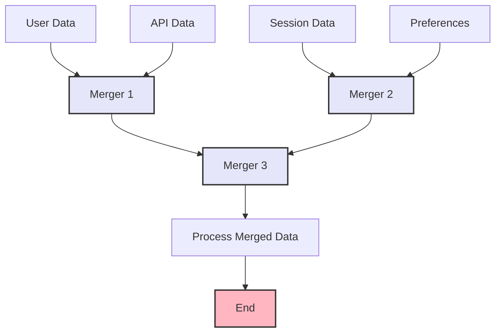

import { Card, CardHeader, CardTitle, CardDescription } from '@site/src/components/Card';
import { Callout } from '@site/src/components/Callout';
import { Features, Feature } from '@site/src/components/Features';
import { CollapsibleCodeBlock, InlineCodeCard } from '@site/src/components/CodeBlock';
import Tabs from '@theme/Tabs';
import TabItem from '@theme/TabItem';
import CodeBlock from '@theme/CodeBlock';

# Merger Element

The Merger element combines multiple data inputs into a single unified output in the HPC Neura Execution Engine. It's essential for aggregating data from different sources, creating composite objects, and consolidating results from parallel processing paths.

<Card>
  <CardHeader>
    <CardTitle>Element Overview</CardTitle>
  </CardHeader>
  

    <table>
      <tbody>
        <tr>
          <td><strong>Type</strong></td>
          <td><code>merger</code></td>
        </tr>
        <tr>
          <td><strong>Category</strong></td>
          <td>Utility Elements</td>
        </tr>
        <tr>
          <td><strong>Inputs</strong></td>
          <td><code>data1</code> (any), <code>data2</code> (any) - Required</td>
        </tr>
        <tr>
          <td><strong>Output</strong></td>
          <td><code>merged_data</code> (any) - Combined result</td>
        </tr>
        <tr>
          <td><strong>L2 Customizable</strong></td>
          <td>Merge strategy, conflict resolution, output structure</td>
        </tr>
      </tbody>
    </table>
  

</Card>

## Purpose

<Features>
  <Feature title="Data Aggregation" icon="/img/icons/database.svg">
    Combine outputs from multiple nodes
  </Feature>
  <Feature title="Object Composition" icon="/img/icons/network.svg">
    Build complex objects from parts
  </Feature>
  <Feature title="Result Consolidation" icon="/img/icons/settings.svg">
    Merge parallel processing results
  </Feature>
</Features>

## Element Schema

<CollapsibleCodeBlock
  title="Complete Element Definition"
  description="L1 element template for Merger"
  language="yaml"
  defaultCollapsed={false}
>
{`type: merger
element_id: null  # Auto-generated at L2
name: null  # Set by L2
node_description: Combines multiple data inputs into a single output
description: null  # Customizable by L2
input_schema:
  data1:
    type: any
    description: First data input
    required: true
  data2:
    type: any
    description: Second data input
    required: true
output_schema:
  merged_data:
    type: any
    description: Combined data result
    required: true
parameter_schema_structure: {}  # No configurable parameters in base version
parameters: {}
processing_message: Merging data...
tags:
  - utility
  - data-manipulation
layer: null  # Set by L2
hyperparameters:
  type:
    access: fixed
  element_id:
    access: fixed
  name:
    access: edit
  description:
    access: edit
  input_schema:
    access: fixed
  output_schema:
    access: fixed
  processing_message:
    access: edit
  tags:
    access: append
  layer:
    access: edit`}
</CollapsibleCodeBlock>

## Key Characteristics

<Callout type="info">
The Merger element performs **intelligent merging** based on input data types:
- **Objects**: Deep merge with nested property combination
- **Arrays**: Concatenation or element-wise merge
- **Primitives**: Creates an object with both values
- **Mixed types**: Wraps in a container object
</Callout>

### Merge Behaviors

| Input Types | Merge Result |
|-------------|--------------|
| Object + Object | Deep merge (recursive) |
| Array + Array | Concatenated array |
| Object + Primitive | Object with primitive as property |
| Primitive + Primitive | Object containing both |
| Any + null/undefined | Non-null value |

## Usage Examples

### Basic Object Merging

<CollapsibleCodeBlock
  title="Simple Object Merge"
  description="Combine two objects"
  language="yaml"
>
{`flow_definition:
  nodes:
    user_profile:
      type: rest_api
      name: "Get User Profile"
      # Returns: { "id": 123, "name": "John", "email": "john@example.com" }
      
    user_preferences:
      type: rest_api
      name: "Get User Preferences"
      # Returns: { "theme": "dark", "language": "en", "notifications": true }
      
    profile_merger:
      type: merger
      element_id: profile_merger
      name: "Combine User Data"
      description: "Merges profile and preferences"
      processing_message: "Combining user information..."
      tags:
        - user-data
        - aggregation
      layer: "processing"
      
  connections:
    - from_id: user_profile
      to_id: profile_merger
      from_output: "user_profile:response"
      to_input: "profile_merger:data1"
      
    - from_id: user_preferences
      to_id: profile_merger
      from_output: "user_preferences:response"
      to_input: "profile_merger:data2"
      
  # Result: {
  #   "id": 123,
  #   "name": "John",
  #   "email": "john@example.com",
  #   "theme": "dark",
  #   "language": "en",
  #   "notifications": true
  # }`}
</CollapsibleCodeBlock>

### Array Concatenation

<CollapsibleCodeBlock
  title="Merge Arrays"
  description="Combine multiple arrays"
  language="yaml"
>
{`nodes:
  recent_orders:
    type: rest_api
    name: "Recent Orders"
    # Returns: { "orders": [{"id": 1}, {"id": 2}] }
    
  pending_orders:
    type: rest_api
    name: "Pending Orders"
    # Returns: { "orders": [{"id": 3}, {"id": 4}] }
    
  order_merger:
    type: merger
    name: "Combine All Orders"
    
  # Extract arrays first
  recent_array:
    type: selector
    name: "Get Recent Array"
    parameters:
      key: "orders"
      
  pending_array:
    type: selector
    name: "Get Pending Array"
    parameters:
      key: "orders"
      
connections:
  - from_id: recent_orders
    to_id: recent_array
  - from_id: pending_orders
    to_id: pending_array
  - from_id: recent_array
    to_id: order_merger
    from_output: "recent_array:selected_value"
    to_input: "order_merger:data1"
  - from_id: pending_array
    to_id: order_merger
    from_output: "pending_array:selected_value"
    to_input: "order_merger:data2"
    
  # Result: [{"id": 1}, {"id": 2}, {"id": 3}, {"id": 4}]`}
</CollapsibleCodeBlock>

### Nested Object Merging

<CollapsibleCodeBlock
  title="Deep Merge Example"
  description="Merge nested structures"
  language="yaml"
>
{`nodes:
  base_config:
    type: constants
    name: "Base Configuration"
    parameters:
      api:
        endpoint: "https://api.example.com"
        version: "v1"
        timeout: 30
      features:
        analytics: true
        export: false
        
  env_overrides:
    type: constants
    name: "Environment Overrides"
    parameters:
      api:
        endpoint: "https://prod-api.example.com"
        auth_required: true
      features:
        export: true
        beta: true
        
  config_merger:
    type: merger
    name: "Final Configuration"
    
connections:
  - from_id: base_config
    to_id: config_merger
    to_input: "config_merger:data1"
  - from_id: env_overrides
    to_id: config_merger
    to_input: "config_merger:data2"
    
  # Result: {
  #   "api": {
  #     "endpoint": "https://prod-api.example.com",  # Overridden
  #     "version": "v1",                              # Preserved
  #     "timeout": 30,                                # Preserved
  #     "auth_required": true                         # Added
  #   },
  #   "features": {
  #     "analytics": true,                            # Preserved
  #     "export": true,                               # Overridden
  #     "beta": true                                  # Added
  #   }
  # }`}
</CollapsibleCodeBlock>

## Common Patterns

### Pattern 1: Multi-Source Aggregation

<CollapsibleCodeBlock
  title="Aggregate Multiple Sources"
  description="Combine data from many nodes"
  language="yaml"
>
{`nodes:
  # Multiple data sources
  user_data:
    type: metadata
    name: "User Context"
    
  session_data:
    type: context_history
    name: "Session History"
    
  api_data:
    type: rest_api
    name: "External Data"
    
  # First merge
  merge_1:
    type: merger
    name: "Merge User + Session"
    
  # Second merge (cascading)
  merge_2:
    type: merger
    name: "Add API Data"
    
  # Format the final result
  data_formatter:
    type: custom
    name: "Format Aggregated Data"
    code: |
      merged = inputs['merged_data']
      
      output['formatted'] = {
          'user': {
              'id': merged.get('user_id'),
              'email': merged.get('user_email'),
              'session_count': merged.get('session_count')
          },
          'context': {
              'history': merged.get('history', []),
              'environment': merged.get('environment')
          },
          'external': merged.get('response', {})
      }
      
connections:
  # Cascade merges
  - from_id: user_data
    to_id: merge_1
    to_input: "merge_1:data1"
  - from_id: session_data
    to_id: merge_1
    to_input: "merge_1:data2"
  - from_id: merge_1
    to_id: merge_2
    from_output: "merge_1:merged_data"
    to_input: "merge_2:data1"
  - from_id: api_data
    to_id: merge_2
    from_output: "api_data:response"
    to_input: "merge_2:data2"`}
</CollapsibleCodeBlock>

### Pattern 2: Parallel Results Consolidation

<CollapsibleCodeBlock
  title="Merge Parallel Processing"
  description="Combine results from parallel paths"
  language="yaml"
>
{`nodes:
  input_data:
    type: chat_input
    name: "User Query"
    
  # Parallel analysis
  sentiment_analyzer:
    type: llm_structured
    name: "Analyze Sentiment"
    output_schema:
      sentiment:
        type: string
        enum: ["positive", "neutral", "negative"]
      score:
        type: float
        
  entity_extractor:
    type: llm_structured
    name: "Extract Entities"
    output_schema:
      entities:
        type: list
      entity_count:
        type: int
        
  intent_classifier:
    type: llm_structured
    name: "Classify Intent"
    output_schema:
      intent:
        type: string
      confidence:
        type: float
        
  # Merge parallel results
  analysis_merger_1:
    type: merger
    name: "Merge Sentiment + Entities"
    
  analysis_merger_2:
    type: merger
    name: "Add Intent"
    
  # Final processor
  result_processor:
    type: custom
    name: "Process Analysis"
    code: |
      analysis = inputs['merged_analysis']
      
      # Determine action based on combined analysis
      if (analysis['sentiment'] == 'negative' and 
          analysis['confidence'] < 0.5):
          action = 'escalate_to_human'
      elif analysis['intent'] == 'purchase':
          action = 'route_to_sales'
      else:
          action = 'standard_response'
          
      output['action'] = action
      output['analysis'] = analysis`}
</CollapsibleCodeBlock>

### Pattern 3: Configuration Override Chain

<CollapsibleCodeBlock
  title="Layered Configuration"
  description="Build config through multiple layers"
  language="yaml"
>
{`nodes:
  # Configuration layers
  default_config:
    type: constants
    name: "Defaults"
    parameters:
      timeout: 30
      retries: 3
      cache: true
      log_level: "info"
      
  app_config:
    type: datablock
    name: "Application Config"
    parameters:
      format: "json"
      data:
        timeout: 60
        api_url: "https://api.example.com"
        features:
          analytics: true
          
  user_config:
    type: metadata
    name: "User Preferences"
    # Provides user-specific overrides
    
  env_config:
    type: constants
    name: "Environment"
    parameters:
      log_level: "debug"
      api_url: "https://staging-api.example.com"
      
  # Build final config through merges
  merge_defaults_app:
    type: merger
    name: "Apply App Config"
    
  merge_user:
    type: merger
    name: "Apply User Config"
    
  merge_env:
    type: merger
    name: "Apply Env Config"
    
  # Result: Environment > User > App > Defaults`}
</CollapsibleCodeBlock>

## Advanced Usage

### Conditional Merging

<CollapsibleCodeBlock
  title="Merge Based on Conditions"
  description="Selective data merging"
  language="yaml"
>
{`nodes:
  base_data:
    type: datablock
    name: "Base Data"
    parameters:
      format: "json"
      data:
        name: "Product"
        price: 99.99
        
  premium_features:
    type: constants
    name: "Premium Features"
    parameters:
      features:
        - "Priority Support"
        - "Advanced Analytics"
      discount: 0.10
      
  user_tier_check:
    type: metadata
    name: "Check User Tier"
    
  tier_router:
    type: case
    name: "Route by Tier"
    parameters:
      cases:
        - is_premium:
            variable1: custom_data.tier
            variable2: "premium"
            compare: "=="
            
  conditional_merger:
    type: merger
    name: "Add Premium Data"
    # Only executes for premium users
    
  default_passthrough:
    type: custom
    name: "Standard Data"
    code: |
      output['data'] = inputs['base_data']`}
</CollapsibleCodeBlock>

### Custom Merge Strategy

<CollapsibleCodeBlock
  title="Implement Custom Merging"
  description="When default merge isn't enough"
  language="yaml"
>
{`nodes:
  # When you need specific merge behavior
  custom_merger:
    type: custom
    name: "Custom Merge Logic"
    code: |
      data1 = inputs.get('data1', {})
      data2 = inputs.get('data2', {})
      
      # Custom merge strategy
      merged = {}
      
      # Prefer data2 for strings, data1 for numbers
      for key in set(data1.keys()) | set(data2.keys()):
          val1 = data1.get(key)
          val2 = data2.get(key)
          
          if isinstance(val2, str) and val2:
              merged[key] = val2
          elif isinstance(val1, (int, float)):
              merged[key] = val1
          elif val2 is not None:
              merged[key] = val2
          else:
              merged[key] = val1
              
      # Special handling for arrays
      if 'tags' in data1 and 'tags' in data2:
          # Combine and deduplicate
          merged['tags'] = list(set(data1['tags'] + data2['tags']))
          
      output['merged'] = merged`}
</CollapsibleCodeBlock>

### Structured Output Building

<CollapsibleCodeBlock
  title="Build Complex Structures"
  description="Use merger to build response objects"
  language="yaml"
>
{`nodes:
  # Various data components
  header_builder:
    type: custom
    name: "Build Header"
    code: |
      output['header'] = {
          'timestamp': datetime.now().isoformat(),
          'version': '2.0',
          'request_id': inputs.get('request_id')
      }
      
  body_processor:
    type: llm_text
    name: "Generate Body"
    
  metadata_collector:
    type: custom
    name: "Collect Metadata"
    code: |
      output['meta'] = {
          'processing_time': inputs.get('duration_ms'),
          'tokens_used': inputs.get('tokens'),
          'model': inputs.get('model_used')
      }
      
  # Build response structure
  header_body_merge:
    type: merger
    name: "Combine Header + Body"
    
  final_merge:
    type: merger
    name: "Add Metadata"
    
  # Wrap in response envelope
  response_wrapper:
    type: custom
    name: "Format Response"
    code: |
      data = inputs['merged_data']
      
      output['response'] = {
          'success': True,
          'data': data,
          'timestamp': data.get('header', {}).get('timestamp'),
          'meta': data.get('meta', {})
      }`}
</CollapsibleCodeBlock>

## Error Handling

### Type Mismatch Handling

<CollapsibleCodeBlock
  title="Handle Incompatible Types"
  description="Graceful handling of type conflicts"
  language="yaml"
>
{`nodes:
  safe_merger:
    type: custom
    name: "Type-Safe Merge"
    code: |
      data1 = inputs.get('data1')
      data2 = inputs.get('data2')
      
      # Type checking
      type1 = type(data1).__name__
      type2 = type(data2).__name__
      
      # Handle different type combinations
      if isinstance(data1, dict) and isinstance(data2, dict):
          # Standard object merge
          output['merged'] = {**data1, **data2}
          output['merge_type'] = 'object_merge'
          
      elif isinstance(data1, list) and isinstance(data2, list):
          # Array concatenation
          output['merged'] = data1 + data2
          output['merge_type'] = 'array_concat'
          
      elif type1 == type2:
          # Same types - wrap in object
          output['merged'] = {
              'value1': data1,
              'value2': data2
          }
          output['merge_type'] = 'wrapped_same_type'
          
      else:
          # Different types - structured output
          output['merged'] = {
              f'{type1}_value': data1,
              f'{type2}_value': data2
          }
          output['merge_type'] = 'wrapped_different_types'
          
      output['success'] = True`}
</CollapsibleCodeBlock>

### Null/Undefined Handling

<CollapsibleCodeBlock
  title="Handle Missing Data"
  description="Merge with null values"
  language="yaml"
>
{`nodes:
  null_safe_merger:
    type: custom
    name: "Null-Safe Merge"
    code: |
      data1 = inputs.get('data1')
      data2 = inputs.get('data2')
      
      # Handle null/None values
      if data1 is None and data2 is None:
          output['merged'] = {}
          output['status'] = 'both_null'
      elif data1 is None:
          output['merged'] = data2
          output['status'] = 'used_data2'
      elif data2 is None:
          output['merged'] = data1
          output['status'] = 'used_data1'
      else:
          # Both have values - standard merge
          if isinstance(data1, dict) and isinstance(data2, dict):
              merged = data1.copy()
              merged.update(data2)
              output['merged'] = merged
          else:
              output['merged'] = {
                  'data1': data1,
                  'data2': data2
              }
          output['status'] = 'merged_both'`}
</CollapsibleCodeBlock>

## Best Practices

<Callout type="success" title="Merger Best Practices">
✅ **Consistent Types**: Merge similar data types when possible
✅ **Order Matters**: Second input overwrites first in conflicts
✅ **Validate Results**: Check merged output structure
✅ **Handle Nulls**: Account for missing data
✅ **Document Structure**: Explain expected merge behavior
✅ **Test Edge Cases**: Try different type combinations
✅ **Use Cascading**: Chain mergers for multiple sources
</Callout>

## Performance Considerations

### Merge Efficiency

<Card>
  <CardHeader>
    <CardTitle>Performance Guidelines</CardTitle>
  </CardHeader>
  

    <table>
      <thead>
        <tr>
          <th>Data Size</th>
          <th>Performance Impact</th>
          <th>Recommendation</th>
        </tr>
      </thead>
      <tbody>
        <tr>
          <td>Small objects (&lt;1KB)</td>
          <td>Negligible</td>
          <td>Use freely</td>
        </tr>
        <tr>
          <td>Medium objects (1-100KB)</td>
          <td>Low</td>
          <td>Normal usage</td>
        </tr>
        <tr>
          <td>Large objects (&gt;100KB)</td>
          <td>Moderate</td>
          <td>Consider alternatives</td>
        </tr>
        <tr>
          <td>Deep nesting (&gt;5 levels)</td>
          <td>Higher</td>
          <td>Flatten if possible</td>
        </tr>
      </tbody>
    </table>
  

</Card>

### Optimization Tips

<CollapsibleCodeBlock
  title="Optimize Large Merges"
  description="Handle large data efficiently"
  language="yaml"
>
{`nodes:
  # For large data, consider selective merging
  selective_merger:
    type: custom
    name: "Selective Merge"
    code: |
      # Only merge specific fields
      data1 = inputs['large_data1']
      data2 = inputs['large_data2']
      
      # Extract only needed fields
      merged = {
          'id': data1.get('id'),
          'summary': data1.get('summary'),
          'updates': data2.get('updates'),
          'status': data2.get('status', data1.get('status'))
      }
      
      # Avoid copying large nested structures
      if 'metadata' in data2:
          merged['metadata'] = data2['metadata']
      elif 'metadata' in data1:
          merged['metadata'] = {'source': 'data1'}
          
      output['optimized_merge'] = merged`}
</CollapsibleCodeBlock>

## Visual Flow Example

## Limitations

<Callout type="warning" title="Merger Limitations">
- **Two inputs only**: Can't merge more than 2 sources directly
- **Fixed strategy**: Deep merge behavior can't be customized
- **No transforms**: Can't modify data during merge
- **Type coercion**: Limited type conversion capabilities

For advanced merging needs, use Custom elements or chain multiple mergers.
</Callout>

## Related Elements

  <Card>
    <CardHeader>
      <CardTitle>Selector Element</CardTitle>
      <CardDescription>
        Extract data before merging
      </CardDescription>
    </CardHeader>
    

      <a href="./01-selector" style={{ textDecoration: 'none' }}>
        Learn about Selector →
      </a>
    

  </Card>
  
  <Card>
    <CardHeader>
      <CardTitle>Custom Element</CardTitle>
      <CardDescription>
        For complex merge strategies
      </CardDescription>
    </CardHeader>
    

      <a href="../07-custom-elements/01-custom" style={{ textDecoration: 'none' }}>
        Custom merging →
      </a>
    

  </Card>

## Summary

The Merger element provides essential data combination capabilities by offering:
- **Intelligent merging** based on data types
- **Deep object merge** with nested property handling
- **Array concatenation** for list data
- **Type flexibility** handling mixed input types
- **Simple interface** with just two inputs

Remember: Merger is perfect for combining data from multiple sources. For more than two inputs, cascade multiple mergers or use a Custom element for complex logic.