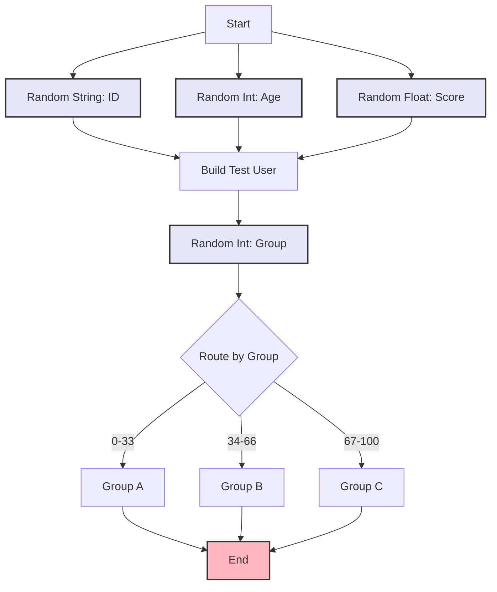

import { Card, CardHeader, CardTitle, CardDescription } from '@site/src/components/Card';
import { Callout } from '@site/src/components/Callout';
import { Features, Feature } from '@site/src/components/Features';
import { CollapsibleCodeBlock, InlineCodeCard } from '@site/src/components/CodeBlock';
import Tabs from '@theme/Tabs';
import TabItem from '@theme/TabItem';
import CodeBlock from '@theme/CodeBlock';

# Random Generator Element

The Random Generator element creates random values of various types in the HPC Neura Execution Engine. It's useful for testing, simulations, generating unique identifiers, sampling, and adding controlled randomness to flows.

<Card>
  <CardHeader>
    <CardTitle>Element Overview</CardTitle>
  </CardHeader>
  

    <table>
      <tbody>
        <tr>
          <td><strong>Type</strong></td>
          <td><code>random_generator</code></td>
        </tr>
        <tr>
          <td><strong>Category</strong></td>
          <td>Utility Elements</td>
        </tr>
        <tr>
          <td><strong>Input</strong></td>
          <td>None - generates values based on parameters</td>
        </tr>
        <tr>
          <td><strong>Output</strong></td>
          <td><code>random_data</code> (any) - The generated value</td>
        </tr>
        <tr>
          <td><strong>L2 Customizable</strong></td>
          <td>Type, range, length, precision settings</td>
        </tr>
      </tbody>
    </table>
  

</Card>

## Purpose

<Features>
  <Feature title="Test Data Generation" icon="/img/icons/database.svg">
    Create random test data for development
  </Feature>
  <Feature title="Unique Identifiers" icon="/img/icons/settings.svg">
    Generate random IDs and codes
  </Feature>
  <Feature title="Simulations" icon="/img/icons/ai-workflow.svg">
    Add randomness for simulations and modeling
  </Feature>
</Features>

## Element Schema

<CollapsibleCodeBlock
  title="Complete Element Definition"
  description="L1 element template for Random Generator"
  language="yaml"
  defaultCollapsed={false}
>
{`type: random_generator
element_id: null  # Auto-generated at L2
name: null  # Set by L2
node_description: Generates random values of different types
description: null  # Customizable by L2
input_schema: {}  # No inputs required
output_schema:
  random_data:
    type: any
    description: The generated random value
    required: true
parameter_schema_structure:
  type:
    type: string
    enum:
      - string
      - int
      - float
  floating_point:
    type: bool
  min:
    type: int
  max:
    type: int
  decimal:
    type: int
  length:
    type: int
parameters:
  type: string
  floating_point: false
  min: 0
  max: 100
  decimal: 2
  length: 10
processing_message: Generating random value...
tags:
  - utility
  - random
layer: null  # Set by L2
hyperparameters:
  type:
    access: fixed
  element_id:
    access: fixed
  name:
    access: edit
  description:
    access: edit
  input_schema:
    access: fixed
  output_schema:
    access: fixed
  parameters.type:
    access: edit
  parameters.floating_point:
    access: edit
  parameters.min:
    access: edit
  parameters.max:
    access: edit
  parameters.decimal:
    access: edit
  parameters.length:
    access: edit
  processing_message:
    access: edit
  tags:
    access: append
  layer:
    access: edit`}
</CollapsibleCodeBlock>

## Key Characteristics

<Callout type="info">
The Random Generator supports three main types:
- **String**: Random alphanumeric strings of specified length
- **Integer**: Random whole numbers within a range
- **Float**: Random decimal numbers with precision control

Each execution produces a new random value.
</Callout>

### Parameter Effects by Type

| Type | Parameters Used | Output Example |
|------|----------------|----------------|
| `string` | `length` | "a3Kf9mP2xL" |
| `int` | `min`, `max` | 42 |
| `float` | `min`, `max`, `decimal` | 3.14 |

## Usage Examples

### Random String Generation

<CollapsibleCodeBlock
  title="Generate Random IDs"
  description="Create unique identifiers"
  language="yaml"
>
{`flow_definition:
  nodes:
    session_id_generator:
      type: random_generator
      element_id: session_id_generator
      name: "Generate Session ID"
      description: "Creates unique session identifier"
      parameters:
        type: "string"
        length: 16
      processing_message: "Generating session ID..."
      tags:
        - identifier
        - session
      layer: "generation"
      
    confirmation_code:
      type: random_generator
      element_id: confirmation_code
      name: "Confirmation Code"
      description: "6-character confirmation code"
      parameters:
        type: "string"
        length: 6
        
    # Use in response
    response_builder:
      type: custom
      name: "Build Response"
      code: |
        output['message'] = f"Your session ID is: {inputs['session_id']}"
        output['confirmation'] = f"Confirmation code: {inputs['code']}"
        
  connections:
    - from_id: session_id_generator
      to_id: response_builder
      from_output: "session_id_generator:random_data"
      to_input: "response_builder:session_id"
      
    - from_id: confirmation_code
      to_id: response_builder
      from_output: "confirmation_code:random_data"
      to_input: "response_builder:code"`}
</CollapsibleCodeBlock>

### Random Number Generation

<CollapsibleCodeBlock
  title="Generate Random Numbers"
  description="Integer and float examples"
  language="yaml"
>
{`nodes:
  # Random integer for sampling
  random_index:
    type: random_generator
    element_id: random_index
    name: "Random Array Index"
    description: "Select random item from array"
    parameters:
      type: "int"
      min: 0
      max: 9  # For 10-item array
      
  # Random percentage
  random_percentage:
    type: random_generator
    element_id: random_percentage
    name: "Random Percentage"
    parameters:
      type: "float"
      min: 0
      max: 100
      decimal: 2
      
  # Random price
  random_price:
    type: random_generator
    element_id: random_price
    name: "Random Price"
    parameters:
      type: "float"
      min: 10
      max: 1000
      decimal: 2
      
  # Use random values
  data_selector:
    type: custom
    name: "Select Random Item"
    code: |
      items = ["Option A", "Option B", "Option C", "Option D", "Option E",
               "Option F", "Option G", "Option H", "Option I", "Option J"]
      
      index = inputs['random_index']
      selected = items[index]
      
      output['selected_item'] = selected
      output['discount_percent'] = inputs['percentage']
      output['special_price'] = inputs['price']`}
</CollapsibleCodeBlock>

### A/B Testing with Random

<CollapsibleCodeBlock
  title="Random A/B Test Assignment"
  description="Randomly assign users to test groups"
  language="yaml"
>
{`nodes:
  # Generate random value for assignment
  ab_random:
    type: random_generator
    name: "A/B Test Random"
    parameters:
      type: "float"
      min: 0
      max: 1
      decimal: 3
      
  # Assign to test group
  ab_assigner:
    type: custom
    name: "Assign Test Group"
    code: |
      random_value = inputs['random_value']
      
      # 50/50 split
      if random_value < 0.5:
          group = 'control'
      else:
          group = 'variant'
          
      # Or weighted split (70/20/10)
      if random_value < 0.7:
          weighted_group = 'A'
      elif random_value < 0.9:
          weighted_group = 'B'
      else:
          weighted_group = 'C'
          
      output['test_group'] = group
      output['weighted_group'] = weighted_group
      output['random_seed'] = random_value
      
  # Route based on assignment
  test_router:
    type: case
    name: "Route by Test Group"
    parameters:
      cases:
        - control_group:
            variable1: test_group
            variable2: "control"
            compare: "=="
        - variant_group:
            variable1: test_group
            variable2: "variant"
            compare: "=="`}
</CollapsibleCodeBlock>

## Common Patterns

### Pattern 1: Random Sampling

<CollapsibleCodeBlock
  title="Random Data Sampling"
  description="Select random samples from datasets"
  language="yaml"
>
{`nodes:
  # Load data
  data_source:
    type: datablock
    name: "Product Catalog"
    parameters:
      format: "json"
      data:
        products:
          - id: "P001"
            name: "Widget A"
            price: 29.99
          - id: "P002"
            name: "Widget B"
            price: 39.99
          - id: "P003"
            name: "Widget C"
            price: 49.99
          - id: "P004"
            name: "Widget D"
            price: 59.99
          - id: "P005"
            name: "Widget E"
            price: 69.99
            
  # Generate random indices
  sample_1:
    type: random_generator
    name: "First Sample"
    parameters:
      type: "int"
      min: 0
      max: 4
      
  sample_2:
    type: random_generator
    name: "Second Sample"
    parameters:
      type: "int"
      min: 0
      max: 4
      
  sample_3:
    type: random_generator
    name: "Third Sample"
    parameters:
      type: "int"
      min: 0
      max: 4
      
  # Select random products
  random_selector:
    type: custom
    name: "Select Random Products"
    code: |
      products = inputs['products']['products']
      indices = [
          inputs['idx1'],
          inputs['idx2'],
          inputs['idx3']
      ]
      
      # Remove duplicates by using set
      unique_indices = list(set(indices))
      
      selected = [products[i] for i in unique_indices]
      
      output['featured_products'] = selected
      output['count'] = len(selected)`}
</CollapsibleCodeBlock>

### Pattern 2: Test Data Generation

<CollapsibleCodeBlock
  title="Generate Test Data"
  description="Create realistic test data"
  language="yaml"
>
{`nodes:
  # Generate various random fields
  user_id:
    type: random_generator
    name: "Random User ID"
    parameters:
      type: "string"
      length: 8
      
  age:
    type: random_generator
    name: "Random Age"
    parameters:
      type: "int"
      min: 18
      max: 80
      
  score:
    type: random_generator
    name: "Random Score"
    parameters:
      type: "float"
      min: 0
      max: 100
      decimal: 1
      
  active_flag:
    type: random_generator
    name: "Random Boolean"
    parameters:
      type: "int"
      min: 0
      max: 1
      
  # Combine into test user
  test_user_builder:
    type: custom
    name: "Build Test User"
    code: |
      # Generate additional random data
      import random
      
      first_names = ["John", "Jane", "Bob", "Alice", "Charlie", "Diana"]
      last_names = ["Smith", "Johnson", "Williams", "Brown", "Jones"]
      domains = ["gmail.com", "yahoo.com", "outlook.com", "example.com"]
      
      first = random.choice(first_names)
      last = random.choice(last_names)
      
      output['test_user'] = {
          'id': f"USER_{inputs['user_id']}",
          'name': f"{first} {last}",
          'email': f"{first.lower()}.{last.lower()}@{random.choice(domains)}",
          'age': inputs['age'],
          'score': inputs['score'],
          'active': bool(inputs['active']),
          'created_at': datetime.now().isoformat()
      }`}
</CollapsibleCodeBlock>

### Pattern 3: Simulation Variables

<CollapsibleCodeBlock
  title="Simulation Randomness"
  description="Add randomness to simulations"
  language="yaml"
>
{`nodes:
  # Market simulation variables
  demand_variance:
    type: random_generator
    name: "Demand Variance"
    parameters:
      type: "float"
      min: -20
      max: 20
      decimal: 2
      
  price_fluctuation:
    type: random_generator
    name: "Price Change"
    parameters:
      type: "float"
      min: -5
      max: 5
      decimal: 2
      
  event_probability:
    type: random_generator
    name: "Event Chance"
    parameters:
      type: "float"
      min: 0
      max: 1
      decimal: 3
      
  # Run simulation step
  simulation_step:
    type: custom
    name: "Market Simulation Step"
    code: |
      base_demand = inputs.get('base_demand', 1000)
      base_price = inputs.get('base_price', 50.00)
      
      # Apply random variations
      demand_var = inputs['demand_variance']
      price_var = inputs['price_fluctuation']
      event_prob = inputs['event_probability']
      
      # Calculate current values
      current_demand = base_demand * (1 + demand_var / 100)
      current_price = base_price * (1 + price_var / 100)
      
      # Random events
      if event_prob < 0.05:  # 5% chance
          event = "Supply shortage"
          current_price *= 1.2
      elif event_prob > 0.95:  # 5% chance
          event = "Competitor sale"
          current_demand *= 0.8
      else:
          event = "Normal market"
          
      output['market_state'] = {
          'demand': round(current_demand),
          'price': round(current_price, 2),
          'event': event,
          'variance': {
              'demand': demand_var,
              'price': price_var
          }
      }`}
</CollapsibleCodeBlock>

## Advanced Usage

### Controlled Randomness

<CollapsibleCodeBlock
  title="Weighted Random Selection"
  description="Non-uniform random distributions"
  language="yaml"
>
{`nodes:
  # Generate uniform random
  random_value:
    type: random_generator
    name: "Random Value"
    parameters:
      type: "float"
      min: 0
      max: 1
      decimal: 4
      
  # Convert to weighted selection
  weighted_selector:
    type: custom
    name: "Weighted Random Choice"
    code: |
      rand = inputs['random']
      
      # Define weighted options
      # Format: (cumulative_probability, value, weight)
      options = [
          (0.10, "Common", 10),      # 10% chance
          (0.35, "Uncommon", 25),    # 25% chance
          (0.75, "Rare", 40),        # 40% chance
          (0.95, "Epic", 20),        # 20% chance
          (1.00, "Legendary", 5)     # 5% chance
      ]
      
      # Select based on random value
      selected = None
      for cum_prob, value, weight in options:
          if rand <= cum_prob:
              selected = value
              break
              
      output['selected_tier'] = selected
      output['random_value'] = rand
      
      # Generate loot based on tier
      loot_table = {
          "Common": ["Copper Coin", "Bread", "Cloth"],
          "Uncommon": ["Silver Coin", "Potion", "Leather"],
          "Rare": ["Gold Coin", "Weapon", "Armor"],
          "Epic": ["Gem", "Magic Item", "Artifact"],
          "Legendary": ["Dragon Scale", "Ancient Rune", "Divine Essence"]
      }
      
      # Random item from tier
      import random
      items = loot_table.get(selected, ["Nothing"])
      output['reward'] = random.choice(items)`}
</CollapsibleCodeBlock>

### Multiple Random Values

<CollapsibleCodeBlock
  title="Generate Multiple Randoms"
  description="Create sets of random values"
  language="yaml"
>
{`nodes:
  # Generate coordinates
  x_coord:
    type: random_generator
    name: "X Coordinate"
    parameters:
      type: "float"
      min: -180
      max: 180
      decimal: 6
      
  y_coord:
    type: random_generator
    name: "Y Coordinate"
    parameters:
      type: "float"
      min: -90
      max: 90
      decimal: 6
      
  # Generate RGB values
  red:
    type: random_generator
    name: "Red Value"
    parameters:
      type: "int"
      min: 0
      max: 255
      
  green:
    type: random_generator
    name: "Green Value"
    parameters:
      type: "int"
      min: 0
      max: 255
      
  blue:
    type: random_generator
    name: "Blue Value"
    parameters:
      type: "int"
      min: 0
      max: 255
      
  # Combine values
  data_combiner:
    type: custom
    name: "Combine Random Data"
    code: |
      # Location
      output['location'] = {
          'latitude': inputs['y'],
          'longitude': inputs['x'],
          'formatted': f"{inputs['y']:.6f}, {inputs['x']:.6f}"
      }
      
      # Color
      r, g, b = inputs['r'], inputs['g'], inputs['b']
      output['color'] = {
          'rgb': f"rgb({r}, {g}, {b})",
          'hex': f"#{r:02x}{g:02x}{b:02x}",
          'values': {'r': r, 'g': g, 'b': b}
      }`}
</CollapsibleCodeBlock>

### Random with Constraints

<CollapsibleCodeBlock
  title="Constrained Random Generation"
  description="Generate random values with rules"
  language="yaml"
>
{`nodes:
  # Generate base random values
  random_1:
    type: random_generator
    name: "First Random"
    parameters:
      type: "int"
      min: 1
      max: 50
      
  random_2:
    type: random_generator
    name: "Second Random"
    parameters:
      type: "int"
      min: 1
      max: 50
      
  # Apply constraints
  constraint_applier:
    type: custom
    name: "Apply Constraints"
    code: |
      val1 = inputs['val1']
      val2 = inputs['val2']
      
      # Ensure val1 < val2
      if val1 >= val2:
          val1, val2 = val2, val1
          
      # Ensure minimum gap
      min_gap = 10
      if val2 - val1 < min_gap:
          val2 = val1 + min_gap
          
      # Ensure total doesn't exceed limit
      max_total = 80
      if val1 + val2 > max_total:
          # Scale down proportionally
          factor = max_total / (val1 + val2)
          val1 = int(val1 * factor)
          val2 = int(val2 * factor)
          
      output['value_1'] = val1
      output['value_2'] = val2
      output['total'] = val1 + val2
      output['gap'] = val2 - val1`}
</CollapsibleCodeBlock>

## Best Practices

<Callout type="success" title="Random Generator Best Practices">
✅ **Define Clear Ranges**: Set appropriate min/max for your use case
✅ **Consider Type**: Choose the right type for your needs
✅ **Document Purpose**: Explain why randomness is needed
✅ **Test Boundaries**: Verify behavior at min/max values
✅ **Handle All Cases**: Account for all possible random values
✅ **Avoid Bias**: Ensure fair distribution when needed
✅ **Reproducibility**: Consider if you need seed control (use Custom)
</Callout>

## Performance Considerations

### Efficiency Guidelines

<Card>
  <CardHeader>
    <CardTitle>Performance Characteristics</CardTitle>
  </CardHeader>
  

    <table>
      <thead>
        <tr>
          <th>Operation</th>
          <th>Performance</th>
          <th>Notes</th>
        </tr>
      </thead>
      <tbody>
        <tr>
          <td>String generation</td>
          <td>Fast</td>
          <td>Length has minimal impact</td>
        </tr>
        <tr>
          <td>Integer generation</td>
          <td>Very fast</td>
          <td>Range size irrelevant</td>
        </tr>
        <tr>
          <td>Float generation</td>
          <td>Very fast</td>
          <td>Precision doesn't affect speed</td>
        </tr>
        <tr>
          <td>Multiple generators</td>
          <td>Linear</td>
          <td>Each adds minimal overhead</td>
        </tr>
      </tbody>
    </table>
  

</Card>

## Error Handling

### Parameter Validation

<CollapsibleCodeBlock
  title="Validate Random Parameters"
  description="Ensure valid configuration"
  language="yaml"
>
{`nodes:
  # Wrapper to validate parameters
  safe_random:
    type: custom
    name: "Safe Random Generator"
    code: |
      rand_type = inputs.get('type', 'int')
      min_val = inputs.get('min', 0)
      max_val = inputs.get('max', 100)
      
      # Validate range
      if min_val >= max_val:
          output['error'] = "Min must be less than max"
          output['random_data'] = min_val
          return
          
      # Validate type
      if rand_type not in ['string', 'int', 'float']:
          output['error'] = f"Invalid type: {rand_type}"
          output['random_data'] = 0
          return
          
      # Generate based on type
      import random
      import string
      
      if rand_type == 'string':
          length = inputs.get('length', 10)
          chars = string.ascii_letters + string.digits
          result = ''.join(random.choice(chars) for _ in range(length))
      elif rand_type == 'int':
          result = random.randint(min_val, max_val)
      else:  # float
          decimal = inputs.get('decimal', 2)
          result = round(random.uniform(min_val, max_val), decimal)
          
      output['random_data'] = result
      output['parameters_used'] = {
          'type': rand_type,
          'min': min_val,
          'max': max_val
      }`}
</CollapsibleCodeBlock>

## Use Cases

### Gaming and Simulations

<CollapsibleCodeBlock
  title="Game Mechanics"
  description="Random elements for games"
  language="yaml"
>
{`nodes:
  # Dice roll
  dice_roll:
    type: random_generator
    name: "Roll D20"
    parameters:
      type: "int"
      min: 1
      max: 20
      
  # Critical hit check
  crit_check:
    type: custom
    name: "Check Critical"
    code: |
      roll = inputs['roll']
      
      if roll == 20:
          output['result'] = "CRITICAL HIT!"
          output['damage_multiplier'] = 2.0
      elif roll == 1:
          output['result'] = "CRITICAL MISS!"
          output['damage_multiplier'] = 0.0
      else:
          output['result'] = "Normal hit"
          output['damage_multiplier'] = 1.0
          
      output['roll'] = roll`}
</CollapsibleCodeBlock>

### Testing and Development

<CollapsibleCodeBlock
  title="Test Scenarios"
  description="Generate test cases"
  language="yaml"
>
{`nodes:
  # Random test scenario
  scenario_selector:
    type: random_generator
    name: "Test Scenario"
    parameters:
      type: "int"
      min: 1
      max: 5
      
  # Map to test case
  test_mapper:
    type: custom
    name: "Select Test Case"
    code: |
      scenario = inputs['scenario']
      
      test_cases = {
          1: {
              'name': 'Happy Path',
              'input': 'valid_data.json',
              'expected': 'success'
          },
          2: {
              'name': 'Empty Input',
              'input': '{}',
              'expected': 'validation_error'
          },
          3: {
              'name': 'Large Dataset',
              'input': 'large_data.json',
              'expected': 'success'
          },
          4: {
              'name': 'Invalid Format',
              'input': 'malformed.xml',
              'expected': 'format_error'
          },
          5: {
              'name': 'Timeout Test',
              'input': 'slow_response.json',
              'expected': 'timeout'
          }
      }
      
      output['test_case'] = test_cases[scenario]`}
</CollapsibleCodeBlock>

## Visual Flow Example

## Limitations

<Callout type="warning" title="Random Generator Limitations">
- **No seed control**: Can't reproduce exact sequences
- **Basic distributions**: Only uniform distribution
- **Limited types**: String, int, float only
- **No custom alphabets**: Strings use alphanumeric only
- **No arrays**: Can't generate lists of values

For advanced randomness needs (seeds, distributions, custom types), use a Custom element.
</Callout>

## Related Elements

  <Card>
    <CardHeader>
      <CardTitle>Custom Element</CardTitle>
      <CardDescription>
        For advanced random generation
      </CardDescription>
    </CardHeader>
    

      <a href="../07-custom-elements/01-custom" style={{ textDecoration: 'none' }}>
        Advanced randomness →
      </a>
    

  </Card>
  
  <Card>
    <CardHeader>
      <CardTitle>Time Block Element</CardTitle>
      <CardDescription>
        For time-based values
      </CardDescription>
    </CardHeader>
    

      <a href="./04-time-block" style={{ textDecoration: 'none' }}>
        Time generation →
      </a>
    

  </Card>

## Summary

The Random Generator element provides essential randomness capabilities by offering:
- **Multiple types** supporting strings, integers, and floats
- **Configurable ranges** for numeric generation
- **Length control** for string generation
- **Simple interface** with no input requirements
- **Immediate generation** with no external dependencies

Remember: Random Generator is perfect for basic randomness needs. For reproducible sequences, custom distributions, or complex random data, use a Custom element.