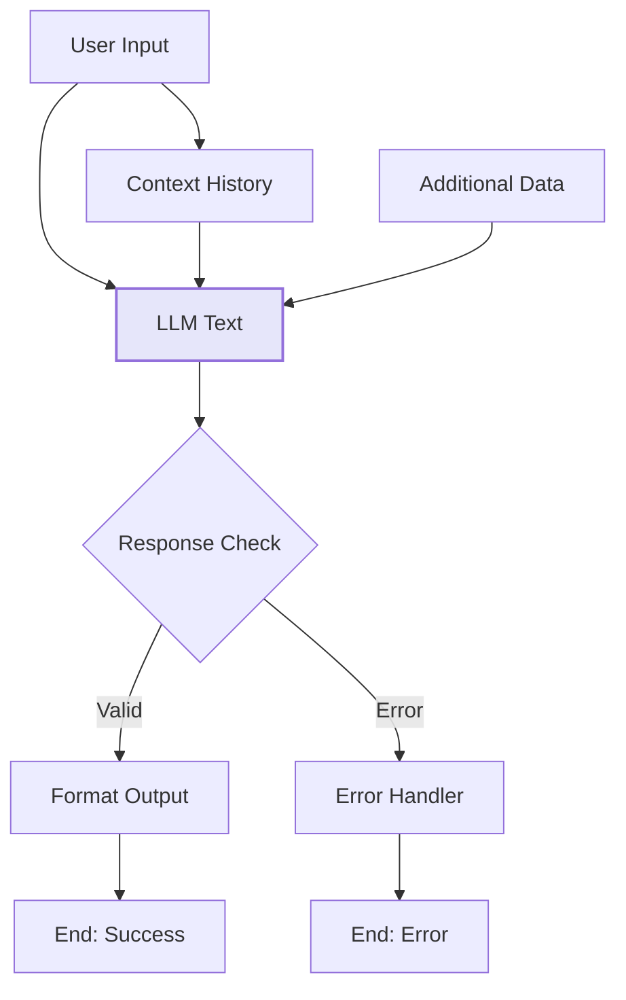

import { Card, CardHeader, CardTitle, CardDescription } from '@site/src/components/Card';
import { Callout } from '@site/src/components/Callout';
import { Features, Feature } from '@site/src/components/Features';
import { CollapsibleCodeBlock, InlineCodeCard } from '@site/src/components/CodeBlock';
import Tabs from '@theme/Tabs';
import TabItem from '@theme/TabItem';
import CodeBlock from '@theme/CodeBlock';

# LLM Text Element

The LLM Text element generates free-form text responses using large language models. It's the primary element for AI-powered text generation in the HPC Neura Execution Engine, supporting streaming responses and customizable prompts.

<Card>
  <CardHeader>
    <CardTitle>Element Overview</CardTitle>
  </CardHeader>
  

    <table>
      <tbody>
        <tr>
          <td><strong>Type</strong></td>
          <td><code>llm_text</code></td>
        </tr>
        <tr>
          <td><strong>Category</strong></td>
          <td>AI Elements</td>
        </tr>
        <tr>
          <td><strong>Output Type</strong></td>
          <td>Free-form text</td>
        </tr>
        <tr>
          <td><strong>Default Model</strong></td>
          <td>llama-3.3-70b</td>
        </tr>
        <tr>
          <td><strong>Streaming</strong></td>
          <td>Supported</td>
        </tr>
      </tbody>
    </table>
  

</Card>

## Purpose

<Features>
  <Feature title="Text Generation" icon="/img/icons/ai-workflow.svg">
    Generate human-like text responses for any prompt
  </Feature>
  <Feature title="Context Aware" icon="/img/icons/network.svg">
    Maintain conversation context across interactions
  </Feature>
  <Feature title="Customizable" icon="/img/icons/settings.svg">
    Fine-tune behavior with temperature and prompts
  </Feature>
</Features>

## Element Schema

<CollapsibleCodeBlock
  title="Complete Element Definition"
  description="L1 element template for LLM Text"
  language="yaml"
  defaultCollapsed={false}
>
{`type: llm_text
element_id: null  # Auto-generated at L2
name: null  # Set by L2
node_description: Generates free-form text using a language model
description: null  # Customizable by L2
input_schema:
  prompt:
    type: string
    description: The prompt for the LLM
    required: true
  context:
    type: list
    description: Previous conversation context
    required: false
  additional_data:
    type: json
    description: Additional data for the LLM
    required: false
output_schema:
  llm_output:
    type: string
    description: Generated text response
    required: true
parameter_schema_structure:
  model:
    type: string
  temperature:
    type: float
    min: 0.0
    max: 1.0
  max_tokens:
    type: int
  wrapper_prompt:
    type: string
parameters:
  model: llama-3.3-70b
  temperature: 0.7
  max_tokens: 1000
  wrapper_prompt: ""
processing_message: AI is generating response...
tags:
  - ai
  - llm
  - text-generation
layer: null
hyperparameters:
  type:
    access: fixed
  element_id:
    access: fixed
  name:
    access: edit
  description:
    access: edit
  input_schema:
    access: fixed
  output_schema:
    access: fixed
  parameters.model:
    access: fixed
  parameters.temperature:
    access: edit
  parameters.max_tokens:
    access: edit
  parameters.wrapper_prompt:
    access: edit
  parameters.api_key:
    access: hidden
  processing_message:
    access: edit
  tags:
    access: append
  layer:
    access: edit`}
</CollapsibleCodeBlock>

## Input Schema

<Card>
  <CardHeader>
    <CardTitle>Input Requirements</CardTitle>
  </CardHeader>
  

    <table>
      <thead>
        <tr>
          <th>Input</th>
          <th>Type</th>
          <th>Required</th>
          <th>Description</th>
        </tr>
      </thead>
      <tbody>
        <tr>
          <td><code>prompt</code></td>
          <td>string</td>
          <td>Yes</td>
          <td>The main prompt/question for the AI</td>
        </tr>
        <tr>
          <td><code>context</code></td>
          <td>list</td>
          <td>No</td>
          <td>Previous conversation messages for context</td>
        </tr>
        <tr>
          <td><code>additional_data</code></td>
          <td>json</td>
          <td>No</td>
          <td>Extra information to include in generation</td>
        </tr>
      </tbody>
    </table>
  

</Card>

## Parameters

<Tabs>
  <TabItem value="model" label="Model" default>
    

      <Card>
        <CardHeader>
          <CardTitle>Model Selection</CardTitle>
        </CardHeader>
        

          
<strong>Parameter:</strong> <code>model</code>

          
<strong>Type:</strong> string

          
<strong>Default:</strong> llama-3.3-70b

          
<strong>Access:</strong> Fixed (L1 controlled)

          
          
Currently supported model:

          <ul>
            <li><strong>llama-3.3-70b</strong>: High-quality instruction-following model optimized for general text generation</li>
          </ul>
          
          <Callout type="info">
            The model is fixed at the L1 level to ensure consistent performance and cost management. Contact system administrators to request different models.
          </Callout>
        

      </Card>
    

  </TabItem>
  
  <TabItem value="temperature" label="Temperature">
    

      <Card>
        <CardHeader>
          <CardTitle>Temperature Control</CardTitle>
        </CardHeader>
        

          
<strong>Parameter:</strong> <code>temperature</code>

          
<strong>Type:</strong> float

          
<strong>Range:</strong> 0.0 - 1.0

          
<strong>Default:</strong> 0.7

          
<strong>Access:</strong> Editable (L2 can modify)

          
          <table style={{ marginTop: '1rem' }}>
            <thead>
              <tr>
                <th>Temperature</th>
                <th>Behavior</th>
                <th>Use Case</th>
              </tr>
            </thead>
            <tbody>
              <tr>
                <td>0.0 - 0.3</td>
                <td>Deterministic, focused</td>
                <td>Factual responses, data extraction</td>
              </tr>
              <tr>
                <td>0.4 - 0.6</td>
                <td>Balanced</td>
                <td>General conversation, Q&A</td>
              </tr>
              <tr>
                <td>0.7 - 0.9</td>
                <td>Creative, varied</td>
                <td>Creative writing, brainstorming</td>
              </tr>
              <tr>
                <td>1.0</td>
                <td>Maximum randomness</td>
                <td>Experimental, highly creative</td>
              </tr>
            </tbody>
          </table>
        

      </Card>
    

  </TabItem>
  
  <TabItem value="max_tokens" label="Max Tokens">
    

      <Card>
        <CardHeader>
          <CardTitle>Token Limit</CardTitle>
        </CardHeader>
        

          
<strong>Parameter:</strong> <code>max_tokens</code>

          
<strong>Type:</strong> integer

          
<strong>Default:</strong> 1000

          
<strong>Access:</strong> Editable (L2 can modify)

          
          
Controls the maximum length of generated responses:

          <ul>
            <li><strong>Short responses:</strong> 100-500 tokens</li>
            <li><strong>Medium responses:</strong> 500-1500 tokens</li>
            <li><strong>Long responses:</strong> 1500-4000 tokens</li>
          </ul>
          
          <Callout type="tip">
            As a rough estimate: 1 token ≈ 0.75 words. So 1000 tokens ≈ 750 words.
          </Callout>
        

      </Card>
    

  </TabItem>
  
  <TabItem value="wrapper_prompt" label="Wrapper Prompt">
    

      <Card>
        <CardHeader>
          <CardTitle>Wrapper Prompt Template</CardTitle>
        </CardHeader>
        

          
<strong>Parameter:</strong> <code>wrapper_prompt</code>

          
<strong>Type:</strong> string

          
<strong>Default:</strong> "" (empty)

          
<strong>Access:</strong> Editable (L2 can modify)

          
          
The wrapper prompt wraps around the user's input to provide consistent instructions or context. Use <code>{`{prompt}`}</code> to insert the user's prompt.

          
          <CollapsibleCodeBlock
            title="Wrapper Prompt Example"
            language="text"
          >
{`You are a helpful customer service assistant for TechCorp.
Always be polite, professional, and concise.

Customer Query: {prompt}

Please provide a helpful response:`}
          </CollapsibleCodeBlock>
        

      </Card>
    

  </TabItem>
</Tabs>

## Usage Examples

### Basic Text Generation

<CollapsibleCodeBlock
  title="Simple Q&A Bot"
  description="Basic question-answering setup"
  language="yaml"
>
{`flow_definition:
  nodes:
    user_input:
      type: chat_input
      name: "User Question"
      
    ai_responder:
      type: llm_text
      element_id: ai_responder
      name: "AI Assistant"
      description: "Answers user questions"
      parameters:
        temperature: 0.7
        max_tokens: 500
        wrapper_prompt: |
          You are a knowledgeable assistant.
          Answer the following question clearly and concisely:
          
          {prompt}
      processing_message: "Thinking about your question..."
      tags:
        - ai
        - llm
        - text-generation
        - qa-bot
      layer: "ai-processing"
      
    response_output:
      type: end
      name: "Return Response"
      
  connections:
    - from_id: user_input
      to_id: ai_responder
      from_output: "user_input:chat_input"
      to_input: "ai_responder:prompt"
      
    - from_id: ai_responder
      to_id: response_output
      from_output: "ai_responder:llm_output"
      to_input: "response_output:text_input"`}
</CollapsibleCodeBlock>

### Context-Aware Conversation

<CollapsibleCodeBlock
  title="Conversational AI with Context"
  description="Maintaining conversation history"
  language="yaml"
>
{`nodes:
  chat_input:
    type: chat_input
    name: "User Message"
    
  context_history:
    type: context_history
    name: "Conversation History"
    
  conversational_ai:
    type: llm_text
    name: "Context-Aware AI"
    parameters:
      temperature: 0.7
      max_tokens: 800
      wrapper_prompt: |
        You are having a conversation. Use the context to provide relevant responses.
        
        Current message: {prompt}
        
        Respond naturally and maintain conversation continuity.
        
connections:
  - from_id: chat_input
    to_id: conversational_ai
    from_output: "chat_input:chat_input"
    to_input: "conversational_ai:prompt"
    
  - from_id: context_history
    to_id: conversational_ai
    from_output: "context_history:history"
    to_input: "conversational_ai:context"`}
</CollapsibleCodeBlock>

### Multi-Purpose Assistant

<CollapsibleCodeBlock
  title="Dynamic Assistant with Additional Data"
  description="Using all input fields for rich responses"
  language="yaml"
>
{`nodes:
  user_query:
    type: chat_input
    name: "User Query"
    
  user_metadata:
    type: metadata
    name: "User Information"
    
  data_fetcher:
    type: rest_api
    name: "Fetch Relevant Data"
    parameters:
      url: "https://api.example.com/data"
      method: "GET"
      
  ai_assistant:
    type: llm_text
    name: "Personalized Assistant"
    parameters:
      temperature: 0.6
      max_tokens: 1200
      wrapper_prompt: |
        You are a personalized assistant with access to user data and external information.
        
        User Query: {prompt}
        
        Use the additional data provided to give a comprehensive, personalized response.
        Be specific and reference the data when relevant.
        
connections:
  # Main prompt
  - from_id: user_query
    to_id: ai_assistant
    from_output: "user_query:chat_input"
    to_input: "ai_assistant:prompt"
    
  # Additional context
  - from_id: data_fetcher
    to_id: ai_assistant
    from_output: "data_fetcher:response"
    to_input: "ai_assistant:additional_data"`}
</CollapsibleCodeBlock>

## Common Patterns

### Pattern 1: Specialized Assistants

<CollapsibleCodeBlock
  title="Role-Specific AI Assistants"
  description="Creating specialized AI personalities"
  language="yaml"
>
{`# Customer Service Assistant
customer_service_ai:
  type: llm_text
  name: "Customer Service AI"
  parameters:
    temperature: 0.3  # Lower for consistency
    max_tokens: 600
    wrapper_prompt: |
      You are Sarah, a friendly customer service representative for TechStore.
      
      Guidelines:
      - Be empathetic and understanding
      - Offer concrete solutions
      - If you can't help, escalate politely
      - Keep responses under 3 paragraphs
      
      Customer says: {prompt}
      
# Technical Support AI
technical_support_ai:
  type: llm_text
  name: "Technical Support AI"
  parameters:
    temperature: 0.4  # Balanced for technical accuracy
    max_tokens: 1000
    wrapper_prompt: |
      You are a technical support engineer. Provide clear, step-by-step solutions.
      
      Issue: {prompt}
      
      Format your response with:
      1. Problem understanding
      2. Step-by-step solution
      3. Additional tips if relevant
      
# Creative Writing Assistant
creative_writer_ai:
  type: llm_text
  name: "Creative Writer"
  parameters:
    temperature: 0.9  # High for creativity
    max_tokens: 2000
    wrapper_prompt: |
      You are a creative writing assistant. Help craft engaging, imaginative content.
      
      Request: {prompt}
      
      Be creative, use vivid descriptions, and don't be afraid to be unique!`}
</CollapsibleCodeBlock>

### Pattern 2: Chain of Thought

<CollapsibleCodeBlock
  title="Multi-Step Reasoning"
  description="Breaking down complex tasks"
  language="yaml"
>
{`nodes:
  # Step 1: Analyze the problem
  problem_analyzer:
    type: llm_text
    name: "Problem Analysis"
    parameters:
      temperature: 0.3
      max_tokens: 500
      wrapper_prompt: |
        Analyze the following problem. Break it down into key components.
        
        Problem: {prompt}
        
        Provide:
        1. Problem summary
        2. Key challenges
        3. Required information
        
  # Step 2: Generate solution approach
  solution_planner:
    type: llm_text
    name: "Solution Planning"
    parameters:
      temperature: 0.5
      max_tokens: 800
      wrapper_prompt: |
        Based on this analysis: {prompt}
        
        Create a detailed solution approach:
        1. Step-by-step plan
        2. Potential obstacles
        3. Success criteria
        
  # Step 3: Final recommendation
  final_recommender:
    type: llm_text
    name: "Final Recommendation"
    parameters:
      temperature: 0.4
      max_tokens: 600
      wrapper_prompt: |
        Based on the analysis and plan: {prompt}
        
        Provide a final recommendation that is:
        - Clear and actionable
        - Addresses all concerns
        - Includes next steps`}
</CollapsibleCodeBlock>

### Pattern 3: Streaming Responses

<CollapsibleCodeBlock
  title="Real-Time Streaming Setup"
  description="Configuration for streaming AI responses"
  language="yaml"
>
{`nodes:
  streaming_ai:
    type: llm_text
    name: "Streaming AI Assistant"
    parameters:
      temperature: 0.7
      max_tokens: 2000
      wrapper_prompt: |
        Provide a detailed response to: {prompt}
    # Streaming is typically enabled at the flow level
    # The UI will show tokens as they're generated
    processing_message: "AI is thinking..."
    
  # Connect to a streaming-aware output
  streaming_output:
    type: end
    name: "Stream to User"
    
# Flow configuration for streaming
flow_config:
  streaming_enabled: true
  stream_elements:
    - streaming_ai`}
</CollapsibleCodeBlock>

## Input Data Examples

<Tabs>
  <TabItem value="simple" label="Simple Prompt" default>
    

      <CollapsibleCodeBlock
        title="Basic Prompt Input"
        description="Simple string prompt"
        language="json"
      >
{`{
  "prompt": "What are the benefits of cloud computing?"
}`}
      </CollapsibleCodeBlock>
    

  </TabItem>
  
  <TabItem value="context" label="With Context">
    

      <CollapsibleCodeBlock
        title="Prompt with Conversation Context"
        description="Including previous messages"
        language="json"
      >
{`{
  "prompt": "Can you explain more about the security aspect?",
  "context": [
    {
      "role": "user",
      "content": "What are the benefits of cloud computing?"
    },
    {
      "role": "assistant", 
      "content": "Cloud computing offers several key benefits:\n1. Cost efficiency - Pay only for what you use\n2. Scalability - Easily scale resources up or down\n3. Accessibility - Access from anywhere\n4. Security - Professional security measures\n5. Automatic updates - Always latest features"
    }
  ]
}`}
      </CollapsibleCodeBlock>
    

  </TabItem>
  
  <TabItem value="additional" label="With Additional Data">
    

      <CollapsibleCodeBlock
        title="Prompt with Extra Information"
        description="Including additional context data"
        language="json"
      >
{`{
  "prompt": "Generate a product description for our new laptop",
  "additional_data": {
    "product_specs": {
      "model": "TechBook Pro 2025",
      "processor": "Intel Core i7-13700H",
      "ram": "32GB DDR5",
      "storage": "1TB NVMe SSD",
      "display": "15.6\" 4K OLED",
      "battery": "99Wh, 12+ hours",
      "weight": "1.8kg"
    },
    "target_audience": "Creative professionals and developers",
    "key_features": [
      "Ultra-portable design",
      "Professional-grade performance",
      "All-day battery life",
      "Stunning 4K display"
    ],
    "price_range": "$1,899 - $2,499"
  }
}`}
      </CollapsibleCodeBlock>
    

  </TabItem>
</Tabs>

## Best Practices

<Callout type="success" title="LLM Text Best Practices">
✅ **Clear Prompts**: Write specific, unambiguous prompts for better results
✅ **Temperature Tuning**: Lower for factual content, higher for creative tasks
✅ **Token Management**: Set appropriate limits to control costs and response length
✅ **Context Preservation**: Use the context field for multi-turn conversations
✅ **Wrapper Prompts**: Create consistent behavior with well-designed wrapper prompts
✅ **Error Handling**: Always connect to downstream error handlers
✅ **Streaming for UX**: Enable streaming for better user experience with long responses
</Callout>

## Advanced Techniques

### Dynamic Prompt Construction

<CollapsibleCodeBlock
  title="Building Complex Prompts"
  description="Constructing prompts from multiple sources"
  language="yaml"
>
{`nodes:
  data_aggregator:
    type: custom
    name: "Aggregate Data for Prompt"
    code: |
      user_profile = inputs.get('user_profile', {})
      current_context = inputs.get('context', {})
      external_data = inputs.get('external_data', {})
      
      # Build a comprehensive prompt
      prompt_parts = [
        f"User: {user_profile.get('name', 'Guest')}",
        f"Preference: {user_profile.get('communication_style', 'formal')}",
        f"Context: {current_context.get('topic', 'general inquiry')}",
        "",
        "Query: " + inputs.get('user_query', ''),
        "",
        "Relevant Information:",
        json.dumps(external_data, indent=2)
      ]
      
      output['constructed_prompt'] = "\\n".join(prompt_parts)
      
  dynamic_ai:
    type: llm_text
    name: "Dynamic Response AI"
    parameters:
      temperature: 0.6
      max_tokens: 1000
      wrapper_prompt: |
        Based on the following comprehensive information, provide a personalized response:
        
        {prompt}
        
        Tailor your response to the user's communication style and context.`}
</CollapsibleCodeBlock>

### Conditional Temperature

<CollapsibleCodeBlock
  title="Task-Based Temperature Selection"
  description="Adjusting temperature based on task type"
  language="yaml"
>
{`nodes:
  task_classifier:
    type: llm_structured
    name: "Classify Task Type"
    output_schema:
      task_type:
        type: string
        enum: ["factual", "creative", "analytical", "conversational"]
      confidence:
        type: float
        
  # Different AI configurations for different tasks
  factual_ai:
    type: llm_text
    name: "Factual Response AI"
    parameters:
      temperature: 0.2  # Very low for accuracy
      max_tokens: 800
      wrapper_prompt: |
        Provide accurate, factual information about: {prompt}
        Cite sources when possible.
        
  creative_ai:
    type: llm_text
    name: "Creative Response AI"
    parameters:
      temperature: 0.9  # High for creativity
      max_tokens: 1500
      wrapper_prompt: |
        Create an imaginative response for: {prompt}
        Be creative and think outside the box!
        
  analytical_ai:
    type: llm_text
    name: "Analytical Response AI"
    parameters:
      temperature: 0.4  # Balanced for analysis
      max_tokens: 1200
      wrapper_prompt: |
        Analyze the following thoroughly: {prompt}
        Provide structured insights and conclusions.`}
</CollapsibleCodeBlock>

## Error Handling

### Common Errors and Solutions

<Card>
  <CardHeader>
    <CardTitle>Error Scenarios</CardTitle>
  </CardHeader>
  

    <table>
      <thead>
        <tr>
          <th>Error</th>
          <th>Cause</th>
          <th>Solution</th>
        </tr>
      </thead>
      <tbody>
        <tr>
          <td>Empty Response</td>
          <td>Prompt too vague or tokens too limited</td>
          <td>Improve prompt clarity, increase max_tokens</td>
        </tr>
        <tr>
          <td>Truncated Output</td>
          <td>Response exceeds max_tokens</td>
          <td>Increase max_tokens or request concise response</td>
        </tr>
        <tr>
          <td>Off-topic Response</td>
          <td>Unclear wrapper prompt or high temperature</td>
          <td>Refine wrapper prompt, lower temperature</td>
        </tr>
        <tr>
          <td>API Timeout</td>
          <td>Long generation with many tokens</td>
          <td>Reduce max_tokens or optimize prompt</td>
        </tr>
        <tr>
          <td>Rate Limit</td>
          <td>Too many requests</td>
          <td>Implement retry logic or request throttling</td>
        </tr>
      </tbody>
    </table>
  

</Card>

### Error Handling Pattern

<CollapsibleCodeBlock
  title="Robust Error Handling"
  description="Handling potential LLM failures"
  language="yaml"
>
{`nodes:
  llm_with_fallback:
    type: llm_text
    name: "Primary AI"
    parameters:
      temperature: 0.7
      max_tokens: 1000
      
  error_detector:
    type: custom
    name: "Check LLM Output"
    code: |
      llm_output = inputs.get('llm_output', '')
      
      # Check for common issues
      if not llm_output:
          output['has_error'] = True
          output['error_type'] = 'empty_response'
      elif len(llm_output) < 10:
          output['has_error'] = True
          output['error_type'] = 'too_short'
      elif llm_output.strip().endswith('...'):
          output['has_error'] = True
          output['error_type'] = 'truncated'
      else:
          output['has_error'] = False
          output['error_type'] = None
          
      output['original_output'] = llm_output
      
  fallback_response:
    type: custom
    name: "Generate Fallback"
    code: |
      error_type = inputs.get('error_type')
      original_prompt = inputs.get('original_prompt')
      
      fallback_messages = {
          'empty_response': "I apologize, but I couldn't generate a response. Please try rephrasing your question.",
          'too_short': "I need more context to provide a helpful response. Could you please elaborate?",
          'truncated': "My response was cut short. Please try asking for a more concise answer.",
          'default': "I encountered an issue processing your request. Please try again."
      }
      
      output['response'] = fallback_messages.get(error_type, fallback_messages['default'])`}
</CollapsibleCodeBlock>

## Performance Optimization

<Features>
  <Feature title="Prompt Optimization" icon="/img/icons/settings.svg">
    Keep prompts concise and clear for faster processing
  </Feature>
  <Feature title="Token Efficiency" icon="/img/icons/hpc.svg">
    Set appropriate token limits to balance quality and speed
  </Feature>
  <Feature title="Caching Strategy" icon="/img/icons/database.svg">
    Cache responses for repeated queries when appropriate
  </Feature>
</Features>

### Performance Tips

<CollapsibleCodeBlock
  title="Optimized Configuration"
  description="Settings for optimal performance"
  language="yaml"
>
{`# Fast Response Configuration
fast_ai:
  type: llm_text
  name: "Quick Response AI"
  parameters:
    temperature: 0.5  # Balanced
    max_tokens: 300   # Limited for speed
    wrapper_prompt: |
      Provide a concise answer (2-3 sentences) to: {prompt}
      
# Detailed Response Configuration  
detailed_ai:
  type: llm_text
  name: "Comprehensive AI"
  parameters:
    temperature: 0.7
    max_tokens: 2000  # Allow detailed responses
    wrapper_prompt: |
      Provide a comprehensive analysis of: {prompt}
      
      Include:
      - Overview
      - Key points
      - Examples
      - Conclusion
      
# Cached Response Pattern
nodes:
  cache_checker:
    type: custom
    name: "Check Response Cache"
    code: |
      # Check if we've seen this prompt before
      prompt_hash = hashlib.md5(inputs['prompt'].encode()).hexdigest()
      cached_response = cache.get(prompt_hash)  # Pseudo-code
      
      if cached_response:
          output['use_cache'] = True
          output['cached_response'] = cached_response
      else:
          output['use_cache'] = False
          output['prompt'] = inputs['prompt']`}
</CollapsibleCodeBlock>

## Streaming Configuration

<Card>
  <CardHeader>
    <CardTitle>Enabling Streaming Responses</CardTitle>
  </CardHeader>
  

    
Streaming provides real-time token generation for better user experience:

    
    <ol>
      <li><strong>Element Level</strong>: LLM Text supports streaming by default</li>
      <li><strong>Flow Level</strong>: Enable streaming in flow configuration</li>
      <li><strong>Client Level</strong>: Handle streaming events in the UI</li>
    </ol>
    
    <CollapsibleCodeBlock
      title="Streaming Event Example"
      language="json"
    >
{`// Streaming events received by client
{
  "event": "llm_chunk",
  "element_id": "ai_responder",
  "chunk": "Based on your question",
  "chunk_index": 0
}

{
  "event": "llm_chunk",
  "element_id": "ai_responder",
  "chunk": ", I can help you understand",
  "chunk_index": 1
}

{
  "event": "llm_chunk",
  "element_id": "ai_responder",
  "chunk": " cloud computing benefits...",
  "chunk_index": 2,
  "is_final": true
}`}
    </CollapsibleCodeBlock>
  

</Card>

## Integration Examples

### With Other Elements

<CollapsibleCodeBlock
  title="Complete AI Pipeline"
  description="LLM Text integrated with other elements"
  language="yaml"
>
{`nodes:
  # Input from user
  user_input:
    type: chat_input
    name: "User Question"
    
  # Analyze intent first
  intent_analyzer:
    type: llm_structured
    name: "Analyze Intent"
    output_schema:
      intent:
        type: string
        enum: ["question", "command", "feedback", "other"]
      entities:
        type: list
      confidence:
        type: float
        
  # Fetch relevant data
  data_fetcher:
    type: rest_api
    name: "Get Context Data"
    parameters:
      url: "https://api.example.com/context"
      
  # Generate main response
  main_responder:
    type: llm_text
    name: "Generate Response"
    parameters:
      temperature: 0.6
      max_tokens: 1000
      wrapper_prompt: |
        Intent: {intent}
        Context Data: {context_data}
        
        User Query: {prompt}
        
        Provide a helpful response based on the intent and context.
        
  # Format for output
  response_formatter:
    type: custom
    name: "Format Final Response"
    code: |
      response = inputs['llm_response']
      intent_data = inputs['intent_data']
      
      # Add metadata to response
      output['formatted_response'] = {
          'text': response,
          'intent': intent_data['intent'],
          'confidence': intent_data['confidence'],
          'timestamp': datetime.now().isoformat()
      }`}
</CollapsibleCodeBlock>

## Visual Flow Example

## Related Elements

  <Card>
    <CardHeader>
      <CardTitle>LLM Structured</CardTitle>
      <CardDescription>
        For generating structured JSON outputs
      </CardDescription>
    </CardHeader>
    

      <a href="./02-llm-structured" style={{ textDecoration: 'none' }}>
        Compare with structured →
      </a>
    

  </Card>
  
  <Card>
    <CardHeader>
      <CardTitle>Chat Input</CardTitle>
      <CardDescription>
        Common input source for LLM Text
      </CardDescription>
    </CardHeader>
    

      <a href="../03-input-elements/01-chat-input" style={{ textDecoration: 'none' }}>
        Learn about inputs →
      </a>
    

  </Card>
  
  <Card>
    <CardHeader>
      <CardTitle>Context History</CardTitle>
      <CardDescription>
        Maintaining conversation context
      </CardDescription>
    </CardHeader>
    

      <a href="../03-input-elements/02-context-history" style={{ textDecoration: 'none' }}>
        Manage context →
      </a>
    

  </Card>

## Summary

The LLM Text element is your primary tool for AI-powered text generation, offering:
- **Flexible text generation** with customizable prompts and parameters
- **Context awareness** through conversation history support
- **Streaming capabilities** for responsive user experiences
- **Temperature control** to balance creativity and consistency
- **Integration flexibility** with other flow elements

Use LLM Text when you need natural language responses, creative content, or conversational AI capabilities in your flows.