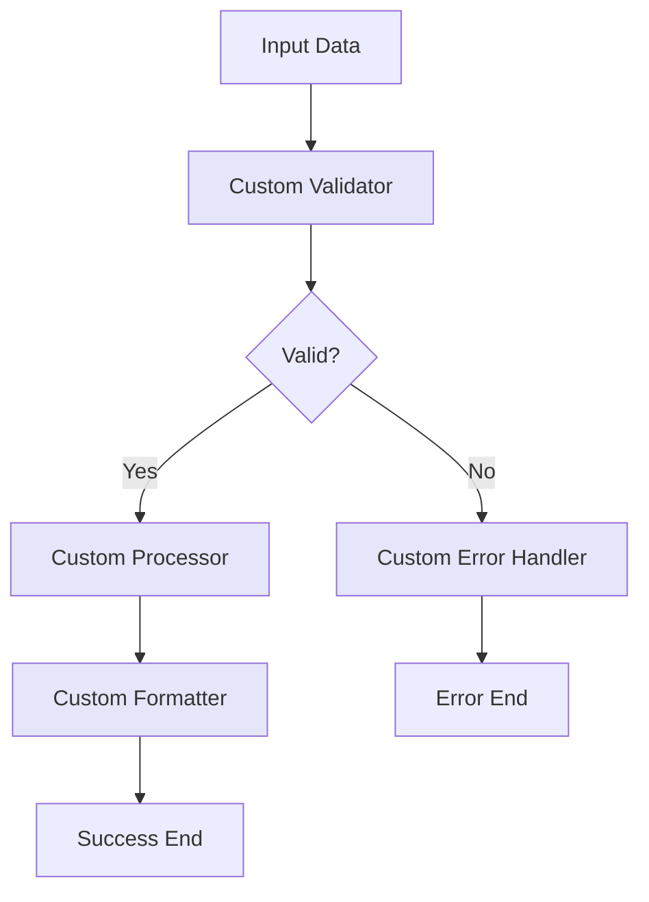
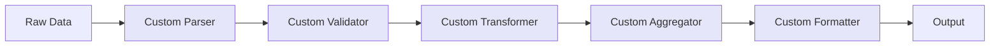

import { Card, CardHeader, CardTitle, CardDescription } from '@site/src/components/Card';
import { Callout } from '@site/src/components/Callout';
import { Features, Feature } from '@site/src/components/Features';
import { CollapsibleCodeBlock, InlineCodeCard } from '@site/src/components/CodeBlock';
import Tabs from '@theme/Tabs';
import TabItem from '@theme/TabItem';
import CodeBlock from '@theme/CodeBlock';

# Custom Element

The Custom element enables execution of Python code within the HPC Neura Execution Engine. It provides a flexible way to implement custom logic when existing elements don't meet specific requirements, while maintaining security through sandboxed execution.

<Card>
  <CardHeader>
    <CardTitle>Element Overview</CardTitle>
  </CardHeader>
  

    <table>
      <tbody>
        <tr>
          <td><strong>Type</strong></td>
          <td><code>custom</code></td>
        </tr>
        <tr>
          <td><strong>Category</strong></td>
          <td>Custom Elements</td>
        </tr>
        <tr>
          <td><strong>Input Schema</strong></td>
          <td>Fully customizable by L2</td>
        </tr>
        <tr>
          <td><strong>Output Schema</strong></td>
          <td>Fully customizable by L2</td>
        </tr>
        <tr>
          <td><strong>Code Execution</strong></td>
          <td>Sandboxed Python environment</td>
        </tr>
      </tbody>
    </table>
  

</Card>

## Purpose

<Features>
  <Feature title="Custom Logic" icon="/img/icons/code.svg">
    Execute arbitrary Python code for unique requirements
  </Feature>
  <Feature title="Flexible I/O" icon="/img/icons/network.svg">
    Define custom input and output schemas
  </Feature>
  <Feature title="Secure Execution" icon="/img/icons/security.svg">
    Runs in sandboxed environment with resource limits
  </Feature>
</Features>

## Element Schema

<CollapsibleCodeBlock
  title="Complete Element Definition"
  description="L1 element template for Custom"
  language="yaml"
  defaultCollapsed={false}
>
{`type: custom
element_id: null  # Auto-generated at L2
name: null  # Set by L2
node_description: Executes custom Python code with security restrictions
description: null  # Customizable by L2
input_schema: {}  # Fully customizable by L2
output_schema: {}  # Fully customizable by L2
parameter_schema_structure:
  hyperparameters:
    type: json
  constants:
    type: json
parameters:
  hyperparameters: {}
  constants: {}
processing_message: Executing custom code...
tags:
  - custom
  - code
layer: null  # Set by L2
hyperparameters:
  type:
    access: fixed
  element_id:
    access: fixed
  name:
    access: edit
  description:
    access: edit
  input_schema:
    access: edit
  output_schema:
    access: edit
  code:
    access: edit
  parameters.hyperparameters:
    access: edit
  parameters.constants:
    access: edit
  processing_message:
    access: edit
  tags:
    access: append
  layer:
    access: edit
input: null
output: null
code: ""  # Python code added by L2
flow_control: null`}
</CollapsibleCodeBlock>

## Key Characteristics

<Callout type="info">
The Custom element is unique in that L2 developers have **full control** over:
- Input and output schemas
- The Python code that executes
- Parameters (both hyperparameters and constants)

This flexibility comes with responsibility for ensuring code safety and efficiency.
</Callout>

### Flexibility Features

| Feature | Description | L2 Control |
|---------|-------------|------------|
| **Input Schema** | Define expected inputs | Full - any structure |
| **Output Schema** | Define output format | Full - any structure |
| **Code** | Python implementation | Full - write any code |
| **Parameters** | Hyperparameters & constants | Full - define and use |
| **Error Handling** | Exception management | Full - implement as needed |

## Usage Examples

### Basic Custom Element

<CollapsibleCodeBlock
  title="Simple Data Processor"
  description="Basic custom element for data transformation"
  language="yaml"
>
{`flow_definition:
  nodes:
    data_processor:
      type: custom
      element_id: data_processor
      name: "Custom Data Processor"
      description: "Transforms and validates user data"
      input_schema:
        user_data:
          type: json
          required: true
          description: "Raw user data to process"
        threshold:
          type: float
          required: false
          default: 0.5
          description: "Processing threshold"
      output_schema:
        processed_data:
          type: json
          required: true
          description: "Transformed user data"
        status:
          type: string
          required: true
          description: "Processing status"
        score:
          type: float
          required: false
          description: "Validation score"
      code: |
        # Access inputs
        user_data = inputs.get('user_data', {})
        threshold = inputs.get('threshold', 0.5)
        
        # Process data
        processed = {}
        for key, value in user_data.items():
            # Convert strings to uppercase
            if isinstance(value, str):
                processed[key] = value.upper()
            # Double numeric values
            elif isinstance(value, (int, float)):
                processed[key] = value * 2
            else:
                processed[key] = value
                
        # Calculate score
        score = len(processed) / 10.0
        
        # Determine status
        status = "valid" if score >= threshold else "needs_review"
        
        # Set outputs
        output['processed_data'] = processed
        output['status'] = status
        output['score'] = score
      processing_message: "Processing user data..."
      tags:
        - custom
        - code
        - data-processing
      layer: "processing"`}
</CollapsibleCodeBlock>

### Custom Element with Parameters

<CollapsibleCodeBlock
  title="Parameterized Custom Element"
  description="Using hyperparameters and constants"
  language="yaml"
>
{`nodes:
  configurable_processor:
    type: custom
    name: "Configurable Processor"
    input_schema:
      text:
        type: string
        required: true
      options:
        type: json
        required: false
    output_schema:
      result:
        type: string
      metadata:
        type: json
    parameters:
      hyperparameters:
        max_length: 1000
        min_length: 10
        allowed_languages: ["en", "es", "fr"]
        processing_mode: "standard"
      constants:
        api_version: "2.0"
        default_language: "en"
        timeout_seconds: 30
    code: |
      # Access parameters
      max_length = parameters['hyperparameters']['max_length']
      min_length = parameters['hyperparameters']['min_length']
      allowed_languages = parameters['hyperparameters']['allowed_languages']
      mode = parameters['hyperparameters']['processing_mode']
      
      # Access constants
      api_version = parameters['constants']['api_version']
      default_lang = parameters['constants']['default_language']
      
      # Get inputs
      text = inputs.get('text', '')
      options = inputs.get('options', {})
      language = options.get('language', default_lang)
      
      # Validate
      if len(text) < min_length:
          raise ValueError(f"Text too short. Minimum {min_length} characters.")
      if len(text) > max_length:
          text = text[:max_length]
          
      if language not in allowed_languages:
          language = default_lang
          
      # Process based on mode
      if mode == "uppercase":
          result = text.upper()
      elif mode == "lowercase":
          result = text.lower()
      elif mode == "title":
          result = text.title()
      else:
          result = text
          
      # Set outputs
      output['result'] = result
      output['metadata'] = {
          'original_length': len(inputs.get('text', '')),
          'final_length': len(result),
          'language': language,
          'mode': mode,
          'api_version': api_version
      }`}
</CollapsibleCodeBlock>

### Advanced Data Analysis

<CollapsibleCodeBlock
  title="Statistical Analysis Custom Element"
  description="Complex data analysis with multiple outputs"
  language="yaml"
>
{`nodes:
  statistical_analyzer:
    type: custom
    name: "Statistical Data Analyzer"
    description: "Performs comprehensive statistical analysis"
    input_schema:
      data_points:
        type: list
        required: true
        description: "List of numeric values to analyze"
      analysis_type:
        type: string
        required: false
        default: "full"
        enum: ["basic", "full", "advanced"]
      confidence_level:
        type: float
        required: false
        default: 0.95
    output_schema:
      statistics:
        type: json
        required: true
        description: "Statistical measures"
      outliers:
        type: list
        required: false
        description: "Detected outliers"
      summary:
        type: string
        required: true
        description: "Human-readable summary"
    code: |
      import statistics
      import math
      
      # Get inputs
      data = inputs.get('data_points', [])
      analysis_type = inputs.get('analysis_type', 'full')
      confidence = inputs.get('confidence_level', 0.95)
      
      if not data:
          output['statistics'] = {}
          output['summary'] = "No data provided"
          return
          
      # Convert to floats
      try:
          data = [float(x) for x in data]
      except ValueError:
          raise ValueError("All data points must be numeric")
          
      # Basic statistics
      stats = {
          'count': len(data),
          'mean': statistics.mean(data),
          'median': statistics.median(data),
          'min': min(data),
          'max': max(data)
      }
      
      # Full analysis
      if analysis_type in ['full', 'advanced']:
          stats['std_dev'] = statistics.stdev(data) if len(data) > 1 else 0
          stats['variance'] = statistics.variance(data) if len(data) > 1 else 0
          
          # Quartiles
          sorted_data = sorted(data)
          n = len(sorted_data)
          stats['q1'] = sorted_data[n//4] if n >= 4 else sorted_data[0]
          stats['q3'] = sorted_data[3*n//4] if n >= 4 else sorted_data[-1]
          stats['iqr'] = stats['q3'] - stats['q1']
          
      # Advanced analysis
      if analysis_type == 'advanced':
          # Detect outliers using IQR method
          outliers = []
          lower_bound = stats['q1'] - 1.5 * stats['iqr']
          upper_bound = stats['q3'] + 1.5 * stats['iqr']
          
          for i, value in enumerate(data):
              if value < lower_bound or value > upper_bound:
                  outliers.append({'index': i, 'value': value})
                  
          output['outliers'] = outliers
          
          # Additional metrics
          stats['skewness'] = calculate_skewness(data, stats['mean'], stats['std_dev'])
          stats['confidence_interval'] = calculate_ci(stats['mean'], stats['std_dev'], n, confidence)
          
      # Generate summary
      summary_parts = [
          f"Analyzed {stats['count']} data points.",
          f"Mean: {stats['mean']:.2f}, Median: {stats['median']:.2f}",
          f"Range: [{stats['min']:.2f}, {stats['max']:.2f}]"
      ]
      
      if 'std_dev' in stats:
          summary_parts.append(f"Std Dev: {stats['std_dev']:.2f}")
          
      if 'outliers' in output:
          summary_parts.append(f"Found {len(output['outliers'])} outliers")
          
      output['statistics'] = stats
      output['summary'] = " ".join(summary_parts)
      
      # Helper functions (defined inline for sandboxed environment)
      def calculate_skewness(data, mean, std_dev):
          if std_dev == 0:
              return 0
          n = len(data)
          skew = sum((x - mean) ** 3 for x in data) / n
          return skew / (std_dev ** 3)
          
      def calculate_ci(mean, std_dev, n, confidence):
          if n < 2:
              return [mean, mean]
          z_score = 1.96 if confidence == 0.95 else 2.58  # Simple approximation
          margin = z_score * (std_dev / math.sqrt(n))
          return [mean - margin, mean + margin]`}
</CollapsibleCodeBlock>

## Code Property Deep Dive

<Tabs>
  <TabItem value="structure" label="Code Structure" default>
    

      <Card>
        <CardHeader>
          <CardTitle>Understanding the Code Block</CardTitle>
        </CardHeader>
        

          
The code property contains Python code that executes in a sandboxed environment with these predefined variables:

          
          <table>
            <thead>
              <tr>
                <th>Variable</th>
                <th>Type</th>
                <th>Description</th>
              </tr>
            </thead>
            <tbody>
              <tr>
                <td><code>inputs</code></td>
                <td>dict</td>
                <td>Contains all input values</td>
              </tr>
              <tr>
                <td><code>output</code></td>
                <td>dict</td>
                <td>Write output values here</td>
              </tr>
              <tr>
                <td><code>parameters</code></td>
                <td>dict</td>
                <td>Contains hyperparameters and constants</td>
              </tr>
            </tbody>
          </table>
          
          <CollapsibleCodeBlock
            title="Code Structure Template"
            language="python"
          >
{`# 1. Access inputs
input_value = inputs.get('input_field', default_value)

# 2. Access parameters
param = parameters.get('hyperparameters', {}).get('param_name')
const = parameters.get('constants', {}).get('const_name')

# 3. Process data
# Your custom logic here
result = process_data(input_value)

# 4. Set outputs
output['output_field'] = result
output['status'] = 'success'

# 5. Error handling (optional)
if error_condition:
    raise ValueError("Descriptive error message")`}
          </CollapsibleCodeBlock>
        

      </Card>
    

  </TabItem>
  
  <TabItem value="available" label="Available Libraries">
    

      <Card>
        <CardHeader>
          <CardTitle>Python Environment</CardTitle>
        </CardHeader>
        

          
The sandboxed environment includes standard Python libraries:

          
          <h4>Built-in Modules Available:</h4>
          <ul>
            <li><code>math</code> - Mathematical functions</li>
            <li><code>statistics</code> - Statistical calculations</li>
            <li><code>json</code> - JSON parsing and encoding</li>
            <li><code>datetime</code> - Date and time operations</li>
            <li><code>re</code> - Regular expressions</li>
            <li><code>collections</code> - Specialized containers</li>
            <li><code>itertools</code> - Iterator functions</li>
            <li><code>hashlib</code> - Hashing algorithms</li>
            <li><code>base64</code> - Base64 encoding/decoding</li>
            <li><code>urllib.parse</code> - URL parsing</li>
          </ul>
          
          <CollapsibleCodeBlock
            title="Using Available Libraries"
            language="python"
          >
{`# Example using multiple libraries
import json
import datetime
import re
import statistics

# Parse JSON input
data = json.loads(inputs.get('json_data', '{}'))

# Date operations
now = datetime.datetime.now()
timestamp = now.isoformat()

# Regex validation
email_pattern = r'^[a-zA-Z0-9._%+-]+@[a-zA-Z0-9.-]+\.[a-zA-Z]{2,}$'
is_valid_email = re.match(email_pattern, inputs.get('email', ''))

# Statistical operations
values = inputs.get('numbers', [])
if values:
    mean = statistics.mean(values)
    median = statistics.median(values)
    
output['processed_data'] = data
output['timestamp'] = timestamp
output['email_valid'] = bool(is_valid_email)
output['statistics'] = {'mean': mean, 'median': median}`}
          </CollapsibleCodeBlock>
        

      </Card>
    

  </TabItem>
  
  <TabItem value="restrictions" label="Security Restrictions">
    

      <Card>
        <CardHeader>
          <CardTitle>Sandboxed Execution Limits</CardTitle>
        </CardHeader>
        

          <Callout type="warning" title="Security Restrictions">
            The following operations are **NOT allowed** in custom code:
            - File system access (no reading/writing files)
            - Network requests (no HTTP calls)
            - System calls or subprocess execution
            - Importing external packages (only standard library)
            - Infinite loops or excessive resource usage
            - Access to environment variables
            - Direct database connections
          </Callout>
          
          <h4>Resource Limits:</h4>
          <ul>
            <li><strong>Execution Time:</strong> Maximum 30 seconds</li>
            <li><strong>Memory:</strong> Limited to prevent excessive usage</li>
            <li><strong>CPU:</strong> Single-threaded execution</li>
            <li><strong>Output Size:</strong> Limited to prevent memory overflow</li>
          </ul>
          
          <CollapsibleCodeBlock
            title="What NOT to Do"
            language="python"
          >
{`# ❌ These will fail or be blocked:

# File operations
with open('file.txt', 'r') as f:  # Not allowed
    data = f.read()

# Network requests
import requests  # Cannot import
response = requests.get('http://api.example.com')

# System calls
import os
os.system('ls')  # Not allowed

# Subprocess
import subprocess
result = subprocess.run(['echo', 'hello'])  # Not allowed

# Infinite loops
while True:  # Will timeout
    process_data()

# External packages
import numpy as np  # Cannot import
import pandas as pd  # Cannot import`}
          </CollapsibleCodeBlock>
        

      </Card>
    

  </TabItem>
</Tabs>

## Common Patterns

### Pattern 1: Data Validation

<CollapsibleCodeBlock
  title="Input Validation Pattern"
  description="Validate and sanitize inputs"
  language="yaml"
>
{`nodes:
  input_validator:
    type: custom
    name: "Input Validator"
    input_schema:
      email:
        type: string
        required: true
      age:
        type: int
        required: true
      preferences:
        type: json
        required: false
    output_schema:
      valid:
        type: bool
      sanitized_data:
        type: json
      errors:
        type: list
    code: |
      import re
      
      errors = []
      sanitized = {}
      
      # Validate email
      email = inputs.get('email', '')
      email_pattern = r'^[a-zA-Z0-9._%+-]+@[a-zA-Z0-9.-]+\.[a-zA-Z]{2,}$'
      if re.match(email_pattern, email):
          sanitized['email'] = email.lower().strip()
      else:
          errors.append("Invalid email format")
          
      # Validate age
      age = inputs.get('age', 0)
      if isinstance(age, int) and 0 < age < 150:
          sanitized['age'] = age
      else:
          errors.append("Age must be between 1 and 149")
          
      # Validate preferences
      prefs = inputs.get('preferences', {})
      if isinstance(prefs, dict):
          # Sanitize preferences
          allowed_keys = ['theme', 'language', 'notifications']
          sanitized['preferences'] = {
              k: v for k, v in prefs.items() 
              if k in allowed_keys
          }
      else:
          errors.append("Preferences must be a JSON object")
          
      # Set outputs
      output['valid'] = len(errors) == 0
      output['sanitized_data'] = sanitized
      output['errors'] = errors`}
</CollapsibleCodeBlock>

### Pattern 2: Data Aggregation

<CollapsibleCodeBlock
  title="Multi-Source Aggregation"
  description="Combine data from multiple inputs"
  language="yaml"
>
{`nodes:
  data_aggregator:
    type: custom
    name: "Data Aggregator"
    input_schema:
      source_a:
        type: json
        required: true
      source_b:
        type: json
        required: true
      source_c:
        type: json
        required: false
      merge_strategy:
        type: string
        enum: ["overwrite", "combine", "deep_merge"]
        default: "combine"
    output_schema:
      merged_data:
        type: json
      data_sources:
        type: list
      statistics:
        type: json
    code: |
      # Get inputs
      source_a = inputs.get('source_a', {})
      source_b = inputs.get('source_b', {})
      source_c = inputs.get('source_c', {})
      strategy = inputs.get('merge_strategy', 'combine')
      
      # Track sources
      sources = ['source_a', 'source_b']
      if source_c:
          sources.append('source_c')
          
      # Merge based on strategy
      if strategy == 'overwrite':
          # Later sources overwrite earlier ones
          merged = {}
          merged.update(source_a)
          merged.update(source_b)
          if source_c:
              merged.update(source_c)
              
      elif strategy == 'combine':
          # Combine values into lists
          merged = {}
          all_sources = [source_a, source_b]
          if source_c:
              all_sources.append(source_c)
              
          all_keys = set()
          for source in all_sources:
              all_keys.update(source.keys())
              
          for key in all_keys:
              values = []
              for source in all_sources:
                  if key in source:
                      values.append(source[key])
              merged[key] = values if len(values) > 1 else values[0]
              
      else:  # deep_merge
          # Recursive deep merge
          def deep_merge(dict1, dict2):
              result = dict1.copy()
              for key, value in dict2.items():
                  if key in result and isinstance(result[key], dict) and isinstance(value, dict):
                      result[key] = deep_merge(result[key], value)
                  else:
                      result[key] = value
              return result
              
          merged = deep_merge(source_a, source_b)
          if source_c:
              merged = deep_merge(merged, source_c)
              
      # Calculate statistics
      stats = {
          'total_keys': len(merged),
          'source_count': len(sources),
          'merge_strategy': strategy,
          'data_size_bytes': len(str(merged))
      }
      
      # Set outputs
      output['merged_data'] = merged
      output['data_sources'] = sources
      output['statistics'] = stats`}
</CollapsibleCodeBlock>

### Pattern 3: Text Processing

<CollapsibleCodeBlock
  title="Advanced Text Processing"
  description="Complex text analysis and transformation"
  language="yaml"
>
{`nodes:
  text_processor:
    type: custom
    name: "Advanced Text Processor"
    input_schema:
      text:
        type: string
        required: true
      operations:
        type: list
        required: true
        description: "List of operations to perform"
      options:
        type: json
        required: false
    output_schema:
      processed_text:
        type: string
      analysis:
        type: json
      transformations_applied:
        type: list
    code: |
      import re
      from collections import Counter
      
      # Get inputs
      text = inputs.get('text', '')
      operations = inputs.get('operations', [])
      options = inputs.get('options', {})
      
      # Track transformations
      applied = []
      analysis = {}
      
      # Original analysis
      analysis['original'] = {
          'length': len(text),
          'word_count': len(text.split()),
          'line_count': len(text.splitlines())
      }
      
      # Apply operations in sequence
      processed = text
      
      for op in operations:
          if op == 'lowercase':
              processed = processed.lower()
              applied.append('lowercase')
              
          elif op == 'uppercase':
              processed = processed.upper()
              applied.append('uppercase')
              
          elif op == 'remove_punctuation':
              processed = re.sub(r'[^\\w\\s]', '', processed)
              applied.append('remove_punctuation')
              
          elif op == 'remove_numbers':
              processed = re.sub(r'\\d+', '', processed)
              applied.append('remove_numbers')
              
          elif op == 'normalize_whitespace':
              processed = ' '.join(processed.split())
              applied.append('normalize_whitespace')
              
          elif op == 'extract_emails':
              emails = re.findall(r'[a-zA-Z0-9._%+-]+@[a-zA-Z0-9.-]+\\.[a-zA-Z]{2,}', processed)
              analysis['extracted_emails'] = emails
              applied.append('extract_emails')
              
          elif op == 'extract_urls':
              urls = re.findall(r'https?://[^\\s]+', processed)
              analysis['extracted_urls'] = urls
              applied.append('extract_urls')
              
          elif op == 'word_frequency':
              words = processed.lower().split()
              word_freq = Counter(words)
              analysis['top_words'] = dict(word_freq.most_common(10))
              applied.append('word_frequency')
              
          elif op == 'sentence_split':
              sentences = re.split(r'[.!?]+', processed)
              sentences = [s.strip() for s in sentences if s.strip()]
              analysis['sentences'] = sentences
              analysis['sentence_count'] = len(sentences)
              applied.append('sentence_split')
              
          elif op == 'title_case':
              processed = processed.title()
              applied.append('title_case')
              
          elif op == 'reverse':
              processed = processed[::-1]
              applied.append('reverse')
              
          elif op == 'remove_extra_spaces':
              processed = re.sub(r'\\s+', ' ', processed).strip()
              applied.append('remove_extra_spaces')
              
      # Final analysis
      analysis['final'] = {
          'length': len(processed),
          'word_count': len(processed.split()),
          'line_count': len(processed.splitlines())
      }
      
      analysis['changes'] = {
          'length_change': analysis['final']['length'] - analysis['original']['length'],
          'word_count_change': analysis['final']['word_count'] - analysis['original']['word_count']
      }
      
      # Set outputs
      output['processed_text'] = processed
      output['analysis'] = analysis
      output['transformations_applied'] = applied`}
</CollapsibleCodeBlock>

## Error Handling

### Safe Error Handling

<CollapsibleCodeBlock
  title="Comprehensive Error Handling"
  description="Handle errors gracefully"
  language="yaml"
>
{`nodes:
  safe_processor:
    type: custom
    name: "Safe Data Processor"
    input_schema:
      data:
        type: json
        required: true
      operation:
        type: string
        required: true
    output_schema:
      success:
        type: bool
      result:
        type: json
      error:
        type: string
      error_details:
        type: json
    code: |
      # Initialize outputs
      output['success'] = False
      output['result'] = None
      output['error'] = None
      output['error_details'] = {}
      
      try:
          # Validate inputs
          data = inputs.get('data')
          operation = inputs.get('operation')
          
          if not data:
              raise ValueError("No data provided")
              
          if not operation:
              raise ValueError("No operation specified")
              
          # Process based on operation
          if operation == 'sum':
              if not isinstance(data, list):
                  raise TypeError("Data must be a list for sum operation")
              result = sum(float(x) for x in data)
              
          elif operation == 'average':
              if not isinstance(data, list) or len(data) == 0:
                  raise ValueError("Data must be a non-empty list")
              result = sum(float(x) for x in data) / len(data)
              
          elif operation == 'transform':
              if not isinstance(data, dict):
                  raise TypeError("Data must be a dictionary for transform")
              result = {k: str(v).upper() for k, v in data.items()}
              
          elif operation == 'filter':
              if not isinstance(data, list):
                  raise TypeError("Data must be a list for filter")
              result = [x for x in data if x is not None and x != '']
              
          else:
              raise ValueError(f"Unknown operation: {operation}")
              
          # Success
          output['success'] = True
          output['result'] = result
          
      except ValueError as e:
          output['error'] = str(e)
          output['error_details'] = {
              'type': 'ValueError',
              'operation': operation,
              'data_type': type(data).__name__
          }
          
      except TypeError as e:
          output['error'] = str(e)
          output['error_details'] = {
              'type': 'TypeError',
              'operation': operation,
              'data_type': type(data).__name__
          }
          
      except Exception as e:
          output['error'] = f"Unexpected error: {str(e)}"
          output['error_details'] = {
              'type': type(e).__name__,
              'operation': operation
          }`}
</CollapsibleCodeBlock>

### Input Validation

<CollapsibleCodeBlock
  title="Robust Input Validation"
  description="Validate inputs before processing"
  language="yaml"
>
{`nodes:
  input_validator:
    type: custom
    name: "Robust Validator"
    code: |
      # Define validation rules
      def validate_email(email):
          import re
          pattern = r'^[a-zA-Z0-9._%+-]+@[a-zA-Z0-9.-]+\.[a-zA-Z]{2,}$'
          return bool(re.match(pattern, email))
          
      def validate_phone(phone):
          import re
          # Remove common formatting
          cleaned = re.sub(r'[\\s\\-\\(\\)]', '', phone)
          # Check if it's digits and right length
          return cleaned.isdigit() and 10 <= len(cleaned) <= 15
          
      def validate_url(url):
          import re
          pattern = r'^https?://[^\\s/$.?#].[^\\s]*$'
          return bool(re.match(pattern, url))
          
      def validate_json(json_str):
          import json
          try:
              json.loads(json_str)
              return True
          except:
              return False
              
      # Get all inputs
      all_inputs = inputs.copy()
      validation_results = {}
      valid_inputs = {}
      errors = []
      
      # Validate each input based on its name/type
      for key, value in all_inputs.items():
          if 'email' in key.lower():
              if validate_email(str(value)):
                  valid_inputs[key] = value.lower().strip()
                  validation_results[key] = 'valid'
              else:
                  errors.append(f"{key}: Invalid email format")
                  validation_results[key] = 'invalid'
                  
          elif 'phone' in key.lower():
              if validate_phone(str(value)):
                  valid_inputs[key] = re.sub(r'[\\s\\-\\(\\)]', '', str(value))
                  validation_results[key] = 'valid'
              else:
                  errors.append(f"{key}: Invalid phone format")
                  validation_results[key] = 'invalid'
                  
          elif 'url' in key.lower() or 'link' in key.lower():
              if validate_url(str(value)):
                  valid_inputs[key] = value
                  validation_results[key] = 'valid'
              else:
                  errors.append(f"{key}: Invalid URL format")
                  validation_results[key] = 'invalid'
                  
          elif 'json' in key.lower():
              if validate_json(str(value)):
                  valid_inputs[key] = json.loads(str(value))
                  validation_results[key] = 'valid'
              else:
                  errors.append(f"{key}: Invalid JSON format")
                  validation_results[key] = 'invalid'
                  
          else:
              # Default: accept as-is
              valid_inputs[key] = value
              validation_results[key] = 'valid'
              
      # Set outputs
      output['all_valid'] = len(errors) == 0
      output['valid_inputs'] = valid_inputs
      output['validation_results'] = validation_results
      output['errors'] = errors`}
</CollapsibleCodeBlock>

## Best Practices

<Callout type="success" title="Custom Element Best Practices">
✅ **Clear Documentation**: Document input/output schemas thoroughly
✅ **Error Handling**: Always include try-except blocks
✅ **Input Validation**: Validate all inputs before processing
✅ **Resource Awareness**: Be mindful of execution time and memory
✅ **Output Consistency**: Always set expected output fields
✅ **Code Readability**: Write clear, well-commented code
✅ **Security First**: Never attempt to bypass sandbox restrictions
✅ **Test Edge Cases**: Handle empty, null, and invalid inputs
</Callout>

## Common Use Cases

<Features>
  <Feature title="Data Transformation" icon="/img/icons/network.svg">
    Format conversion, filtering, aggregation
  </Feature>
  <Feature title="Validation Logic" icon="/img/icons/success.svg">
    Complex business rules and constraints
  </Feature>
  <Feature title="Calculations" icon="/img/icons/settings.svg">
    Mathematical and statistical operations
  </Feature>
  <Feature title="Text Processing" icon="/img/icons/docs.svg">
    Parsing, extraction, and analysis
  </Feature>
  <Feature title="Decision Logic" icon="/img/icons/ai-workflow.svg">
    Complex conditional processing
  </Feature>
  <Feature title="Data Integration" icon="/img/icons/database.svg">
    Combine and reconcile multiple sources
  </Feature>
</Features>

## Performance Optimization

### Efficient Code Patterns

<CollapsibleCodeBlock
  title="Performance Best Practices"
  description="Write efficient custom code"
  language="python"
>
{`# ✅ Good: Efficient patterns

# Use list comprehensions instead of loops
filtered = [x for x in data if condition(x)]  # Good
# Instead of:
filtered = []
for x in data:
    if condition(x):
        filtered.append(x)  # Less efficient

# Use built-in functions
total = sum(values)  # Good
# Instead of:
total = 0
for v in values:
    total += v  # Less efficient

# Early returns for validation
if not inputs.get('required_field'):
    output['error'] = 'Missing required field'
    return  # Exit early

# Use generators for large datasets
def process_items(items):
    for item in items:
        if validate(item):
            yield transform(item)

# Efficient string building
parts = []
for item in items:
    parts.append(str(item))
result = ''.join(parts)  # Good
# Instead of:
result = ''
for item in items:
    result += str(item)  # Creates new string each time

# Avoid repeated calculations
const_value = expensive_calculation()
for item in items:
    process(item, const_value)  # Reuse the calculated value`}
</CollapsibleCodeBlock>

### Memory Management

<CollapsibleCodeBlock
  title="Memory-Efficient Patterns"
  description="Handle large datasets efficiently"
  language="python"
>
{`# Process large datasets in chunks
def process_large_dataset(data, chunk_size=1000):
    results = []
    
    for i in range(0, len(data), chunk_size):
        chunk = data[i:i + chunk_size]
        chunk_results = process_chunk(chunk)
        results.extend(chunk_results)
        
        # Allow garbage collection between chunks
        del chunk
        del chunk_results
        
    return results

# Stream processing for text
def process_text_lines(text):
    results = []
    for line in text.splitlines():
        if line.strip():  # Skip empty lines
            result = process_line(line)
            if result:
                results.append(result)
    return results

# Efficient data structures
# Use sets for membership testing
valid_ids = set(valid_id_list)  # O(1) lookup
if item_id in valid_ids:  # Fast
    process(item)

# Use dictionaries for mapping
mapping = {item['id']: item for item in items}  # Build once
result = mapping.get(target_id)  # Fast lookup`}
</CollapsibleCodeBlock>

## Technical Details

### Execution Environment

<Card>
  <CardHeader>
    <CardTitle>Sandbox Specifications</CardTitle>
  </CardHeader>
  

    <table>
      <thead>
        <tr>
          <th>Aspect</th>
          <th>Specification</th>
          <th>Notes</th>
        </tr>
      </thead>
      <tbody>
        <tr>
          <td>Python Version</td>
          <td>3.8+</td>
          <td>Modern Python features available</td>
        </tr>
        <tr>
          <td>Execution Timeout</td>
          <td>30 seconds</td>
          <td>Prevents infinite loops</td>
        </tr>
        <tr>
          <td>Memory Limit</td>
          <td>Configurable</td>
          <td>Prevents memory exhaustion</td>
        </tr>
        <tr>
          <td>CPU Threads</td>
          <td>1</td>
          <td>Single-threaded execution</td>
        </tr>
        <tr>
          <td>Network Access</td>
          <td>Disabled</td>
          <td>No external API calls</td>
        </tr>
        <tr>
          <td>File System</td>
          <td>Disabled</td>
          <td>No file read/write</td>
        </tr>
        <tr>
          <td>Standard Library</td>
          <td>Available</td>
          <td>Most built-in modules</td>
        </tr>
      </tbody>
    </table>
  

</Card>

### Variable Scoping

<CollapsibleCodeBlock
  title="Understanding Variable Scope"
  description="How variables work in custom code"
  language="python"
>
{`# Global scope (available throughout code)
inputs  # Read-only dictionary of inputs
output  # Write outputs here
parameters  # Read-only parameters

# Local scope (your variables)
my_var = "value"  # Your variables

# Function scope
def my_function(param):
    local_var = param * 2  # Function-local
    return local_var

# DON'T try to modify inputs or parameters
# ❌ Wrong:
inputs['new_key'] = 'value'  # Will fail
parameters['new_param'] = 123  # Will fail

# ✅ Correct:
output['new_key'] = 'value'  # Write to output
my_data = inputs.copy()  # Make a copy to modify
my_data['new_key'] = 'value'`}
</CollapsibleCodeBlock>

## Visual Examples

### Custom Element in Flow

### Data Processing Pipeline

## Debugging Tips

<Card>
  <CardHeader>
    <CardTitle>Debugging Custom Code</CardTitle>
  </CardHeader>
  

    <h4>1. Use Print Statements</h4>
    <CollapsibleCodeBlock
      title="Debug with Prints"
      language="python"
    >
{`# Print to see values during execution
print(f"Input data: {inputs}")
print(f"Processing step 1: {intermediate_value}")
print(f"Final result: {result}")

# These prints will appear in execution logs`}
    </CollapsibleCodeBlock>
    
    <h4>2. Test with Simple Inputs First</h4>
    
Start with minimal test cases before complex data

    
    <h4>3. Add Type Checking</h4>
    <CollapsibleCodeBlock
      title="Type Validation"
      language="python"
    >
{`# Check types explicitly
if not isinstance(inputs.get('data'), list):
    output['error'] = f"Expected list, got {type(inputs.get('data')).__name__}"
    return`}
    </CollapsibleCodeBlock>
    
    <h4>4. Use Try-Except Blocks</h4>
    
Catch and report specific errors

    
    <h4>5. Output Intermediate Results</h4>
    <CollapsibleCodeBlock
      title="Debug Outputs"
      language="python"
    >
{`# Include debug info in outputs
output['debug'] = {
    'input_count': len(inputs),
    'processing_steps': steps_completed,
    'intermediate_values': intermediates
}`}
    </CollapsibleCodeBlock>
  

</Card>

## Related Elements

  <Card>
    <CardHeader>
      <CardTitle>LLM Structured</CardTitle>
      <CardDescription>
        For AI-based data generation
      </CardDescription>
    </CardHeader>
    

      <a href="../05-ai-elements/02-llm-structured" style={{ textDecoration: 'none' }}>
        Compare with LLM →
      </a>
    

  </Card>
  
  <Card>
    <CardHeader>
      <CardTitle>Case Element</CardTitle>
      <CardDescription>
        For simpler conditional logic
      </CardDescription>
    </CardHeader>
    

      <a href="../02-flow-control/03-case" style={{ textDecoration: 'none' }}>
        Use for conditions →
      </a>
    

  </Card>
  
  <Card>
    <CardHeader>
      <CardTitle>Selector Element</CardTitle>
      <CardDescription>
        For simple data extraction
      </CardDescription>
    </CardHeader>
    

      <a href="../04-utility-elements/01-selector" style={{ textDecoration: 'none' }}>
        Simple selection →
      </a>
    

  </Card>

## Summary

The Custom element provides maximum flexibility by allowing:
- **Full Python code execution** in a secure sandbox
- **Custom input/output schemas** defined by L2 developers
- **Complex logic implementation** not possible with other elements
- **Efficient data processing** with standard library support

Remember: With great power comes great responsibility. Always validate inputs, handle errors gracefully, and respect the sandbox limitations for secure and reliable custom logic execution.