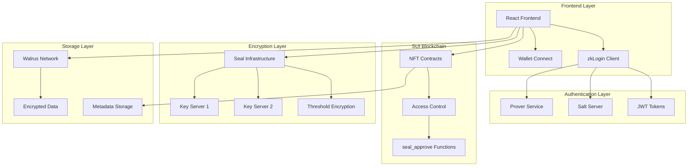

import { Card, CardHeader, CardTitle, CardDescription } from '@site/src/components/Card';
import { Callout } from '@site/src/components/Callout';
import { Features, Feature } from '@site/src/components/Features';
import { CollapsibleCodeBlock, InlineCodeCard } from '@site/src/components/CodeBlock';
import Tabs from '@theme/Tabs';
import TabItem from '@theme/TabItem';

# SUI Integration

Complete integration guide for SUI blockchain technologies in the NeuraLabs platform, including smart contracts, zkLogin authentication, Seal threshold encryption, and Walrus decentralized storage.

## Overview

The NeuraLabs platform leverages SUI's advanced blockchain technologies to create a secure, decentralized AI workflow platform. This integration encompasses multiple components working together to provide:

- **NFT-based access control** through smart contracts
- **Passwordless authentication** via zkLogin
- **Threshold encryption** using Seal
- **Decentralized storage** with Walrus
- **Zero-knowledge proofs** through custom prover service

## Integration Components

  <Card>
    <CardHeader>
      <CardTitle>
         zkLogin Authentication
      </CardTitle>
      <CardDescription>
        Zero-knowledge authentication with salt server and custom prover service
      </CardDescription>
    </CardHeader>
  </Card>

  <Card>
    <CardHeader>
      <CardTitle>
         Prover Service
      </CardTitle>
      <CardDescription>
        Custom prover service setup for testnet zkLogin functionality
      </CardDescription>
    </CardHeader>
  </Card>

  <Card>
    <CardHeader>
      <CardTitle>
         Smart Contracts
      </CardTitle>
      <CardDescription>
        NFT contracts with 6-level access control and Seal integration
      </CardDescription>
    </CardHeader>
  </Card>

  <Card>
    <CardHeader>
      <CardTitle>
         Seal Encryption
      </CardTitle>
      <CardDescription>
        Threshold encryption for secure data management and access control
      </CardDescription>
    </CardHeader>
  </Card>

  <Card>
    <CardHeader>
      <CardTitle>
         Walrus Storage
      </CardTitle>
      <CardDescription>
        Decentralized blob storage for encrypted AI workflow data
      </CardDescription>
    </CardHeader>
  </Card>

## Architecture Overview

## Implementation Sequence

Follow this recommended order for SUI integration:

### Phase 1: Foundation
1. **[zkLogin Setup](./authentication/zklogin)** - Configure authentication infrastructure
2. **[Prover Service](./authentication/prover-service)** - Deploy custom prover for testnet

### Phase 2: Core Integration
3. **[Smart Contracts](./smart-contracts/smart-contracts)** - Deploy NFT contracts with access control
4. **[Seal Integration](./encryption/seal)** - Configure threshold encryption

### Phase 3: Storage & Optimization
5. **[Walrus Integration](./storage/walrus)** - Set up decentralized storage

## Key Features

### 🔐 Six-Level Access Control
- **Level 1-3**: Basic usage, resale, and replication rights
- **Level 4+**: File decryption capabilities (minimum for Seal)
- **Level 5**: Data modification rights
- **Level 6**: Absolute ownership and admin controls

### 🔑 Threshold Encryption
- **1-of-2 threshold** for development and testing
- **2-of-3 threshold** recommended for production
- **Identity-based encryption** with automatic key derivation
- **Session key management** for seamless user experience

### 📡 Decentralized Storage
- **Content-addressed storage** on Walrus network
- **Encrypted blob management** with access control
- **Metadata storage** on SUI blockchain
- **Automatic redundancy** and data integrity

## Prerequisites

Before starting the SUI integration, ensure you have:

  <h3>Required Tools</h3>
  <ul>
    <li>SUI CLI installed and configured</li>
    <li>Node.js 18+ for frontend integration</li>
    <li>Python 3.12 for backend services</li>
    <li>Docker for prover service deployment</li>
    <li>Testnet SUI tokens for gas fees</li>
  </ul>

  <h3>Network Configuration</h3>
  <ul>
    <li>SUI Testnet access</li>
    <li>Walrus Testnet endpoints</li>
    <li>Mysten Labs Seal key servers</li>
    <li>OAuth provider credentials (Google, Facebook, etc.)</li>
  </ul>

## Security Considerations

  <h3>Important Security Notes</h3>
  <ul>
    <li><strong>Testnet Only</strong>: This guide is for testnet deployment. Production requires additional security measures.</li>
    <li><strong>Key Management</strong>: Never commit private keys or mnemonic phrases to version control.</li>
    <li><strong>Access Control</strong>: Verify access control logic thoroughly before deployment.</li>
    <li><strong>Gas Management</strong>: Set appropriate gas limits to prevent excessive fees.</li>
  </ul>

## Performance Expectations

| Operation | Expected Time | Throughput |
|-----------|---------------|------------|
| NFT Creation | < 2 seconds | 10-20 TPS |
| Access Grant/Revoke | < 1 second | 20-30 TPS |
| File Encryption | Variable | 10+ MB/s |
| File Decryption | Variable | 15+ MB/s |
| Walrus Upload | Variable | 5+ MB/s |

## Next Steps

1. **Start with [zkLogin Setup](./authentication/zklogin)** to configure authentication
2. **Deploy [Prover Service](./authentication/prover-service)** for testnet functionality
3. **Deploy [Smart Contracts](./smart-contracts/smart-contracts)** for core NFT functionality
4. **Configure [Seal](./encryption/seal)** for threshold encryption
5. **Integrate [Walrus](./storage/walrus)** for decentralized storage

## Support & Resources

- **SUI Documentation**: https://docs.sui.io/
- **Seal Documentation**: https://github.com/MystenLabs/seal
- **Walrus Documentation**: https://docs.walrus.space/
- **NeuraLabs GitHub**: https://github.com/neuralabs/neuralabs-sui
- **Discord Support**: https://discord.gg/neuralabs