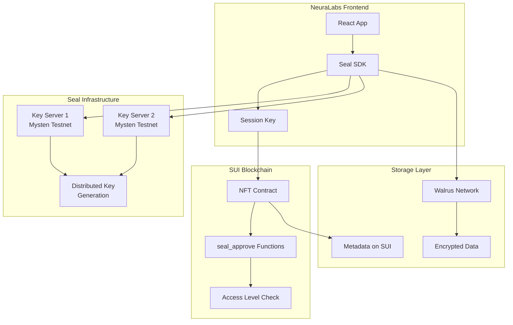

import { Card, CardHeader, CardTitle, CardDescription } from '@site/src/components/Card';

# Seal Threshold Encryption

Integrate SUI Seal for decentralized threshold encryption, enabling secure data management with distributed key generation and access control.

## Overview

Seal is a decentralized secrets management (DSM) service that uses threshold encryption to secure sensitive data. In the NeuraLabs platform, Seal enables secure storage of AI workflows on Walrus while maintaining fine-grained access control through NFT ownership levels.

<div className="card padding--md mt-4">
  <h3>Seal Key Features</h3>
  <ul>
    <li><strong>Threshold Encryption:</strong> t-out-of-n key servers for fault tolerance</li>
    <li><strong>Distributed Key Generation (DKG):</strong> No single point of failure</li>
    <li><strong>SUI-based Access Control:</strong> Leverages NFT ownership for permissions</li>
    <li><strong>Client-side Encryption:</strong> Data never exposed in plaintext to servers</li>
    <li><strong>Identity-based Keys:</strong> Automatic key derivation per workflow/user</li>
  </ul>
</div>

## Architecture



## Seal Key Servers

### Mysten Labs Key Servers

For testnet development, NeuraLabs uses Mysten Labs managed key servers:

<div className="grid grid-cols-1 md:grid-cols-2 gap-4 mt-4">
  <Card>
    <CardHeader>
      <CardTitle>
        
        Testnet Key Server 1
      </CardTitle>
      <CardDescription>
        URL: https://seal-key-server-testnet-1.mystenlabs.com<br/>
        Object ID: 0x1ee708e0d09c31593a60bee444f8f36a5a3ce66f1409a9dfb12eb11ab254b06b
      </CardDescription>
    </CardHeader>
  </Card>

  <Card>
    <CardHeader>
      <CardTitle>
        
        Testnet Key Server 2
      </CardTitle>
      <CardDescription>
        URL: https://seal-key-server-testnet-2.mystenlabs.com<br/>
        Object ID: 0x2ff809f1e1ad42604a71cff555f9f47b6b4df77g5109b0efc23fc22bc365c17c
      </CardDescription>
    </CardHeader>
  </Card>
</div>

### Threshold Configuration

<div className="card padding--md mt-4">
  <h3>Recommended Thresholds</h3>
  <ul>
    <li><strong>Development:</strong> 1-of-2 threshold for low latency testing</li>
    <li><strong>Staging:</strong> 2-of-2 threshold for reliability testing</li>
    <li><strong>Production:</strong> 2-of-3 or higher for maximum security</li>
  </ul>
</div>

## Installation and Setup

### 1. Install Seal SDK

```bash
# Frontend dependencies
npm install @mysten/seal @mysten/sui.js

# Backend dependencies (if needed)
pip install sui-python-sdk
```

### 2. Environment Configuration

```bash
# .env configuration
REACT_APP_SEAL_NETWORK=testnet
REACT_APP_SEAL_KEY_SERVER_1=0x1ee708e0d09c31593a60bee444f8f36a5a3ce66f1409a9dfb12eb11ab254b06b
REACT_APP_SEAL_KEY_SERVER_2=0x2ff809f1e1ad42604a71cff555f9f47b6b4df77g5109b0efc23fc22bc365c17c
REACT_APP_SEAL_THRESHOLD=1
REACT_APP_PACKAGE_ID=0x926de4be791b165822a8a213540c0606bb0d52450e5f8b6531097d9cd2c4dc64
```

## Implementation

### 1. Seal Client Setup

```typescript
// sealClient.ts
import { SealClient } from '@mysten/seal';
import { SuiClient, getFullnodeUrl } from '@mysten/sui.js/client';

export class NeuraLabsSealClient {
  private sealClient: SealClient;
  private suiClient: SuiClient;
  
  constructor() {
    this.suiClient = new SuiClient({ 
      url: getFullnodeUrl('testnet') 
    });
    
    const keyServerIds = [
      process.env.REACT_APP_SEAL_KEY_SERVER_1!,
      process.env.REACT_APP_SEAL_KEY_SERVER_2!,
    ];
    
    this.sealClient = new SealClient({
      suiClient: this.suiClient,
      serverObjectIds: keyServerIds,
      verifyKeyServers: false, // Set to true for production
    });
  }
  
  async encryptWorkflow(
    workflowId: string,
    data: Uint8Array,
    threshold: number = 1
  ) {
    const packageId = process.env.REACT_APP_PACKAGE_ID!;
    
    try {
      const { encryptedObject, key: backupKey } = await this.sealClient.encrypt({
        threshold,
        packageId: fromHEX(packageId),
        id: fromHEX(workflowId),
        data,
      });
      
      return {
        encryptedData: encryptedObject,
        backupKey, // Store securely for disaster recovery
        success: true,
      };
    } catch (error) {
      console.error('Encryption failed:', error);
      return { success: false, error };
    }
  }
  
  async decryptWorkflow(
    encryptedData: Uint8Array,
    sessionKey: SessionKey,
    workflowId: string
  ) {
    const packageId = process.env.REACT_APP_PACKAGE_ID!;
    
    try {
      // Create transaction for seal_approve
      const tx = new Transaction();
      tx.moveCall({
        target: `${packageId}::nft::seal_approve`,
        arguments: [
          tx.pure.vector("u8", fromHEX(workflowId)),
          // Additional arguments based on your contract
        ],
      });
      
      const txBytes = tx.build({ 
        client: this.suiClient, 
        onlyTransactionKind: true 
      });
      
      const decryptedData = await this.sealClient.decrypt({
        data: encryptedData,
        sessionKey,
        txBytes,
      });
      
      return {
        decryptedData,
        success: true,
      };
    } catch (error) {
      console.error('Decryption failed:', error);
      return { success: false, error };
    }
  }
}
```

### 2. Session Key Management

```typescript
// sessionManager.ts
import { SessionKey } from '@mysten/seal';
import { fromHEX } from '@mysten/sui.js/utils';

export class SessionManager {
  private sessionKey: SessionKey | null = null;
  
  async createSession(
    userAddress: string,
    packageId: string,
    signer: any,
    ttlMinutes: number = 10
  ) {
    try {
      this.sessionKey = new SessionKey({
        address: userAddress,
        packageId: fromHEX(packageId),
        ttlMin: ttlMinutes,
      });
      
      const message = this.sessionKey.getPersonalMessage();
      const { signature } = await signer.signPersonalMessage(message);
      
      this.sessionKey.setPersonalMessageSignature(signature);
      
      // Optionally store in IndexedDB for cross-tab persistence
      this.storeSession();
      
      return { success: true, sessionKey: this.sessionKey };
    } catch (error) {
      console.error('Session creation failed:', error);
      return { success: false, error };
    }
  }
  
  getSession(): SessionKey | null {
    if (!this.sessionKey) {
      this.loadSession();
    }
    return this.sessionKey;
  }
  
  private storeSession() {
    if (this.sessionKey) {
      const exportedSession = this.sessionKey.export();
      localStorage.setItem('seal_session', JSON.stringify(exportedSession));
    }
  }
  
  private loadSession() {
    const stored = localStorage.getItem('seal_session');
    if (stored) {
      try {
        const sessionData = JSON.parse(stored);
        this.sessionKey = SessionKey.import(sessionData);
      } catch (error) {
        console.error('Failed to load session:', error);
        this.clearSession();
      }
    }
  }
  
  clearSession() {
    this.sessionKey = null;
    localStorage.removeItem('seal_session');
  }
}
```

### 3. Smart Contract Integration

The smart contract must implement `seal_approve` functions for access control:

```move
// In nft.move
entry fun seal_approve(
    id: vector<u8>,
    nft: &NFT,
    ctx: &TxContext
) {
    let caller = tx_context::sender(ctx);
    let nft_id = object::id(nft);
    
    // Check if caller has required access level (4 or above for decryption)
    let access_level = access::get_user_access_level(caller, nft_id);
    assert!(access_level >= 4, EInsufficientAccess);
    
    // Additional validation logic
    let nft_owner = nft::get_owner(nft);
    assert!(caller == nft_owner || access_level >= 4, EUnauthorized);
    
    // Function succeeds if all checks pass
    // Seal key servers will use this to validate access
}

// Alternative seal_approve with additional parameters
entry fun seal_approve_with_params(
    id: vector<u8>,
    nft: &NFT,
    required_level: u8,
    ctx: &TxContext
) {
    let caller = tx_context::sender(ctx);
    let access_level = access::get_user_access_level(caller, object::id(nft));
    
    assert!(access_level >= required_level, EInsufficientAccess);
    
    // Additional business logic
}
```

### 4. React Hook Integration

```typescript
// useSealEncryption.ts
import { useState, useCallback } from 'react';
import { useWallet } from '@mysten/wallet-kit';
import { NeuraLabsSealClient } from './sealClient';
import { SessionManager } from './sessionManager';

export const useSealEncryption = () => {
  const { currentWallet } = useWallet();
  const [sealClient] = useState(() => new NeuraLabsSealClient());
  const [sessionManager] = useState(() => new SessionManager());
  const [isLoading, setIsLoading] = useState(false);
  
  const createSession = useCallback(async () => {
    if (!currentWallet) return { success: false, error: 'No wallet connected' };
    
    setIsLoading(true);
    try {
      const result = await sessionManager.createSession(
        currentWallet.address,
        process.env.REACT_APP_PACKAGE_ID!,
        currentWallet.signer,
        10 // 10 minutes TTL
      );
      
      return result;
    } finally {
      setIsLoading(false);
    }
  }, [currentWallet, sessionManager]);
  
  const encryptData = useCallback(async (
    workflowId: string,
    data: Uint8Array,
    threshold: number = 1
  ) => {
    setIsLoading(true);
    try {
      const result = await sealClient.encryptWorkflow(workflowId, data, threshold);
      return result;
    } finally {
      setIsLoading(false);
    }
  }, [sealClient]);
  
  const decryptData = useCallback(async (
    encryptedData: Uint8Array,
    workflowId: string
  ) => {
    const session = sessionManager.getSession();
    if (!session) {
      return { success: false, error: 'No active session' };
    }
    
    setIsLoading(true);
    try {
      const result = await sealClient.decryptWorkflow(
        encryptedData,
        session,
        workflowId
      );
      return result;
    } finally {
      setIsLoading(false);
    }
  }, [sealClient, sessionManager]);
  
  return {
    createSession,
    encryptData,
    decryptData,
    isLoading,
    clearSession: () => sessionManager.clearSession(),
  };
};
```

## Encryption Workflow

### 1. Encrypting AI Workflow Data

```typescript
// Example: Encrypting a complete AI workflow
const encryptWorkflow = async (workflow: AIWorkflow) => {
  const { encryptData } = useSealEncryption();
  
  // Prepare workflow data
  const workflowData = {
    model: workflow.model,
    config: workflow.config,
    dependencies: workflow.dependencies,
    metadata: workflow.metadata,
  };
  
  // Serialize to bytes
  const data = new TextEncoder().encode(JSON.stringify(workflowData));
  
  // Encrypt with Seal
  const result = await encryptData(
    workflow.id,
    data,
    1 // 1-of-2 threshold for testing
  );
  
  if (result.success) {
    // Store encrypted data on Walrus
    const blobId = await storeOnWalrus(result.encryptedData);
    
    // Store metadata on blockchain
    await storeMetadataOnChain({
      workflowId: workflow.id,
      blobId,
      encryptionInfo: {
        threshold: 1,
        keyServers: 2,
        backupKey: result.backupKey, // Store securely
      },
    });
    
    return { success: true, blobId };
  }
  
  return result;
};
```

### 2. Decrypting AI Workflow Data

```typescript
// Example: Decrypting AI workflow data
const decryptWorkflow = async (workflowId: string) => {
  const { decryptData, createSession } = useSealEncryption();
  
  // Ensure we have an active session
  const sessionResult = await createSession();
  if (!sessionResult.success) {
    return sessionResult;
  }
  
  try {
    // Get metadata from blockchain
    const metadata = await getWorkflowMetadata(workflowId);
    
    // Fetch encrypted data from Walrus
    const encryptedData = await fetchFromWalrus(metadata.blobId);
    
    // Decrypt with Seal
    const result = await decryptData(encryptedData, workflowId);
    
    if (result.success) {
      // Parse decrypted data
      const workflowData = JSON.parse(
        new TextDecoder().decode(result.decryptedData)
      );
      
      return { success: true, workflow: workflowData };
    }
    
    return result;
  } catch (error) {
    return { success: false, error };
  }
};
```

## Access Control Integration

### 1. NFT-Based Access Levels

```typescript
// Access level checking
const checkDecryptionAccess = async (
  userAddress: string,
  nftId: string
): Promise<boolean> => {
  const accessLevel = await getUserAccessLevel(userAddress, nftId);
  
  // Level 4 or above required for decryption
  return accessLevel >= 4;
};

// Access level constants
export const ACCESS_LEVELS = {
  USE_MODEL: 1,
  RESALE: 2,
  CREATE_REPLICA: 3,
  VIEW_DOWNLOAD: 4, // Minimum for Seal decryption
  EDIT_DATA: 5,
  ABSOLUTE_OWNERSHIP: 6,
} as const;
```

### 2. Conditional Encryption

```typescript
// Encrypt only if user has sufficient access
const conditionalEncrypt = async (
  workflowId: string,
  data: Uint8Array,
  userAddress: string,
  nftId: string
) => {
  // Check access level first
  const hasAccess = await checkDecryptionAccess(userAddress, nftId);
  
  if (!hasAccess) {
    return { 
      success: false, 
      error: 'Insufficient access level for encryption' 
    };
  }
  
  // Proceed with encryption
  return await encryptData(workflowId, data);
};
```

## Performance Optimization

### 1. Key Caching

```typescript
// Cache decryption keys for better performance
class SealKeyCache {
  private cache = new Map<string, any>();
  private ttl = 5 * 60 * 1000; // 5 minutes
  
  async getKey(id: string, fetchFn: () => Promise<any>) {
    const cached = this.cache.get(id);
    if (cached && Date.now() - cached.timestamp < this.ttl) {
      return cached.key;
    }
    
    const key = await fetchFn();
    this.cache.set(id, { key, timestamp: Date.now() });
    return key;
  }
  
  clear() {
    this.cache.clear();
  }
}
```

### 2. Batch Operations

```typescript
// Batch key fetching for multiple workflows
const batchFetchKeys = async (workflowIds: string[]) => {
  const { sealClient } = useSealEncryption();
  
  // Create multi-command transaction
  const tx = new Transaction();
  
  workflowIds.forEach(id => {
    tx.moveCall({
      target: `${packageId}::nft::seal_approve`,
      arguments: [tx.pure.vector("u8", fromHEX(id))],
    });
  });
  
  const txBytes = tx.build({ 
    client: suiClient, 
    onlyTransactionKind: true 
  });
  
  // Fetch all keys in one request
  return await sealClient.fetchKeys({
    ids: workflowIds,
    txBytes,
    sessionKey: session,
    threshold: 1,
  });
};
```

## Testing and Validation

### 1. Unit Tests

```typescript
// seal.test.ts
import { describe, it, expect } from 'vitest';
import { NeuraLabsSealClient } from './sealClient';

describe('Seal Integration', () => {
  it('should encrypt and decrypt data successfully', async () => {
    const sealClient = new NeuraLabsSealClient();
    const testData = new TextEncoder().encode('test workflow data');
    
    // Encrypt
    const encrypted = await sealClient.encryptWorkflow(
      'test-workflow-id',
      testData,
      1
    );
    
    expect(encrypted.success).toBe(true);
    expect(encrypted.encryptedData).toBeDefined();
    
    // Decrypt (requires session setup)
    // ... decryption test
  });
  
  it('should validate access levels correctly', async () => {
    // Test access level validation
    const hasAccess = await checkDecryptionAccess(
      'test-address',
      'test-nft-id'
    );
    
    expect(typeof hasAccess).toBe('boolean');
  });
});
```

### 2. Integration Tests

```bash
# Run comprehensive Seal integration tests
npm test seal-integration

# Test different threshold configurations
npm run test:seal-thresholds

# Performance testing
npm run test:seal-performance
```

## Troubleshooting

### Common Issues

<div className="card padding--md mt-4">
  <h3>Common Seal Issues</h3>
  
  **Key Server Timeout**
  ```bash
  # Increase timeout in configuration
  REACT_APP_SEAL_TIMEOUT=30000
  ```
  
  **Access Denied Errors**
  ```typescript
  // Verify access level and session validity
  const accessLevel = await getUserAccessLevel(userAddress, nftId);
  console.log('Access level:', accessLevel); // Should be >= 4
  ```
  
  **Session Expiry**
  ```typescript
  // Check and refresh session
  if (sessionExpired) {
    await createSession();
  }
  ```
</div>

## Security Considerations

<div className="card padding--md mt-4" style={{ borderLeft: '4px solid #ff6b6b' }}>
  <h3>Security Best Practices</h3>
  <ul>
    <li><strong>Session Management:</strong> Use appropriate TTL and secure storage</li>
    <li><strong>Key Servers:</strong> Verify key server authenticity in production</li>
    <li><strong>Backup Keys:</strong> Store backup keys securely for disaster recovery</li>
    <li><strong>Access Control:</strong> Always validate access levels before operations</li>
    <li><strong>Threshold Selection:</strong> Use higher thresholds for production</li>
  </ul>
</div>

## Concrete Implementation Patterns

### 1. Allowlist Pattern

The allowlist pattern provides simple access control where a list of addresses can access encrypted data.

<div className="grid grid-cols-1 lg:grid-cols-2 gap-4 mt-4">
  <Card>
    <CardHeader>
      <CardTitle>
        <span style={{ display: 'flex', alignItems: 'center' }}>
          
          Allowlist Smart Contract
        </span>
      </CardTitle>
      <CardDescription>
        Core allowlist contract implementation with admin capabilities
      </CardDescription>
    </CardHeader>
  </Card>

  <Card>
    <CardHeader>
      <CardTitle>
        <span style={{ display: 'flex', alignItems: 'center' }}>
          
          React Frontend Integration
        </span>
      </CardTitle>
      <CardDescription>
        TypeScript components for allowlist management and access control
      </CardDescription>
    </CardHeader>
  </Card>
</div>

```move
// allowlist.move - Core allowlist contract
module walrus::allowlist {
    use std::string::String;
    use sui::dynamic_field as df;
    use walrus::utils::is_prefix;

    const EInvalidCap: u64 = 0;
    const ENoAccess: u64 = 1;
    const EDuplicate: u64 = 2;
    const MARKER: u64 = 3;

    /// Main allowlist structure
    public struct Allowlist has key {
        id: UID,
        name: String,
        list: vector<address>,
    }

    /// Admin capability for managing the allowlist
    public struct Cap has key {
        id: UID,
        allowlist_id: ID,
    }

    /// Create an allowlist with admin capability
    public fun create_allowlist(name: String, ctx: &mut TxContext): Cap {
        let allowlist = Allowlist {
            id: object::new(ctx),
            list: vector::empty(),
            name: name,
        };
        let cap = Cap {
            id: object::new(ctx),
            allowlist_id: object::id(&allowlist),
        };
        transfer::share_object(allowlist);
        cap
    }

    /// Add address to allowlist (admin only)
    public fun add(allowlist: &mut Allowlist, cap: &Cap, account: address) {
        assert!(cap.allowlist_id == object::id(allowlist), EInvalidCap);
        assert!(!allowlist.list.contains(&account), EDuplicate);
        allowlist.list.push_back(account);
    }

    /// Remove address from allowlist (admin only)
    public fun remove(allowlist: &mut Allowlist, cap: &Cap, account: address) {
        assert!(cap.allowlist_id == object::id(allowlist), EInvalidCap);
        allowlist.list = allowlist.list.filter!(|x| x != account);
    }

    /// Seal approval function - validates access
    entry fun seal_approve(id: vector<u8>, allowlist: &Allowlist, ctx: &TxContext) {
        let caller = ctx.sender();
        let namespace = allowlist.id.to_bytes();
        
        // Check if the id has the right prefix
        assert!(is_prefix(namespace, id), ENoAccess);
        
        // Check if user is in the allowlist
        assert!(allowlist.list.contains(&caller), ENoAccess);
    }

    /// Publish encrypted blob to allowlist
    public fun publish(allowlist: &mut Allowlist, cap: &Cap, blob_id: String) {
        assert!(cap.allowlist_id == object::id(allowlist), EInvalidCap);
        df::add(&mut allowlist.id, blob_id, MARKER);
    }
}
```

```typescript
// AllowlistManager.tsx - React component for managing allowlists
import React, { useState, useEffect } from 'react';
import { useCurrentAccount, useSignAndExecuteTransaction, useSuiClient } from '@mysten/dapp-kit';
import { Transaction } from '@mysten/sui/transactions';
import { isValidSuiAddress } from '@mysten/sui/utils';

interface Allowlist {
  id: string;
  name: string;
  list: string[];
}

interface AllowlistManagerProps {
  packageId: string;
  allowlistId: string;
}

export function AllowlistManager({ packageId, allowlistId }: AllowlistManagerProps) {
  const suiClient = useSuiClient();
  const currentAccount = useCurrentAccount();
  const [allowlist, setAllowlist] = useState<Allowlist>();
  const [capId, setCapId] = useState<string>();
  const [newAddress, setNewAddress] = useState('');
  
  const { mutate: signAndExecute } = useSignAndExecuteTransaction();

  useEffect(() => {
    loadAllowlist();
    const interval = setInterval(loadAllowlist, 3000);
    return () => clearInterval(interval);
  }, [allowlistId, currentAccount?.address]);

  async function loadAllowlist() {
    if (!currentAccount?.address) return;

    try {
      // Load admin capabilities
      const caps = await suiClient.getOwnedObjects({
        owner: currentAccount.address,
        filter: { StructType: `${packageId}::allowlist::Cap` },
        options: { showContent: true }
      });

      const relevantCap = caps.data.find(obj => {
        const fields = (obj.data?.content as any)?.fields;
        return fields?.allowlist_id === allowlistId;
      });

      if (relevantCap) {
        setCapId((relevantCap.data?.content as any)?.fields?.id?.id);
      }

      // Load allowlist data
      const allowlistObj = await suiClient.getObject({
        id: allowlistId,
        options: { showContent: true }
      });

      const fields = (allowlistObj.data?.content as any)?.fields;
      if (fields) {
        setAllowlist({
          id: allowlistId,
          name: fields.name,
          list: fields.list || []
        });
      }
    } catch (error) {
      console.error('Failed to load allowlist:', error);
    }
  }

  const addToAllowlist = async () => {
    if (!newAddress.trim() || !capId || !isValidSuiAddress(newAddress.trim())) {
      alert('Invalid address');
      return;
    }

    const tx = new Transaction();
    tx.moveCall({
      target: `${packageId}::allowlist::add`,
      arguments: [
        tx.object(allowlistId),
        tx.object(capId),
        tx.pure.address(newAddress.trim())
      ]
    });
    tx.setGasBudget(10000000);

    signAndExecute({
      transaction: tx
    }, {
      onSuccess: () => {
        setNewAddress('');
        loadAllowlist();
      }
    });
  };

  const removeFromAllowlist = async (address: string) => {
    if (!capId) return;

    const tx = new Transaction();
    tx.moveCall({
      target: `${packageId}::allowlist::remove`,
      arguments: [
        tx.object(allowlistId),
        tx.object(capId),
        tx.pure.address(address)
      ]
    });
    tx.setGasBudget(10000000);

    signAndExecute({
      transaction: tx
    }, {
      onSuccess: () => loadAllowlist()
    });
  };

  return (
    <div className="allowlist-manager">
      <h2>Allowlist: {allowlist?.name}</h2>
      
      {capId && (
        <div className="admin-section">
          <h3>Add New Member</h3>
          <div className="add-member">
            <input
              type="text"
              placeholder="Enter SUI address"
              value={newAddress}
              onChange={(e) => setNewAddress(e.target.value)}
            />
            <button onClick={addToAllowlist}>Add</button>
          </div>
        </div>
      )}

      <div className="members-list">
        <h3>Current Members ({allowlist?.list?.length || 0})</h3>
        {allowlist?.list?.map((address, index) => (
          <div key={index} className="member-item">
            <span>{address}</span>
            {capId && (
              <button onClick={() => removeFromAllowlist(address)}>
                Remove
              </button>
            )}
          </div>
        ))}
      </div>
    </div>
  );
}
```

### 2. Subscription Pattern

The subscription pattern enables time-limited access with payment requirements.

<div className="grid grid-cols-1 lg:grid-cols-2 gap-4 mt-4">
  <Card>
    <CardHeader>
      <CardTitle>
        <span style={{ display: 'flex', alignItems: 'center' }}>
          
          Subscription Service Contract
        </span>
      </CardTitle>
      <CardDescription>
        Time-based subscription service with SUI payment integration
      </CardDescription>
    </CardHeader>
  </Card>

  <Card>
    <CardHeader>
      <CardTitle>
        <span style={{ display: 'flex', alignItems: 'center' }}>
          
          Subscription Management UI
        </span>
      </CardTitle>
      <CardDescription>
        Frontend components for subscription creation and payment processing
      </CardDescription>
    </CardHeader>
  </Card>
</div>

```move
// subscription.move - Time-limited subscription service
module walrus::subscription {
    use std::string::String;
    use sui::{clock::Clock, coin::Coin, dynamic_field as df, sui::SUI};
    use walrus::utils::is_prefix;

    const EInvalidCap: u64 = 0;
    const EInvalidFee: u64 = 1;
    const ENoAccess: u64 = 2;
    const MARKER: u64 = 3;

    /// Subscription service definition
    public struct Service has key {
        id: UID,
        fee: u64,           // Cost in MIST
        ttl: u64,           // Time-to-live in milliseconds
        owner: address,     // Service owner (receives payments)
        name: String,
    }

    /// Individual subscription instance
    public struct Subscription has key {
        id: UID,
        service_id: ID,
        created_at: u64,    // Timestamp when subscription was created
    }

    /// Admin capability for service management
    public struct Cap has key {
        id: UID,
        service_id: ID,
    }

    /// Create a new subscription service
    public fun create_service(fee: u64, ttl: u64, name: String, ctx: &mut TxContext): Cap {
        let service = Service {
            id: object::new(ctx),
            fee,
            ttl,
            owner: ctx.sender(),
            name,
        };
        let cap = Cap {
            id: object::new(ctx),
            service_id: object::id(&service),
        };
        transfer::share_object(service);
        cap
    }

    /// Subscribe to a service (requires payment)
    public fun subscribe(
        fee: Coin<SUI>,
        service: &Service,
        c: &Clock,
        ctx: &mut TxContext,
    ): Subscription {
        assert!(fee.value() == service.fee, EInvalidFee);
        transfer::public_transfer(fee, service.owner);
        
        Subscription {
            id: object::new(ctx),
            service_id: object::id(service),
            created_at: c.timestamp_ms(),
        }
    }

    /// Seal approval function - validates subscription and time limits
    entry fun seal_approve(
        id: vector<u8>, 
        sub: &Subscription, 
        service: &Service, 
        c: &Clock
    ) {
        // Verify subscription belongs to service
        assert!(object::id(service) == sub.service_id, ENoAccess);
        
        // Check if subscription hasn't expired
        assert!(c.timestamp_ms() <= sub.created_at + service.ttl, ENoAccess);
        
        // Check if the id has the right prefix
        assert!(is_prefix(service.id.to_bytes(), id), ENoAccess);
    }

    /// Publish encrypted content to service (admin only)
    public fun publish(service: &mut Service, cap: &Cap, blob_id: String) {
        assert!(cap.service_id == object::id(service), EInvalidCap);
        df::add(&mut service.id, blob_id, MARKER);
    }

    /// Transfer subscription to another user
    public fun transfer(sub: Subscription, to: address) {
        transfer::transfer(sub, to);
    }
}
```

```typescript
// SubscriptionManager.tsx - React component for subscription services
import React, { useState, useEffect } from 'react';
import { useCurrentAccount, useSignAndExecuteTransaction, useSuiClient } from '@mysten/dapp-kit';
import { Transaction } from '@mysten/sui/transactions';
import { SUI_CLOCK_OBJECT_ID } from '@mysten/sui/utils';

interface Service {
  id: string;
  fee: number;
  ttl: number;
  owner: string;
  name: string;
}

interface Subscription {
  id: string;
  service_id: string;
  created_at: number;
  expires_at: number;
  is_active: boolean;
}

interface SubscriptionManagerProps {
  packageId: string;
  serviceId: string;
}

export function SubscriptionManager({ packageId, serviceId }: SubscriptionManagerProps) {
  const suiClient = useSuiClient();
  const currentAccount = useCurrentAccount();
  const [service, setService] = useState<Service>();
  const [userSubscriptions, setUserSubscriptions] = useState<Subscription[]>([]);
  const [isSubscribing, setIsSubscribing] = useState(false);
  
  const { mutate: signAndExecute } = useSignAndExecuteTransaction();

  useEffect(() => {
    loadServiceData();
    loadUserSubscriptions();
    const interval = setInterval(() => {
      loadServiceData();
      loadUserSubscriptions();
    }, 5000);
    return () => clearInterval(interval);
  }, [serviceId, currentAccount?.address]);

  async function loadServiceData() {
    try {
      const serviceObj = await suiClient.getObject({
        id: serviceId,
        options: { showContent: true }
      });

      const fields = (serviceObj.data?.content as any)?.fields;
      if (fields) {
        setService({
          id: serviceId,
          fee: parseInt(fields.fee),
          ttl: parseInt(fields.ttl),
          owner: fields.owner,
          name: fields.name
        });
      }
    } catch (error) {
      console.error('Failed to load service:', error);
    }
  }

  async function loadUserSubscriptions() {
    if (!currentAccount?.address) return;

    try {
      const subs = await suiClient.getOwnedObjects({
        owner: currentAccount.address,
        filter: { StructType: `${packageId}::subscription::Subscription` },
        options: { showContent: true }
      });

      const currentTime = Date.now();
      const subscriptions: Subscription[] = subs.data
        .map(obj => {
          const fields = (obj.data?.content as any)?.fields;
          if (!fields || fields.service_id !== serviceId) return null;
          
          const createdAt = parseInt(fields.created_at);
          const expiresAt = createdAt + (service?.ttl || 0);
          
          return {
            id: fields.id.id,
            service_id: fields.service_id,
            created_at: createdAt,
            expires_at: expiresAt,
            is_active: currentTime < expiresAt
          };
        })
        .filter(Boolean) as Subscription[];

      setUserSubscriptions(subscriptions);
    } catch (error) {
      console.error('Failed to load subscriptions:', error);
    }
  }

  const subscribeToService = async () => {
    if (!service || !currentAccount?.address) return;

    setIsSubscribing(true);
    try {
      const tx = new Transaction();
      
      // Split coin for exact payment
      const [coin] = tx.splitCoins(tx.gas, [service.fee]);
      
      // Subscribe to service
      tx.moveCall({
        target: `${packageId}::subscription::subscribe`,
        arguments: [
          coin,
          tx.object(serviceId),
          tx.object(SUI_CLOCK_OBJECT_ID)
        ]
      });
      
      tx.setGasBudget(20000000);

      signAndExecute({
        transaction: tx
      }, {
        onSuccess: () => {
          loadUserSubscriptions();
          setIsSubscribing(false);
        },
        onError: () => {
          setIsSubscribing(false);
        }
      });
    } catch (error) {
      console.error('Subscription failed:', error);
      setIsSubscribing(false);
    }
  };

  const formatDuration = (ms: number) => {
    const minutes = Math.floor(ms / 60000);
    const hours = Math.floor(minutes / 60);
    const days = Math.floor(hours / 24);
    
    if (days > 0) return `${days} day(s)`;
    if (hours > 0) return `${hours} hour(s)`;
    return `${minutes} minute(s)`;
  };

  const formatTimeRemaining = (expiresAt: number) => {
    const remaining = expiresAt - Date.now();
    if (remaining <= 0) return 'Expired';
    return formatDuration(remaining);
  };

  const activeSubscription = userSubscriptions.find(sub => sub.is_active);

  return (
    <div className="subscription-manager">
      <div className="service-info">
        <h2>{service?.name}</h2>
        <div className="service-details">
          <p><strong>Duration:</strong> {service ? formatDuration(service.ttl) : 'Loading...'}</p>
          <p><strong>Fee:</strong> {service?.fee} MIST</p>
          <p><strong>Owner:</strong> {service?.owner}</p>
        </div>
      </div>

      {activeSubscription ? (
        <div className="active-subscription">
          <h3>✅ Active Subscription</h3>
          <p><strong>Expires in:</strong> {formatTimeRemaining(activeSubscription.expires_at)}</p>
          <p><strong>Subscription ID:</strong> {activeSubscription.id}</p>
          <div className="access-status">
            🔓 You have access to encrypted content
          </div>
        </div>
      ) : (
        <div className="subscribe-section">
          <h3>Subscribe to Access Content</h3>
          <button 
            onClick={subscribeToService}
            disabled={isSubscribing || !service}
            className="subscribe-button"
          >
            {isSubscribing ? 'Subscribing...' : `Subscribe (${service?.fee} MIST)`}
          </button>
        </div>
      )}

      {userSubscriptions.length > 0 && (
        <div className="subscription-history">
          <h3>Subscription History</h3>
          {userSubscriptions.map(sub => (
            <div key={sub.id} className={`subscription-item ${sub.is_active ? 'active' : 'expired'}`}>
              <p><strong>ID:</strong> {sub.id.slice(0, 8)}...</p>
              <p><strong>Created:</strong> {new Date(sub.created_at).toLocaleString()}</p>
              <p><strong>Status:</strong> {sub.is_active ? '🟢 Active' : '🔴 Expired'}</p>
              {sub.is_active && (
                <p><strong>Expires:</strong> {formatTimeRemaining(sub.expires_at)}</p>
              )}
            </div>
          ))}
        </div>
      )}
    </div>
  );
}
```

### 3. Integration with NeuraLabs Workflows

```typescript
// SealPatternIntegration.tsx - Integrating patterns with NeuraLabs
import React, { useState } from 'react';
import { useSealEncryption } from '../hooks/useSealEncryption';
import { AllowlistManager } from './AllowlistManager';
import { SubscriptionManager } from './SubscriptionManager';

interface WorkflowAccessControlProps {
  workflowId: string;
  accessPattern: 'allowlist' | 'subscription' | 'nft';
  patternConfig: {
    allowlistId?: string;
    serviceId?: string;
    nftId?: string;
  };
}

export function WorkflowAccessControl({ 
  workflowId, 
  accessPattern, 
  patternConfig 
}: WorkflowAccessControlProps) {
  const { encryptData, decryptData, createSession } = useSealEncryption();
  const [isProcessing, setIsProcessing] = useState(false);

  const encryptWorkflowWithPattern = async (workflowData: any) => {
    setIsProcessing(true);
    try {
      // Create session for encryption
      const sessionResult = await createSession();
      if (!sessionResult.success) {
        throw new Error('Failed to create session');
      }

      // Serialize workflow data
      const data = new TextEncoder().encode(JSON.stringify(workflowData));
      
      // Encrypt with appropriate pattern-based ID
      let encryptionId: string;
      switch (accessPattern) {
        case 'allowlist':
          encryptionId = `${patternConfig.allowlistId}-${workflowId}`;
          break;
        case 'subscription':
          encryptionId = `${patternConfig.serviceId}-${workflowId}`;
          break;
        case 'nft':
          encryptionId = `${patternConfig.nftId}-${workflowId}`;
          break;
        default:
          encryptionId = workflowId;
      }

      const result = await encryptData(encryptionId, data, 1);
      return result;
    } finally {
      setIsProcessing(false);
    }
  };

  const decryptWorkflowWithPattern = async () => {
    setIsProcessing(true);
    try {
      // Fetch encrypted data from storage
      const encryptedData = await fetchWorkflowData(workflowId);
      
      // Construct pattern-based ID
      let decryptionId: string;
      switch (accessPattern) {
        case 'allowlist':
          decryptionId = `${patternConfig.allowlistId}-${workflowId}`;
          break;
        case 'subscription':
          decryptionId = `${patternConfig.serviceId}-${workflowId}`;
          break;
        case 'nft':
          decryptionId = `${patternConfig.nftId}-${workflowId}`;
          break;
        default:
          decryptionId = workflowId;
      }

      const result = await decryptData(encryptedData, decryptionId);
      
      if (result.success) {
        const workflowData = JSON.parse(
          new TextDecoder().decode(result.decryptedData!)
        );
        return { success: true, workflowData };
      }
      
      return result;
    } finally {
      setIsProcessing(false);
    }
  };

  const renderPatternManager = () => {
    const packageId = process.env.REACT_APP_PACKAGE_ID!;
    
    switch (accessPattern) {
      case 'allowlist':
        return (
          <AllowlistManager 
            packageId={packageId}
            allowlistId={patternConfig.allowlistId!}
          />
        );
      case 'subscription':
        return (
          <SubscriptionManager 
            packageId={packageId}
            serviceId={patternConfig.serviceId!}
          />
        );
      case 'nft':
        return (
          <div className="nft-access">
            <h3>NFT-Based Access Control</h3>
            <p>Access controlled by NFT: {patternConfig.nftId}</p>
            <p>Requires VIEW_DOWNLOAD level (4) or higher</p>
          </div>
        );
      default:
        return null;
    }
  };

  return (
    <div className="workflow-access-control">
      <div className="pattern-header">
        <h2>Access Control Pattern: {accessPattern.toUpperCase()}</h2>
        <div className="workflow-info">
          <p><strong>Workflow ID:</strong> {workflowId}</p>
          <p><strong>Pattern:</strong> {accessPattern}</p>
        </div>
      </div>

      <div className="pattern-manager">
        {renderPatternManager()}
      </div>

      <div className="encryption-controls">
        <h3>Encryption Controls</h3>
        <div className="button-group">
          <button 
            onClick={() => encryptWorkflowWithPattern({ /* workflow data */ })}
            disabled={isProcessing}
          >
            {isProcessing ? 'Encrypting...' : 'Encrypt Workflow'}
          </button>
          
          <button 
            onClick={decryptWorkflowWithPattern}
            disabled={isProcessing}
          >
            {isProcessing ? 'Decrypting...' : 'Decrypt Workflow'}
          </button>
        </div>
      </div>
    </div>
  );
}

// Helper function to fetch workflow data
async function fetchWorkflowData(workflowId: string): Promise<Uint8Array> {
  // Implementation would fetch from Walrus or other storage
  // This is a placeholder
  const response = await fetch(`/api/workflows/${workflowId}/encrypted`);
  const arrayBuffer = await response.arrayBuffer();
  return new Uint8Array(arrayBuffer);
}
```

## Next Steps

1. **Complete [Walrus Integration](./walrus)** for decentralized storage
2. **Test end-to-end encryption/decryption flows**
3. **Configure production key servers** (if needed)
4. **Implement comprehensive monitoring**
5. **Plan disaster recovery procedures**
6. **Deploy and test allowlist and subscription patterns**

## Testing Seal Patterns

### 1. Allowlist Pattern Tests

```bash
# Test allowlist creation and management
npm run test:seal-allowlist

# Test access control validation
npm run test:allowlist-access
```

### 2. Subscription Pattern Tests

```bash
# Test subscription service creation
npm run test:seal-subscription

# Test payment and time-based access
npm run test:subscription-payment

# Test subscription expiry
npm run test:subscription-expiry
```

### 3. Integration Tests

```bash
# Test end-to-end encryption/decryption with patterns
npm run test:seal-integration

# Test pattern switching
npm run test:pattern-migration
```

## References

- [Seal Documentation](https://github.com/MystenLabs/seal)
- [Seal TypeScript SDK](https://www.npmjs.com/package/@mysten/seal)
- [Seal Examples](https://github.com/MystenLabs/seal/tree/main/examples)
- [Using Seal Guide](https://github.com/MystenLabs/seal/blob/main/UsingSeal.md)
- [Seal Security Best Practices](https://github.com/MystenLabs/seal/blob/main/SecurityBestPractices.md)
- [Allowlist Pattern Source](https://github.com/MystenLabs/seal/blob/main/examples/move/sources/allowlist.move)
- [Subscription Pattern Source](https://github.com/MystenLabs/seal/blob/main/examples/move/sources/subscription.move)