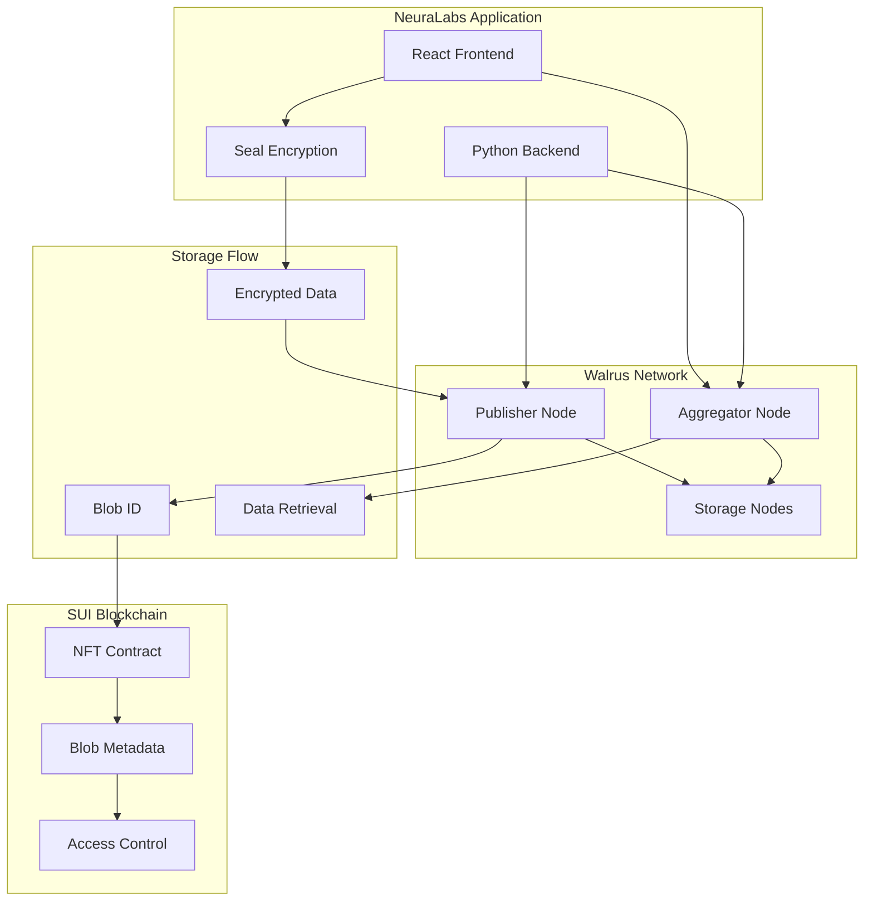

import { Card, CardHeader, CardTitle, CardDescription } from '@site/src/components/Card';
import {CollapsibleCodeBlock} from '@site/src/components/CodeBlock';

# Walrus Decentralized Storage

Integrate Walrus for decentralized blob storage of encrypted AI workflow data with content-addressed storage and built-in redundancy.

## Overview

Walrus is a decentralized storage network that provides secure, efficient, and cost-effective blob storage. In the NeuraLabs platform, Walrus stores encrypted AI workflow data while metadata and access control remain on the SUI blockchain, creating a hybrid architecture that combines security with performance.

<div className="card padding--md mt-4">
  <h3>Walrus Key Features</h3>
  <ul>
    <li><strong>Content-Addressed Storage:</strong> Immutable data references with integrity verification</li>
    <li><strong>Built-in Redundancy:</strong> Automatic data replication across storage nodes</li>
    <li><strong>Cost-Effective:</strong> Optimized for large blob storage at scale</li>
    <li><strong>SUI Integration:</strong> Seamless integration with SUI blockchain</li>
    <li><strong>HTTP API:</strong> Simple REST API for data operations</li>
  </ul>
</div>

## Architecture



## Walrus Testnet Configuration

### Network Endpoints (Updated January 2025)

<div className="grid grid-cols-1 md:grid-cols-2 gap-4 mt-4">
  <Card>
    <CardHeader>
      <CardTitle>
        
        Publisher Endpoint
      </CardTitle>
      <CardDescription>
        For uploading data to Walrus<br/>
        Primary: https://publisher.walrus-testnet.walrus.space<br/>
        Alternative: https://wal-publisher-testnet.staketab.org
      </CardDescription>
    </CardHeader>
  </Card>

  <Card>
    <CardHeader>
      <CardTitle>
        
        Aggregator Endpoint
      </CardTitle>
      <CardDescription>
        For downloading data from Walrus<br/>
        Primary: https://aggregator.walrus-testnet.walrus.space<br/>
        Alternative: https://wal-aggregator-testnet.staketab.org
      </CardDescription>
    </CardHeader>
  </Card>
</div>

<div className="card padding--md mt-4">
  <h3>Testnet Status</h3>
  <p>The Walrus testnet is currently in <strong>Phase 2</strong> with improved reliability and performance. Key updates:</p>
  <ul>
    <li><strong>Extended Storage Duration:</strong> Files can now be stored for up to 200 epochs</li>
    <li><strong>Increased File Size:</strong> Maximum blob size increased to 100MB</li>
    <li><strong>Multi-Region Support:</strong> Storage nodes distributed globally</li>
    <li><strong>Improved API:</strong> New batch operations and streaming support</li>
  </ul>
</div>

### Environment Configuration

```bash
# .env configuration for frontend
REACT_APP_WALRUS_PUBLISHER_URL=https://publisher.walrus-testnet.walrus.space
REACT_APP_WALRUS_AGGREGATOR_URL=https://aggregator.walrus-testnet.walrus.space
REACT_APP_WALRUS_NETWORK=testnet
REACT_APP_WALRUS_MAX_FILE_SIZE=104857600  # 100MB
REACT_APP_WALRUS_DEFAULT_EPOCHS=30        # Default storage duration

# Backend configuration (.env)
WALRUS_PUBLISHER_URL=https://publisher.walrus-testnet.walrus.space
WALRUS_AGGREGATOR_URL=https://aggregator.walrus-testnet.walrus.space
WALRUS_TIMEOUT=60                         # Increased for large files
WALRUS_MAX_RETRIES=3
WALRUS_BATCH_SIZE=5                       # For parallel uploads
WALRUS_COMPRESSION_ENABLED=true           # Enable compression
```

## Walrus CLI Installation & Usage

### Installing Walrus CLI (Latest Version)

<CollapsibleCodeBlock
  title="Install Walrus Binary"
  description="Download and setup the latest Walrus command-line tool"
  language="bash"
  defaultCollapsed={false}
>
{`# Download latest Walrus binary for your platform
# For Ubuntu/Linux x86_64
wget https://github.com/MystenLabs/walrus-sites/releases/latest/download/walrus-x86_64-unknown-linux-gnu
chmod +x walrus-x86_64-unknown-linux-gnu
sudo mv walrus-x86_64-unknown-linux-gnu /usr/local/bin/walrus

# For macOS (Intel)
wget https://github.com/MystenLabs/walrus-sites/releases/latest/download/walrus-x86_64-apple-darwin
chmod +x walrus-x86_64-apple-darwin
sudo mv walrus-x86_64-apple-darwin /usr/local/bin/walrus

# For macOS (Apple Silicon)
wget https://github.com/MystenLabs/walrus-sites/releases/latest/download/walrus-aarch64-apple-darwin
chmod +x walrus-aarch64-apple-darwin
sudo mv walrus-aarch64-apple-darwin /usr/local/bin/walrus

# Verify installation
walrus --version

# Initialize configuration
walrus config init

# Get testnet WAL tokens from faucet
walrus get-wal --testnet

# Check your WAL balance
walrus wallet balance`}
</CollapsibleCodeBlock>

### Basic CLI Operations

<CollapsibleCodeBlock
  title="Common Walrus CLI Commands"
  description="Essential commands for storing and retrieving data"
  language="bash"
  defaultCollapsed={true}
>
{`# Store a file with default settings (5 epochs)
walrus store myfile.pdf

# Store with custom duration (epochs)
walrus store myfile.pdf --epochs 30

# Store multiple files
walrus store file1.txt file2.json file3.pdf --epochs 10

# Read/download a blob
walrus read <blob-id> -o downloaded-file.pdf

# Check blob status
walrus blob-status <blob-id>

# List your stored blobs
walrus list

# Extend storage duration
walrus extend <blob-id> --epochs 20

# Delete a blob (if supported)
walrus delete <blob-id>

# Advanced: Store with custom metadata
walrus store myfile.pdf --epochs 30 \
  --content-type "application/pdf" \
  --metadata '{"project":"neuralabs","version":"1.0"}'`}
</CollapsibleCodeBlock>

## Implementation

### 1. Production-Ready Walrus Client

<CollapsibleCodeBlock
  title="TypeScript Walrus Client Implementation"
  description="Complete Walrus client with error handling, retries, and progress tracking"
  language="typescript"
  defaultCollapsed={false}
>
{`// walrusClient.ts
import { EventEmitter } from 'events';

export interface WalrusConfig {
  publisherUrl: string;
  aggregatorUrl: string;
  timeout?: number;
  maxRetries?: number;
  compressionEnabled?: boolean;
}

export interface StoreOptions {
  epochs?: number;
  compress?: boolean;
  onProgress?: (progress: number) => void;
  metadata?: Record<string, any>;
}

export interface WalrusStoreResult {
  success: boolean;
  blobId?: string;
  url?: string;
  cost?: {
    suiCost: number;
    computeUnits: number;
  };
  error?: string;
}

export class WalrusClient extends EventEmitter {
  private config: Required<WalrusConfig>;
  
  constructor(config: WalrusConfig) {
    super();
    this.config = {
      publisherUrl: config.publisherUrl,
      aggregatorUrl: config.aggregatorUrl,
      timeout: config.timeout || 60000,
      maxRetries: config.maxRetries || 3,
      compressionEnabled: config.compressionEnabled ?? true,
    };
  }
  
  async store(
    data: Uint8Array, 
    options: StoreOptions = {}
  ): Promise<WalrusStoreResult> {
    const startTime = Date.now();
    let attempt = 0;
    
    // Compress if enabled
    const finalData = options.compress && this.config.compressionEnabled
      ? await this.compressData(data)
      : data;
    
    while (attempt < this.config.maxRetries) {
      try {
        attempt++;
        this.emit('store:attempt', { attempt, maxRetries: this.config.maxRetries });
        
        const formData = new FormData();
        const blob = new Blob([finalData], { 
          type: 'application/octet-stream' 
        });
        formData.append('file', blob);
        
        // Add optional parameters
        if (options.epochs) {
          formData.append('epochs', options.epochs.toString());
        }
        if (options.metadata) {
          formData.append('metadata', JSON.stringify(options.metadata));
        }
        
        const response = await fetch(\`\${this.config.publisherUrl}/v1/store\`, {
          method: 'POST',
          body: formData,
          signal: AbortSignal.timeout(this.config.timeout),
        });
        
        if (!response.ok) {
          const errorText = await response.text();
          throw new Error(\`Storage failed: \${response.status} - \${errorText}\`);
        }
        
        const result = await response.json();
        
        const storeResult: WalrusStoreResult = {
          success: true,
          blobId: result.blob_id || result.blobId,
          url: \`\${this.config.aggregatorUrl}/v1/\${result.blob_id}\`,
          cost: result.cost,
        };
        
        this.emit('store:success', {
          ...storeResult,
          duration: Date.now() - startTime,
          compressed: options.compress,
          originalSize: data.length,
          finalSize: finalData.length,
        });
        
        return storeResult;
        
      } catch (error) {
        const errorMsg = error instanceof Error ? error.message : 'Unknown error';
        this.emit('store:error', { attempt, error: errorMsg });
        
        if (attempt >= this.config.maxRetries) {
          return {
            success: false,
            error: \`Failed after \${attempt} attempts: \${errorMsg}\`,
          };
        }
        
        // Exponential backoff
        const delay = Math.min(1000 * Math.pow(2, attempt - 1), 10000);
        await this.delay(delay);
      }
    }
    
    return { success: false, error: 'Max retries exceeded' };
  }
  
  async retrieve(
    blobId: string,
    options: { decompress?: boolean } = {}
  ): Promise<{
    success: boolean;
    data?: Uint8Array;
    metadata?: Record<string, any>;
    error?: string;
  }> {
    let attempt = 0;
    
    while (attempt < this.config.maxRetries) {
      try {
        attempt++;
        this.emit('retrieve:attempt', { attempt, blobId });
        
        const response = await fetch(
          \`\${this.config.aggregatorUrl}/v1/\${blobId}\`,
          {
            method: 'GET',
            signal: AbortSignal.timeout(this.config.timeout),
          }
        );
        
        if (!response.ok) {
          if (response.status === 404) {
            return { success: false, error: 'Blob not found' };
          }
          throw new Error(\`Retrieval failed: \${response.status}\`);
        }
        
        const arrayBuffer = await response.arrayBuffer();
        let data = new Uint8Array(arrayBuffer);
        
        // Check for metadata header
        const metadataHeader = response.headers.get('x-walrus-metadata');
        const metadata = metadataHeader ? JSON.parse(metadataHeader) : undefined;
        
        // Decompress if needed
        if (options.decompress && this.isCompressed(data)) {
          data = await this.decompressData(data);
        }
        
        this.emit('retrieve:success', { blobId, size: data.length });
        
        return {
          success: true,
          data,
          metadata,
        };
        
      } catch (error) {
        const errorMsg = error instanceof Error ? error.message : 'Unknown error';
        this.emit('retrieve:error', { attempt, blobId, error: errorMsg });
        
        if (attempt >= this.config.maxRetries) {
          return {
            success: false,
            error: \`Failed after \${attempt} attempts: \${errorMsg}\`,
          };
        }
        
        const delay = Math.min(1000 * Math.pow(2, attempt - 1), 10000);
        await this.delay(delay);
      }
    }
    
    return { success: false, error: 'Max retries exceeded' };
  }
  
  async checkAvailability(blobId: string): Promise<boolean> {
    try {
      const response = await fetch(
        \`\${this.config.aggregatorUrl}/v1/\${blobId}\`,
        {
          method: 'HEAD',
          signal: AbortSignal.timeout(5000),
        }
      );
      return response.ok;
    } catch {
      return false;
    }
  }
  
  async getBlobInfo(blobId: string): Promise<{
    success: boolean;
    info?: {
      size: number;
      contentType?: string;
      createdAt?: string;
      expiresAt?: string;
      metadata?: Record<string, any>;
    };
    error?: string;
  }> {
    try {
      const response = await fetch(
        \`\${this.config.aggregatorUrl}/v1/\${blobId}\`,
        {
          method: 'HEAD',
          signal: AbortSignal.timeout(5000),
        }
      );
      
      if (!response.ok) {
        return { 
          success: false, 
          error: \`Failed to get info: \${response.status}\` 
        };
      }
      
      return {
        success: true,
        info: {
          size: parseInt(response.headers.get('content-length') || '0'),
          contentType: response.headers.get('content-type') || undefined,
          createdAt: response.headers.get('x-walrus-created-at') || undefined,
          expiresAt: response.headers.get('x-walrus-expires-at') || undefined,
          metadata: response.headers.get('x-walrus-metadata') 
            ? JSON.parse(response.headers.get('x-walrus-metadata')!)
            : undefined,
        },
      };
    } catch (error) {
      return {
        success: false,
        error: error instanceof Error ? error.message : 'Unknown error',
      };
    }
  }
  
  // Helper methods
  private async compressData(data: Uint8Array): Promise<Uint8Array> {
    const compressionStream = new CompressionStream('gzip');
    const writer = compressionStream.writable.getWriter();
    writer.write(data);
    writer.close();
    
    const chunks: Uint8Array[] = [];
    const reader = compressionStream.readable.getReader();
    
    while (true) {
      const { done, value } = await reader.read();
      if (done) break;
      chunks.push(value);
    }
    
    const compressed = new Uint8Array(
      chunks.reduce((acc, chunk) => acc + chunk.length, 0)
    );
    let offset = 0;
    for (const chunk of chunks) {
      compressed.set(chunk, offset);
      offset += chunk.length;
    }
    
    return compressed;
  }
  
  private async decompressData(data: Uint8Array): Promise<Uint8Array> {
    const decompressionStream = new DecompressionStream('gzip');
    const writer = decompressionStream.writable.getWriter();
    writer.write(data);
    writer.close();
    
    const chunks: Uint8Array[] = [];
    const reader = decompressionStream.readable.getReader();
    
    while (true) {
      const { done, value } = await reader.read();
      if (done) break;
      chunks.push(value);
    }
    
    const decompressed = new Uint8Array(
      chunks.reduce((acc, chunk) => acc + chunk.length, 0)
    );
    let offset = 0;
    for (const chunk of chunks) {
      decompressed.set(chunk, offset);
      offset += chunk.length;
    }
    
    return decompressed;
  }
  
  private isCompressed(data: Uint8Array): boolean {
    // Check for gzip magic numbers (1f 8b)
    return data.length > 2 && data[0] === 0x1f && data[1] === 0x8b;
  }
  
  private delay(ms: number): Promise<void> {
    return new Promise(resolve => setTimeout(resolve, ms));
  }
}

// Usage example
const walrusClient = new WalrusClient({
  publisherUrl: process.env.REACT_APP_WALRUS_PUBLISHER_URL!,
  aggregatorUrl: process.env.REACT_APP_WALRUS_AGGREGATOR_URL!,
  timeout: 60000,
  maxRetries: 3,
  compressionEnabled: true,
});

// Listen to events
walrusClient.on('store:attempt', ({ attempt }) => {
  console.log(\`Upload attempt \${attempt}\`);
});

walrusClient.on('store:success', ({ blobId, duration, originalSize, finalSize }) => {
  console.log(\`Stored successfully: \${blobId}\`);
  console.log(\`Duration: \${duration}ms\`);
  console.log(\`Compression: \${originalSize} → \${finalSize} bytes\`);
});`}
</CollapsibleCodeBlock>

### 2. Integrated Storage Manager

```typescript
// storageManager.ts
import { WalrusClient } from './walrusClient';
import { NeuraLabsSealClient } from './sealClient';

export class StorageManager {
  private walrusClient: WalrusClient;
  private sealClient: NeuraLabsSealClient;
  
  constructor() {
    this.walrusClient = new WalrusClient();
    this.sealClient = new NeuraLabsSealClient();
  }
  
  async storeWorkflow(
    workflowId: string,
    workflowData: any,
    threshold: number = 1
  ): Promise<{
    success: boolean;
    blobId?: string;
    encryptionKey?: string;
    error?: string;
  }> {
    try {
      // 1. Serialize workflow data
      const serialized = JSON.stringify(workflowData);
      const data = new TextEncoder().encode(serialized);
      
      // 2. Encrypt with Seal
      const encryptionResult = await this.sealClient.encryptWorkflow(
        workflowId,
        data,
        threshold
      );
      
      if (!encryptionResult.success) {
        return {
          success: false,
          error: `Encryption failed: ${encryptionResult.error}`,
        };
      }
      
      // 3. Store encrypted data on Walrus
      const storageResult = await this.walrusClient.store(
        encryptionResult.encryptedData
      );
      
      if (!storageResult.success) {
        return {
          success: false,
          error: `Storage failed: ${storageResult.error}`,
        };
      }
      
      return {
        success: true,
        blobId: storageResult.blobId,
        encryptionKey: encryptionResult.backupKey,
      };
    } catch (error) {
      console.error('Workflow storage error:', error);
      return {
        success: false,
        error: error instanceof Error ? error.message : 'Unknown error',
      };
    }
  }
  
  async retrieveWorkflow(
    blobId: string,
    workflowId: string,
    sessionKey: any
  ): Promise<{
    success: boolean;
    workflow?: any;
    error?: string;
  }> {
    try {
      // 1. Retrieve encrypted data from Walrus
      const retrievalResult = await this.walrusClient.retrieve(blobId);
      
      if (!retrievalResult.success) {
        return {
          success: false,
          error: `Retrieval failed: ${retrievalResult.error}`,
        };
      }
      
      // 2. Decrypt with Seal
      const decryptionResult = await this.sealClient.decryptWorkflow(
        retrievalResult.data!,
        sessionKey,
        workflowId
      );
      
      if (!decryptionResult.success) {
        return {
          success: false,
          error: `Decryption failed: ${decryptionResult.error}`,
        };
      }
      
      // 3. Deserialize workflow data
      const serialized = new TextDecoder().decode(decryptionResult.decryptedData);
      const workflow = JSON.parse(serialized);
      
      return {
        success: true,
        workflow,
      };
    } catch (error) {
      console.error('Workflow retrieval error:', error);
      return {
        success: false,
        error: error instanceof Error ? error.message : 'Unknown error',
      };
    }
  }
  
  async verifyWorkflowIntegrity(
    blobId: string,
    expectedHash?: string
  ): Promise<boolean> {
    try {
      const available = await this.walrusClient.checkAvailability(blobId);
      
      if (!available) return false;
      
      if (expectedHash) {
        // If we have an expected hash, verify content integrity
        const data = await this.walrusClient.retrieve(blobId);
        if (!data.success || !data.data) return false;
        
        // Calculate hash and compare
        const hash = await this.calculateHash(data.data);
        return hash === expectedHash;
      }
      
      return true;
    } catch {
      return false;
    }
  }
  
  private async calculateHash(data: Uint8Array): Promise<string> {
    const hashBuffer = await crypto.subtle.digest('SHA-256', data);
    const hashArray = Array.from(new Uint8Array(hashBuffer));
    return hashArray.map(b => b.toString(16).padStart(2, '0')).join('');
  }
}
```

### 3. React Hook Integration

```typescript
// useWalrusStorage.ts
import { useState, useCallback } from 'react';
import { StorageManager } from './storageManager';
import { useSealEncryption } from './useSealEncryption';

export const useWalrusStorage = () => {
  const [storageManager] = useState(() => new StorageManager());
  const { createSession } = useSealEncryption();
  const [isLoading, setIsLoading] = useState(false);
  
  const storeWorkflow = useCallback(async (
    workflowId: string,
    workflowData: any,
    threshold: number = 1
  ) => {
    setIsLoading(true);
    try {
      const result = await storageManager.storeWorkflow(
        workflowId,
        workflowData,
        threshold
      );
      
      return result;
    } finally {
      setIsLoading(false);
    }
  }, [storageManager]);
  
  const retrieveWorkflow = useCallback(async (
    blobId: string,
    workflowId: string
  ) => {
    setIsLoading(true);
    try {
      // Ensure we have an active session
      const sessionResult = await createSession();
      if (!sessionResult.success) {
        return sessionResult;
      }
      
      const result = await storageManager.retrieveWorkflow(
        blobId,
        workflowId,
        sessionResult.sessionKey
      );
      
      return result;
    } finally {
      setIsLoading(false);
    }
  }, [storageManager, createSession]);
  
  const verifyIntegrity = useCallback(async (
    blobId: string,
    expectedHash?: string
  ) => {
    return await storageManager.verifyWorkflowIntegrity(blobId, expectedHash);
  }, [storageManager]);
  
  const getBlobInfo = useCallback(async (blobId: string) => {
    const walrusClient = new (await import('./walrusClient')).WalrusClient();
    return await walrusClient.getBlobInfo(blobId);
  }, []);
  
  return {
    storeWorkflow,
    retrieveWorkflow,
    verifyIntegrity,
    getBlobInfo,
    isLoading,
  };
};
```

### 4. Backend Integration (Python)

<CollapsibleCodeBlock
  title="Python Walrus Client with Async Support"
  description="Production-ready Python client with compression, retry logic, and FastAPI integration"
  language="python"
  defaultCollapsed={false}
>
{`# walrus_client.py
import aiohttp
import asyncio
import gzip
import json
import logging
from typing import Optional, Dict, Any, Tuple, Union, AsyncIterator
from dataclasses import dataclass
from datetime import datetime
import hashlib

logger = logging.getLogger(__name__)

@dataclass
class WalrusStoreResult:
    success: bool
    blob_id: Optional[str] = None
    url: Optional[str] = None
    cost: Optional[Dict[str, Any]] = None
    error: Optional[str] = None
    size: Optional[int] = None
    compressed: bool = False

@dataclass
class WalrusConfig:
    publisher_url: str
    aggregator_url: str
    timeout: int = 60
    max_retries: int = 3
    compression_enabled: bool = True
    chunk_size: int = 5 * 1024 * 1024  # 5MB chunks

class WalrusClient:
    def __init__(self, config: WalrusConfig):
        self.config = config
        self.session: Optional[aiohttp.ClientSession] = None
    
    async def __aenter__(self):
        self.session = aiohttp.ClientSession(
            timeout=aiohttp.ClientTimeout(total=self.config.timeout)
        )
        return self
    
    async def __aexit__(self, exc_type, exc_val, exc_tb):
        if self.session:
            await self.session.close()
    
    async def store(
        self, 
        data: bytes,
        epochs: Optional[int] = None,
        compress: bool = True,
        metadata: Optional[Dict[str, Any]] = None,
        progress_callback: Optional[callable] = None
    ) -> WalrusStoreResult:
        """Store data on Walrus with automatic retry and compression."""
        
        # Compress if enabled
        original_size = len(data)
        if compress and self.config.compression_enabled:
            data = gzip.compress(data, compresslevel=6)
            logger.info(f"Compressed {original_size} → {len(data)} bytes")
        
        for attempt in range(1, self.config.max_retries + 1):
            try:
                if not self.session:
                    self.session = aiohttp.ClientSession()
                
                form_data = aiohttp.FormData()
                form_data.add_field(
                    'file', 
                    data, 
                    content_type='application/octet-stream',
                    filename='blob'
                )
                
                # Add optional parameters
                if epochs:
                    form_data.add_field('epochs', str(epochs))
                if metadata:
                    form_data.add_field('metadata', json.dumps(metadata))
                
                url = f"{self.config.publisher_url}/v1/store"
                
                async with self.session.post(url, data=form_data) as response:
                    if response.status == 200:
                        result = await response.json()
                        blob_id = result.get('blob_id') or result.get('blobId')
                        
                        return WalrusStoreResult(
                            success=True,
                            blob_id=blob_id,
                            url=f"{self.config.aggregator_url}/v1/{blob_id}",
                            cost=result.get('cost'),
                            size=len(data),
                            compressed=compress and self.config.compression_enabled
                        )
                    else:
                        error_text = await response.text()
                        logger.warning(f"Attempt {attempt} failed: {response.status} - {error_text}")
                        
                        if attempt == self.config.max_retries:
                            return WalrusStoreResult(
                                success=False,
                                error=f"Failed after {attempt} attempts: {error_text}"
                            )
                        
                        # Exponential backoff
                        delay = min(2 ** (attempt - 1), 10)
                        await asyncio.sleep(delay)
            
            except asyncio.TimeoutError:
                logger.error(f"Attempt {attempt} timed out")
                if attempt == self.config.max_retries:
                    return WalrusStoreResult(success=False, error="Storage timeout")
            except Exception as e:
                logger.error(f"Attempt {attempt} error: {str(e)}")
                if attempt == self.config.max_retries:
                    return WalrusStoreResult(success=False, error=str(e))
        
        return WalrusStoreResult(success=False, error="Max retries exceeded")
    
    async def retrieve(
        self, 
        blob_id: str,
        decompress: bool = True
    ) -> Tuple[bool, Optional[bytes], Optional[str]]:
        """Retrieve data from Walrus with automatic decompression."""
        
        for attempt in range(1, self.config.max_retries + 1):
            try:
                if not self.session:
                    self.session = aiohttp.ClientSession()
                
                url = f"{self.config.aggregator_url}/v1/{blob_id}"
                
                async with self.session.get(url) as response:
                    if response.status == 200:
                        data = await response.read()
                        
                        # Decompress if it's gzipped
                        if decompress and self._is_gzipped(data):
                            data = gzip.decompress(data)
                            logger.info(f"Decompressed {len(data)} bytes")
                        
                        return True, data, None
                    elif response.status == 404:
                        return False, None, "Blob not found"
                    else:
                        error_text = await response.text()
                        logger.warning(f"Attempt {attempt} failed: {error_text}")
                        
                        if attempt == self.config.max_retries:
                            return False, None, f"Failed after {attempt} attempts: {error_text}"
                        
                        await asyncio.sleep(min(2 ** (attempt - 1), 10))
            
            except Exception as e:
                logger.error(f"Retrieval error on attempt {attempt}: {str(e)}")
                if attempt == self.config.max_retries:
                    return False, None, str(e)
        
        return False, None, "Max retries exceeded"
    
    async def store_stream(
        self,
        data_stream: AsyncIterator[bytes],
        estimated_size: Optional[int] = None,
        **kwargs
    ) -> WalrusStoreResult:
        """Store large files using streaming."""
        chunks = []
        total_size = 0
        
        async for chunk in data_stream:
            chunks.append(chunk)
            total_size += len(chunk)
            
            # Yield progress if callback provided
            if kwargs.get('progress_callback') and estimated_size:
                progress = min(total_size / estimated_size, 1.0)
                await kwargs['progress_callback'](progress)
        
        # Combine chunks and store
        data = b''.join(chunks)
        return await self.store(data, **kwargs)
    
    async def check_availability(self, blob_id: str) -> bool:
        """Check if blob is available."""
        try:
            if not self.session:
                self.session = aiohttp.ClientSession()
            
            async with self.session.head(
                f"{self.config.aggregator_url}/v1/{blob_id}",
                timeout=aiohttp.ClientTimeout(total=5)
            ) as response:
                return response.status == 200
        except:
            return False
    
    async def get_blob_info(self, blob_id: str) -> Dict[str, Any]:
        """Get blob metadata."""
        try:
            if not self.session:
                self.session = aiohttp.ClientSession()
            
            async with self.session.head(
                f"{self.config.aggregator_url}/v1/{blob_id}"
            ) as response:
                if response.status == 200:
                    return {
                        'available': True,
                        'size': int(response.headers.get('content-length', 0)),
                        'content_type': response.headers.get('content-type'),
                        'created_at': response.headers.get('x-walrus-created-at'),
                        'expires_at': response.headers.get('x-walrus-expires-at'),
                        'metadata': json.loads(
                            response.headers.get('x-walrus-metadata', '{}')
                        ),
                    }
                return {'available': False}
        except Exception as e:
            return {'available': False, 'error': str(e)}
    
    def _is_gzipped(self, data: bytes) -> bool:
        return len(data) > 2 and data[0] == 0x1f and data[1] == 0x8b

# FastAPI integration with advanced features
from fastapi import FastAPI, UploadFile, File, HTTPException, BackgroundTasks
from fastapi.responses import StreamingResponse
import os
from contextlib import asynccontextmanager

# Application lifespan manager
@asynccontextmanager
async def lifespan(app: FastAPI):
    # Startup
    config = WalrusConfig(
        publisher_url=os.getenv('WALRUS_PUBLISHER_URL'),
        aggregator_url=os.getenv('WALRUS_AGGREGATOR_URL'),
        timeout=int(os.getenv('WALRUS_TIMEOUT', '60')),
        max_retries=int(os.getenv('WALRUS_MAX_RETRIES', '3')),
        compression_enabled=os.getenv('WALRUS_COMPRESSION_ENABLED', 'true').lower() == 'true'
    )
    
    app.state.walrus_client = WalrusClient(config)
    await app.state.walrus_client.__aenter__()
    
    yield
    
    # Shutdown
    await app.state.walrus_client.__aexit__(None, None, None)

app = FastAPI(lifespan=lifespan)

@app.post("/api/walrus/store")
async def store_file(
    background_tasks: BackgroundTasks,
    file: UploadFile = File(...),
    epochs: Optional[int] = None,
    compress: bool = True
):
    """Store file on Walrus with optional compression."""
    try:
        # Read file in chunks for memory efficiency
        chunks = []
        while chunk := await file.read(1024 * 1024):  # 1MB chunks
            chunks.append(chunk)
        
        data = b''.join(chunks)
        
        # Store on Walrus
        result = await app.state.walrus_client.store(
            data,
            epochs=epochs,
            compress=compress,
            metadata={
                'filename': file.filename,
                'content_type': file.content_type,
                'upload_timestamp': datetime.utcnow().isoformat()
            }
        )
        
        if result.success:
            # Log successful upload in background
            background_tasks.add_task(
                log_upload,
                blob_id=result.blob_id,
                size=result.size,
                compressed=result.compressed
            )
            
            return {
                'success': True,
                'blob_id': result.blob_id,
                'url': result.url,
                'size': result.size,
                'compressed': result.compressed,
                'cost': result.cost,
                'hash': hashlib.sha256(data).hexdigest()
            }
        else:
            raise HTTPException(status_code=400, detail=result.error)
    
    except Exception as e:
        logger.error(f"Upload error: {str(e)}")
        raise HTTPException(status_code=500, detail=str(e))

@app.get("/api/walrus/retrieve/{blob_id}")
async def retrieve_file(blob_id: str, decompress: bool = True):
    """Retrieve and stream file from Walrus."""
    try:
        # Check if blob exists first
        info = await app.state.walrus_client.get_blob_info(blob_id)
        if not info.get('available'):
            raise HTTPException(status_code=404, detail="Blob not found")
        
        # Retrieve data
        success, data, error = await app.state.walrus_client.retrieve(
            blob_id, 
            decompress=decompress
        )
        
        if success:
            # Determine content type
            content_type = info.get('content_type', 'application/octet-stream')
            filename = info.get('metadata', {}).get('filename', blob_id)
            
            # Stream response for large files
            async def stream_generator():
                chunk_size = 1024 * 1024  # 1MB chunks
                for i in range(0, len(data), chunk_size):
                    yield data[i:i + chunk_size]
            
            return StreamingResponse(
                stream_generator(),
                media_type=content_type,
                headers={
                    "Content-Disposition": f"attachment; filename={filename}",
                    "Content-Length": str(len(data)),
                    "X-Walrus-Blob-Id": blob_id
                }
            )
        else:
            raise HTTPException(status_code=404, detail=error)
    
    except HTTPException:
        raise
    except Exception as e:
        logger.error(f"Retrieval error: {str(e)}")
        raise HTTPException(status_code=500, detail=str(e))

@app.get("/api/walrus/info/{blob_id}")
async def get_blob_info(blob_id: str):
    """Get blob metadata without downloading."""
    info = await app.state.walrus_client.get_blob_info(blob_id)
    if info.get('available'):
        return info
    else:
        raise HTTPException(status_code=404, detail="Blob not found")

@app.post("/api/walrus/batch-store")
async def batch_store(files: List[UploadFile] = File(...)):
    """Store multiple files in parallel."""
    tasks = []
    for file in files:
        data = await file.read()
        task = app.state.walrus_client.store(
            data,
            metadata={'filename': file.filename}
        )
        tasks.append(task)
    
    results = await asyncio.gather(*tasks, return_exceptions=True)
    
    return {
        'total': len(files),
        'successful': sum(1 for r in results if isinstance(r, WalrusStoreResult) and r.success),
        'results': [
            {
                'filename': files[i].filename,
                'success': r.success if isinstance(r, WalrusStoreResult) else False,
                'blob_id': r.blob_id if isinstance(r, WalrusStoreResult) and r.success else None,
                'error': str(r) if isinstance(r, Exception) else r.error if isinstance(r, WalrusStoreResult) else None
            }
            for i, r in enumerate(results)
        ]
    }

async def log_upload(blob_id: str, size: int, compressed: bool):
    """Background task to log uploads."""
    logger.info(f"Upload completed: {blob_id}, size: {size}, compressed: {compressed}")`}
</CollapsibleCodeBlock>

## Complete Workflow Example

### 1. End-to-End Storage Flow

```typescript
// Complete workflow storage example
const storeAIWorkflow = async (workflow: AIWorkflow) => {
  const { storeWorkflow } = useWalrusStorage();
  const { currentWallet } = useWallet();
  
  try {
    // 1. Prepare workflow data
    const workflowData = {
      id: workflow.id,
      name: workflow.name,
      description: workflow.description,
      model: {
        type: workflow.model.type,
        parameters: workflow.model.parameters,
        weights: workflow.model.weights, // This could be large
      },
      config: workflow.config,
      dependencies: workflow.dependencies,
      metadata: {
        created_at: new Date().toISOString(),
        created_by: currentWallet?.address,
        version: '1.0',
      },
    };
    
    // 2. Store with encryption on Walrus
    const storageResult = await storeWorkflow(
      workflow.id,
      workflowData,
      1 // 1-of-2 threshold for testing
    );
    
    if (!storageResult.success) {
      throw new Error(storageResult.error);
    }
    
    // 3. Store metadata on SUI blockchain
    const metadataResult = await storeWorkflowMetadata({
      workflowId: workflow.id,
      blobId: storageResult.blobId!,
      encryptionInfo: {
        threshold: 1,
        keyServers: 2,
        backupKey: storageResult.encryptionKey, // Store securely!
      },
      size: workflowData.model.weights?.length || 0,
      hash: await calculateDataHash(workflowData),
    });
    
    return {
      success: true,
      blobId: storageResult.blobId,
      transactionId: metadataResult.transactionId,
    };
    
  } catch (error) {
    console.error('Workflow storage failed:', error);
    return {
      success: false,
      error: error instanceof Error ? error.message : 'Unknown error',
    };
  }
};
```

### 2. End-to-End Retrieval Flow

```typescript
// Complete workflow retrieval example
const loadAIWorkflow = async (workflowId: string) => {
  const { retrieveWorkflow, verifyIntegrity } = useWalrusStorage();
  
  try {
    // 1. Get metadata from blockchain
    const metadata = await getWorkflowMetadata(workflowId);
    if (!metadata) {
      throw new Error('Workflow not found');
    }
    
    // 2. Verify data integrity (optional)
    const isIntact = await verifyIntegrity(metadata.blobId, metadata.hash);
    if (!isIntact) {
      throw new Error('Data integrity check failed');
    }
    
    // 3. Retrieve and decrypt from Walrus
    const retrievalResult = await retrieveWorkflow(
      metadata.blobId,
      workflowId
    );
    
    if (!retrievalResult.success) {
      throw new Error(retrievalResult.error);
    }
    
    // 4. Validate workflow structure
    const workflow = retrievalResult.workflow;
    if (!workflow.id || workflow.id !== workflowId) {
      throw new Error('Invalid workflow data');
    }
    
    return {
      success: true,
      workflow,
      metadata,
    };
    
  } catch (error) {
    console.error('Workflow retrieval failed:', error);
    return {
      success: false,
      error: error instanceof Error ? error.message : 'Unknown error',
    };
  }
};
```

## Performance Optimization

### 1. Chunked Upload for Large Files

```typescript
// chunkedUpload.ts
export class ChunkedUploader {
  private static readonly CHUNK_SIZE = 5 * 1024 * 1024; // 5MB chunks
  
  async uploadLargeWorkflow(
    workflowId: string,
    data: Uint8Array,
    onProgress?: (progress: number) => void
  ) {
    const chunks = this.splitIntoChunks(data);
    const chunkIds: string[] = [];
    
    // Upload chunks in parallel (with concurrency limit)
    const concurrencyLimit = 3;
    for (let i = 0; i < chunks.length; i += concurrencyLimit) {
      const batch = chunks.slice(i, i + concurrencyLimit);
      const batchPromises = batch.map((chunk, index) => 
        this.uploadChunk(chunk, i + index)
      );
      
      const batchResults = await Promise.all(batchPromises);
      chunkIds.push(...batchResults);
      
      onProgress?.(Math.min((i + batch.length) / chunks.length, 1));
    }
    
    // Store chunk manifest
    const manifest = {
      workflowId,
      totalSize: data.length,
      chunkCount: chunks.length,
      chunkIds,
      checksum: await this.calculateChecksum(data),
    };
    
    const manifestId = await this.uploadManifest(manifest);
    return manifestId;
  }
  
  private splitIntoChunks(data: Uint8Array): Uint8Array[] {
    const chunks: Uint8Array[] = [];
    for (let i = 0; i < data.length; i += ChunkedUploader.CHUNK_SIZE) {
      chunks.push(data.slice(i, i + ChunkedUploader.CHUNK_SIZE));
    }
    return chunks;
  }
  
  private async uploadChunk(chunk: Uint8Array, index: number): Promise<string> {
    const walrusClient = new WalrusClient();
    const result = await walrusClient.store(chunk);
    if (!result.success) {
      throw new Error(`Chunk ${index} upload failed: ${result.error}`);
    }
    return result.blobId!;
  }
}
```

### 2. Caching and Prefetching

```typescript
// storageCache.ts
export class StorageCache {
  private cache = new Map<string, { data: any; timestamp: number; ttl: number }>();
  private prefetchQueue = new Set<string>();
  
  async get(key: string, fetchFn: () => Promise<any>, ttl: number = 300000) {
    const cached = this.cache.get(key);
    if (cached && Date.now() - cached.timestamp < cached.ttl) {
      return cached.data;
    }
    
    const data = await fetchFn();
    this.cache.set(key, { data, timestamp: Date.now(), ttl });
    return data;
  }
  
  async prefetch(workflowIds: string[]) {
    const toPrefetch = workflowIds.filter(id => 
      !this.cache.has(id) && !this.prefetchQueue.has(id)
    );
    
    toPrefetch.forEach(id => this.prefetchQueue.add(id));
    
    // Prefetch in background
    Promise.all(
      toPrefetch.map(async (id) => {
        try {
          await this.get(id, () => loadAIWorkflow(id));
        } finally {
          this.prefetchQueue.delete(id);
        }
      })
    );
  }
  
  clear() {
    this.cache.clear();
  }
}
```

## Monitoring and Analytics

### 1. Storage Metrics

```typescript
// storageMetrics.ts
export class StorageMetrics {
  private metrics = {
    uploads: 0,
    downloads: 0,
    totalBytesStored: 0,
    totalBytesRetrieved: 0,
    errors: 0,
    averageUploadTime: 0,
    averageDownloadTime: 0,
  };
  
  recordUpload(size: number, duration: number) {
    this.metrics.uploads++;
    this.metrics.totalBytesStored += size;
    this.updateAverageTime('upload', duration);
  }
  
  recordDownload(size: number, duration: number) {
    this.metrics.downloads++;
    this.metrics.totalBytesRetrieved += size;
    this.updateAverageTime('download', duration);
  }
  
  recordError() {
    this.metrics.errors++;
  }
  
  getMetrics() {
    return { ...this.metrics };
  }
  
  private updateAverageTime(type: 'upload' | 'download', newTime: number) {
    const countKey = type === 'upload' ? 'uploads' : 'downloads';
    const avgKey = type === 'upload' ? 'averageUploadTime' : 'averageDownloadTime';
    
    const count = this.metrics[countKey];
    const currentAvg = this.metrics[avgKey];
    
    this.metrics[avgKey] = (currentAvg * (count - 1) + newTime) / count;
  }
}
```

### 2. Health Monitoring

```typescript
// healthMonitor.ts
export class WalrusHealthMonitor {
  private walrusClient: WalrusClient;
  private healthStatus = {
    publisher: false,
    aggregator: false,
    lastCheck: 0,
  };
  
  constructor() {
    this.walrusClient = new WalrusClient();
    this.startHealthCheck();
  }
  
  private startHealthCheck() {
    setInterval(() => {
      this.checkHealth();
    }, 60000); // Check every minute
  }
  
  private async checkHealth() {
    const testBlobId = 'test-blob-id'; // Known test blob
    
    // Check publisher health
    try {
      const testData = new TextEncoder().encode('health-check');
      const result = await this.walrusClient.store(testData);
      this.healthStatus.publisher = result.success;
    } catch {
      this.healthStatus.publisher = false;
    }
    
    // Check aggregator health
    try {
      const available = await this.walrusClient.checkAvailability(testBlobId);
      this.healthStatus.aggregator = available;
    } catch {
      this.healthStatus.aggregator = false;
    }
    
    this.healthStatus.lastCheck = Date.now();
    
    // Emit health status if needed
    if (!this.healthStatus.publisher || !this.healthStatus.aggregator) {
      console.warn('Walrus health check failed:', this.healthStatus);
    }
  }
  
  getHealthStatus() {
    return { ...this.healthStatus };
  }
}
```

## Error Handling and Retry Logic

### 1. Robust Error Handling

```typescript
// errorHandler.ts
export class WalrusErrorHandler {
  private maxRetries = 3;
  private baseDelay = 1000; // 1 second
  
  async withRetry<T>(
    operation: () => Promise<T>,
    context: string
  ): Promise<T> {
    let lastError: Error;
    
    for (let attempt = 0; attempt < this.maxRetries; attempt++) {
      try {
        return await operation();
      } catch (error) {
        lastError = error instanceof Error ? error : new Error(String(error));
        
        if (attempt < this.maxRetries - 1) {
          const delay = this.baseDelay * Math.pow(2, attempt);
          console.warn(`${context} failed (attempt ${attempt + 1}), retrying in ${delay}ms:`, error);
          await this.delay(delay);
        }
      }
    }
    
    throw new Error(`${context} failed after ${this.maxRetries} attempts: ${lastError.message}`);
  }
  
  private delay(ms: number): Promise<void> {
    return new Promise(resolve => setTimeout(resolve, ms));
  }
  
  isRetriableError(error: any): boolean {
    // Network errors, timeouts, and 5xx responses are retriable
    return (
      error.name === 'TimeoutError' ||
      error.message.includes('timeout') ||
      error.message.includes('network') ||
      (error.status >= 500 && error.status < 600)
    );
  }
}
```

## Testing & Debugging

### 1. Comprehensive Test Suite

<CollapsibleCodeBlock
  title="TypeScript Test Suite with Vitest"
  description="Complete test suite for Walrus integration including unit, integration, and E2E tests"
  language="typescript"
  defaultCollapsed={false}
>
{`// walrus.test.ts
import { describe, it, expect, vi, beforeEach, afterEach } from 'vitest';
import { WalrusClient } from './walrusClient';
import type { WalrusConfig, WalrusStoreResult } from './walrusClient';

describe('Walrus Client', () => {
  let client: WalrusClient;
  let mockFetch: any;
  
  beforeEach(() => {
    const config: WalrusConfig = {
      publisherUrl: 'https://publisher.test',
      aggregatorUrl: 'https://aggregator.test',
      timeout: 5000,
      maxRetries: 2,
      compressionEnabled: true,
    };
    client = new WalrusClient(config);
    
    // Setup fetch mock
    mockFetch = vi.fn();
    global.fetch = mockFetch;
    global.AbortSignal.timeout = vi.fn(() => new AbortController().signal);
  });
  
  afterEach(() => {
    vi.clearAllMocks();
  });
  
  describe('store()', () => {
    it('should store data successfully', async () => {
      const testData = new TextEncoder().encode('test data');
      const mockBlobId = 'blob_123456';
      
      mockFetch.mockResolvedValueOnce({
        ok: true,
        json: async () => ({ blob_id: mockBlobId, cost: { sui: 0.1 } }),
      });
      
      const result = await client.store(testData);
      
      expect(result.success).toBe(true);
      expect(result.blobId).toBe(mockBlobId);
      expect(result.url).toBe(\`https://aggregator.test/v1/\${mockBlobId}\`);
      expect(result.cost).toEqual({ sui: 0.1 });
      
      // Verify FormData was created correctly
      expect(mockFetch).toHaveBeenCalledWith(
        'https://publisher.test/v1/store',
        expect.objectContaining({
          method: 'POST',
          body: expect.any(FormData),
        })
      );
    });
    
    it('should compress data when enabled', async () => {
      const testData = new TextEncoder().encode('a'.repeat(1000));
      const mockBlobId = 'blob_compressed';
      
      mockFetch.mockResolvedValueOnce({
        ok: true,
        json: async () => ({ blob_id: mockBlobId }),
      });
      
      const storePromise = client.store(testData, { compress: true });
      
      // Listen for store:success event
      const eventPromise = new Promise<any>((resolve) => {
        client.once('store:success', resolve);
      });
      
      const result = await storePromise;
      const eventData = await eventPromise;
      
      expect(result.success).toBe(true);
      expect(eventData.compressed).toBe(true);
      expect(eventData.finalSize).toBeLessThan(eventData.originalSize);
    });
    
    it('should retry on failure with exponential backoff', async () => {
      const testData = new TextEncoder().encode('test');
      
      // First attempt fails
      mockFetch.mockRejectedValueOnce(new Error('Network error'));
      
      // Second attempt succeeds
      mockFetch.mockResolvedValueOnce({
        ok: true,
        json: async () => ({ blob_id: 'retry_success' }),
      });
      
      const startTime = Date.now();
      const result = await client.store(testData);
      const duration = Date.now() - startTime;
      
      expect(result.success).toBe(true);
      expect(mockFetch).toHaveBeenCalledTimes(2);
      expect(duration).toBeGreaterThanOrEqual(1000); // At least 1s delay
    });
    
    it('should fail after max retries', async () => {
      const testData = new TextEncoder().encode('test');
      
      // All attempts fail
      mockFetch.mockRejectedValue(new Error('Persistent error'));
      
      const result = await client.store(testData);
      
      expect(result.success).toBe(false);
      expect(result.error).toContain('Failed after 2 attempts');
      expect(mockFetch).toHaveBeenCalledTimes(2);
    });
  });
  
  describe('retrieve()', () => {
    it('should retrieve and decompress data', async () => {
      const originalData = 'test data for compression';
      const compressedData = await compressData(originalData);
      const mockBlobId = 'compressed_blob';
      
      mockFetch.mockResolvedValueOnce({
        ok: true,
        headers: new Headers({
          'x-walrus-metadata': JSON.stringify({ compressed: true }),
        }),
        arrayBuffer: async () => compressedData.buffer,
      });
      
      const result = await client.retrieve(mockBlobId);
      
      expect(result.success).toBe(true);
      expect(new TextDecoder().decode(result.data!)).toBe(originalData);
      expect(result.metadata).toEqual({ compressed: true });
    });
    
    it('should handle 404 errors', async () => {
      mockFetch.mockResolvedValueOnce({
        ok: false,
        status: 404,
      });
      
      const result = await client.retrieve('non_existent');
      
      expect(result.success).toBe(false);
      expect(result.error).toBe('Blob not found');
    });
  });
  
  describe('getBlobInfo()', () => {
    it('should return blob metadata', async () => {
      const mockHeaders = new Headers({
        'content-length': '1024',
        'content-type': 'application/pdf',
        'x-walrus-created-at': '2025-01-25T10:00:00Z',
        'x-walrus-expires-at': '2025-02-25T10:00:00Z',
        'x-walrus-metadata': JSON.stringify({ filename: 'test.pdf' }),
      });
      
      mockFetch.mockResolvedValueOnce({
        ok: true,
        headers: mockHeaders,
      });
      
      const result = await client.getBlobInfo('test_blob');
      
      expect(result.success).toBe(true);
      expect(result.info).toEqual({
        size: 1024,
        contentType: 'application/pdf',
        createdAt: '2025-01-25T10:00:00Z',
        expiresAt: '2025-02-25T10:00:00Z',
        metadata: { filename: 'test.pdf' },
      });
    });
  });
});

// Helper function for compression
async function compressData(data: string): Promise<Uint8Array> {
  const encoder = new TextEncoder();
  const stream = new CompressionStream('gzip');
  const writer = stream.writable.getWriter();
  writer.write(encoder.encode(data));
  writer.close();
  
  const chunks: Uint8Array[] = [];
  const reader = stream.readable.getReader();
  while (true) {
    const { done, value } = await reader.read();
    if (done) break;
    chunks.push(value);
  }
  
  const compressed = new Uint8Array(chunks.reduce((acc, chunk) => acc + chunk.length, 0));
  let offset = 0;
  for (const chunk of chunks) {
    compressed.set(chunk, offset);
    offset += chunk.length;
  }
  return compressed;
}

// Integration tests
describe('Walrus Integration Tests', () => {
  it('should handle large file upload with progress', async () => {
    const client = new WalrusClient({
      publisherUrl: process.env.VITE_WALRUS_PUBLISHER_URL!,
      aggregatorUrl: process.env.VITE_WALRUS_AGGREGATOR_URL!,
    });
    
    // Create 5MB test file
    const largeData = new Uint8Array(5 * 1024 * 1024);
    crypto.getRandomValues(largeData);
    
    let progressUpdates: number[] = [];
    client.on('store:progress', ({ progress }) => {
      progressUpdates.push(progress);
    });
    
    const result = await client.store(largeData, {
      compress: true,
      epochs: 10,
    });
    
    expect(result.success).toBe(true);
    expect(progressUpdates.length).toBeGreaterThan(0);
    expect(progressUpdates[progressUpdates.length - 1]).toBe(1);
  });
});`}
</CollapsibleCodeBlock>

### 2. Python Test Suite

<CollapsibleCodeBlock
  title="Python Test Suite with pytest"
  description="Comprehensive Python tests for the Walrus client"
  language="python"
  defaultCollapsed={true}
>
{`# test_walrus_client.py
import pytest
import asyncio
import gzip
from unittest.mock import Mock, patch, AsyncMock
from walrus_client import WalrusClient, WalrusConfig, WalrusStoreResult

@pytest.fixture
def walrus_config():
    return WalrusConfig(
        publisher_url="https://publisher.test",
        aggregator_url="https://aggregator.test",
        timeout=5,
        max_retries=2,
        compression_enabled=True
    )

@pytest.fixture
def walrus_client(walrus_config):
    return WalrusClient(walrus_config)

class TestWalrusClient:
    @pytest.mark.asyncio
    async def test_store_success(self, walrus_client):
        """Test successful file storage."""
        test_data = b"test data"
        mock_response = AsyncMock()
        mock_response.status = 200
        mock_response.json = AsyncMock(return_value={"blob_id": "test_blob_123"})
        
        with patch('aiohttp.ClientSession.post', return_value=mock_response):
            async with walrus_client:
                result = await walrus_client.store(test_data)
        
        assert result.success is True
        assert result.blob_id == "test_blob_123"
        assert result.size == len(test_data)
    
    @pytest.mark.asyncio
    async def test_store_with_compression(self, walrus_client):
        """Test storage with compression."""
        test_data = b"a" * 1000  # Compressible data
        mock_response = AsyncMock()
        mock_response.status = 200
        mock_response.json = AsyncMock(return_value={"blob_id": "compressed_123"})
        
        with patch('aiohttp.ClientSession.post', return_value=mock_response) as mock_post:
            async with walrus_client:
                result = await walrus_client.store(test_data, compress=True)
        
        assert result.success is True
        assert result.compressed is True
        
        # Verify compressed data was sent
        call_args = mock_post.call_args
        form_data = call_args[1]['data']
        # Note: Actual verification of FormData content requires more complex mocking
    
    @pytest.mark.asyncio
    async def test_store_retry_logic(self, walrus_client):
        """Test retry logic with exponential backoff."""
        test_data = b"test"
        
        # First call fails, second succeeds
        mock_responses = [
            asyncio.TimeoutError("Timeout"),
            AsyncMock(status=200, json=AsyncMock(return_value={"blob_id": "retry_success"}))
        ]
        
        with patch('aiohttp.ClientSession.post', side_effect=mock_responses):
            async with walrus_client:
                start_time = asyncio.get_event_loop().time()
                result = await walrus_client.store(test_data)
                duration = asyncio.get_event_loop().time() - start_time
        
        assert result.success is True
        assert result.blob_id == "retry_success"
        assert duration >= 1  # At least 1 second delay for retry
    
    @pytest.mark.asyncio
    async def test_retrieve_with_decompression(self, walrus_client):
        """Test retrieval with automatic decompression."""
        original_data = b"test data for compression"
        compressed_data = gzip.compress(original_data)
        
        mock_response = AsyncMock()
        mock_response.status = 200
        mock_response.read = AsyncMock(return_value=compressed_data)
        
        with patch('aiohttp.ClientSession.get', return_value=mock_response):
            async with walrus_client:
                success, data, error = await walrus_client.retrieve("test_blob")
        
        assert success is True
        assert data == original_data
        assert error is None
    
    @pytest.mark.asyncio
    async def test_stream_store(self, walrus_client):
        """Test streaming upload for large files."""
        async def data_generator():
            for i in range(10):
                yield b"chunk_%d" % i
        
        mock_response = AsyncMock()
        mock_response.status = 200
        mock_response.json = AsyncMock(return_value={"blob_id": "stream_123"})
        
        progress_updates = []
        async def progress_callback(progress):
            progress_updates.append(progress)
        
        with patch('aiohttp.ClientSession.post', return_value=mock_response):
            async with walrus_client:
                result = await walrus_client.store_stream(
                    data_generator(),
                    estimated_size=70,  # 10 chunks * 7 bytes each
                    progress_callback=progress_callback
                )
        
        assert result.success is True
        assert len(progress_updates) > 0
        assert progress_updates[-1] == 1.0

# Integration test with real Walrus testnet
@pytest.mark.integration
@pytest.mark.asyncio
async def test_real_walrus_integration():
    """Test with real Walrus testnet (requires network access)."""
    config = WalrusConfig(
        publisher_url="https://publisher.walrus-testnet.walrus.space",
        aggregator_url="https://aggregator.walrus-testnet.walrus.space"
    )
    
    async with WalrusClient(config) as client:
        # Store test data
        test_data = b"NeuraLabs Walrus integration test"
        store_result = await client.store(test_data, epochs=1)
        
        assert store_result.success is True
        assert store_result.blob_id is not None
        
        # Retrieve and verify
        success, retrieved_data, error = await client.retrieve(store_result.blob_id)
        
        assert success is True
        assert retrieved_data == test_data
        
        # Check blob info
        info = await client.get_blob_info(store_result.blob_id)
        
        assert info['available'] is True
        assert info['size'] == len(test_data)`}
</CollapsibleCodeBlock>

### 3. Debugging Tools & Scripts

<CollapsibleCodeBlock
  title="Walrus Debug Utilities"
  description="Helpful debugging scripts and utilities for troubleshooting Walrus issues"
  language="typescript"
  defaultCollapsed={true}
>
{`// walrus-debug.ts
import { WalrusClient } from './walrusClient';

export class WalrusDebugger {
  private client: WalrusClient;
  
  constructor(client: WalrusClient) {
    this.client = client;
    this.setupDebugListeners();
  }
  
  private setupDebugListeners() {
    // Log all events
    this.client.on('store:attempt', (data) => {
      console.log('[STORE:ATTEMPT]', data);
    });
    
    this.client.on('store:success', (data) => {
      console.log('[STORE:SUCCESS]', {
        blobId: data.blobId,
        duration: \`\${data.duration}ms\`,
        compression: \`\${data.originalSize} → \${data.finalSize} bytes\`,
        ratio: ((1 - data.finalSize / data.originalSize) * 100).toFixed(2) + '%'
      });
    });
    
    this.client.on('store:error', (data) => {
      console.error('[STORE:ERROR]', data);
    });
    
    this.client.on('retrieve:attempt', (data) => {
      console.log('[RETRIEVE:ATTEMPT]', data);
    });
    
    this.client.on('retrieve:success', (data) => {
      console.log('[RETRIEVE:SUCCESS]', data);
    });
    
    this.client.on('retrieve:error', (data) => {
      console.error('[RETRIEVE:ERROR]', data);
    });
  }
  
  async testConnectivity(): Promise<{
    publisher: boolean;
    aggregator: boolean;
    latency: { publisher: number; aggregator: number };
  }> {
    console.log('Testing Walrus connectivity...');
    
    // Test publisher
    const pubStart = Date.now();
    let publisherOk = false;
    try {
      const response = await fetch(\`\${this.client.config.publisherUrl}/health\`);
      publisherOk = response.ok;
    } catch (e) {
      console.error('Publisher health check failed:', e);
    }
    const pubLatency = Date.now() - pubStart;
    
    // Test aggregator
    const aggStart = Date.now();
    let aggregatorOk = false;
    try {
      const response = await fetch(\`\${this.client.config.aggregatorUrl}/health\`);
      aggregatorOk = response.ok;
    } catch (e) {
      console.error('Aggregator health check failed:', e);
    }
    const aggLatency = Date.now() - aggStart;
    
    const result = {
      publisher: publisherOk,
      aggregator: aggregatorOk,
      latency: {
        publisher: pubLatency,
        aggregator: aggLatency,
      },
    };
    
    console.log('Connectivity test results:', result);
    return result;
  }
  
  async benchmarkStorage(sizes: number[] = [1024, 10240, 102400, 1048576]) {
    console.log('Starting storage benchmark...');
    const results = [];
    
    for (const size of sizes) {
      const data = new Uint8Array(size);
      crypto.getRandomValues(data);
      
      // Test without compression
      const start1 = Date.now();
      const result1 = await this.client.store(data, { compress: false });
      const time1 = Date.now() - start1;
      
      // Test with compression
      const start2 = Date.now();
      const result2 = await this.client.store(data, { compress: true });
      const time2 = Date.now() - start2;
      
      results.push({
        size: size,
        sizeHuman: this.formatBytes(size),
        uncompressed: {
          success: result1.success,
          time: time1,
          blobId: result1.blobId,
        },
        compressed: {
          success: result2.success,
          time: time2,
          blobId: result2.blobId,
          savedBytes: result1.success && result2.success ? 
            (size - (result2 as any).finalSize) : 0,
        },
      });
    }
    
    console.table(results);
    return results;
  }
  
  async verifyBlobIntegrity(blobId: string, expectedHash?: string) {
    console.log(\`Verifying blob integrity: \${blobId}\`);
    
    // Check availability
    const available = await this.client.checkAvailability(blobId);
    console.log('Blob available:', available);
    
    if (!available) {
      console.error('Blob not available');
      return false;
    }
    
    // Get info
    const info = await this.client.getBlobInfo(blobId);
    console.log('Blob info:', info);
    
    // Retrieve and verify
    const result = await this.client.retrieve(blobId);
    if (result.success && result.data) {
      const hash = await this.calculateHash(result.data);
      console.log('Calculated hash:', hash);
      
      if (expectedHash) {
        const matches = hash === expectedHash;
        console.log('Hash verification:', matches ? 'PASSED' : 'FAILED');
        return matches;
      }
      
      return true;
    }
    
    console.error('Failed to retrieve blob:', result.error);
    return false;
  }
  
  private async calculateHash(data: Uint8Array): Promise<string> {
    const hashBuffer = await crypto.subtle.digest('SHA-256', data);
    const hashArray = Array.from(new Uint8Array(hashBuffer));
    return hashArray.map(b => b.toString(16).padStart(2, '0')).join('');
  }
  
  private formatBytes(bytes: number): string {
    if (bytes < 1024) return bytes + ' B';
    if (bytes < 1048576) return (bytes / 1024).toFixed(2) + ' KB';
    return (bytes / 1048576).toFixed(2) + ' MB';
  }
}

// Usage example
const client = new WalrusClient({
  publisherUrl: process.env.VITE_WALRUS_PUBLISHER_URL!,
  aggregatorUrl: process.env.VITE_WALRUS_AGGREGATOR_URL!,
});

const debugger = new WalrusDebugger(client);

// Run diagnostics
await debugger.testConnectivity();
await debugger.benchmarkStorage();
await debugger.verifyBlobIntegrity('your-blob-id');`}
</CollapsibleCodeBlock>

### 4. Test Execution Scripts

<CollapsibleCodeBlock
  title="Test Runner Configuration"
  description="Scripts for running different test suites"
  language="json"
  defaultCollapsed={true}
>
{`// package.json test scripts
{
  "scripts": {
    "test": "vitest",
    "test:unit": "vitest run --testNamePattern='^(?!.*Integration).*$'",
    "test:integration": "vitest run --testNamePattern='Integration'",
    "test:walrus": "vitest run src/**/*walrus*.test.ts",
    "test:walrus:live": "VITE_TEST_WALRUS_LIVE=true vitest run --testNamePattern='real Walrus'",
    "test:coverage": "vitest run --coverage",
    "test:debug": "node --inspect-brk ./node_modules/.bin/vitest --no-file-parallelism",
    "bench:walrus": "tsx scripts/benchmark-walrus.ts"
  }
}

// vitest.config.ts
import { defineConfig } from 'vitest/config';

export default defineConfig({
  test: {
    globals: true,
    environment: 'jsdom',
    setupFiles: ['./src/test/setup.ts'],
    testTimeout: 30000, // 30s for Walrus operations
    hookTimeout: 30000,
  },
  define: {
    'process.env.VITE_TEST_WALRUS_LIVE': process.env.VITE_TEST_WALRUS_LIVE,
  },
});

// src/test/setup.ts
import { beforeAll, afterAll } from 'vitest';

beforeAll(() => {
  // Setup global test environment
  if (process.env.VITE_TEST_WALRUS_LIVE) {
    console.log('Running tests against live Walrus testnet');
  }
});

afterAll(() => {
  // Cleanup
});`}
</CollapsibleCodeBlock>

## Security Considerations

<div className="card padding--md mt-4" style={{ borderLeft: '4px solid #ff6b6b' }}>
  <h3>Security Best Practices</h3>
  <ul>
    <li><strong>Data Encryption:</strong> Always encrypt data before storing on Walrus</li>
    <li><strong>Access Control:</strong> Verify permissions before allowing data access</li>
    <li><strong>Content Validation:</strong> Validate retrieved data integrity</li>
    <li><strong>Backup Keys:</strong> Store Seal backup keys securely for disaster recovery</li>
    <li><strong>Rate Limiting:</strong> Implement rate limiting for API endpoints</li>
  </ul>
</div>

## Troubleshooting

### Common Issues

<div className="card padding--md mt-4">
  <h3>Common Walrus Issues</h3>
  
  **Upload Timeout**
  ```typescript
  // Increase timeout for large files
  const client = new WalrusClient();
  client.timeout = 60000; // 60 seconds
  ```
  
  **Network Connectivity**
  ```bash
  # Test connectivity
  curl -X GET https://aggregator.walrus-testnet.walrus.space/v1/health
  ```
  
  **Large File Handling**
  ```typescript
  // Use chunked upload for files > 10MB
  if (fileSize > 10 * 1024 * 1024) {
    return await chunkedUploader.uploadLargeWorkflow(id, data);
  }
  ```
</div>

## Advanced Topics

### 1. Walrus Sites Hosting

<CollapsibleCodeBlock
  title="Deploy Static Sites on Walrus"
  description="Host your dApp frontend on Walrus decentralized storage"
  language="bash"
  defaultCollapsed={true}
>
{`# Install Walrus Sites CLI
npm install -g @walrus/sites-cli

# Build your React app
cd frontend
npm run build

# Deploy to Walrus Sites
walrus-sites deploy ./build --epochs 100

# Output:
# Site deployed to: https://your-site-id.walrus.site
# Deployment cost: 2.5 WAL
# Valid until epoch: 543

# Update existing site
walrus-sites update <site-id> ./build --epochs 50

# Custom domain setup
walrus-sites domain add <site-id> mydapp.example.com

# Monitor site health
walrus-sites status <site-id>`}
</CollapsibleCodeBlock>

### 2. Walrus SDK Integration

<CollapsibleCodeBlock
  title="Using Official Walrus SDK"
  description="Integration with the official Walrus TypeScript SDK"
  language="typescript"
  defaultCollapsed={true}
>
{`// Install official SDK
// npm install @walrus/sdk

import { WalrusSDK, WalrusConfig } from '@walrus/sdk';
import { SuiClient } from '@mysten/sui.js/client';

// Initialize SDK
const config: WalrusConfig = {
  network: 'testnet',
  suiClient: new SuiClient({ url: 'https://fullnode.testnet.sui.io:443' }),
  walletAdapter: window.suiWallet, // Or any wallet adapter
};

const walrus = new WalrusSDK(config);

// Advanced storage with SUI payment
async function storeWithPayment(data: Uint8Array) {
  try {
    // Get storage quote
    const quote = await walrus.getStorageQuote({
      size: data.length,
      epochs: 30,
    });
    
    console.log(\`Storage cost: \${quote.totalCost} SUI\`);
    console.log(\`Per epoch: \${quote.costPerEpoch} SUI\`);
    
    // Store with automatic payment
    const result = await walrus.store(data, {
      epochs: 30,
      paymentCoin: quote.suggestedCoin, // Auto-select coin
      waitForFinality: true,
    });
    
    return {
      blobId: result.blobId,
      certificateId: result.certificateId,
      transactionDigest: result.txDigest,
      storageCost: quote.totalCost,
    };
  } catch (error) {
    console.error('Storage failed:', error);
    throw error;
  }
}

// Batch operations
async function batchStore(files: File[]) {
  const batch = walrus.createBatch();
  
  for (const file of files) {
    const data = await file.arrayBuffer();
    batch.add({
      data: new Uint8Array(data),
      metadata: { filename: file.name },
    });
  }
  
  // Execute batch with progress tracking
  const results = await batch.execute({
    onProgress: (completed, total) => {
      console.log(\`Progress: \${completed}/\${total}\`);
    },
  });
  
  return results;
}

// Advanced retrieval with caching
class CachedWalrusClient {
  private cache = new Map<string, { data: Uint8Array; timestamp: number }>();
  private cacheTTL = 3600000; // 1 hour
  
  async retrieve(blobId: string): Promise<Uint8Array> {
    // Check cache first
    const cached = this.cache.get(blobId);
    if (cached && Date.now() - cached.timestamp < this.cacheTTL) {
      console.log('Cache hit:', blobId);
      return cached.data;
    }
    
    // Retrieve from Walrus
    const data = await walrus.retrieve(blobId, {
      maxRetries: 5,
      retryDelay: 1000,
      preferredNodes: ['node1.walrus.site', 'node2.walrus.site'],
    });
    
    // Update cache
    this.cache.set(blobId, { data, timestamp: Date.now() });
    
    return data;
  }
  
  clearCache() {
    this.cache.clear();
  }
}`}
</CollapsibleCodeBlock>

### 3. Performance Optimization Strategies

<CollapsibleCodeBlock
  title="Advanced Performance Optimizations"
  description="Techniques for optimizing Walrus storage performance"
  language="typescript"
  defaultCollapsed={true}
>
{`// Parallel chunk upload for large files
class OptimizedWalrusUploader {
  private chunkSize = 5 * 1024 * 1024; // 5MB chunks
  private maxConcurrency = 3;
  
  async uploadLargeFile(
    file: File,
    onProgress?: (progress: number) => void
  ): Promise<{ blobIds: string[]; manifest: any }> {
    const chunks = await this.splitFileIntoChunks(file);
    const totalChunks = chunks.length;
    let completedChunks = 0;
    
    // Upload chunks in parallel with concurrency control
    const blobIds: string[] = [];
    
    for (let i = 0; i < chunks.length; i += this.maxConcurrency) {
      const batch = chunks.slice(i, i + this.maxConcurrency);
      
      const promises = batch.map((chunk, index) => 
        this.uploadChunk(chunk, i + index)
          .then(blobId => {
            completedChunks++;
            onProgress?.(completedChunks / totalChunks);
            return blobId;
          })
      );
      
      const batchResults = await Promise.all(promises);
      blobIds.push(...batchResults);
    }
    
    // Create and upload manifest
    const manifest = {
      filename: file.name,
      size: file.size,
      mimeType: file.type,
      chunks: blobIds.map((id, index) => ({
        index,
        blobId: id,
        size: chunks[index].length,
      })),
      created: new Date().toISOString(),
    };
    
    const manifestBlob = new Blob([JSON.stringify(manifest)]);
    const manifestId = await this.uploadChunk(
      new Uint8Array(await manifestBlob.arrayBuffer()),
      -1
    );
    
    return { blobIds, manifest: { ...manifest, manifestId } };
  }
  
  private async splitFileIntoChunks(file: File): Promise<Uint8Array[]> {
    const chunks: Uint8Array[] = [];
    let offset = 0;
    
    while (offset < file.size) {
      const chunk = file.slice(offset, offset + this.chunkSize);
      const arrayBuffer = await chunk.arrayBuffer();
      chunks.push(new Uint8Array(arrayBuffer));
      offset += this.chunkSize;
    }
    
    return chunks;
  }
  
  private async uploadChunk(chunk: Uint8Array, index: number): Promise<string> {
    // Add retry logic here
    const client = new WalrusClient(/* config */);
    const result = await client.store(chunk, { compress: true });
    
    if (!result.success) {
      throw new Error(\`Chunk \${index} upload failed: \${result.error}\`);
    }
    
    return result.blobId!;
  }
  
  // Download and reassemble large files
  async downloadLargeFile(
    manifestId: string,
    onProgress?: (progress: number) => void
  ): Promise<Blob> {
    // Download manifest
    const client = new WalrusClient(/* config */);
    const manifestResult = await client.retrieve(manifestId);
    
    if (!manifestResult.success) {
      throw new Error('Failed to retrieve manifest');
    }
    
    const manifest = JSON.parse(
      new TextDecoder().decode(manifestResult.data!)
    );
    
    // Download chunks in parallel
    const chunks: Uint8Array[] = new Array(manifest.chunks.length);
    let downloaded = 0;
    
    const downloadPromises = manifest.chunks.map(async (chunkInfo: any) => {
      const result = await client.retrieve(chunkInfo.blobId);
      
      if (!result.success) {
        throw new Error(\`Failed to download chunk \${chunkInfo.index}\`);
      }
      
      chunks[chunkInfo.index] = result.data!;
      downloaded++;
      onProgress?.(downloaded / manifest.chunks.length);
    });
    
    await Promise.all(downloadPromises);
    
    // Reassemble file
    return new Blob(chunks, { type: manifest.mimeType });
  }
}

// Edge caching with Service Workers
// service-worker.js
self.addEventListener('fetch', (event) => {
  const url = new URL(event.request.url);
  
  // Cache Walrus aggregator responses
  if (url.hostname.includes('walrus') && url.pathname.includes('/v1/')) {
    event.respondWith(
      caches.match(event.request).then((cachedResponse) => {
        if (cachedResponse) {
          // Return cached response and update in background
          event.waitUntil(
            fetch(event.request).then((response) => {
              return caches.open('walrus-cache').then((cache) => {
                cache.put(event.request, response.clone());
                return response;
              });
            })
          );
          return cachedResponse;
        }
        
        // No cache, fetch and store
        return fetch(event.request).then((response) => {
          return caches.open('walrus-cache').then((cache) => {
            cache.put(event.request, response.clone());
            return response;
          });
        });
      })
    );
  }
});`}
</CollapsibleCodeBlock>

## Best Practices

### Storage Guidelines

<div className="card padding--md mt-4">
  <h3>Recommended Practices</h3>
  <ol>
    <li><strong>Always encrypt sensitive data</strong> before storing on Walrus</li>
    <li><strong>Use compression</strong> for text and JSON data (typically 60-90% savings)</li>
    <li><strong>Implement retry logic</strong> with exponential backoff</li>
    <li><strong>Store metadata on-chain</strong> for indexing and access control</li>
    <li><strong>Use appropriate epochs</strong> - balance cost vs. storage duration</li>
    <li><strong>Batch small files</strong> to reduce transaction overhead</li>
    <li><strong>Monitor blob expiration</strong> and extend as needed</li>
    <li><strong>Implement client-side caching</strong> for frequently accessed data</li>
  </ol>
</div>

### Cost Optimization

<div className="grid grid-cols-1 md:grid-cols-2 gap-4 mt-4">
  <Card>
    <CardHeader>
      <CardTitle>Storage Duration</CardTitle>
      <CardDescription>
        • Short-term (1-5 epochs): Temporary data, caches<br/>
        • Medium-term (10-50 epochs): User uploads, assets<br/>
        • Long-term (100+ epochs): Permanent archives
      </CardDescription>
    </CardHeader>
  </Card>
  
  <Card>
    <CardHeader>
      <CardTitle>File Size Strategy</CardTitle>
      <CardDescription>
        • {"<"} 1MB: Direct upload<br/>
        • 1-10MB: Compress first<br/>
        • {">"} 10MB: Chunk and parallel upload<br/>
        • {">"} 100MB: Consider alternative storage
      </CardDescription>
    </CardHeader>
  </Card>
</div>

## Documentation Sections

<div className="grid grid-cols-1 md:grid-cols-2 gap-4 mt-4">
  <Card>
    <CardHeader>
      <CardTitle>
        
        <a href="/docs/sui-integration/storage/walrus-architecture">Architecture Overview</a>
      </CardTitle>
      <CardDescription>
        Deep dive into Walrus decentralized storage architecture, consensus mechanisms, and integration points
      </CardDescription>
    </CardHeader>
  </Card>

  <Card>
    <CardHeader>
      <CardTitle>
        
        <a href="/docs/sui-integration/storage/walrus-sdk">TypeScript SDK</a>
      </CardTitle>
      <CardDescription>
        Complete guide to using the official Walrus TypeScript SDK with examples and best practices
      </CardDescription>
    </CardHeader>
  </Card>

  <Card>
    <CardHeader>
      <CardTitle>
        
        <a href="/docs/sui-integration/storage/walrus-http-api">HTTP/JSON API</a>
      </CardTitle>
      <CardDescription>
        Direct REST API integration for any programming language with comprehensive examples
      </CardDescription>
    </CardHeader>
  </Card>

  <Card>
    <CardHeader>
      <CardTitle>
        
        <a href="/docs/sui-integration/storage/walrus-cli">CLI Usage</a>
      </CardTitle>
      <CardDescription>
        Command-line interface guide for development, testing, and automation workflows
      </CardDescription>
    </CardHeader>
  </Card>

  <Card>
    <CardHeader>
      <CardTitle>
        
        <a href="/docs/sui-integration/storage/walrus-examples">Example Use Cases</a>
      </CardTitle>
      <CardDescription>
        Real-world implementation examples for AI models, workflows, datasets, and more
      </CardDescription>
    </CardHeader>
  </Card>
</div>

## Next Steps

1. **Explore the documentation sections above** for detailed implementation guides
2. **Choose between SDK or HTTP API** based on your project requirements
3. **Setup monitoring and analytics** for storage operations
4. **Create backup strategy** for critical data
5. **Plan migration to mainnet** when available
6. **Optimize costs** with intelligent caching and compression

## Additional Resources

### Official Documentation
- [Walrus Protocol Specification](https://github.com/MystenLabs/walrus-docs)
- [Walrus Testnet Guide](https://docs.walrus.site/walrus-sites/intro.html)
- [Walrus SDK Reference](https://sdk.mystenlabs.com/walrus)
- [TypeScript SDK Examples](https://github.com/MystenLabs/ts-sdks/tree/main/packages/walrus/examples)

### Community Resources
- [Walrus Discord Channel](https://discord.gg/sui)
- [Example Projects](https://github.com/MystenLabs/walrus-examples)
- [Video Tutorials](https://www.youtube.com/playlist?list=walrus-tutorials)

### Related Documentation
- [Sui Object Storage](https://docs.sui.io/concepts/object-model)
- [NeuraLabs Architecture](/docs/theoretical/blockchain-architecture)
- [Seal Encryption Integration](/docs/sui-integration/encryption/seal)

