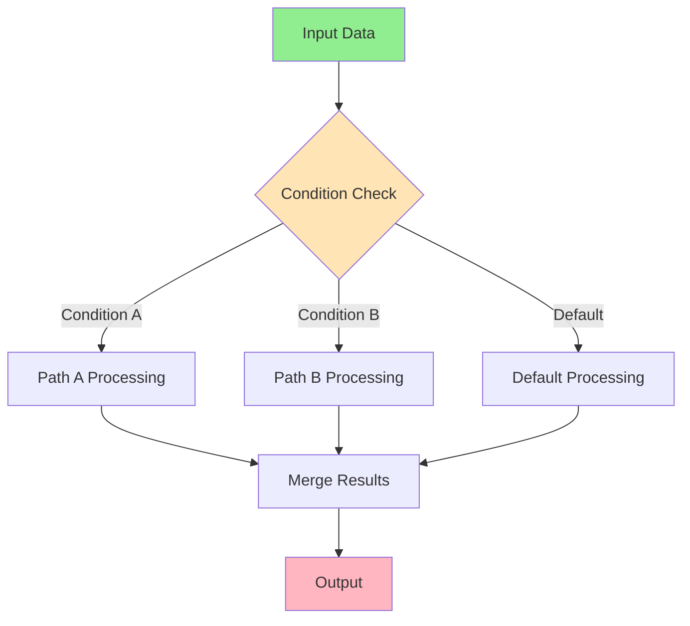

import { Card, CardHeader, CardTitle, CardDescription } from '@site/src/components/Card';
import { Callout } from '@site/src/components/Callout';
import { Features, Feature } from '@site/src/components/Features';
import { CollapsibleCodeBlock, InlineCodeCard } from '@site/src/components/CodeBlock';
import Tabs from '@theme/Tabs';
import TabItem from '@theme/TabItem';
import CodeBlock from '@theme/CodeBlock';

# Data Flow

Data flow is the lifeblood of the HPC Neura Execution Engine. Understanding how data moves through your flows, transforms between nodes, and reaches its final destination is crucial for building efficient and reliable workflows.

## Data Flow Lifecycle

Data in the HPC Neura Execution Engine follows a clear lifecycle from input to output:

<Card>
  <CardHeader>
    <CardTitle>The Four Stages of Data Flow</CardTitle>
  </CardHeader>
  

    <ol>
      <li><strong>L3 Input Stage</strong>: Users provide initial data to the flow</li>
      <li><strong>L4 Processing Stage</strong>: Runtime executes nodes and transforms data</li>
      <li><strong>Inter-Node Transfer</strong>: Data flows between connected nodes</li>
      <li><strong>Output Stage</strong>: Final results are returned to the user</li>
    </ol>
  

</Card>

## Input Data Structure

When a flow starts, input data is organized by node ID:

<CollapsibleCodeBlock
  title="Flow Input Structure"
  description="How L3 users provide data to flows"
  language="yaml"
>
{`# Flow inputs are organized by node
inputs:
  chat_input_001:
    "chat_input_001:message": "Analyze this text for sentiment"
    "chat_input_001:language": "en"
    
  config_node_002:
    "config_node_002:temperature": 0.7
    "config_node_002:max_tokens": 1000
    
  data_source_003:
    "data_source_003:user_id": "user_123"
    "data_source_003:include_history": true

# Each node receives only its designated inputs
# Format: node_id:variable_name = value`}
</CollapsibleCodeBlock>

<Callout type="info">
Input values override any default values defined in the node configuration but must respect the constraints set by L1 hyperparameters.
</Callout>

## Data Transformation

As data flows through nodes, it undergoes transformations:

<Tabs>
  <TabItem value="types" label="Transformation Types" default>
    

      <Features>
        <Feature title="Type Conversion" icon="/img/icons/code.svg">
          Converting between data types (string → number, JSON → list)
        </Feature>
        <Feature title="Structure Change" icon="/img/icons/network.svg">
          Reshaping data (flattening, nesting, merging)
        </Feature>
        <Feature title="Content Generation" icon="/img/icons/ai-workflow.svg">
          Creating new data from inputs (AI generation, calculations)
        </Feature>
      </Features>
    

  </TabItem>
  
  <TabItem value="examples" label="Examples">
    

      <CollapsibleCodeBlock
        title="Data Transformation Examples"
        description="Common transformation patterns"
        language="python"
      >
{`# 1. Simple transformation
# Input: {"text": "Hello World"}
# Output: {"uppercase": "HELLO WORLD", "length": 11}

# 2. Structure transformation
# Input: {"users": [{"name": "John", "age": 30}]}
# Output: {"names": ["John"], "avg_age": 30}

# 3. AI transformation
# Input: {"prompt": "Summarize this article..."}
# Output: {"summary": "The article discusses...", "key_points": [...]}

# 4. Aggregation transformation
# Input: {"values": [1, 2, 3, 4, 5]}
# Output: {"sum": 15, "average": 3, "min": 1, "max": 5}`}
      </CollapsibleCodeBlock>
    

  </TabItem>
</Tabs>

## Data Flow Patterns

### Linear Flow

Data flows sequentially through a chain of nodes:

<CollapsibleCodeBlock
  title="Linear Data Flow Pattern"
  description="Step-by-step data transformation"
  language="yaml"
>
{`# Initial input
input_data: "Process this text"

# Step 1: Validation
validator_output: {
  "validated_text": "Process this text",
  "is_valid": true,
  "language": "en"
}

# Step 2: Enhancement
enhancer_output: {
  "enhanced_text": "Process this text for analysis",
  "metadata": {
    "original_length": 17,
    "enhanced_length": 31
  }
}

# Step 3: Analysis
analyzer_output: {
  "sentiment": "neutral",
  "entities": [],
  "confidence": 0.85
}

# Final output
end_output: {
  "result": "Analysis complete",
  "data": { ... }
}`}
</CollapsibleCodeBlock>

### Branching Flow

Data splits and follows multiple paths:

<CollapsibleCodeBlock
  title="Branching Data Flow Pattern"
  description="Data flowing through multiple parallel paths"
  language="yaml"
>
{`# Source node output
source_output: {
  "text": "Customer complaint about service",
  "priority": "high",
  "customer_id": "cust_123"
}

# Branch 1: Sentiment Analysis
sentiment_path: {
  input: { "text": "Customer complaint about service" },
  output: { "sentiment": "negative", "score": -0.8 }
}

# Branch 2: Customer Lookup
customer_path: {
  input: { "customer_id": "cust_123" },
  output: { "tier": "premium", "history": [...] }
}

# Branch 3: Priority Routing
routing_path: {
  input: { "priority": "high" },
  output: { "queue": "urgent", "sla": "1h" }
}

# Convergence point receives all branch outputs
merger_input: {
  "sentiment_data": { "sentiment": "negative", "score": -0.8 },
  "customer_data": { "tier": "premium", "history": [...] },
  "routing_data": { "queue": "urgent", "sla": "1h" }
}`}
</CollapsibleCodeBlock>

### Conditional Flow

Data follows different paths based on conditions:

## Data Types and Schemas

The engine supports various data types with automatic validation:

<Card>
  <CardHeader>
    <CardTitle>Supported Data Types</CardTitle>
  </CardHeader>
  

    <table>
      <thead>
        <tr>
          <th>Type</th>
          <th>Description</th>
          <th>Example</th>
          <th>Use Cases</th>
        </tr>
      </thead>
      <tbody>
        <tr>
          <td><code>string</code></td>
          <td>Text data</td>
          <td>"Hello World"</td>
          <td>User input, AI responses</td>
        </tr>
        <tr>
          <td><code>int</code></td>
          <td>Integer numbers</td>
          <td>42</td>
          <td>Counts, IDs, indexes</td>
        </tr>
        <tr>
          <td><code>float</code></td>
          <td>Decimal numbers</td>
          <td>3.14</td>
          <td>Scores, percentages</td>
        </tr>
        <tr>
          <td><code>bool</code></td>
          <td>Boolean values</td>
          <td>true/false</td>
          <td>Flags, conditions</td>
        </tr>
        <tr>
          <td><code>json</code></td>
          <td>Complex objects</td>
          <td>{`{"key": "value"}`}</td>
          <td>Structured data</td>
        </tr>
        <tr>
          <td><code>list</code></td>
          <td>Arrays</td>
          <td>[1, 2, 3]</td>
          <td>Collections, history</td>
        </tr>
      </tbody>
    </table>
  

</Card>

### Schema Validation

Data is validated against schemas at each node:

<CollapsibleCodeBlock
  title="Schema Validation Example"
  description="How data is validated during flow"
  language="yaml"
>
{`# Node schema definition
node_schema:
  input_schema:
    user_data:
      type: json
      required: true
      properties:
        name:
          type: string
          min_length: 1
          max_length: 100
        age:
          type: int
          minimum: 0
          maximum: 150
        email:
          type: string
          pattern: "^[a-zA-Z0-9._%+-]+@[a-zA-Z0-9.-]+\\.[a-zA-Z]{2,}$"

# Valid input passes validation
valid_input:
  user_data:
    name: "John Doe"
    age: 30
    email: "john@example.com"

# Invalid input fails with error
invalid_input:
  user_data:
    name: ""  # Too short
    age: 200  # Exceeds maximum
    email: "invalid-email"  # Doesn't match pattern

# Validation error response
error:
  node_id: "processor_001"
  error_type: "validation_error"
  details:
    - field: "user_data.name"
      error: "String length must be at least 1"
    - field: "user_data.age"
      error: "Value 200 exceeds maximum of 150"`}
</CollapsibleCodeBlock>

## Data Streaming

For large data or real-time responses, the engine supports streaming:

<Features>
  <Feature title="LLM Streaming" icon="/img/icons/ai-workflow.svg">
    Stream AI responses token by token for better UX
  </Feature>
  <Feature title="File Processing" icon="/img/icons/database.svg">
    Process large files in chunks without loading entirely
  </Feature>
  <Feature title="Event Streams" icon="/img/icons/network.svg">
    Real-time updates as data flows through nodes
  </Feature>
</Features>

<CollapsibleCodeBlock
  title="Streaming Data Example"
  description="How streaming works in the engine"
  language="json"
>
{`// Initial chunk
{
  "event": "llm_chunk",
  "node_id": "ai_generator_001",
  "chunk": "Based on my analysis",
  "chunk_index": 0
}

// Subsequent chunks
{
  "event": "llm_chunk",
  "node_id": "ai_generator_001",
  "chunk": ", the sentiment is",
  "chunk_index": 1
}

{
  "event": "llm_chunk",
  "node_id": "ai_generator_001",
  "chunk": " strongly positive.",
  "chunk_index": 2,
  "is_final": true
}

// Complete response assembled
{
  "event": "element_completed",
  "node_id": "ai_generator_001",
  "output": {
    "ai_generator_001:response": "Based on my analysis, the sentiment is strongly positive."
  }
}`}
</CollapsibleCodeBlock>

## Memory Management

The engine implements intelligent memory management for data flow:

<Tabs>
  <TabItem value="lifecycle" label="Data Lifecycle" default>
    

      <h4>Automatic Cleanup</h4>
      
Data is automatically cleaned up when no longer needed:

      
      <ol>
        <li><strong>Node Execution</strong>: Data is loaded into node memory</li>
        <li><strong>Output Generation</strong>: Node produces output data</li>
        <li><strong>Downstream Consumption</strong>: Connected nodes receive data</li>
        <li><strong>Cleanup</strong>: Original data is released after all consumers process it</li>
      </ol>
      
      <Callout type="info">
        The engine uses reference counting to ensure data is kept only as long as needed.
      </Callout>
    

  </TabItem>
  
  <TabItem value="optimization" label="Optimization">
    

      <h4>Memory Optimization Techniques</h4>
      
      <Card>
        <CardHeader>
          <CardTitle>Best Practices</CardTitle>
        </CardHeader>
        

          <ul>
            <li><strong>Use Selectors</strong>: Extract only needed fields instead of passing entire objects</li>
            <li><strong>Stream Large Data</strong>: Use streaming for responses over 1MB</li>
            <li><strong>Clean Up Early</strong>: Design flows to process and discard data quickly</li>
            <li><strong>Avoid Duplication</strong>: Reference data instead of copying when possible</li>
          </ul>
        

      </Card>
    

  </TabItem>
</Tabs>

## Error Handling in Data Flow

When errors occur during data flow:

<CollapsibleCodeBlock
  title="Error Propagation"
  description="How errors affect data flow"
  language="yaml"
>
{`# Node encounters an error
error_event:
  event: "element_error"
  node_id: "processor_001"
  error:
    type: "ProcessingError"
    message: "Failed to parse input data"
    details:
      expected: "json"
      received: "string"
    stack_trace: "..."

# Downstream effects
downstream_impacts:
  # All nodes dependent on processor_001 are blocked
  blocked_nodes:
    - analyzer_002  # Waiting for processor_001:output
    - formatter_003 # Waiting for processor_001:data
    
  # Alternative paths may still execute
  active_paths:
    - error_handler_004  # Triggered by error condition
    - fallback_processor_005  # Alternative processing path

# Flow continues with error handling
error_flow:
  1. Error detected in processor_001
  2. Error event emitted
  3. Downstream nodes blocked
  4. Error handler activated
  5. Alternative path processes data
  6. Flow completes with partial results`}
</CollapsibleCodeBlock>

## Data Flow Monitoring

Track data as it moves through your flow:

<Card>
  <CardHeader>
    <CardTitle>Data Flow Metrics</CardTitle>
  </CardHeader>
  

    <table>
      <thead>
        <tr>
          <th>Metric</th>
          <th>Description</th>
          <th>Use Case</th>
        </tr>
      </thead>
      <tbody>
        <tr>
          <td>Data Volume</td>
          <td>Size of data transferred between nodes</td>
          <td>Identify bottlenecks</td>
        </tr>
        <tr>
          <td>Transfer Time</td>
          <td>Time to move data between nodes</td>
          <td>Optimize connections</td>
        </tr>
        <tr>
          <td>Transformation Time</td>
          <td>Processing time within nodes</td>
          <td>Find slow operations</td>
        </tr>
        <tr>
          <td>Queue Depth</td>
          <td>Data waiting for processing</td>
          <td>Detect overload</td>
        </tr>
        <tr>
          <td>Error Rate</td>
          <td>Failed data transfers</td>
          <td>Improve reliability</td>
        </tr>
      </tbody>
    </table>
  

</Card>

## Advanced Data Flow Concepts

### Data Enrichment Pipeline

<CollapsibleCodeBlock
  title="Data Enrichment Example"
  description="Progressive data enhancement through multiple nodes"
  language="yaml"
>
{`# Stage 1: Raw Input
raw_input: {
  "user_id": "user_123",
  "query": "Show me my recent orders"
}

# Stage 2: User Profile Enrichment
with_profile: {
  "user_id": "user_123",
  "query": "Show me my recent orders",
  "profile": {
    "name": "John Doe",
    "tier": "premium",
    "preferences": {...}
  }
}

# Stage 3: Context Addition
with_context: {
  ...previous_data,
  "context": {
    "session_id": "sess_456",
    "device": "mobile",
    "location": "US"
  }
}

# Stage 4: Intent Analysis
with_intent: {
  ...previous_data,
  "intent": {
    "action": "retrieve_orders",
    "timeframe": "recent",
    "confidence": 0.95
  }
}

# Stage 5: Final Response
final_output: {
  "response": "Here are your recent orders...",
  "orders": [...],
  "metadata": {
    "processing_time": 250,
    "nodes_executed": 5
  }
}`}
</CollapsibleCodeBlock>

### Parallel Data Processing

<CollapsibleCodeBlock
  title="Parallel Processing Pattern"
  description="Efficient parallel data processing"
  language="yaml"
>
{`# Input distributed to parallel processors
input_splitter:
  input: { "items": [1, 2, 3, 4, 5, 6, 7, 8, 9, 10] }
  outputs:
    batch_1: { "items": [1, 2, 3, 4] }
    batch_2: { "items": [5, 6, 7, 8] }
    batch_3: { "items": [9, 10] }

# Parallel processing
processor_1: { "results": [2, 4, 6, 8] }      # x2
processor_2: { "results": [10, 12, 14, 16] }  # x2
processor_3: { "results": [18, 20] }          # x2

# Results aggregation
aggregator:
  inputs:
    - processor_1.results
    - processor_2.results
    - processor_3.results
  output: {
    "combined_results": [2, 4, 6, 8, 10, 12, 14, 16, 18, 20],
    "statistics": {
      "total": 110,
      "average": 11,
      "processing_time_ms": 50
    }
  }`}
</CollapsibleCodeBlock>

## Best Practices

<Features>
  <Feature title="Design for Efficiency" icon="/img/icons/hpc.svg">
    Minimize data movement and transformation overhead
  </Feature>
  <Feature title="Validate Early" icon="/img/icons/warning.svg">
    Check data validity as soon as possible in the flow
  </Feature>
  <Feature title="Handle Errors Gracefully" icon="/img/icons/error.svg">
    Always include error handling paths for data issues
  </Feature>
</Features>

### Data Flow Checklist

<Callout type="success" title="Data Flow Best Practices">

✅ Define clear schemas for all node inputs/outputs

✅ Use appropriate data types (avoid unnecessary JSON)

✅ Implement validation at flow entry points

✅ Design for parallel processing where possible

✅ Include error handling and fallback paths

✅ Monitor data volume and processing times

✅ Clean up large data after processing

✅ Document data transformations

</Callout>

## Debugging Data Flow

When debugging data flow issues:

1. **Enable Verbose Logging**: Track data at each transformation
2. **Use Data Inspectors**: Add custom nodes to log intermediate states
3. **Validate Schemas**: Ensure all connections have compatible types
4. **Check Memory Usage**: Monitor for data accumulation
5. **Test Edge Cases**: Include empty, null, and invalid data tests

## Summary

Data flow is the core mechanism that brings your workflows to life. By understanding how data moves, transforms, and reaches its destination, you can build more efficient and reliable flows. Remember:

- Data follows the connections you define
- Each node transforms data according to its purpose
- Validation ensures data integrity
- Proper design enables parallel processing
- Error handling maintains flow reliability

## Next Steps

  <Card>
    <CardHeader>
      <CardTitle>Building Flows</CardTitle>
      <CardDescription>
        Apply these concepts to create your first flow
      </CardDescription>
    </CardHeader>
    

      <a href="/docs/hpc-neura-execution-engine/building-flows" style={{ textDecoration: 'none' }}>
        Start building →
      </a>
    

  </Card>
  
  <Card>
    <CardHeader>
      <CardTitle>Element Reference</CardTitle>
      <CardDescription>
        Detailed guide to all available elements
      </CardDescription>
    </CardHeader>
    

      <a href="/docs/hpc-neura-execution-engine/element-reference" style={{ textDecoration: 'none' }}>
        Explore elements →
      </a>
    

  </Card>
  
  <Card>
    <CardHeader>
      <CardTitle>Best Practices</CardTitle>
      <CardDescription>
        Advanced techniques and optimization
      </CardDescription>
    </CardHeader>
    

      <a href="/docs/hpc-neura-execution-engine/best-practices" style={{ textDecoration: 'none' }}>
        Learn more →
      </a>
    

  </Card>

