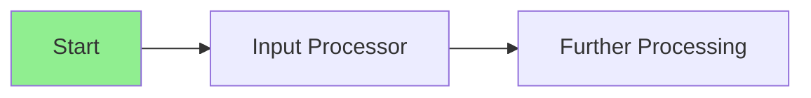
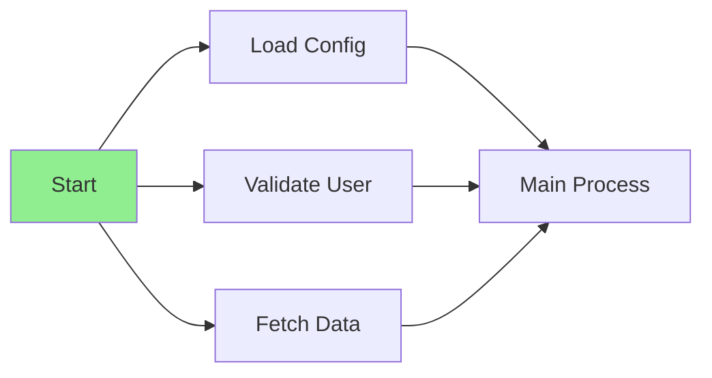
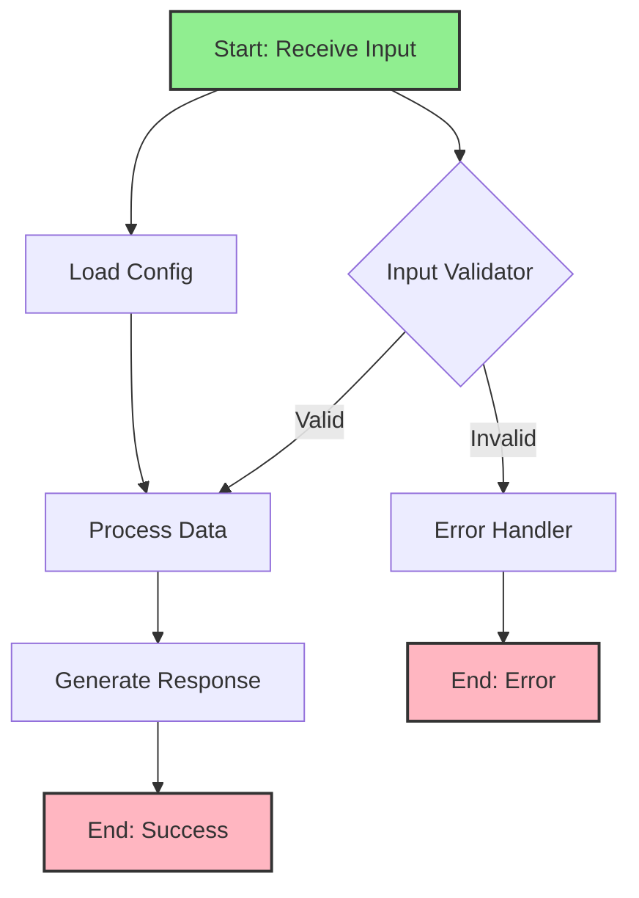

import { Card, CardHeader, CardTitle, CardDescription } from '@site/src/components/Card';
import { Callout } from '@site/src/components/Callout';
import { Features, Feature } from '@site/src/components/Features';
import { CollapsibleCodeBlock, InlineCodeCard } from '@site/src/components/CodeBlock';
import Tabs from '@theme/Tabs';
import TabItem from '@theme/TabItem';
import CodeBlock from '@theme/CodeBlock';

# Start Element

The Start element is the mandatory entry point for every flow in the HPC Neura Execution Engine. It serves as the initial node that receives input data and triggers the execution of downstream elements.

<Card>
  <CardHeader>
    <CardTitle>Element Overview</CardTitle>
  </CardHeader>
  

    <table>
      <tbody>
        <tr>
          <td><strong>Type</strong></td>
          <td><code>start</code></td>
        </tr>
        <tr>
          <td><strong>Category</strong></td>
          <td>Flow Control</td>
        </tr>
        <tr>
          <td><strong>L1 Requirements</strong></td>
          <td>Fixed schemas, no parameters</td>
        </tr>
        <tr>
          <td><strong>L2 Customizable</strong></td>
          <td>Name, description, processing message, tags, layer</td>
        </tr>
      </tbody>
    </table>
  

</Card>

## Purpose

<Features>
  <Feature title="Flow Entry Point" icon="/img/icons/arrow-right.svg">
    Serves as the single entry point for flow execution
  </Feature>
  <Feature title="Input Reception" icon="/img/icons/database.svg">
    Receives and validates initial flow inputs
  </Feature>
  <Feature title="Execution Trigger" icon="/img/icons/network.svg">
    Initiates downstream node execution
  </Feature>
</Features>

## Element Schema

<CollapsibleCodeBlock
  title="Complete Element Definition"
  description="L1 element template for Start"
  language="yaml"
  defaultCollapsed={false}
>
{`type: start
element_id: null  # Auto-generated at L2
name: null  # Set by L2
node_description: Entry point of a flow that receives initial inputs and passes them forward
description: null  # Customizable by L2
input_schema: {}  # No fixed inputs - accepts any data
output_schema: {}  # Outputs mirror inputs
parameter_schema_structure: {}  # No parameters
parameters: {}
processing_message: Starting flow...
tags:
    - flow-control
    - required
layer: null  # Set by L2
hyperparameters:
    type:
        access: fixed
    element_id:
        access: fixed
    name:
        access: edit
    description:
        access: edit
    input_schema:
        access: fixed
    output_schema:
        access: fixed
    processing_message:
        access: edit
    tags:
        access: append
    layer:
        access: edit`}
</CollapsibleCodeBlock>

## Key Characteristics

<Callout type="info">
The Start element has **no fixed input or output schemas**. It dynamically accepts whatever inputs are provided to the flow and passes them through unchanged to connected nodes.
</Callout>

### Input/Output Behavior

- **Inputs**: Accepts any data provided at flow initialization
- **Outputs**: Mirrors the received inputs exactly
- **No transformation**: Data passes through unchanged
- **No validation**: The Start element itself doesn't validate data types

## Usage Examples

### Basic Start Element

<CollapsibleCodeBlock
  title="Simple Start Element Configuration"
  description="Basic usage in a flow"
  language="yaml"
>
{`flow_definition:
  nodes:
    flow_start:
      type: start
      element_id: flow_start
      name: "Flow Entry Point"
      description: "Receives user input and begins processing"
      processing_message: "Initializing flow..."
      tags:
        - flow-control
        - required
        - entry-point
      layer: "input"
      
    # Connected nodes
    input_processor:
      type: custom
      # ... node configuration
      
  connections:
    # Start connects to downstream nodes
    - from_id: flow_start
      to_id: input_processor
      
  # Specify the start element
  start_element: flow_start`}
</CollapsibleCodeBlock>

### Start with Multiple Outputs

<CollapsibleCodeBlock
  title="Start Element with Fan-Out"
  description="Start element triggering multiple parallel paths"
  language="yaml"
>
{`flow_definition:
  nodes:
    main_start:
      type: start
      element_id: main_start
      name: "Multi-Path Start"
      description: "Initiates parallel processing paths"
      
    # Parallel processing paths
    user_validator:
      type: custom
      name: "User Validation"
      
    data_fetcher:
      type: rest_api
      name: "External Data Fetch"
      
    config_loader:
      type: constants
      name: "Configuration Loader"
      
  connections:
    # Start triggers multiple nodes in parallel
    - from_id: main_start
      to_id: user_validator
      
    - from_id: main_start
      to_id: data_fetcher
      
    - from_id: main_start
      to_id: config_loader
      
  start_element: main_start`}
</CollapsibleCodeBlock>

## Input Data Flow

<Tabs>
  <TabItem value="simple" label="Simple Input" default>
    

      <CollapsibleCodeBlock
        title="Simple Input Example"
        description="How data flows through Start element"
        language="yaml"
      >
{`# Flow execution input
initial_inputs:
  flow_start:
    user_message: "Hello, I need help"
    user_id: "user_123"
    session_id: "session_456"

# Start element receives and outputs
start_output:
  user_message: "Hello, I need help"
  user_id: "user_123"
  session_id: "session_456"
  
# Connected nodes receive the data
input_processor_input:
  user_message: "Hello, I need help"
  user_id: "user_123"
  session_id: "session_456"`}
      </CollapsibleCodeBlock>
    

  </TabItem>
  
  <TabItem value="empty" label="No Input">
    

      <CollapsibleCodeBlock
        title="Start with No Input"
        description="Start element can begin with empty inputs"
        language="yaml"
      >
{`# Flow execution with no initial input
initial_inputs:
  flow_start: {}

# Start element outputs empty object
start_output: {}

# Downstream nodes must handle empty input
# or get data from other sources (constants, metadata)`}
      </CollapsibleCodeBlock>
    

  </TabItem>
  
  <TabItem value="complex" label="Complex Input">
    

      <CollapsibleCodeBlock
        title="Complex Nested Input"
        description="Start handles any data structure"
        language="yaml"
      >
{`# Complex nested input data
initial_inputs:
  flow_start:
    request:
      type: "transaction"
      details:
        amount: 100.50
        currency: "USD"
        recipient: "0x742d35Cc..."
    metadata:
      timestamp: "2025-01-27T10:00:00Z"
      priority: "high"
    context:
      - previous_transaction_1
      - previous_transaction_2

# Start passes through unchanged
start_output:
  # Exact same structure as input`}
      </CollapsibleCodeBlock>
    

  </TabItem>
</Tabs>

## Connection Patterns

### Direct Connection

The most common pattern - Start connects directly to processing nodes:

### Parallel Initialization

Start can trigger multiple initialization tasks:

### With Input Distribution

Start can feed different inputs to different nodes:

<CollapsibleCodeBlock
  title="Input Distribution Pattern"
  description="Routing specific inputs to specific nodes"
  language="yaml"
>
{`# Initial inputs
initial_inputs:
  flow_start:
    user_data:
      id: "user_123"
      preferences: {...}
    request_data:
      action: "process"
      params: {...}
      
connections:
  # Route user data to validator
  - from_id: flow_start
    to_id: user_validator
    from_output: "flow_start:user_data"
    to_input: "user_validator:user"
    
  # Route request data to processor
  - from_id: flow_start
    to_id: request_processor
    from_output: "flow_start:request_data"
    to_input: "request_processor:request"`}
</CollapsibleCodeBlock>

## Best Practices

<Callout type="success" title="Start Element Best Practices">
✅ **Single Start**: Always have exactly one Start element per flow
✅ **Clear Naming**: Use descriptive names like "User Input Start" or "API Request Start"
✅ **Document Inputs**: Use the description field to document expected inputs
✅ **Parallel Init**: Use Start to trigger parallel initialization when possible
✅ **No Logic**: Keep Start simple - don't try to add processing logic
</Callout>

## Common Patterns

### Pattern 1: Validation After Start

<CollapsibleCodeBlock
  title="Input Validation Pattern"
  description="Validate inputs immediately after Start"
  language="yaml"
>
{`nodes:
  flow_start:
    type: start
    name: "API Request Start"
    description: "Receives API requests"
    
  input_validator:
    type: custom
    name: "Request Validator"
    code: |
      # Validate required fields
      if not inputs.get('api_key'):
          raise ValueError("API key required")
      if not inputs.get('action'):
          raise ValueError("Action required")
      output = inputs
      
connections:
  - from_id: flow_start
    to_id: input_validator`}
</CollapsibleCodeBlock>

### Pattern 2: Metadata Injection

<CollapsibleCodeBlock
  title="Metadata Addition Pattern"
  description="Add metadata immediately after Start"
  language="yaml"
>
{`nodes:
  flow_start:
    type: start
    name: "User Request Start"
    
  metadata_node:
    type: metadata
    name: "Execution Context"
    parameters:
      data:
        execution_id: "\$\{EXECUTION_ID}"
        timestamp: "\$\{TIMESTAMP}"
        environment: "production"
        
  merger_node:
    type: merger
    name: "Combine Input with Metadata"
    
connections:
  - from_id: flow_start
    to_id: merger_node
    to_input: "merger_node:data1"
    
  - from_id: metadata_node
    to_id: merger_node
    to_input: "merger_node:data2"`}
</CollapsibleCodeBlock>

## Error Handling

<Callout type="warning" title="Start Element Limitations">
The Start element **cannot**:
- Validate input data types
- Transform or modify data
- Make conditional decisions
- Handle errors directly

These operations must be performed by downstream nodes.
</Callout>

### Handling Missing Inputs

<CollapsibleCodeBlock
  title="Defensive Programming After Start"
  description="Handle potentially missing inputs"
  language="yaml"
>
{`nodes:
  flow_start:
    type: start
    
  safe_processor:
    type: custom
    code: |
      # Safely handle potentially missing inputs
      user_input = inputs.get('user_input', '')
      config = inputs.get('config', {})
      
      # Provide defaults
      if not user_input:
          user_input = "default query"
          
      output = {
          'processed_input': user_input,
          'config': config
      }`}
</CollapsibleCodeBlock>

## Visual Flow Example

## Technical Details

### Execution Behavior

1. **First to Execute**: Always the first node in the execution chain
2. **No Dependencies**: Cannot have incoming connections
3. **Triggers Downstream**: Automatically triggers connected nodes after completion
4. **Pass-Through**: No data transformation or processing
5. **Always Succeeds**: Cannot fail (unless system error)

### Memory Considerations

- **Lightweight**: Minimal memory footprint
- **No Caching**: Doesn't cache or store data
- **Immediate Release**: Releases input data after passing to downstream nodes

## Related Elements

  <Card>
    <CardHeader>
      <CardTitle>End Element</CardTitle>
      <CardDescription>
        Terminates flow execution
      </CardDescription>
    </CardHeader>
    

      <a href="./02-end" style={{ textDecoration: 'none' }}>
        Learn about End →
      </a>
    

  </Card>
  
  <Card>
    <CardHeader>
      <CardTitle>Input Elements</CardTitle>
      <CardDescription>
        Elements that provide data to flows
      </CardDescription>
    </CardHeader>
    

      <a href="../03-input-elements/01-chat-input" style={{ textDecoration: 'none' }}>
        Explore inputs →
      </a>
    

  </Card>

## Summary

The Start element is the essential entry point for every flow, providing:
- **Simple interface** for flow initialization
- **Flexible input handling** for any data structure  
- **Parallel execution** triggering
- **Clean separation** between flow entry and processing logic

Remember: Keep your Start element simple and let downstream nodes handle validation and processing.