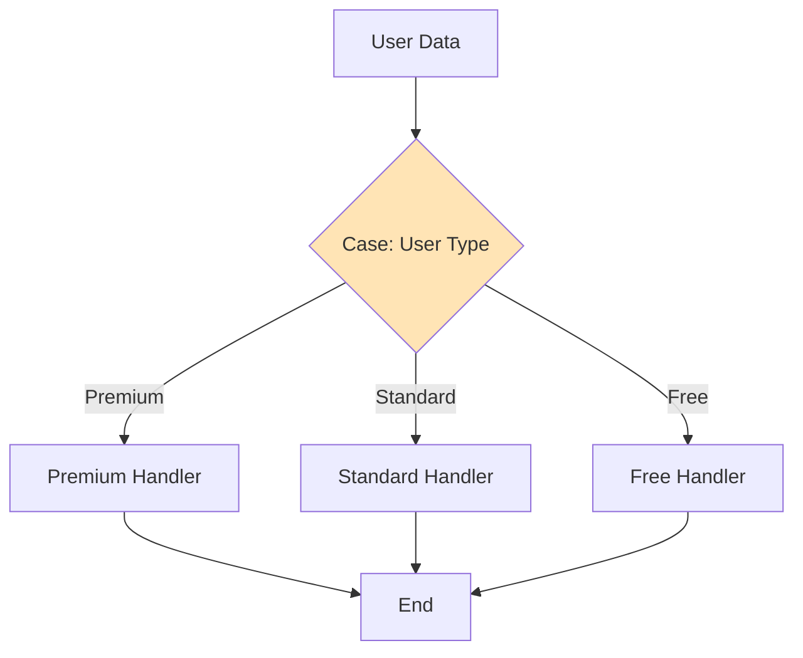
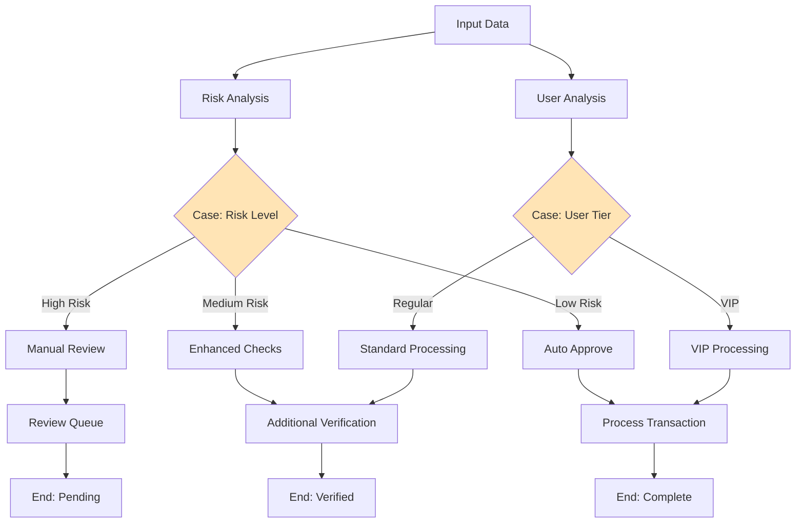

import { Card, CardHeader, CardTitle, CardDescription } from '@site/src/components/Card';
import { Callout } from '@site/src/components/Callout';
import { Features, Feature } from '@site/src/components/Features';
import { CollapsibleCodeBlock, InlineCodeCard } from '@site/src/components/CodeBlock';
import Tabs from '@theme/Tabs';
import TabItem from '@theme/TabItem';
import CodeBlock from '@theme/CodeBlock';

# Case Element

The Case element provides conditional branching in the HPC Neura Execution Engine. It evaluates conditions based on input variables and controls which downstream paths execute by managing the `downwards_execute` flag on connected nodes.

<Card>
  <CardHeader>
    <CardTitle>Element Overview</CardTitle>
  </CardHeader>
  

    <table>
      <tbody>
        <tr>
          <td><strong>Type</strong></td>
          <td><code>case</code></td>
        </tr>
        <tr>
          <td><strong>Category</strong></td>
          <td>Flow Control</td>
        </tr>
        <tr>
          <td><strong>Input</strong></td>
          <td><code>variables</code> (json) - Values to evaluate</td>
        </tr>
        <tr>
          <td><strong>Output</strong></td>
          <td><code>result</code> (json) - Boolean results for each case</td>
        </tr>
        <tr>
          <td><strong>Flow Control</strong></td>
          <td>Enables/disables downstream execution paths</td>
        </tr>
      </tbody>
    </table>
  

</Card>

## Purpose

<Features>
  <Feature title="Conditional Routing" icon="/img/icons/network.svg">
    Route flow execution based on conditions
  </Feature>
  <Feature title="Multi-Path Control" icon="/img/icons/ai-workflow.svg">
    Enable or disable multiple execution paths
  </Feature>
  <Feature title="Dynamic Decisions" icon="/img/icons/settings.svg">
    Make runtime decisions based on data
  </Feature>
</Features>

## How Case Works

<Callout type="info" title="Understanding Case Flow Control">
The Case element **doesn't route data** through connections. Instead, it:
1. Evaluates conditions against input variables
2. Outputs boolean results for each case
3. **Controls the `downwards_execute` flag** on downstream nodes
4. Nodes with `downwards_execute=false` are prevented from executing

This allows complex conditional flows without modifying the connection structure.
</Callout>

## Element Schema

<CollapsibleCodeBlock
  title="Complete Element Definition"
  description="L1 element template for Case"
  language="yaml"
  defaultCollapsed={false}
>
{`type: case
element_id: null  # Auto-generated at L2
name: null  # Set by L2
node_description: Conditional branching element that evaluates conditions and controls downstream execution paths
description: null  # Customizable by L2
input_schema:
  variables:
    type: json
    description: Dictionary of values to compare
    required: true
output_schema:
  result:
    type: json
    description: Dictionary of case IDs to boolean results
    required: true
parameter_schema_structure:
  cases:
    type: list
    description: List of case configurations with conditions
parameters:
  cases: []  # Configured by L2
processing_message: Evaluating conditions...
tags:
  - flow-control
  - conditional
layer: null  # Set by L2
hyperparameters:
  type:
    access: fixed
  element_id:
    access: fixed
  name:
    access: edit
  description:
    access: edit
  input_schema:
    access: fixed
  output_schema:
    access: fixed
  parameters.cases:
    access: edit
  processing_message:
    access: edit
  tags:
    access: append
  layer:
    access: edit
flow_control:
  type: case
  enabled: true`}
</CollapsibleCodeBlock>

## Case Configuration Structure

Each case in the `cases` parameter has this structure:

<CollapsibleCodeBlock
  title="Case Configuration Format"
  description="Structure of each case condition"
  language="yaml"
>
{`cases:
  - case_id:  # Unique identifier for this case
      variable1: "variable_name"  # Variable to check from inputs
      variable2: "value"          # Value to compare against
      compare: "operator"         # Comparison operator
      
# Supported operators:
# == : Equal to
# != : Not equal to
# >  : Greater than
# >= : Greater than or equal to
# <  : Less than
# <= : Less than or equal to
# in : Value in list
# contains : String/list contains value`}
</CollapsibleCodeBlock>

## Usage Examples

### Basic Conditional Routing

<CollapsibleCodeBlock
  title="Simple User Type Routing"
  description="Route based on user type"
  language="yaml"
>
{`flow_definition:
  nodes:
    user_classifier:
      type: metadata
      name: "User Data"
      output_schema:
        user_type:
          type: string
        subscription_level:
          type: string
          
    case_router:
      type: case
      element_id: case_router
      name: "User Type Router"
      description: "Routes based on user subscription"
      parameters:
        cases:
          - premium_route:
              variable1: subscription_level
              variable2: "premium"
              compare: "=="
          - standard_route:
              variable1: subscription_level
              variable2: "standard"
              compare: "=="
              
    premium_handler:
      type: llm_text
      name: "Premium AI Response"
      parameters:
        model: "gpt-4"
        max_tokens: 2000
        
    standard_handler:
      type: llm_text
      name: "Standard AI Response"
      parameters:
        model: "gpt-3.5"
        max_tokens: 1000
        
  connections:
    # Send user data to case
    - from_id: user_classifier
      to_id: case_router
      from_output: "user_classifier:subscription_level"
      to_input: "case_router:variables.subscription_level"
      
    # Connect to both handlers (case controls which executes)
    - from_id: case_router
      to_id: premium_handler
      # This connection is active only if premium_route is true
      
    - from_id: case_router
      to_id: standard_handler
      # This connection is active only if standard_route is true`}
</CollapsibleCodeBlock>

### Multiple Condition Evaluation

<CollapsibleCodeBlock
  title="Complex Multi-Condition Case"
  description="Evaluate multiple conditions for sophisticated routing"
  language="yaml"
>
{`nodes:
  transaction_analyzer:
    type: llm_structured
    name: "Analyze Transaction"
    output_schema:
      amount:
        type: float
      risk_score:
        type: float
      user_tier:
        type: string
      is_international:
        type: bool
        
  case_processor:
    type: case
    name: "Transaction Router"
    description: "Routes based on multiple transaction factors"
    parameters:
      cases:
        - high_value_premium:
            variable1: amount
            variable2: 10000
            compare: ">="
        - high_risk:
            variable1: risk_score
            variable2: 0.7
            compare: ">"
        - international_transfer:
            variable1: is_international
            variable2: true
            compare: "=="
        - vip_user:
            variable1: user_tier
            variable2: "VIP"
            compare: "=="
            
  # Different handlers for different cases
  manual_review:
    type: custom
    name: "Manual Review Queue"
    # Activated for high_risk OR high_value_premium
    
  enhanced_kyc:
    type: rest_api
    name: "Enhanced KYC Check"
    # Activated for international_transfer
    
  vip_processor:
    type: llm_text
    name: "VIP Fast Track"
    # Activated for vip_user
    
  standard_processor:
    type: custom
    name: "Standard Processing"
    # Default processor
    
connections:
  # Route all variables to case
  - from_id: transaction_analyzer
    to_id: case_processor
    from_output: "transaction_analyzer:amount"
    to_input: "case_processor:variables.amount"
    
  - from_id: transaction_analyzer
    to_id: case_processor
    from_output: "transaction_analyzer:risk_score"
    to_input: "case_processor:variables.risk_score"
    
  - from_id: transaction_analyzer
    to_id: case_processor
    from_output: "transaction_analyzer:is_international"
    to_input: "case_processor:variables.is_international"
    
  - from_id: transaction_analyzer
    to_id: case_processor
    from_output: "transaction_analyzer:user_tier"
    to_input: "case_processor:variables.user_tier"`}
</CollapsibleCodeBlock>

### Nested Case Logic

<CollapsibleCodeBlock
  title="Cascading Case Elements"
  description="Multiple case elements for complex logic"
  language="yaml"
>
{`nodes:
  primary_case:
    type: case
    name: "Primary Router"
    parameters:
      cases:
        - business_path:
            variable1: account_type
            variable2: "business"
            compare: "=="
        - personal_path:
            variable1: account_type
            variable2: "personal"
            compare: "=="
            
  business_sub_case:
    type: case
    name: "Business Type Router"
    parameters:
      cases:
        - enterprise:
            variable1: business_size
            variable2: "enterprise"
            compare: "=="
        - small_business:
            variable1: business_size
            variable2: "small"
            compare: "=="
            
  personal_sub_case:
    type: case
    name: "Personal Tier Router"
    parameters:
      cases:
        - premium_personal:
            variable1: account_tier
            variable2: "premium"
            compare: "=="
        - basic_personal:
            variable1: account_tier
            variable2: "basic"
            compare: "=="`}
</CollapsibleCodeBlock>

## Input Variable Patterns

<Tabs>
  <TabItem value="simple" label="Simple Variables" default>
    

      <CollapsibleCodeBlock
        title="Single Variable Input"
        description="Basic variable passing"
        language="yaml"
      >
{`# Source node output
metadata_output:
  user_type: "premium"
  status: "active"
  
# Case input
case_input:
  variables:
    user_type: "premium"
    status: "active"
    
# Case evaluation
cases:
  - premium_active:
      variable1: user_type
      variable2: "premium"
      compare: "=="
  - is_active:
      variable1: status
      variable2: "active"
      compare: "=="
      
# Case output
case_output:
  result:
    premium_active: true
    is_active: true`}
      </CollapsibleCodeBlock>
    

  </TabItem>
  
  <TabItem value="complex" label="Complex Variables">
    

      <CollapsibleCodeBlock
        title="Multiple Source Variables"
        description="Combining variables from multiple sources"
        language="yaml"
      >
{`# Multiple source nodes
user_data_output:
  subscription: "enterprise"
  region: "US"
  
transaction_data_output:
  amount: 50000
  currency: "USD"
  
risk_analysis_output:
  risk_score: 0.3
  flags: ["large_amount", "first_time"]
  
# Aggregated case input
case_input:
  variables:
    subscription: "enterprise"
    region: "US"
    amount: 50000
    currency: "USD"
    risk_score: 0.3
    has_flags: true  # Computed from flags list
    
# Complex case evaluation
cases:
  - enterprise_high_value:
      variable1: subscription
      variable2: "enterprise"
      compare: "=="
  - high_transaction:
      variable1: amount
      variable2: 10000
      compare: ">"
  - low_risk:
      variable1: risk_score
      variable2: 0.5
      compare: "<"
  - us_region:
      variable1: region
      variable2: "US"
      compare: "=="`}
      </CollapsibleCodeBlock>
    

  </TabItem>
  
  <TabItem value="computed" label="Computed Variables">
    

      <CollapsibleCodeBlock
        title="Pre-computed Variables"
        description="Computing variables before case evaluation"
        language="yaml"
      >
{`nodes:
  data_preprocessor:
    type: custom
    name: "Compute Case Variables"
    code: |
      # Compute derived variables for case logic
      user = inputs['user_data']
      transaction = inputs['transaction_data']
      
      # Compute account age in days
      account_age = (datetime.now() - user['created_at']).days
      
      # Compute transaction velocity
      tx_count = len(transaction['recent_transactions'])
      tx_velocity = tx_count / 30  # per day
      
      # Risk factors
      is_new_user = account_age < 30
      is_high_velocity = tx_velocity > 10
      is_large_amount = transaction['amount'] > 5000
      
      output['case_variables'] = {
          'account_age': account_age,
          'is_new_user': is_new_user,
          'transaction_velocity': tx_velocity,
          'is_high_velocity': is_high_velocity,
          'is_large_amount': is_large_amount,
          'risk_level': 'high' if (is_new_user and is_large_amount) else 'normal'
      }
      
  risk_case:
    type: case
    name: "Risk-based Router"
    parameters:
      cases:
        - high_risk_new_user:
            variable1: is_new_user
            variable2: true
            compare: "=="
        - high_velocity:
            variable1: is_high_velocity
            variable2: true
            compare: "=="
        - manual_review:
            variable1: risk_level
            variable2: "high"
            compare: "=="`}
      </CollapsibleCodeBlock>
    

  </TabItem>
</Tabs>

## Comparison Operators

<Card>
  <CardHeader>
    <CardTitle>Supported Comparison Operators</CardTitle>
  </CardHeader>
  

    <table>
      <thead>
        <tr>
          <th>Operator</th>
          <th>Description</th>
          <th>Example</th>
          <th>Supported Types</th>
        </tr>
      </thead>
      <tbody>
        <tr>
          <td><code>==</code></td>
          <td>Equal to</td>
          <td>status == "active"</td>
          <td>All types</td>
        </tr>
        <tr>
          <td><code>!=</code></td>
          <td>Not equal to</td>
          <td>status != "blocked"</td>
          <td>All types</td>
        </tr>
        <tr>
          <td><code>&gt;</code></td>
          <td>Greater than</td>
          <td>amount &gt; 1000</td>
          <td>Numbers</td>
        </tr>
        <tr>
          <td><code>&gt;=</code></td>
          <td>Greater than or equal</td>
          <td>age &gt;= 18</td>
          <td>Numbers</td>
        </tr>
        <tr>
          <td><code>&lt;</code></td>
          <td>Less than</td>
          <td>risk_score &lt; 0.5</td>
          <td>Numbers</td>
        </tr>
        <tr>
          <td><code>&lt;=</code></td>
          <td>Less than or equal</td>
          <td>count &lt;= 10</td>
          <td>Numbers</td>
        </tr>
        <tr>
          <td><code>in</code></td>
          <td>Value in list</td>
          <td>region in ["US", "EU", "UK"]</td>
          <td>Lists</td>
        </tr>
        <tr>
          <td><code>contains</code></td>
          <td>Contains substring/element</td>
          <td>tags contains "premium"</td>
          <td>Strings, Lists</td>
        </tr>
      </tbody>
    </table>
  

</Card>

## Flow Control Mechanism

<Callout type="important" title="How Case Controls Flow">
The Case element uses a sophisticated mechanism to control flow:

1. **Connection Mapping**: Each case ID is mapped to specific downstream connections
2. **Flag Control**: Sets `downwards_execute=true` for matching cases, `false` for non-matching
3. **Multiple Paths**: Multiple cases can be true, enabling parallel execution paths
4. **Default Handling**: Nodes not mapped to any case remain unaffected
</Callout>

### Understanding downwards_execute

<CollapsibleCodeBlock
  title="Flow Control Example"
  description="How Case controls downstream execution"
  language="yaml"
>
{`# Initial state - all nodes can execute
nodes:
  case_router:
    type: case
    downwards_execute: true
    
  path_a_handler:
    type: llm_text
    downwards_execute: true  # Default
    
  path_b_handler:
    type: llm_text
    downwards_execute: true  # Default
    
# Case evaluation
case_router.evaluate({
  variables: { user_type: "premium" },
  cases: [
    { path_a: { variable1: "user_type", variable2: "premium", compare: "==" }},
    { path_b: { variable1: "user_type", variable2: "standard", compare: "==" }}
  ]
})

# Result
case_output:
  result:
    path_a: true   # user_type == "premium"
    path_b: false  # user_type != "standard"
    
# Case modifies downstream nodes
path_a_handler.downwards_execute = true   # Can execute
path_b_handler.downwards_execute = false  # Blocked from execution

# Only path_a_handler will execute`}
</CollapsibleCodeBlock>

## Common Patterns

### Pattern 1: Multi-Tier Routing

<CollapsibleCodeBlock
  title="Service Tier Routing"
  description="Route to different service levels"
  language="yaml"
>
{`nodes:
  tier_analyzer:
    type: custom
    name: "Analyze User Tier"
    code: |
      user = inputs['user_data']
      
      # Calculate tier based on multiple factors
      total_spent = user.get('lifetime_value', 0)
      account_age = user.get('account_age_days', 0)
      support_tickets = user.get('support_tickets', 0)
      
      if total_spent > 10000 and account_age > 365:
          tier = "platinum"
      elif total_spent > 5000 or account_age > 180:
          tier = "gold"
      elif total_spent > 1000:
          tier = "silver"
      else:
          tier = "bronze"
          
      output['tier'] = tier
      output['benefits'] = {
          'platinum': ['24/7 support', 'dedicated manager', 'priority processing'],
          'gold': ['priority support', 'faster processing'],
          'silver': ['extended support hours'],
          'bronze': ['standard support']
      }.get(tier, [])
      
  tier_router:
    type: case
    name: "Tier-based Router"
    parameters:
      cases:
        - platinum_path:
            variable1: tier
            variable2: "platinum"
            compare: "=="
        - gold_path:
            variable1: tier
            variable2: "gold"
            compare: "=="
        - silver_path:
            variable1: tier
            variable2: "silver"
            compare: "=="
        - bronze_path:
            variable1: tier
            variable2: "bronze"
            compare: "=="`}
</CollapsibleCodeBlock>

### Pattern 2: Risk-Based Processing

<CollapsibleCodeBlock
  title="Risk Assessment Routing"
  description="Route based on risk levels"
  language="yaml"
>
{`nodes:
  risk_calculator:
    type: llm_structured
    name: "Calculate Risk Score"
    output_schema:
      risk_score:
        type: float
        description: "Risk score 0-1"
      risk_factors:
        type: list
        description: "List of risk factors"
      requires_review:
        type: bool
        
  risk_router:
    type: case
    name: "Risk-based Router"
    parameters:
      cases:
        - high_risk:
            variable1: risk_score
            variable2: 0.7
            compare: ">"
        - medium_risk:
            variable1: risk_score
            variable2: 0.4
            compare: ">"
        - manual_review_required:
            variable1: requires_review
            variable2: true
            compare: "=="
        - auto_approve:
            variable1: risk_score
            variable2: 0.2
            compare: "<"
            
  # Different handlers for each risk level
  high_risk_handler:
    type: custom
    name: "High Risk - Block"
    
  medium_risk_handler:
    type: custom
    name: "Medium Risk - Additional Checks"
    
  manual_review_queue:
    type: rest_api
    name: "Send to Manual Review"
    
  auto_approval:
    type: custom
    name: "Automatic Approval"`}
</CollapsibleCodeBlock>

### Pattern 3: Feature Flag Routing

<CollapsibleCodeBlock
  title="Feature Flag Based Routing"
  description="Enable features based on flags"
  language="yaml"
>
{`nodes:
  feature_checker:
    type: metadata
    name: "Check Feature Flags"
    parameters:
      data:
        beta_features: true
        ai_enhanced: true
        blockchain_enabled: false
        legacy_mode: false
        
  feature_router:
    type: case
    name: "Feature-based Router"
    parameters:
      cases:
        - beta_path:
            variable1: beta_features
            variable2: true
            compare: "=="
        - ai_enhanced_path:
            variable1: ai_enhanced
            variable2: true
            compare: "=="
        - blockchain_path:
            variable1: blockchain_enabled
            variable2: true
            compare: "=="
        - legacy_path:
            variable1: legacy_mode
            variable2: true
            compare: "=="
            
  # Feature-specific handlers
  beta_handler:
    type: llm_text
    name: "Beta AI Model"
    parameters:
      model: "gpt-4-beta"
      
  standard_handler:
    type: llm_text
    name: "Standard AI Model"
    parameters:
      model: "gpt-3.5"
      
  blockchain_handler:
    type: build_transaction_json
    name: "Blockchain Features"
    # Only executes if blockchain_enabled=true`}
</CollapsibleCodeBlock>

## Best Practices

<Callout type="success" title="Case Element Best Practices">
✅ **Clear Case Names**: Use descriptive case IDs that indicate their purpose
✅ **Complete Coverage**: Consider all possible variable values
✅ **Default Path**: Always have a fallback for unexpected values
✅ **Avoid Overlaps**: Make cases mutually exclusive when possible
✅ **Test All Paths**: Verify each case triggers the correct downstream nodes
✅ **Document Logic**: Use descriptions to explain complex conditions
</Callout>

## Error Handling

### Missing Variables

<CollapsibleCodeBlock
  title="Handle Missing Variables"
  description="Safely handle undefined variables"
  language="yaml"
>
{`nodes:
  safe_preprocessor:
    type: custom
    name: "Safe Variable Prep"
    code: |
      # Safely extract variables with defaults
      user_type = inputs.get('user_type', 'standard')
      risk_score = inputs.get('risk_score', 0.5)
      amount = inputs.get('amount', 0)
      
      # Ensure variables exist for case
      output['case_vars'] = {
          'user_type': user_type,
          'risk_score': risk_score,
          'amount': amount,
          'has_data': bool(inputs)
      }
      
  safe_case:
    type: case
    name: "Case with Defaults"
    parameters:
      cases:
        - no_data_path:
            variable1: has_data
            variable2: false
            compare: "=="
        - standard_path:
            variable1: user_type
            variable2: "standard"
            compare: "=="`}
</CollapsibleCodeBlock>

### Type Mismatches

<CollapsibleCodeBlock
  title="Handle Type Conversions"
  description="Ensure correct types for comparison"
  language="yaml"
>
{`nodes:
  type_converter:
    type: custom
    name: "Ensure Correct Types"
    code: |
      # Convert to correct types for case comparison
      amount_str = str(inputs.get('amount', '0'))
      try:
          amount_float = float(amount_str)
      except:
          amount_float = 0.0
          
      risk_score = inputs.get('risk_score')
      if isinstance(risk_score, str):
          try:
              risk_score = float(risk_score)
          except:
              risk_score = 0.5
              
      output['normalized'] = {
          'amount': amount_float,
          'risk_score': risk_score,
          'is_number': isinstance(amount_float, (int, float))
      }`}
</CollapsibleCodeBlock>

## Visual Flow Examples

### Simple Case Flow

### Complex Multi-Case Flow

## Technical Details

### Execution Behavior

1. **Evaluates All Cases**: All conditions are evaluated, not short-circuited
2. **Parallel Evaluation**: Cases are independent and evaluated in parallel
3. **Output Generation**: Creates result dictionary with all case outcomes
4. **Flow Control**: Modifies `downwards_execute` on connected nodes
5. **Continues Execution**: Case itself continues to downstream nodes

### Performance Considerations

- **Lightweight Comparisons**: Simple operations, minimal overhead
- **Scalable**: Can handle many cases efficiently
- **No Data Transformation**: Pure routing logic
- **Immediate Evaluation**: No delays in case processing

## Related Elements

  <Card>
    <CardHeader>
      <CardTitle>Flow Select Element</CardTitle>
      <CardDescription>
        Simpler path selection without conditions
      </CardDescription>
    </CardHeader>
    

      <a href="./04-flow-select" style={{ textDecoration: 'none' }}>
        Compare with Flow Select →
      </a>
    

  </Card>
  
  <Card>
    <CardHeader>
      <CardTitle>Custom Element</CardTitle>
      <CardDescription>
        For complex conditional logic
      </CardDescription>
    </CardHeader>
    

      <a href="../07-custom-elements/01-custom" style={{ textDecoration: 'none' }}>
        Advanced logic →
      </a>
    

  </Card>

## Summary

The Case element provides powerful conditional routing by:
- **Evaluating multiple conditions** against input variables
- **Controlling execution paths** via the `downwards_execute` mechanism
- **Supporting complex logic** with various comparison operators
- **Enabling parallel paths** when multiple conditions are true

Remember: Case elements control **which nodes execute**, not how data flows. Design your flows with clear, non-overlapping cases for maintainable conditional logic.