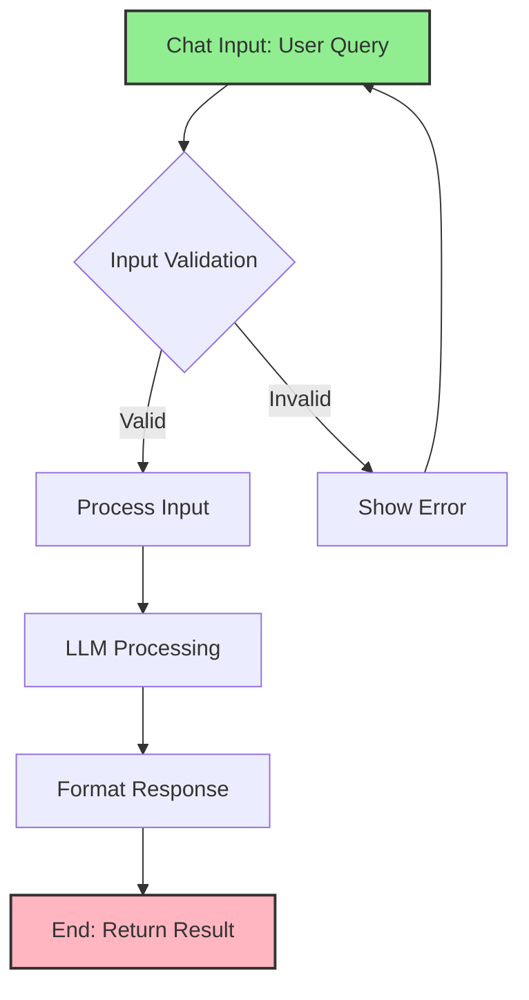

import { Card, CardHeader, CardTitle, CardDescription } from '@site/src/components/Card';
import { Callout } from '@site/src/components/Callout';
import { Features, Feature } from '@site/src/components/Features';
import { CollapsibleCodeBlock, InlineCodeCard } from '@site/src/components/CodeBlock';
import Tabs from '@theme/Tabs';
import TabItem from '@theme/TabItem';
import CodeBlock from '@theme/CodeBlock';

# Chat Input Element

The Chat Input element captures user text input in the HPC Neura Execution Engine. It serves as the primary interface for collecting user messages, queries, or commands that will be processed by downstream elements in the flow.

<Card>
  <CardHeader>
    <CardTitle>Element Overview</CardTitle>
  </CardHeader>
  

    <table>
      <tbody>
        <tr>
          <td><strong>Type</strong></td>
          <td><code>chat_input</code></td>
        </tr>
        <tr>
          <td><strong>Category</strong></td>
          <td>Input Elements</td>
        </tr>
        <tr>
          <td><strong>Output</strong></td>
          <td><code>chat_input</code> (string) - The user's text input</td>
        </tr>
        <tr>
          <td><strong>L2 Customizable</strong></td>
          <td>Name, description, placeholder, validation, processing message, tags, layer</td>
        </tr>
      </tbody>
    </table>
  

</Card>

## Purpose

<Features>
  <Feature title="User Text Capture" icon="/img/icons/frontend.svg">
    Captures free-form text input from users
  </Feature>
  <Feature title="Query Collection" icon="/img/icons/database.svg">
    Collects questions, commands, or messages
  </Feature>
  <Feature title="Flow Initiation" icon="/img/icons/arrow-right.svg">
    Often serves as the starting point for user interactions
  </Feature>
</Features>

## Element Schema

<CollapsibleCodeBlock
  title="Complete Element Definition"
  description="L1 element template for Chat Input"
  language="yaml"
  defaultCollapsed={false}
>
{`type: chat_input
element_id: null  # Auto-generated at L2
name: null  # Set by L2
node_description: Captures user text input for processing
description: null  # Customizable by L2
input_schema: {}  # No inputs - receives from L3 user
output_schema:
  chat_input:
    type: string
    description: The text entered by the user
    required: true
parameter_schema_structure:
  placeholder:
    type: string
    description: Placeholder text shown in input field
  max_length:
    type: int
    description: Maximum character length allowed
  min_length:
    type: int
    description: Minimum character length required
  validation_pattern:
    type: string
    description: Regex pattern for input validation
  required:
    type: bool
    description: Whether input is required
parameters:
  placeholder: "Enter your message..."
  max_length: 1000
  min_length: 1
  validation_pattern: null
  required: true
processing_message: Receiving input...
tags:
  - input
  - user-interaction
  - text
layer: null  # Set by L2
hyperparameters:
  type:
    access: fixed
  element_id:
    access: fixed
  name:
    access: edit
  description:
    access: edit
  input_schema:
    access: fixed
  output_schema:
    access: fixed
  parameters.placeholder:
    access: edit
  parameters.max_length:
    access: edit
  parameters.min_length:
    access: edit
  parameters.validation_pattern:
    access: edit
  parameters.required:
    access: edit
  processing_message:
    access: edit
  tags:
    access: append
  layer:
    access: edit`}
</CollapsibleCodeBlock>

## Key Characteristics

<Callout type="info">
The Chat Input element **receives input from L3 users**, not from other nodes. It transforms user-provided text into a structured output that can be consumed by downstream elements.
</Callout>

### Input/Output Behavior

- **Inputs**: None from flow (receives from L3 user interface)
- **Outputs**: Single string value containing user text
- **Validation**: Optional pattern matching and length constraints
- **Required**: Can be configured as optional or mandatory

## Usage Examples

### Basic Chat Input

<CollapsibleCodeBlock
  title="Simple Chat Input Configuration"
  description="Basic setup for user text input"
  language="yaml"
>
{`flow_definition:
  nodes:
    user_query:
      type: chat_input
      element_id: user_query
      name: "User Question"
      description: "Captures user's question or request"
      parameters:
        placeholder: "Ask me anything..."
        max_length: 500
        required: true
      processing_message: "Processing your question..."
      tags:
        - input
        - user-interaction
        - question
      layer: "input"
      
    # Connected processor
    ai_responder:
      type: llm_text
      name: "AI Response Generator"
      
  connections:
    - from_id: user_query
      to_id: ai_responder
      from_output: "user_query:chat_input"
      to_input: "ai_responder:prompt"`}
</CollapsibleCodeBlock>

### Chat Input with Validation

<CollapsibleCodeBlock
  title="Validated Input Configuration"
  description="Chat input with pattern validation"
  language="yaml"
>
{`nodes:
  email_input:
    type: chat_input
    element_id: email_input
    name: "Email Address Input"
    description: "Captures user email for support"
    parameters:
      placeholder: "Enter your email address"
      max_length: 100
      min_length: 5
      validation_pattern: "^[a-zA-Z0-9._%+-]+@[a-zA-Z0-9.-]+\\.[a-zA-Z]{2,}$"
      required: true
    processing_message: "Validating email..."
    
  ticket_description:
    type: chat_input
    element_id: ticket_description
    name: "Issue Description"
    description: "Detailed description of the problem"
    parameters:
      placeholder: "Describe your issue in detail..."
      max_length: 2000
      min_length: 20
      required: true
    processing_message: "Recording your issue..."`}
</CollapsibleCodeBlock>

### Multiple Chat Inputs

<CollapsibleCodeBlock
  title="Multi-Input Form Pattern"
  description="Collecting multiple pieces of information"
  language="yaml"
>
{`nodes:
  user_name:
    type: chat_input
    name: "Name Input"
    parameters:
      placeholder: "Enter your full name"
      max_length: 100
      required: true
      
  user_company:
    type: chat_input
    name: "Company Input"
    parameters:
      placeholder: "Enter your company name"
      max_length: 200
      required: false
      
  user_request:
    type: chat_input
    name: "Request Details"
    parameters:
      placeholder: "What can we help you with today?"
      max_length: 1000
      min_length: 10
      required: true
      
  # Merge inputs
  input_merger:
    type: merger
    name: "Combine User Inputs"
    
connections:
  - from_id: user_name
    to_id: input_merger
    from_output: "user_name:chat_input"
    to_input: "input_merger:data1.name"
    
  - from_id: user_company
    to_id: input_merger
    from_output: "user_company:chat_input"
    to_input: "input_merger:data1.company"
    
  - from_id: user_request
    to_id: input_merger
    from_output: "user_request:chat_input"
    to_input: "input_merger:data2.request"`}
</CollapsibleCodeBlock>

## Output Format

<Tabs>
  <TabItem value="basic" label="Basic Output" default>
    

      <CollapsibleCodeBlock
        title="Standard Chat Input Output"
        description="Simple string output"
        language="yaml"
      >
{`# User enters: "What is the weather today?"

# Chat input output
chat_input_output:
  chat_input: "What is the weather today?"
  
# Downstream node receives
ai_processor_input:
  prompt: "What is the weather today?"`}
      </CollapsibleCodeBlock>
    

  </TabItem>
  
  <TabItem value="empty" label="Empty Input">
    

      <CollapsibleCodeBlock
        title="Handling Empty Input"
        description="When user provides no text"
        language="yaml"
      >
{`# If required: false
chat_input_output:
  chat_input: ""
  
# If required: true
# Element will not complete until valid input provided`}
      </CollapsibleCodeBlock>
    

  </TabItem>
  
  <TabItem value="validated" label="Validated Input">
    

      <CollapsibleCodeBlock
        title="Validation Examples"
        description="How validation affects output"
        language="yaml"
      >
{`# Email validation pattern
validation_pattern: "^[\\w.-]+@[\\w.-]+\\.\\w+$"

# Valid input: "user@example.com"
output:
  chat_input: "user@example.com"
  
# Invalid input: "not-an-email"
# Element shows validation error
# User must correct input

# Length validation
min_length: 10
max_length: 100

# Too short: "Hi"
# Shows error: "Minimum 10 characters required"

# Valid: "This is my detailed question"
output:
  chat_input: "This is my detailed question"`}
      </CollapsibleCodeBlock>
    

  </TabItem>
</Tabs>

## Common Patterns

### Pattern 1: Conversational Interface

<CollapsibleCodeBlock
  title="Chat-Based Flow"
  description="Building conversational experiences"
  language="yaml"
>
{`nodes:
  # Initial user input
  user_message:
    type: chat_input
    name: "User Message"
    parameters:
      placeholder: "Type your message..."
      max_length: 500
      
  # Get conversation history
  chat_history:
    type: context_history
    name: "Previous Messages"
    
  # Generate AI response
  ai_response:
    type: llm_text
    name: "AI Assistant"
    parameters:
      wrapper_prompt: |
        You are a helpful assistant.
        
        Conversation history:
        {context}
        
        User: {prompt}
        Assistant:
        
connections:
  - from_id: user_message
    to_id: ai_response
    from_output: "user_message:chat_input"
    to_input: "ai_response:prompt"
    
  - from_id: chat_history
    to_id: ai_response
    from_output: "chat_history:history"
    to_input: "ai_response:context"`}
</CollapsibleCodeBlock>

### Pattern 2: Form Collection

<CollapsibleCodeBlock
  title="Multi-Field Form Pattern"
  description="Collecting structured information"
  language="yaml"
>
{`nodes:
  # Form fields
  field_name:
    type: chat_input
    name: "Full Name"
    parameters:
      placeholder: "John Doe"
      validation_pattern: "^[a-zA-Z\\s]+$"
      
  field_phone:
    type: chat_input
    name: "Phone Number"
    parameters:
      placeholder: "+1 (555) 123-4567"
      validation_pattern: "^[\\+\\d\\s\\(\\)-]+$"
      
  field_message:
    type: chat_input
    name: "Message"
    parameters:
      placeholder: "How can we help?"
      min_length: 20
      max_length: 1000
      
  # Process form
  form_processor:
    type: custom
    name: "Submit Form"
    code: |
      output['submission'] = {
          'name': inputs['name'],
          'phone': inputs['phone'],
          'message': inputs['message'],
          'timestamp': datetime.now().isoformat()
      }`}
</CollapsibleCodeBlock>

### Pattern 3: Command Interface

<CollapsibleCodeBlock
  title="Command-Based Input"
  description="Processing user commands"
  language="yaml"
>
{`nodes:
  command_input:
    type: chat_input
    name: "Command Input"
    parameters:
      placeholder: "Enter command (e.g., /help, /status, /transfer)"
      validation_pattern: "^/[a-zA-Z]+.*$"  # Must start with /
      
  command_parser:
    type: custom
    name: "Parse Command"
    code: |
      command_text = inputs['command']
      parts = command_text.split()
      
      output['command'] = parts[0][1:]  # Remove /
      output['args'] = parts[1:] if len(parts) > 1 else []
      output['raw'] = command_text
      
  command_router:
    type: case
    name: "Route Command"
    parameters:
      cases:
        - help_command:
            variable1: command
            variable2: "help"
            compare: "=="
        - status_command:
            variable1: command
            variable2: "status"
            compare: "=="
        - transfer_command:
            variable1: command
            variable2: "transfer"
            compare: "=="`}
</CollapsibleCodeBlock>

## Configuration Options

<Card>
  <CardHeader>
    <CardTitle>Parameter Reference</CardTitle>
  </CardHeader>
  

    <table>
      <thead>
        <tr>
          <th>Parameter</th>
          <th>Type</th>
          <th>Default</th>
          <th>Description</th>
        </tr>
      </thead>
      <tbody>
        <tr>
          <td><code>placeholder</code></td>
          <td>string</td>
          <td>"Enter your message..."</td>
          <td>Hint text shown in empty input</td>
        </tr>
        <tr>
          <td><code>max_length</code></td>
          <td>int</td>
          <td>1000</td>
          <td>Maximum characters allowed</td>
        </tr>
        <tr>
          <td><code>min_length</code></td>
          <td>int</td>
          <td>1</td>
          <td>Minimum characters required</td>
        </tr>
        <tr>
          <td><code>validation_pattern</code></td>
          <td>string</td>
          <td>null</td>
          <td>Regex pattern for validation</td>
        </tr>
        <tr>
          <td><code>required</code></td>
          <td>bool</td>
          <td>true</td>
          <td>Whether input is mandatory</td>
        </tr>
      </tbody>
    </table>
  

</Card>

## Best Practices

<Callout type="success" title="Chat Input Best Practices">
✅ **Clear Placeholders**: Use descriptive placeholder text to guide users
✅ **Appropriate Limits**: Set reasonable min/max lengths for the use case
✅ **Validation Patterns**: Use regex only when format is critical
✅ **Error Messages**: Configure clear validation error messages
✅ **Optional vs Required**: Make fields optional when possible
✅ **Accessibility**: Ensure labels and descriptions are clear
</Callout>

## Error Handling

### Validation Errors

<CollapsibleCodeBlock
  title="Common Validation Scenarios"
  description="Handling input validation"
  language="yaml"
>
{`# Length validation
parameters:
  min_length: 10
  max_length: 500
  
# User input: "Hi"
# Error: "Input must be at least 10 characters"

# Pattern validation
parameters:
  validation_pattern: "^[A-Z][a-z]+$"  # Capitalized word
  
# User input: "john"
# Error: "Input must match the required format"

# Required validation
parameters:
  required: true
  
# User input: "" (empty)
# Error: "This field is required"`}
</CollapsibleCodeBlock>

### Handling Special Characters

<CollapsibleCodeBlock
  title="Special Character Handling"
  description="Dealing with special input"
  language="yaml"
>
{`nodes:
  safe_input:
    type: chat_input
    name: "Safe Text Input"
    parameters:
      # Allow alphanumeric, spaces, basic punctuation
      validation_pattern: "^[a-zA-Z0-9\\s.,!?'-]+$"
      
  code_input:
    type: chat_input
    name: "Code Snippet"
    parameters:
      # No validation - allow all characters
      validation_pattern: null
      max_length: 5000
      
  # Sanitize after input
  input_sanitizer:
    type: custom
    name: "Sanitize Input"
    code: |
      import re
      text = inputs['raw_input']
      
      # Remove potential injection attempts
      sanitized = re.sub(r'[<>\"\'&]', '', text)
      
      # Normalize whitespace
      sanitized = ' '.join(sanitized.split())
      
      output['clean_input'] = sanitized`}
</CollapsibleCodeBlock>

## Integration Examples

### With LLM Processing

<CollapsibleCodeBlock
  title="Chat Input to LLM"
  description="Common integration pattern"
  language="yaml"
>
{`nodes:
  user_question:
    type: chat_input
    name: "Ask a Question"
    parameters:
      placeholder: "What would you like to know?"
      max_length: 500
      
  context_enhancer:
    type: custom
    name: "Add Context"
    code: |
      output['enhanced_prompt'] = f"""
      User Question: {inputs['question']}
      
      Please provide a helpful, accurate response.
      """
      
  ai_responder:
    type: llm_text
    name: "Generate Answer"
    parameters:
      temperature: 0.7
      max_tokens: 1000
      
connections:
  - from_id: user_question
    to_id: context_enhancer
    from_output: "user_question:chat_input"
    to_input: "context_enhancer:question"
    
  - from_id: context_enhancer
    to_id: ai_responder
    from_output: "context_enhancer:enhanced_prompt"
    to_input: "ai_responder:prompt"`}
</CollapsibleCodeBlock>

### With Structured Output

<CollapsibleCodeBlock
  title="Parse User Input"
  description="Extract structured data from text"
  language="yaml"
>
{`nodes:
  natural_input:
    type: chat_input
    name: "Natural Language Request"
    parameters:
      placeholder: "e.g., 'Transfer 100 SUI to alice.sui'"
      
  intent_extractor:
    type: llm_structured
    name: "Parse Intent"
    output_schema:
      action:
        type: string
        enum: ["transfer", "swap", "stake", "check_balance"]
      amount:
        type: float
        required: false
      recipient:
        type: string
        required: false
      token:
        type: string
        required: false
    parameters:
      wrapper_prompt: |
        Extract the user's intent from this message:
        {prompt}
        
connections:
  - from_id: natural_input
    to_id: intent_extractor
    from_output: "natural_input:chat_input"
    to_input: "intent_extractor:prompt"`}
</CollapsibleCodeBlock>

## Visual Flow Example

## Technical Details

### Execution Behavior

1. **User Triggered**: Waits for L3 user input
2. **Validation First**: Checks constraints before proceeding
3. **Single Output**: Produces one string value
4. **Blocking**: Flow waits until valid input received
5. **Stateless**: Doesn't maintain conversation history

### Performance Considerations

- **Instant Response**: No processing delay for valid input
- **Client-Side Validation**: Reduces server round trips
- **Lightweight**: Minimal memory footprint
- **No Caching**: Fresh input each execution

## Related Elements

  <Card>
    <CardHeader>
      <CardTitle>Context History</CardTitle>
      <CardDescription>
        Access previous conversation messages
      </CardDescription>
    </CardHeader>
    

      <a href="./02-context-history" style={{ textDecoration: 'none' }}>
        Learn about context →
      </a>
    

  </Card>
  
  <Card>
    <CardHeader>
      <CardTitle>Metadata Element</CardTitle>
      <CardDescription>
        Access user and session information
      </CardDescription>
    </CardHeader>
    

      <a href="./05-metadata" style={{ textDecoration: 'none' }}>
        Explore metadata →
      </a>
    

  </Card>

## Summary

The Chat Input element is essential for user interaction, providing:
- **Simple text capture** with optional validation
- **Flexible configuration** for different input types
- **Integration ready** for downstream processing
- **User-friendly** with placeholders and validation

Remember: Chat Input is your primary interface for collecting user text - make it clear, validated, and user-friendly.