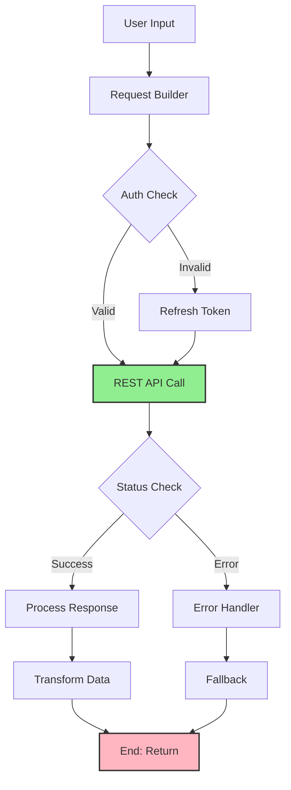

import { Card, CardHeader, CardTitle, CardDescription } from '@site/src/components/Card';
import { Callout } from '@site/src/components/Callout';
import { Features, Feature } from '@site/src/components/Features';
import { CollapsibleCodeBlock, InlineCodeCard } from '@site/src/components/CodeBlock';
import Tabs from '@theme/Tabs';
import TabItem from '@theme/TabItem';
import CodeBlock from '@theme/CodeBlock';

# REST API Element

The REST API element enables external API integration in the HPC Neura Execution Engine. It allows flows to fetch data from external services, submit data to endpoints, and integrate with third-party systems through standard HTTP methods.

<Card>
  <CardHeader>
    <CardTitle>Element Overview</CardTitle>
  </CardHeader>
  

    <table>
      <tbody>
        <tr>
          <td><strong>Type</strong></td>
          <td><code>rest_api</code></td>
        </tr>
        <tr>
          <td><strong>Category</strong></td>
          <td>Input Elements</td>
        </tr>
        <tr>
          <td><strong>Input</strong></td>
          <td>Dynamic URL parameters and request body</td>
        </tr>
        <tr>
          <td><strong>Output</strong></td>
          <td><code>response</code> (json) - API response data</td>
        </tr>
        <tr>
          <td><strong>L2 Customizable</strong></td>
          <td>URL, method, headers, auth, timeout, retry settings</td>
        </tr>
      </tbody>
    </table>
  

</Card>

## Purpose

<Features>
  <Feature title="External Data Access" icon="/img/icons/network.svg">
    Fetch data from external APIs and services
  </Feature>
  <Feature title="System Integration" icon="/img/icons/database.svg">
    Integrate with third-party platforms
  </Feature>
  <Feature title="Dynamic Operations" icon="/img/icons/settings.svg">
    Submit data and trigger external actions
  </Feature>
</Features>

## Element Schema

<CollapsibleCodeBlock
  title="Complete Element Definition"
  description="L1 element template for REST API"
  language="yaml"
  defaultCollapsed={false}
>
{`type: rest_api
element_id: null  # Auto-generated at L2
name: null  # Set by L2
node_description: Makes HTTP requests to external APIs and returns response data
description: null  # Customizable by L2
input_schema:
    url_params:
        type: json
        description: Parameters to inject into URL template
        required: false
    query_params:
        type: json
        description: Query string parameters
        required: false
    body:
        type: json
        description: Request body for POST/PUT/PATCH
        required: false
    headers:
        type: json
        description: Additional headers to include
        required: false
output_schema:
    response:
        type: json
        description: API response data
        required: true
    status_code:
        type: int
        description: HTTP status code
        required: true
    headers:
        type: json
        description: Response headers
        required: false
    error:
        type: string
        description: Error message if request failed
        required: false
parameter_schema_structure:
    url:
        type: string
        description: API endpoint URL (supports templating)
    method:
        type: string
        enum: ["GET", "POST", "PUT", "PATCH", "DELETE", "HEAD", "OPTIONS"]
    headers:
        type: json
        description: Default headers
    auth_type:
        type: string
        enum: ["none", "bearer", "basic", "api_key"]
    auth_config:
        type: json
        description: Authentication configuration
    timeout:
        type: int
        description: Request timeout in seconds
    retry_count:
        type: int
        description: Number of retry attempts
    retry_delay:
        type: int
        description: Delay between retries in seconds
parameters:
    url: ""
    method: "GET"
    headers:
        Content-Type: "application/json"
        Accept: "application/json"
    auth_type: "none"
    auth_config: {}
    timeout: 30
    retry_count: 3
    retry_delay: 1
processing_message: Calling API...
tags:
    - input
    - external-data
    - api
layer: null  # Set by L2
hyperparameters:
    type:
        access: fixed
    element_id:
        access: fixed
    name:
        access: edit
    description:
        access: edit
    input_schema:
        access: fixed
    output_schema:
        access: fixed
    parameters.url:
        access: edit
    parameters.method:
        access: edit
    parameters.headers:
        access: edit
    parameters.auth_type:
        access: edit
    parameters.auth_config:
        access: edit
    parameters.timeout:
        access: edit
    parameters.retry_count:
        access: edit
    parameters.retry_delay:
        access: edit
    processing_message:
        access: edit
    tags:
        access: append
    layer:
        access: edit`}
</CollapsibleCodeBlock>

## Key Characteristics

<Callout type="info">
REST API elements support **URL templating** with `{parameter}` syntax, allowing dynamic endpoint construction. Authentication credentials should be stored securely using environment variables or hidden parameters.
</Callout>

### Supported Features

- **All HTTP Methods**: GET, POST, PUT, PATCH, DELETE, HEAD, OPTIONS
- **Authentication**: Bearer token, Basic auth, API key
- **URL Templating**: Dynamic URL construction
- **Retry Logic**: Configurable retry with exponential backoff
- **Timeout Control**: Prevent hanging requests
- **Header Management**: Custom headers per request

## Usage Examples

### Basic GET Request

<CollapsibleCodeBlock
  title="Simple API Call"
  description="Fetch data from public API"
  language="yaml"
>
{`flow_definition:
  nodes:
    weather_api:
      type: rest_api
      element_id: weather_api
      name: "Get Weather Data"
      description: "Fetches current weather for a city"
      parameters:
        url: "https://api.openweathermap.org/data/2.5/weather"
        method: "GET"
        headers:
          Accept: "application/json"
        timeout: 10
      processing_message: "Fetching weather data..."
      tags:
        - weather
        - external-api
      layer: "data-fetch"
      
    user_city:
      type: chat_input
      name: "City Input"
      parameters:
        placeholder: "Enter city name"
        
  connections:
    # Pass city as query parameter
    - from_id: user_city
      to_id: weather_api
      from_output: "user_city:chat_input"
      to_input: "weather_api:query_params.q"`}
</CollapsibleCodeBlock>

### POST Request with Body

<CollapsibleCodeBlock
  title="Submit Data to API"
  description="POST request with JSON body"
  language="yaml"
>
{`nodes:
  user_registration:
    type: rest_api
    element_id: user_registration
    name: "Register User"
    description: "Creates new user account"
    parameters:
      url: "https://api.example.com/v1/users"
      method: "POST"
      headers:
        Content-Type: "application/json"
        X-API-Version: "2.0"
      auth_type: "bearer"
      auth_config:
        token: "\${API_TOKEN}"  # From environment
      timeout: 15
      retry_count: 2
      
  registration_form:
    type: custom
    name: "Build Registration Data"
    code: |
      output['user_data'] = {
          'name': inputs['name'],
          'email': inputs['email'],
          'password': inputs['password'],
          'preferences': {
              'newsletter': True,
              'notifications': 'email'
          }
      }
      
connections:
  - from_id: registration_form
    to_id: user_registration
    from_output: "registration_form:user_data"
    to_input: "user_registration:body"`}
</CollapsibleCodeBlock>

### Dynamic URL with Parameters

<CollapsibleCodeBlock
  title="URL Template Example"
  description="Dynamic endpoint construction"
  language="yaml"
>
{`nodes:
  github_api:
    type: rest_api
    element_id: github_api
    name: "Get GitHub User"
    description: "Fetches GitHub user profile"
    parameters:
      url: "https://api.github.com/users/{username}/repos"
      method: "GET"
      headers:
        Accept: "application/vnd.github.v3+json"
        User-Agent: "HPC-Neura-Engine"
      auth_type: "bearer"
      auth_config:
        token: "\${GITHUB_TOKEN}"
        
  username_input:
    type: chat_input
    name: "GitHub Username"
    parameters:
      placeholder: "Enter GitHub username"
      validation_pattern: "^[a-zA-Z0-9-]+$"
      
  query_builder:
    type: custom
    name: "Build Query"
    code: |
      output['url_params'] = {
          'username': inputs['username']
      }
      output['query_params'] = {
          'type': 'public',
          'sort': 'updated',
          'per_page': 10
      }
      
connections:
  - from_id: query_builder
    to_id: github_api
    from_output: "query_builder:url_params"
    to_input: "github_api:url_params"
    
  - from_id: query_builder
    to_id: github_api
    from_output: "query_builder:query_params"
    to_input: "github_api:query_params"`}
</CollapsibleCodeBlock>

## Authentication Methods

<Tabs>
  <TabItem value="bearer" label="Bearer Token" default>
    

      <CollapsibleCodeBlock
        title="Bearer Token Authentication"
        description="OAuth2 / JWT authentication"
        language="yaml"
      >
{`parameters:
  auth_type: "bearer"
  auth_config:
    token: "\${BEARER_TOKEN}"  # From environment variable
    
# Or dynamic token from previous node
connections:
  - from_id: auth_provider
    to_id: api_caller
    from_output: "auth_provider:access_token"
    to_input: "api_caller:auth_config.token"
    
# Results in header:
# Authorization: Bearer <token>`}
      </CollapsibleCodeBlock>
    

  </TabItem>
  
  <TabItem value="basic" label="Basic Auth">
    

      <CollapsibleCodeBlock
        title="Basic Authentication"
        description="Username/password authentication"
        language="yaml"
      >
{`parameters:
  auth_type: "basic"
  auth_config:
    username: "\${API_USERNAME}"
    password: "\${API_PASSWORD}"
    
# Results in header:
# Authorization: Basic <base64(username:password)>`}
      </CollapsibleCodeBlock>
    

  </TabItem>
  
  <TabItem value="api_key" label="API Key">
    

      <CollapsibleCodeBlock
        title="API Key Authentication"
        description="Header or query parameter API key"
        language="yaml"
      >
{`# Header-based API key
parameters:
  auth_type: "api_key"
  auth_config:
    location: "header"
    key_name: "X-API-Key"
    key_value: "\${API_KEY}"
    
# Query parameter API key
parameters:
  auth_type: "api_key"
  auth_config:
    location: "query"
    key_name: "apikey"
    key_value: "\${API_KEY}"
    
# Custom header name
parameters:
  auth_type: "api_key"
  auth_config:
    location: "header"
    key_name: "X-Custom-Auth"
    key_value: "\${SECRET_KEY}"`}
      </CollapsibleCodeBlock>
    

  </TabItem>
</Tabs>

## Common Patterns

### Pattern 1: Paginated API Calls

<CollapsibleCodeBlock
  title="Handle Pagination"
  description="Fetch multiple pages of results"
  language="yaml"
>
{`nodes:
  # Initial API call
  first_page:
    type: rest_api
    name: "Fetch First Page"
    parameters:
      url: "https://api.example.com/items"
      method: "GET"
      
  # Check if more pages exist
  pagination_checker:
    type: custom
    name: "Check Next Page"
    code: |
      response = inputs['response']
      
      # Extract pagination info
      total_pages = response.get('total_pages', 1)
      current_page = response.get('current_page', 1)
      
      output['has_next'] = current_page < total_pages
      output['next_page'] = current_page + 1
      output['items'] = response.get('items', [])
      
  # Conditional next page fetch
  next_page_router:
    type: case
    name: "Need Next Page?"
    parameters:
      cases:
        - fetch_next:
            variable1: has_next
            variable2: true
            compare: "=="
            
  # Fetch next page
  next_page:
    type: rest_api
    name: "Fetch Next Page"
    parameters:
      url: "https://api.example.com/items"
      method: "GET"
      
  # Aggregate results
  result_aggregator:
    type: custom
    name: "Combine Pages"
    code: |
      all_items = inputs.get('accumulated_items', [])
      new_items = inputs.get('page_items', [])
      
      all_items.extend(new_items)
      output['all_items'] = all_items`}
</CollapsibleCodeBlock>

### Pattern 2: API Chain Calls

<CollapsibleCodeBlock
  title="Sequential API Dependencies"
  description="Chain multiple API calls"
  language="yaml"
>
{`nodes:
  # Get user profile
  user_api:
    type: rest_api
    name: "Get User Profile"
    parameters:
      url: "https://api.example.com/users/{user_id}"
      method: "GET"
      
  # Extract organization ID
  org_extractor:
    type: selector
    name: "Get Org ID"
    parameters:
      key: "organization_id"
      
  # Get organization details
  org_api:
    type: rest_api
    name: "Get Organization"
    parameters:
      url: "https://api.example.com/orgs/{org_id}"
      method: "GET"
      
  # Get org projects
  projects_api:
    type: rest_api
    name: "Get Projects"
    parameters:
      url: "https://api.example.com/orgs/{org_id}/projects"
      method: "GET"
      
connections:
  # Chain the API calls
  - from_id: user_api
    to_id: org_extractor
    from_output: "user_api:response"
    to_input: "org_extractor:data"
    
  - from_id: org_extractor
    to_id: org_api
    from_output: "org_extractor:selected_value"
    to_input: "org_api:url_params.org_id"
    
  - from_id: org_extractor
    to_id: projects_api
    from_output: "org_extractor:selected_value"
    to_input: "projects_api:url_params.org_id"`}
</CollapsibleCodeBlock>

### Pattern 3: Webhook Handler

<CollapsibleCodeBlock
  title="Process Webhook Data"
  description="Handle incoming webhook and respond"
  language="yaml"
>
{`nodes:
  # Validate webhook signature
  webhook_validator:
    type: custom
    name: "Validate Webhook"
    code: |
      import hmac
      import hashlib
      
      payload = inputs['webhook_payload']
      signature = inputs['webhook_signature']
      secret = inputs['webhook_secret']
      
      # Calculate expected signature
      expected = hmac.new(
          secret.encode(),
          payload.encode(),
          hashlib.sha256
      ).hexdigest()
      
      output['valid'] = hmac.compare_digest(signature, expected)
      output['payload'] = payload
      
  # Process valid webhook
  webhook_processor:
    type: llm_structured
    name: "Extract Webhook Data"
    output_schema:
      event_type:
        type: string
      resource_id:
        type: string
      action_required:
        type: bool
      priority:
        type: string
        enum: ["low", "medium", "high"]
        
  # Send acknowledgment
  ack_sender:
    type: rest_api
    name: "Send Acknowledgment"
    parameters:
      url: "{webhook_source}/ack"
      method: "POST"
      headers:
        Content-Type: "application/json"
      timeout: 5`}
</CollapsibleCodeBlock>

## Error Handling

### Retry Configuration

<CollapsibleCodeBlock
  title="Retry Strategy"
  description="Configure retry behavior"
  language="yaml"
>
{`nodes:
  resilient_api:
    type: rest_api
    name: "Resilient API Call"
    parameters:
      url: "https://flaky-api.example.com/data"
      method: "GET"
      timeout: 10
      retry_count: 3
      retry_delay: 2  # seconds
      
  # Process response with error handling
  response_handler:
    type: custom
    name: "Handle API Response"
    code: |
      response = inputs.get('api_response')
      
      if response.get('error'):
          # API call failed after retries
          output['success'] = False
          output['error_message'] = response['error']
          output['fallback_data'] = {
              'message': 'Service temporarily unavailable',
              'cached_data': True
          }
      else:
          # Success
          output['success'] = True
          output['data'] = response['response']
          
  # Route based on success
  error_router:
    type: case
    name: "Route by Success"
    parameters:
      cases:
        - success_path:
            variable1: success
            variable2: true
            compare: "=="
        - error_path:
            variable1: success
            variable2: false
            compare: "=="`}
</CollapsibleCodeBlock>

### Status Code Handling

<CollapsibleCodeBlock
  title="Handle HTTP Status Codes"
  description="Process different response codes"
  language="yaml"
>
{`nodes:
  api_caller:
    type: rest_api
    name: "API Request"
    parameters:
      url: "https://api.example.com/resource"
      method: "POST"
      
  status_handler:
    type: custom
    name: "Process Status Code"
    code: |
      status = inputs['status_code']
      response = inputs['response']
      
      if status == 200:
          output['result'] = 'success'
          output['data'] = response
      elif status == 201:
          output['result'] = 'created'
          output['data'] = response
          output['resource_id'] = response.get('id')
      elif status == 400:
          output['result'] = 'bad_request'
          output['errors'] = response.get('errors', [])
      elif status == 401:
          output['result'] = 'unauthorized'
          output['needs_auth'] = True
      elif status == 404:
          output['result'] = 'not_found'
      elif status == 429:
          output['result'] = 'rate_limited'
          output['retry_after'] = response.get('retry_after', 60)
      elif status >= 500:
          output['result'] = 'server_error'
          output['should_retry'] = True
      else:
          output['result'] = 'unknown'
          output['status'] = status`}
</CollapsibleCodeBlock>

## Advanced Features

### Request Transformation

<CollapsibleCodeBlock
  title="Transform Request Data"
  description="Prepare data for API"
  language="yaml"
>
{`nodes:
  # Transform user input for API
  request_transformer:
    type: custom
    name: "Prepare API Request"
    code: |
      user_data = inputs['user_input']
      
      # Transform to API format
      api_payload = {
          'customer': {
              'name': user_data['full_name'],
              'email': user_data['email_address'],
              'metadata': {
                  'source': 'web_form',
                  'timestamp': datetime.now().isoformat()
              }
          },
          'preferences': {
              'communication': user_data.get('contact_preference', 'email'),
              'language': user_data.get('language', 'en')
          }
      }
      
      # Add conditional fields
      if user_data.get('company'):
          api_payload['customer']['company'] = user_data['company']
          
      output['request_body'] = api_payload
      output['custom_headers'] = {
          'X-Request-ID': str(uuid.uuid4()),
          'X-Client-Version': '2.0'
      }`}
</CollapsibleCodeBlock>

### Response Caching

<CollapsibleCodeBlock
  title="Cache API Responses"
  description="Reduce API calls with caching"
  language="yaml"
>
{`nodes:
  # Check cache first
  cache_checker:
    type: custom
    name: "Check Cache"
    code: |
      cache_key = f"api_cache_{inputs['endpoint']}_{inputs['params']}"
      
      # In real implementation, check Redis/memory cache
      cached_data = cache.get(cache_key)
      
      if cached_data and not inputs.get('force_refresh'):
          output['use_cache'] = True
          output['data'] = cached_data
      else:
          output['use_cache'] = False
          output['cache_key'] = cache_key
          
  # Route based on cache
  cache_router:
    type: case
    name: "Cache Decision"
    parameters:
      cases:
        - use_cache:
            variable1: use_cache
            variable2: true
            compare: "=="
        - fetch_fresh:
            variable1: use_cache
            variable2: false
            compare: "=="
            
  # Fresh API call
  api_fetch:
    type: rest_api
    name: "Fetch from API"
    
  # Store in cache
  cache_writer:
    type: custom
    name: "Update Cache"
    code: |
      # Store with TTL
      cache.set(
          inputs['cache_key'],
          inputs['api_data'],
          ttl=300  # 5 minutes
      )
      output['data'] = inputs['api_data']`}
</CollapsibleCodeBlock>

### Batch API Operations

<CollapsibleCodeBlock
  title="Batch Processing"
  description="Handle multiple items efficiently"
  language="yaml"
>
{`nodes:
  # Prepare batch request
  batch_builder:
    type: custom
    name: "Build Batch Request"
    code: |
      items = inputs['items']
      
      # Split into chunks for API limits
      chunk_size = 100
      chunks = [items[i:i + chunk_size] 
                for i in range(0, len(items), chunk_size)]
      
      output['chunks'] = chunks
      output['chunk_count'] = len(chunks)
      
  # Process each chunk
  chunk_processor:
    type: rest_api
    name: "Process Chunk"
    parameters:
      url: "https://api.example.com/batch"
      method: "POST"
      headers:
        Content-Type: "application/json"
        X-Batch-Size: "100"
        
  # Aggregate results
  result_aggregator:
    type: custom
    name: "Combine Results"
    code: |
      all_results = []
      
      for chunk_result in inputs['chunk_results']:
          if chunk_result.get('success'):
              all_results.extend(chunk_result['items'])
          else:
              # Handle partial failures
              print(f"Chunk failed: {chunk_result.get('error')}")
              
      output['total_processed'] = len(all_results)
      output['results'] = all_results`}
</CollapsibleCodeBlock>

## Best Practices

<Callout type="success" title="REST API Best Practices">
✅ **Secure Credentials**: Use environment variables for sensitive data
✅ **Set Timeouts**: Prevent hanging requests with appropriate timeouts
✅ **Handle Errors**: Always check status codes and handle failures
✅ **Use Retries**: Configure retries for transient failures
✅ **Rate Limiting**: Respect API rate limits to avoid blocking
✅ **Cache Responses**: Cache when appropriate to reduce API calls
✅ **Log Requests**: Track API usage for debugging and monitoring
</Callout>

## Performance Optimization

### Connection Pooling

<CollapsibleCodeBlock
  title="Efficient Connection Management"
  description="Reuse connections for better performance"
  language="yaml"
>
{`# Multiple API calls to same host
nodes:
  # These will reuse connections automatically
  api_call_1:
    type: rest_api
    name: "First Call"
    parameters:
      url: "https://api.example.com/endpoint1"
      
  api_call_2:
    type: rest_api
    name: "Second Call"
    parameters:
      url: "https://api.example.com/endpoint2"
      
  api_call_3:
    type: rest_api
    name: "Third Call"
    parameters:
      url: "https://api.example.com/endpoint3"
      
# Connection pooling happens automatically
# for same host to improve performance`}
</CollapsibleCodeBlock>

### Parallel API Calls

<CollapsibleCodeBlock
  title="Concurrent Requests"
  description="Make multiple API calls in parallel"
  language="yaml"
>
{`nodes:
  # Trigger parallel calls
  parallel_trigger:
    type: custom
    name: "Prepare Parallel"
    code: |
      output['user_id'] = inputs['user_id']
      output['ready'] = True
      
  # These execute in parallel
  user_profile:
    type: rest_api
    name: "Get Profile"
    parameters:
      url: "https://api.example.com/users/{user_id}"
      
  user_orders:
    type: rest_api
    name: "Get Orders"
    parameters:
      url: "https://api.example.com/users/{user_id}/orders"
      
  user_preferences:
    type: rest_api
    name: "Get Preferences"
    parameters:
      url: "https://api.example.com/users/{user_id}/preferences"
      
  # Merge results
  data_merger:
    type: merger
    name: "Combine User Data"
    
connections:
  # All three API calls happen in parallel
  - from_id: parallel_trigger
    to_id: user_profile
  - from_id: parallel_trigger
    to_id: user_orders
  - from_id: parallel_trigger
    to_id: user_preferences`}
</CollapsibleCodeBlock>

## Visual Flow Example

## Technical Details

### Execution Behavior

1. **Async Execution**: Non-blocking API calls
2. **Auto-Retry**: Configurable retry with backoff
3. **Connection Reuse**: Efficient connection pooling
4. **Timeout Enforcement**: Prevents hanging
5. **Error Propagation**: Failed requests return error data

### Security Considerations

- **HTTPS Preferred**: Use secure connections
- **Credential Storage**: Never hardcode secrets
- **Input Validation**: Sanitize URL parameters
- **Header Injection**: Validate custom headers
- **Response Validation**: Verify response structure

## Related Elements

  <Card>
    <CardHeader>
      <CardTitle>DataBlocks Element</CardTitle>
      <CardDescription>
        For static data storage
      </CardDescription>
    </CardHeader>
    

      <a href="./03-datablocks" style={{ textDecoration: 'none' }}>
        Compare with DataBlocks →
      </a>
    

  </Card>
  
  <Card>
    <CardHeader>
      <CardTitle>Custom Element</CardTitle>
      <CardDescription>
        For complex API logic
      </CardDescription>
    </CardHeader>
    

      <a href="../07-custom-elements/01-custom" style={{ textDecoration: 'none' }}>
        Advanced processing →
      </a>
    

  </Card>

## Summary

The REST API element provides powerful external integration capabilities:
- **Flexible HTTP requests** with all standard methods
- **Dynamic URL construction** with templating
- **Multiple authentication** methods for secure access
- **Robust error handling** with retries and timeouts
- **Performance optimized** with connection pooling

Remember: Always secure API credentials, handle errors gracefully, and respect rate limits when integrating with external services.