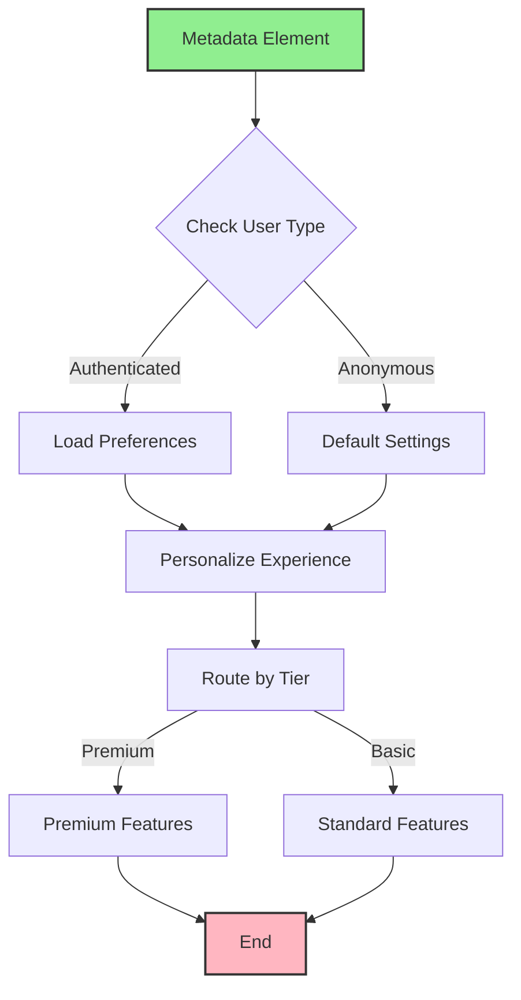

import { Card, CardHeader, CardTitle, CardDescription } from '@site/src/components/Card';
import { Callout } from '@site/src/components/Callout';
import { Features, Feature } from '@site/src/components/Features';
import { CollapsibleCodeBlock, InlineCodeCard } from '@site/src/components/CodeBlock';
import Tabs from '@theme/Tabs';
import TabItem from '@theme/TabItem';
import CodeBlock from '@theme/CodeBlock';

# Metadata Element

The Metadata element provides access to execution context and runtime information in the HPC Neura Execution Engine. It exposes user information, session data, environment variables, and custom metadata that's automatically injected during flow execution.

<Card>
  <CardHeader>
    <CardTitle>Element Overview</CardTitle>
  </CardHeader>
  

    <table>
      <tbody>
        <tr>
          <td><strong>Type</strong></td>
          <td><code>metadata</code></td>
        </tr>
        <tr>
          <td><strong>Category</strong></td>
          <td>Input Elements</td>
        </tr>
        <tr>
          <td><strong>Output</strong></td>
          <td>Context data including user, session, and environment info</td>
        </tr>
        <tr>
          <td><strong>L2 Customizable</strong></td>
          <td>Name, description, data selection, processing message, tags, layer</td>
        </tr>
      </tbody>
    </table>
  

</Card>

## Purpose

<Features>
  <Feature title="User Context" icon="/img/icons/frontend.svg">
    Access current user information and profile
  </Feature>
  <Feature title="Session Data" icon="/img/icons/database.svg">
    Retrieve session-specific information
  </Feature>
  <Feature title="Environment Info" icon="/img/icons/settings.svg">
    Get execution environment and configuration
  </Feature>
</Features>

## Element Schema

<CollapsibleCodeBlock
  title="Complete Element Definition"
  description="L1 element template for Metadata"
  language="yaml"
  defaultCollapsed={false}
>
{`type: metadata
element_id: null  # Auto-generated at L2
name: null  # Set by L2
node_description: Provides access to execution context including user, session, and environment metadata
description: null  # Customizable by L2
input_schema: {}  # No inputs - data from execution context
output_schema:
  user_id:
    type: string
    description: Unique user identifier
    required: false
  user_name:
    type: string
    description: User's display name
    required: false
  user_email:
    type: string
    description: User's email address
    required: false
  wallet_address:
    type: string
    description: User's blockchain wallet address
    required: false
  session_id:
    type: string
    description: Current session identifier
    required: false
  session_count:
    type: int
    description: Number of user sessions
    required: false
  environment:
    type: string
    description: Execution environment (production, staging, etc)
    required: false
  execution_id:
    type: string
    description: Current flow execution ID
    required: false
  custom_data:
    type: json
    description: Additional custom metadata
    required: false
parameter_schema_structure:
  data_filter:
    type: list
    description: Specific metadata fields to include
  include_all:
    type: bool
    description: Include all available metadata
  custom_fields:
    type: json
    description: Additional custom fields to add
parameters:
  data_filter: []
  include_all: true
  custom_fields: {}
processing_message: Loading metadata...
tags:
  - input
  - context
  - metadata
layer: null  # Set by L2
hyperparameters:
  type:
    access: fixed
  element_id:
    access: fixed
  name:
    access: edit
  description:
    access: edit
  input_schema:
    access: fixed
  output_schema:
    access: fixed
  parameters.data_filter:
    access: edit
  parameters.include_all:
    access: edit
  parameters.custom_fields:
    access: edit
  processing_message:
    access: edit
  tags:
    access: append
  layer:
    access: edit`}
</CollapsibleCodeBlock>

## Key Characteristics

<Callout type="info">
The Metadata element **automatically receives context from the execution environment**. The available data depends on the flow's execution context and can include user authentication, session state, and custom application metadata.
</Callout>

### Available Metadata Fields

| Field | Type | Description | Always Present |
|-------|------|-------------|----------------|
| `user_id` | string | Unique user identifier | Usually |
| `user_name` | string | Display name | If authenticated |
| `user_email` | string | Email address | If authenticated |
| `wallet_address` | string | Blockchain wallet | If connected |
| `session_id` | string | Session identifier | Yes |
| `session_count` | int | Total user sessions | If tracked |
| `environment` | string | prod/staging/dev | Yes |
| `execution_id` | string | Flow execution ID | Yes |
| `timestamp` | string | Current timestamp | Yes |
| `custom_data` | json | Application-specific | Varies |

## Usage Examples

### Basic Metadata Access

<CollapsibleCodeBlock
  title="Simple Metadata Usage"
  description="Access user and session information"
  language="yaml"
>
{`flow_definition:
  nodes:
    user_context:
      type: metadata
      element_id: user_context
      name: "Get User Context"
      description: "Retrieves current user information"
      parameters:
        include_all: true
      processing_message: "Loading user context..."
      tags:
        - context
        - user-data
      layer: "input"
      
    personalized_greeting:
      type: llm_text
      name: "Generate Greeting"
      parameters:
        wrapper_prompt: |
          Create a personalized greeting for:
          Name: {user_name}
          Email: {user_email}
          Session count: {session_count}
          
          Make it friendly and acknowledge if they're a returning user.
      
  connections:
    - from_id: user_context
      to_id: personalized_greeting
      from_output: "user_context:user_name"
      to_input: "personalized_greeting:user_name"
      
    - from_id: user_context
      to_id: personalized_greeting
      from_output: "user_context:session_count"
      to_input: "personalized_greeting:session_count"`}
</CollapsibleCodeBlock>

### Filtered Metadata

<CollapsibleCodeBlock
  title="Select Specific Fields"
  description="Only retrieve needed metadata"
  language="yaml"
>
{`nodes:
  auth_data:
    type: metadata
    element_id: auth_data
    name: "Authentication Info"
    description: "Get only auth-related metadata"
    parameters:
      include_all: false
      data_filter:
        - user_id
        - wallet_address
        - session_id
        
  permission_checker:
    type: custom
    name: "Check Permissions"
    code: |
      user_id = inputs.get('user_id')
      wallet = inputs.get('wallet_address')
      
      # Check permissions based on user/wallet
      has_premium = check_premium_status(user_id)
      has_nft = check_nft_ownership(wallet) if wallet else False
      
      output['access_level'] = 'premium' if has_premium else 'basic'
      output['nft_holder'] = has_nft
      output['features_enabled'] = {
          'advanced_ai': has_premium,
          'blockchain_features': has_nft,
          'api_access': True
      }`}
</CollapsibleCodeBlock>

### Custom Metadata Addition

<CollapsibleCodeBlock
  title="Extend with Custom Fields"
  description="Add custom metadata fields"
  language="yaml"
>
{`nodes:
  extended_metadata:
    type: metadata
    element_id: extended_metadata
    name: "Extended Context"
    description: "Metadata with custom fields"
    parameters:
      include_all: true
      custom_fields:
        app_version: "2.1.0"
        feature_flags:
          new_ui: true
          beta_features: false
          ai_v2: true
        region: "us-east-1"
        tier: "premium"
        
  feature_router:
    type: case
    name: "Route by Features"
    parameters:
      cases:
        - new_ui_enabled:
            variable1: feature_flags.new_ui
            variable2: true
            compare: "=="
        - ai_v2_enabled:
            variable1: feature_flags.ai_v2
            variable2: true
            compare: "=="`}
</CollapsibleCodeBlock>

## Common Patterns

### Pattern 1: User Personalization

<CollapsibleCodeBlock
  title="Personalized Experience"
  description="Customize based on user context"
  language="yaml"
>
{`nodes:
  user_meta:
    type: metadata
    name: "User Metadata"
    
  preference_loader:
    type: rest_api
    name: "Load Preferences"
    parameters:
      url: "https://api.example.com/users/{user_id}/preferences"
      method: "GET"
      
  experience_customizer:
    type: custom
    name: "Customize Experience"
    code: |
      user_data = inputs['metadata']
      preferences = inputs.get('preferences', {})
      
      # Determine user segment
      if user_data.get('session_count', 0) == 1:
          segment = 'new_user'
      elif user_data.get('session_count', 0) > 50:
          segment = 'power_user'
      else:
          segment = 'regular_user'
          
      # Customize based on segment
      output['ui_theme'] = preferences.get('theme', 'light')
      output['welcome_message'] = {
          'new_user': 'Welcome! Let me show you around...',
          'regular_user': f"Welcome back, {user_data.get('user_name', 'friend')}!",
          'power_user': f"Hey {user_data.get('user_name', 'pro')}! Ready to dive in?"
      }[segment]
      
      output['show_tutorial'] = segment == 'new_user'
      output['advanced_features'] = segment == 'power_user'`}
</CollapsibleCodeBlock>

### Pattern 2: Access Control

<CollapsibleCodeBlock
  title="Role-Based Access"
  description="Control features based on user context"
  language="yaml"
>
{`nodes:
  access_metadata:
    type: metadata
    name: "Access Context"
    parameters:
      data_filter:
        - user_id
        - user_email
        - custom_data
        
  role_determiner:
    type: custom
    name: "Determine User Role"
    code: |
      metadata = inputs['metadata']
      custom_data = metadata.get('custom_data', {})
      
      # Check various role indicators
      user_role = custom_data.get('role', 'user')
      is_admin = user_role == 'admin'
      is_premium = custom_data.get('subscription', 'free') == 'premium'
      
      # Email domain check
      email = metadata.get('user_email', '')
      is_internal = email.endswith('@company.com')
      
      # Determine effective permissions
      output['permissions'] = {
          'can_access_admin': is_admin or is_internal,
          'can_use_advanced_features': is_premium or is_admin,
          'can_export_data': is_premium,
          'can_modify_settings': is_admin,
          'api_rate_limit': 1000 if is_premium else 100
      }
      
      output['effective_role'] = 'admin' if is_admin else 'premium' if is_premium else 'basic'
      
  feature_gate:
    type: case
    name: "Feature Access Gate"
    parameters:
      cases:
        - admin_features:
            variable1: permissions.can_access_admin
            variable2: true
            compare: "=="
        - premium_features:
            variable1: permissions.can_use_advanced_features
            variable2: true
            compare: "=="`}
</CollapsibleCodeBlock>

### Pattern 3: Multi-Tenant Context

<CollapsibleCodeBlock
  title="Tenant-Aware Processing"
  description="Handle multi-tenant scenarios"
  language="yaml"
>
{`nodes:
  tenant_metadata:
    type: metadata
    name: "Tenant Context"
    parameters:
      include_all: true
      custom_fields:
        default_tenant: "public"
        
  tenant_resolver:
    type: custom
    name: "Resolve Tenant"
    code: |
      metadata = inputs['metadata']
      
      # Determine tenant from various sources
      # Priority: custom_data > email domain > default
      
      custom_data = metadata.get('custom_data', {})
      tenant = custom_data.get('tenant_id')
      
      if not tenant:
          # Try to infer from email
          email = metadata.get('user_email', '')
          if email:
              domain = email.split('@')[1] if '@' in email else ''
              tenant_map = {
                  'acme.com': 'tenant_acme',
                  'widgets.inc': 'tenant_widgets',
                  'example.org': 'tenant_example'
              }
              tenant = tenant_map.get(domain)
              
      if not tenant:
          tenant = metadata.get('default_tenant', 'public')
          
      output['tenant_id'] = tenant
      output['tenant_config'] = load_tenant_config(tenant)
      output['data_isolation'] = f"tenant_{tenant}"
      
  tenant_data_loader:
    type: rest_api
    name: "Load Tenant Data"
    parameters:
      url: "https://api.example.com/tenants/{tenant_id}/data"
      headers:
        X-Tenant-ID: "{tenant_id}"`}
</CollapsibleCodeBlock>

## Environment-Based Configuration

<Tabs>
  <TabItem value="environment" label="Environment Detection" default>
    

      <CollapsibleCodeBlock
        title="Environment-Specific Logic"
        description="Adapt behavior based on environment"
        language="yaml"
      >
{`nodes:
  env_metadata:
    type: metadata
    name: "Environment Info"
    
  env_config:
    type: custom
    name: "Configure for Environment"
    code: |
      env = inputs['environment']
      
      # Environment-specific settings
      config = {
          'production': {
              'api_endpoint': 'https://api.example.com',
              'cache_ttl': 3600,
              'log_level': 'info',
              'feature_flags': {
                  'experimental': False,
                  'debug_mode': False
              }
          },
          'staging': {
              'api_endpoint': 'https://staging-api.example.com',
              'cache_ttl': 300,
              'log_level': 'debug',
              'feature_flags': {
                  'experimental': True,
                  'debug_mode': True
              }
          },
          'development': {
              'api_endpoint': 'http://localhost:3000',
              'cache_ttl': 0,
              'log_level': 'debug',
              'feature_flags': {
                  'experimental': True,
                  'debug_mode': True
              }
          }
      }
      
      output['config'] = config.get(env, config['production'])
      output['is_production'] = env == 'production'`}
      </CollapsibleCodeBlock>
    

  </TabItem>
  
  <TabItem value="feature-flags" label="Feature Flags">
    

      <CollapsibleCodeBlock
        title="Feature Flag Management"
        description="Control features via metadata"
        language="yaml"
      >
{`nodes:
  feature_metadata:
    type: metadata
    name: "Feature Flags"
    parameters:
      custom_fields:
        features:
          chat_v2: true
          ai_assistant: true
          blockchain_integration: false
          analytics_dashboard: true
          
  feature_controller:
    type: custom
    name: "Apply Feature Flags"
    code: |
      metadata = inputs['metadata']
      features = metadata.get('features', {})
      user_tier = metadata.get('custom_data', {}).get('tier', 'basic')
      
      # Override features based on user tier
      if user_tier == 'basic':
          features['ai_assistant'] = False
          features['analytics_dashboard'] = False
      elif user_tier == 'premium':
          features['blockchain_integration'] = True
          
      output['enabled_features'] = features
      output['ui_components'] = {
          'show_chat': features.get('chat_v2', False),
          'show_ai_button': features.get('ai_assistant', False),
          'show_blockchain_menu': features.get('blockchain_integration', False),
          'show_analytics': features.get('analytics_dashboard', False)
      }`}
      </CollapsibleCodeBlock>
    

  </TabItem>
</Tabs>

## Session Management

<CollapsibleCodeBlock
  title="Session-Based Logic"
  description="Track and use session information"
  language="yaml"
>
{`nodes:
  session_meta:
    type: metadata
    name: "Session Info"
    parameters:
      data_filter:
        - session_id
        - session_count
        - user_id
        - custom_data
        
  session_analyzer:
    type: custom
    name: "Analyze Session"
    code: |
      session_id = inputs['session_id']
      session_count = inputs.get('session_count', 1)
      custom_data = inputs.get('custom_data', {})
      
      # Track session behavior
      is_first_session = session_count == 1
      is_returning_user = session_count > 1
      session_duration = custom_data.get('duration_minutes', 0)
      
      # Determine engagement level
      if session_count > 20 and session_duration > 30:
          engagement = 'high'
      elif session_count > 5:
          engagement = 'medium'
      else:
          engagement = 'low'
          
      output['session_insights'] = {
          'is_first_visit': is_first_session,
          'is_returning': is_returning_user,
          'engagement_level': engagement,
          'total_sessions': session_count,
          'current_session': session_id
      }
      
      # Recommendations based on session
      output['recommendations'] = {
          'show_onboarding': is_first_session,
          'show_whats_new': is_returning_user and session_count < 5,
          'show_advanced_tips': engagement == 'high',
          'prompt_for_feedback': session_count == 10
      }`}
</CollapsibleCodeBlock>

## Best Practices

<Callout type="success" title="Metadata Best Practices">
✅ **Privacy First**: Only access metadata you need
✅ **Null Checks**: Always handle missing metadata gracefully
✅ **Environment Aware**: Test with different environment configs
✅ **Performance**: Filter metadata to reduce payload size
✅ **Security**: Don't expose sensitive metadata in logs
✅ **Documentation**: Document what metadata your flow expects
</Callout>

## Error Handling

### Missing Metadata

<CollapsibleCodeBlock
  title="Handle Missing Fields"
  description="Gracefully handle absent metadata"
  language="yaml"
>
{`nodes:
  safe_metadata:
    type: metadata
    name: "Get Metadata Safely"
    
  metadata_validator:
    type: custom
    name: "Validate Metadata"
    code: |
      metadata = inputs.get('metadata', {})
      
      # Define required fields with defaults
      required_fields = {
          'user_id': None,
          'session_id': 'anonymous',
          'environment': 'production'
      }
      
      # Check and provide defaults
      validated = {}
      missing = []
      
      for field, default in required_fields.items():
          value = metadata.get(field, default)
          if value is None:
              missing.append(field)
          validated[field] = value
          
      # Handle anonymous users
      if not metadata.get('user_id'):
          validated['is_anonymous'] = True
          validated['access_level'] = 'public'
      else:
          validated['is_anonymous'] = False
          validated['access_level'] = 'authenticated'
          
      output['metadata'] = validated
      output['missing_fields'] = missing
      output['is_valid'] = len(missing) == 0`}
</CollapsibleCodeBlock>

### Type Safety

<CollapsibleCodeBlock
  title="Ensure Type Safety"
  description="Validate metadata types"
  language="yaml"
>
{`nodes:
  type_safe_handler:
    type: custom
    name: "Type-Safe Processing"
    code: |
      metadata = inputs.get('metadata', {})
      
      # Safe type conversions
      def safe_int(value, default=0):
          try:
              return int(value) if value is not None else default
          except (ValueError, TypeError):
              return default
              
      def safe_bool(value, default=False):
          if isinstance(value, bool):
              return value
          if isinstance(value, str):
              return value.lower() in ('true', '1', 'yes')
          return default
          
      # Process with type safety
      output['processed'] = {
          'user_id': str(metadata.get('user_id', 'anonymous')),
          'session_count': safe_int(metadata.get('session_count')),
          'is_premium': safe_bool(
              metadata.get('custom_data', {}).get('premium')
          ),
          'environment': metadata.get('environment', 'unknown').lower()
      }`}
</CollapsibleCodeBlock>

## Advanced Usage

### Dynamic Metadata Injection

<CollapsibleCodeBlock
  title="Runtime Metadata Enhancement"
  description="Add computed metadata"
  language="yaml"
>
{`nodes:
  base_metadata:
    type: metadata
    name: "Base Metadata"
    
  metadata_enricher:
    type: custom
    name: "Enrich Metadata"
    code: |
      import datetime
      import hashlib
      
      base_meta = inputs['metadata']
      
      # Add computed fields
      enhanced = base_meta.copy()
      
      # Add timestamps
      now = datetime.datetime.utcnow()
      enhanced['timestamp'] = now.isoformat()
      enhanced['day_of_week'] = now.strftime('%A')
      enhanced['is_weekend'] = now.weekday() >= 5
      
      # Add user hash (for anonymous tracking)
      user_id = base_meta.get('user_id', 'anonymous')
      enhanced['user_hash'] = hashlib.sha256(
          user_id.encode()
      ).hexdigest()[:8]
      
      # Add derived fields
      enhanced['user_segment'] = determine_segment(base_meta)
      enhanced['feature_eligibility'] = check_features(base_meta)
      
      output['enriched_metadata'] = enhanced`}
</CollapsibleCodeBlock>

### Metadata-Driven Routing

<CollapsibleCodeBlock
  title="Complex Routing Logic"
  description="Route based on multiple metadata factors"
  language="yaml"
>
{`nodes:
  routing_metadata:
    type: metadata
    name: "Routing Context"
    
  route_calculator:
    type: custom
    name: "Calculate Route"
    code: |
      meta = inputs['metadata']
      
      # Multi-factor routing decision
      factors = {
          'user_tier': meta.get('custom_data', {}).get('tier', 'basic'),
          'session_count': meta.get('session_count', 0),
          'environment': meta.get('environment', 'production'),
          'wallet_connected': bool(meta.get('wallet_address')),
          'feature_flags': meta.get('custom_data', {}).get('features', {})
      }
      
      # Determine route
      if factors['user_tier'] == 'enterprise':
          route = 'enterprise_flow'
      elif factors['wallet_connected'] and factors['feature_flags'].get('web3'):
          route = 'web3_flow'
      elif factors['session_count'] == 1:
          route = 'onboarding_flow'
      elif factors['environment'] == 'development':
          route = 'debug_flow'
      else:
          route = 'standard_flow'
          
      output['selected_route'] = route
      output['routing_factors'] = factors
      
  flow_router:
    type: flow_select
    name: "Execute Route"
    parameters:
      flows_to_switch:
        - enterprise_flow
        - web3_flow
        - onboarding_flow
        - debug_flow
        - standard_flow`}
</CollapsibleCodeBlock>

## Visual Flow Example

## Technical Details

### Execution Behavior

1. **Automatic Injection**: Metadata injected at flow start
2. **Read-Only**: Cannot modify metadata during execution
3. **Cached**: Metadata cached for flow duration
4. **Filtered Output**: Only requested fields returned
5. **Type Preservation**: Original types maintained

### Performance Considerations

- **Lightweight**: Minimal overhead
- **No External Calls**: Instant access
- **Filtered Access**: Reduce payload with filters
- **Memory Efficient**: Only requested data loaded

## Related Elements

  <Card>
    <CardHeader>
      <CardTitle>Context History</CardTitle>
      <CardDescription>
        Access conversation history
      </CardDescription>
    </CardHeader>
    

      <a href="./02-context-history" style={{ textDecoration: 'none' }}>
        Learn about history →
      </a>
    

  </Card>
  
  <Card>
    <CardHeader>
      <CardTitle>Constants Element</CardTitle>
      <CardDescription>
        Define static configuration
      </CardDescription>
    </CardHeader>
    

      <a href="./06-constants" style={{ textDecoration: 'none' }}>
        Compare with Constants →
      </a>
    

  </Card>

## Summary

The Metadata element provides essential context awareness by offering:
- **Automatic access** to execution context
- **User information** for personalization
- **Session tracking** for behavior analysis
- **Environment detection** for adaptive behavior
- **Custom metadata** for application-specific needs

Remember: Metadata is your window into the execution context - use it for personalization, access control, and environment-aware processing.