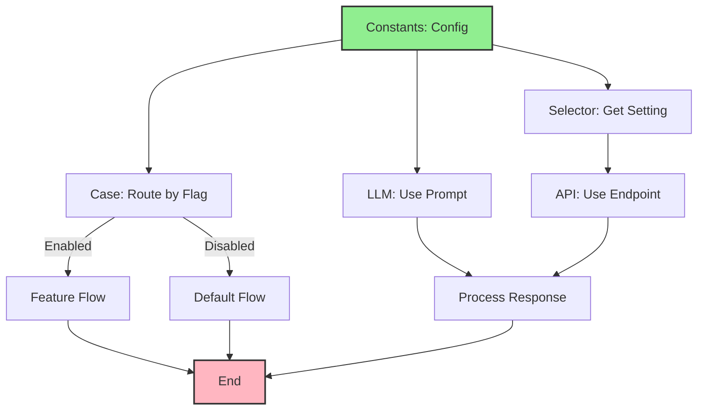

import { Card, CardHeader, CardTitle, CardDescription } from '@site/src/components/Card';
import { Callout } from '@site/src/components/Callout';
import { Features, Feature } from '@site/src/components/Features';
import { CollapsibleCodeBlock, InlineCodeCard } from '@site/src/components/CodeBlock';
import Tabs from '@theme/Tabs';
import TabItem from '@theme/TabItem';
import CodeBlock from '@theme/CodeBlock';

# Constants Element

The Constants element provides simple key-value storage for configuration values in the HPC Neura Execution Engine. It's ideal for storing settings, configuration parameters, and static values that need to be easily accessible throughout your flow.

<Card>
  <CardHeader>
    <CardTitle>Element Overview</CardTitle>
  </CardHeader>
  

    <table>
      <tbody>
        <tr>
          <td><strong>Type</strong></td>
          <td><code>constants</code></td>
        </tr>
        <tr>
          <td><strong>Category</strong></td>
          <td>Input Elements</td>
        </tr>
        <tr>
          <td><strong>Output</strong></td>
          <td>Key-value pairs as defined in parameters</td>
        </tr>
        <tr>
          <td><strong>L2 Customizable</strong></td>
          <td>All constant values, name, description, processing message, tags, layer</td>
        </tr>
      </tbody>
    </table>
  

</Card>

## Purpose

<Features>
  <Feature title="Configuration Storage" icon="/img/icons/settings.svg">
    Store application settings and parameters
  </Feature>
  <Feature title="Simple Values" icon="/img/icons/database.svg">
    Provide easy access to static values
  </Feature>
  <Feature title="Type-Safe Constants" icon="/img/icons/docs.svg">
    Define typed constants for flow use
  </Feature>
</Features>

## Element Schema

<CollapsibleCodeBlock
  title="Complete Element Definition"
  description="L1 element template for Constants"
  language="yaml"
  defaultCollapsed={false}
>
{`type: constants
element_id: null  # Auto-generated at L2
name: null  # Set by L2
node_description: Provides static key-value pairs for configuration and settings
description: null  # Customizable by L2
input_schema: {}  # No inputs - values are pre-defined
output_schema: {}  # Dynamic based on defined constants
parameter_schema_structure:
  # Dynamic - any key-value pairs allowed
  # L2 developers define their own constants
parameters: {}  # Set by L2 - can be any key-value pairs
processing_message: Loading constants...
tags:
  - input
  - configuration
  - static-data
layer: null  # Set by L2
hyperparameters:
  type:
    access: fixed
  element_id:
    access: fixed
  name:
    access: edit
  description:
    access: edit
  input_schema:
    access: fixed
  output_schema:
    access: edit  # L2 can define output schema
  parameters:
    access: edit  # L2 defines all constants
  processing_message:
    access: edit
  tags:
    access: append
  layer:
    access: edit`}
</CollapsibleCodeBlock>

## Key Characteristics

<Callout type="info">
Constants elements are **completely customizable by L2 developers**. Unlike other elements with fixed schemas, L2 developers can define any key-value pairs they need. Each key becomes an output field of the element.
</Callout>

### Key Features

- **Flexible Schema**: Define any constants you need
- **Type Support**: Supports all JSON-compatible types
- **Direct Access**: Each constant becomes an output
- **No Processing**: Values are returned as-is
- **Environment Variables**: Can reference environment vars

## Usage Examples

### Basic Configuration Constants

<CollapsibleCodeBlock
  title="Simple Configuration"
  description="Basic app configuration constants"
  language="yaml"
>
{`flow_definition:
  nodes:
    app_config:
      type: constants
      element_id: app_config
      name: "Application Settings"
      description: "Core configuration values"
      parameters:
        app_name: "HPC Neura Assistant"
        version: "2.1.0"
        max_retries: 3
        timeout_seconds: 30
        enable_cache: true
        supported_languages: ["en", "es", "fr"]
        api_endpoints:
          production: "https://api.example.com/v2"
          staging: "https://staging-api.example.com/v2"
      output_schema:
        app_name:
          type: string
        version:
          type: string
        max_retries:
          type: int
        timeout_seconds:
          type: int
        enable_cache:
          type: bool
        supported_languages:
          type: list
        api_endpoints:
          type: json
      processing_message: "Loading configuration..."
      tags:
        - configuration
        - settings
      layer: "config"
      
    api_caller:
      type: rest_api
      name: "API Request"
      
  connections:
    # Use constants in other nodes
    - from_id: app_config
      to_id: api_caller
      from_output: "app_config:api_endpoints.production"
      to_input: "api_caller:url"
      
    - from_id: app_config
      to_id: api_caller
      from_output: "app_config:timeout_seconds"
      to_input: "api_caller:timeout"`}
</CollapsibleCodeBlock>

### AI Model Configuration

<CollapsibleCodeBlock
  title="LLM Settings Constants"
  description="Configure AI model parameters"
  language="yaml"
>
{`nodes:
  ai_config:
    type: constants
    element_id: ai_config
    name: "AI Model Configuration"
    description: "Settings for LLM behavior"
    parameters:
      model: "llama-3.3-70b"
      temperature: 0.7
      max_tokens: 2000
      top_p: 0.9
      frequency_penalty: 0.0
      presence_penalty: 0.0
      system_prompt: |
        You are a helpful AI assistant focused on providing
        accurate and concise information.
      response_format: "text"
      streaming: true
      
  llm_processor:
    type: llm_text
    name: "Generate Response"
    
connections:
  # Apply all AI settings
  - from_id: ai_config
    to_id: llm_processor
    from_output: "ai_config:temperature"
    to_input: "llm_processor:temperature"
    
  - from_id: ai_config
    to_id: llm_processor
    from_output: "ai_config:max_tokens"
    to_input: "llm_processor:max_tokens"
    
  - from_id: ai_config
    to_id: llm_processor
    from_output: "ai_config:system_prompt"
    to_input: "llm_processor:wrapper_prompt"`}
</CollapsibleCodeBlock>

### Business Rules Constants

<CollapsibleCodeBlock
  title="Business Logic Constants"
  description="Define business rules and thresholds"
  language="yaml"
>
{`nodes:
  business_rules:
    type: constants
    element_id: business_rules
    name: "Business Rules"
    description: "Thresholds and business logic constants"
    parameters:
      # Pricing tiers
      pricing_tiers:
        basic:
          price: 9.99
          features: ["core", "support"]
          api_calls: 1000
        pro:
          price: 29.99
          features: ["core", "support", "analytics", "api"]
          api_calls: 10000
        enterprise:
          price: 99.99
          features: ["all"]
          api_calls: -1  # unlimited
          
      # Risk thresholds
      risk_thresholds:
        low: 0.3
        medium: 0.6
        high: 0.8
        
      # Processing limits
      limits:
        max_file_size_mb: 10
        max_concurrent_requests: 5
        rate_limit_per_minute: 60
        
      # Business hours (UTC)
      business_hours:
        start: 9
        end: 17
        days: ["monday", "tuesday", "wednesday", "thursday", "friday"]
        
    output_schema:
      pricing_tiers:
        type: json
      risk_thresholds:
        type: json
      limits:
        type: json
      business_hours:
        type: json`}
</CollapsibleCodeBlock>

## Common Patterns

### Pattern 1: Environment-Specific Constants

<CollapsibleCodeBlock
  title="Environment Configuration"
  description="Different constants per environment"
  language="yaml"
>
{`nodes:
  # Get current environment
  env_metadata:
    type: metadata
    name: "Get Environment"
    
  # Development constants
  dev_constants:
    type: constants
    name: "Development Config"
    parameters:
      api_url: "http://localhost:3000"
      debug_mode: true
      log_level: "debug"
      cache_enabled: false
      mock_responses: true
      
  # Production constants
  prod_constants:
    type: constants
    name: "Production Config"
    parameters:
      api_url: "https://api.example.com"
      debug_mode: false
      log_level: "error"
      cache_enabled: true
      mock_responses: false
      
  # Select appropriate constants
  env_selector:
    type: custom
    name: "Select Config"
    code: |
      env = inputs.get('environment', 'production')
      
      if env == 'development':
          output = inputs['dev_config']
      else:
          output = inputs['prod_config']`}
</CollapsibleCodeBlock>

### Pattern 2: Feature Flags

<CollapsibleCodeBlock
  title="Feature Flag Management"
  description="Control features with constants"
  language="yaml"
>
{`nodes:
  feature_flags:
    type: constants
    name: "Feature Flags"
    parameters:
      # Feature toggles
      enable_ai_chat: true
      enable_blockchain: false
      enable_analytics: true
      enable_export: true
      
      # Feature configurations
      ai_features:
        model_version: "v2"
        enable_streaming: true
        enable_function_calling: false
        max_context_length: 8192
        
      ui_features:
        dark_mode: true
        new_dashboard: false
        beta_menu: true
        
      # A/B test configurations
      experiments:
        new_onboarding:
          enabled: true
          percentage: 50
        ai_suggestions:
          enabled: true
          percentage: 30
          
    output_schema:
      enable_ai_chat:
        type: bool
      enable_blockchain:
        type: bool
      ai_features:
        type: json
      ui_features:
        type: json
      experiments:
        type: json
        
  feature_router:
    type: case
    name: "Route by Features"
    parameters:
      cases:
        - ai_enabled:
            variable1: enable_ai_chat
            variable2: true
            compare: "=="
        - blockchain_enabled:
            variable1: enable_blockchain
            variable2: true
            compare: "=="`}
</CollapsibleCodeBlock>

### Pattern 3: API Configuration

<CollapsibleCodeBlock
  title="External Service Configuration"
  description="Configure multiple API integrations"
  language="yaml"
>
{`nodes:
  api_constants:
    type: constants
    name: "API Configuration"
    parameters:
      # Service endpoints
      services:
        weather:
          url: "https://api.weather.com/v1"
          api_key: "\${WEATHER_API_KEY}"
          timeout: 10
          retry: 3
        geocoding:
          url: "https://maps.api.com/geocode"
          api_key: "\${MAPS_API_KEY}"
          timeout: 5
          retry: 2
        payment:
          url: "https://payment.api.com/v2"
          api_key: "\${PAYMENT_API_KEY}"
          timeout: 30
          retry: 1
          
      # Default headers
      default_headers:
        Accept: "application/json"
        Content-Type: "application/json"
        User-Agent: "HPC-Neura/2.0"
        
      # Rate limits
      rate_limits:
        weather: 100  # per minute
        geocoding: 50
        payment: 20
        
  # Use specific service config
  service_selector:
    type: selector
    name: "Get Service Config"
    parameters:
      key: "services.weather"
      
  weather_api:
    type: rest_api
    name: "Call Weather API"
    
connections:
  - from_id: api_constants
    to_id: service_selector
    from_output: "api_constants:services"
    to_input: "service_selector:data"
    
  - from_id: service_selector
    to_id: weather_api
    from_output: "service_selector:selected_value.url"
    to_input: "weather_api:url"`}
</CollapsibleCodeBlock>

## Advanced Usage

### Dynamic Constants with Environment Variables

<CollapsibleCodeBlock
  title="Environment Variable Integration"
  description="Reference environment variables in constants"
  language="yaml"
>
{`nodes:
  env_constants:
    type: constants
    name: "Environment-Based Constants"
    parameters:
      # Direct environment variable references
      api_key: "\${API_KEY}"
      database_url: "\${DATABASE_URL}"
      redis_url: "\${REDIS_URL}"
      
      # Computed from environment
      is_production: "\${NODE_ENV}" == "production"
      enable_ssl: "\${USE_SSL}" == "true"
      
      # With defaults
      port: "\${PORT:-3000}"
      workers: "\${WORKERS:-4}"
      
      # Complex configurations
      database_config:
        host: "\${DB_HOST:-localhost}"
        port: "\${DB_PORT:-5432}"
        name: "\${DB_NAME:-myapp}"
        ssl: "\${DB_SSL:-false}"
        
      feature_overrides:
        beta_features: "\${ENABLE_BETA:-false}"
        debug_mode: "\${DEBUG:-false}"`}
</CollapsibleCodeBlock>

### Validation Constants

<CollapsibleCodeBlock
  title="Input Validation Rules"
  description="Define validation constants"
  language="yaml"
>
{`nodes:
  validation_rules:
    type: constants
    name: "Validation Rules"
    parameters:
      # Field validation
      field_rules:
        email:
          pattern: "^[a-zA-Z0-9._%+-]+@[a-zA-Z0-9.-]+\\.[a-zA-Z]{2,}$"
          min_length: 5
          max_length: 255
        password:
          pattern: "^(?=.*[A-Za-z])(?=.*\\d)[A-Za-z\\d@$!%*?&]{8,}$"
          min_length: 8
          max_length: 128
        username:
          pattern: "^[a-zA-Z0-9_-]{3,20}$"
          min_length: 3
          max_length: 20
          
      # Business validation
      order_rules:
        min_amount: 10.00
        max_amount: 10000.00
        max_items: 100
        allowed_currencies: ["USD", "EUR", "GBP"]
        
      # File upload rules
      upload_rules:
        allowed_types: ["image/jpeg", "image/png", "application/pdf"]
        max_size_mb: 10
        max_files: 5
        
  input_validator:
    type: custom
    name: "Validate Input"
    code: |
      rules = inputs['validation_rules']
      user_input = inputs['user_input']
      field_type = inputs['field_type']
      
      # Get rules for field
      field_rule = rules['field_rules'].get(field_type, {})
      
      # Validate pattern
      if 'pattern' in field_rule:
          import re
          if not re.match(field_rule['pattern'], user_input):
              output['valid'] = False
              output['error'] = f"Invalid {field_type} format"
              return
              
      # Validate length
      if len(user_input) < field_rule.get('min_length', 0):
          output['valid'] = False
          output['error'] = f"Minimum length is {field_rule['min_length']}"
          return
          
      output['valid'] = True`}
</CollapsibleCodeBlock>

### Computed Constants

<CollapsibleCodeBlock
  title="Constants with Computed Values"
  description="Generate constants dynamically"
  language="yaml"
>
{`nodes:
  computed_constants:
    type: constants
    name: "Computed Configuration"
    parameters:
      # Static base values
      base_url: "https://api.example.com"
      api_version: "v2"
      
      # Computed from static values
      full_api_url: "https://api.example.com/v2"
      
      # Date-based constants
      current_year: 2025
      fiscal_year_start: "2025-04-01"
      fiscal_year_end: "2026-03-31"
      
      # Calculated limits
      daily_limit: 1000
      hourly_limit: 42  # daily_limit / 24
      minute_limit: 1   # hourly_limit / 60
      
      # Price calculations
      base_price: 9.99
      tax_rate: 0.08
      total_price: 10.79  # base_price * (1 + tax_rate)
      
  # Use computed values
  rate_limiter:
    type: custom
    name: "Check Rate Limit"
    code: |
      limits = inputs['limits']
      current_usage = inputs.get('usage', 0)
      time_window = inputs.get('window', 'daily')
      
      limit = limits.get(f'{time_window}_limit', 1000)
      
      if current_usage >= limit:
          output['allowed'] = False
          output['reset_in'] = calculate_reset_time(time_window)
      else:
          output['allowed'] = True
          output['remaining'] = limit - current_usage`}
</CollapsibleCodeBlock>

## Best Practices

<Callout type="success" title="Constants Best Practices">
✅ **Meaningful Names**: Use clear, descriptive constant names
✅ **Group Related**: Organize related constants together
✅ **Type Safety**: Define output schemas for validation
✅ **Environment Variables**: Use for sensitive values
✅ **Documentation**: Document what each constant represents
✅ **Version Control**: Track constant changes carefully
✅ **No Logic**: Keep constants simple - avoid computed values
</Callout>

## Comparison with DataBlocks

<Card>
  <CardHeader>
    <CardTitle>Constants vs DataBlocks</CardTitle>
  </CardHeader>
  

    <table>
      <thead>
        <tr>
          <th>Feature</th>
          <th>Constants</th>
          <th>DataBlocks</th>
        </tr>
      </thead>
      <tbody>
        <tr>
          <td><strong>Purpose</strong></td>
          <td>Simple key-value config</td>
          <td>Complex data structures</td>
        </tr>
        <tr>
          <td><strong>Format</strong></td>
          <td>Key-value pairs only</td>
          <td>JSON, CSV, Text, YAML</td>
        </tr>
        <tr>
          <td><strong>Size</strong></td>
          <td>Small values</td>
          <td>Larger datasets</td>
        </tr>
        <tr>
          <td><strong>Access</strong></td>
          <td>Direct output fields</td>
          <td>Single data output</td>
        </tr>
        <tr>
          <td><strong>Use Case</strong></td>
          <td>Settings, flags, limits</td>
          <td>Lookup tables, templates</td>
        </tr>
      </tbody>
    </table>
  

</Card>

## Error Handling

### Type Validation

<CollapsibleCodeBlock
  title="Validate Constant Types"
  description="Ensure constants have expected types"
  language="yaml"
>
{`nodes:
  config_constants:
    type: constants
    name: "Configuration"
    parameters:
      max_retries: 3
      timeout: "30"  # String instead of number
      enabled: "true"  # String instead of boolean
      
  type_validator:
    type: custom
    name: "Validate Types"
    code: |
      config = inputs['config']
      
      # Type conversion with validation
      try:
          validated = {
              'max_retries': int(config.get('max_retries', 3)),
              'timeout': int(config.get('timeout', 30)),
              'enabled': str(config.get('enabled', '')).lower() == 'true'
          }
          
          output['valid'] = True
          output['config'] = validated
          
      except (ValueError, TypeError) as e:
          output['valid'] = False
          output['error'] = f"Type conversion error: {str(e)}"
          output['config'] = None`}
</CollapsibleCodeBlock>

### Missing Constants

<CollapsibleCodeBlock
  title="Handle Missing Values"
  description="Provide defaults for missing constants"
  language="yaml"
>
{`nodes:
  constants_with_defaults:
    type: custom
    name: "Safe Constant Access"
    code: |
      constants = inputs.get('constants', {})
      
      # Define defaults
      defaults = {
          'api_timeout': 30,
          'max_retries': 3,
          'cache_ttl': 3600,
          'batch_size': 100,
          'enable_logging': True
      }
      
      # Merge with defaults
      safe_config = defaults.copy()
      safe_config.update(constants)
      
      # Validate required fields
      required = ['api_url', 'api_key']
      missing = [f for f in required if f not in safe_config]
      
      if missing:
          output['valid'] = False
          output['missing_fields'] = missing
      else:
          output['valid'] = True
          output['config'] = safe_config`}
</CollapsibleCodeBlock>

## Visual Flow Example

## Technical Details

### Execution Behavior

1. **Immediate Output**: No processing delay
2. **Static Values**: Values fixed at L2 configuration
3. **Direct Access**: Each key becomes an output
4. **Type Preservation**: Original types maintained
5. **No Side Effects**: Pure data element

### Performance Considerations

- **Zero Latency**: Instant data access
- **Minimal Memory**: Only stores defined values
- **No Computation**: No processing overhead
- **Efficient**: Ideal for frequently accessed values

## Use Case Examples

### Application Settings

<CollapsibleCodeBlock
  title="App Configuration Constants"
  language="yaml"
>
{`parameters:
  app_name: "My Application"
  version: "1.2.3"
  support_email: "support@example.com"
  max_upload_size: 10485760  # 10MB in bytes
  session_timeout: 3600  # 1 hour in seconds
  maintenance_mode: false`}
</CollapsibleCodeBlock>

### API Rate Limits

<CollapsibleCodeBlock
  title="Rate Limiting Constants"
  language="yaml"
>
{`parameters:
  rate_limits:
    anonymous: 10
    authenticated: 100
    premium: 1000
    enterprise: -1  # unlimited
  time_window: 3600  # per hour`}
</CollapsibleCodeBlock>

### Pricing Configuration

<CollapsibleCodeBlock
  title="Pricing Constants"
  language="yaml"
>
{`parameters:
  pricing:
    basic: 9.99
    pro: 29.99
    enterprise: "contact"
  currency: "USD"
  tax_rate: 0.08
  discount_codes:
    WELCOME10: 0.10
    LOYALTY20: 0.20`}
</CollapsibleCodeBlock>

## Related Elements

  <Card>
    <CardHeader>
      <CardTitle>DataBlocks Element</CardTitle>
      <CardDescription>
        For complex data structures
      </CardDescription>
    </CardHeader>
    

      <a href="./03-datablocks" style={{ textDecoration: 'none' }}>
        Compare with DataBlocks →
      </a>
    

  </Card>
  
  <Card>
    <CardHeader>
      <CardTitle>Metadata Element</CardTitle>
      <CardDescription>
        For runtime context data
      </CardDescription>
    </CardHeader>
    

      <a href="./05-metadata" style={{ textDecoration: 'none' }}>
        Learn about Metadata →
      </a>
    

  </Card>

## Summary

The Constants element provides simple, efficient configuration management by offering:
- **Flexible key-value storage** for any configuration needs
- **Direct output access** to each defined constant
- **Type-safe values** with optional schema validation
- **Environment variable support** for secure credentials
- **Zero overhead** for instant value access

Remember: Constants are perfect for simple configuration values. For complex data structures or large datasets, use DataBlocks instead.