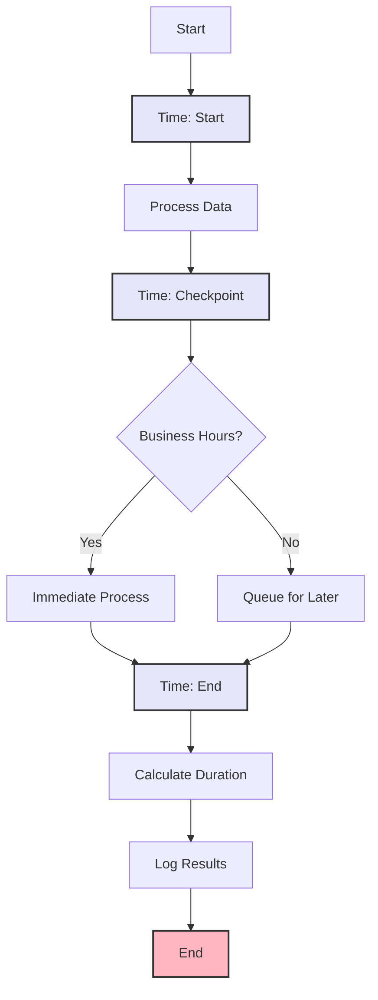

import { Card, CardHeader, CardTitle, CardDescription } from '@site/src/components/Card';
import { Callout } from '@site/src/components/Callout';
import { Features, Feature } from '@site/src/components/Features';
import { CollapsibleCodeBlock, InlineCodeCard } from '@site/src/components/CodeBlock';
import Tabs from '@theme/Tabs';
import TabItem from '@theme/TabItem';
import CodeBlock from '@theme/CodeBlock';

# Time Block Element

The Time Block element provides current time and date information in the HPC Neura Execution Engine. It's essential for timestamps, scheduling, time-based logic, and tracking when events occur in your flows.

<Card>
  <CardHeader>
    <CardTitle>Element Overview</CardTitle>
  </CardHeader>
  

    <table>
      <tbody>
        <tr>
          <td><strong>Type</strong></td>
          <td><code>time</code></td>
        </tr>
        <tr>
          <td><strong>Category</strong></td>
          <td>Utility Elements</td>
        </tr>
        <tr>
          <td><strong>Input</strong></td>
          <td>None - generates current time</td>
        </tr>
        <tr>
          <td><strong>Output</strong></td>
          <td>Time/date in various formats</td>
        </tr>
        <tr>
          <td><strong>L2 Customizable</strong></td>
          <td>Format, timezone, output fields</td>
        </tr>
      </tbody>
    </table>
  

</Card>

## Purpose

<Features>
  <Feature title="Timestamps" icon="/img/icons/terminal.svg">
    Generate timestamps for logging and tracking
  </Feature>
  <Feature title="Time-Based Logic" icon="/img/icons/network.svg">
    Enable scheduling and time conditions
  </Feature>
  <Feature title="Date Operations" icon="/img/icons/settings.svg">
    Provide date/time for calculations
  </Feature>
</Features>

## Element Schema

<CollapsibleCodeBlock
  title="Complete Element Definition"
  description="L1 element template for Time Block"
  language="yaml"
  defaultCollapsed={false}
>
{`type: time
element_id: null  # Auto-generated at L2
name: null  # Set by L2
node_description: Provides current date and time information in various formats
description: null  # Customizable by L2
input_schema: {}  # No inputs required
output_schema:
  timestamp:
    type: string
    description: ISO 8601 timestamp
    required: true
  unix_timestamp:
    type: int
    description: Unix timestamp (seconds since epoch)
    required: false
  date:
    type: string
    description: Date portion (YYYY-MM-DD)
    required: false
  time:
    type: string
    description: Time portion (HH:MM:SS)
    required: false
  year:
    type: int
    description: Current year
    required: false
  month:
    type: int
    description: Current month (1-12)
    required: false
  day:
    type: int
    description: Current day of month
    required: false
  hour:
    type: int
    description: Current hour (0-23)
    required: false
  minute:
    type: int
    description: Current minute (0-59)
    required: false
  second:
    type: int
    description: Current second (0-59)
    required: false
  day_of_week:
    type: string
    description: Day name (e.g., Monday)
    required: false
  timezone:
    type: string
    description: Timezone identifier
    required: false
parameter_schema_structure:
  format:
    type: string
    description: Output format for timestamp
    enum: ["iso", "unix", "custom"]
  custom_format:
    type: string
    description: Custom strftime format string
  timezone:
    type: string
    description: Timezone for output (e.g., UTC, America/New_York)
  include_components:
    type: list
    description: Which time components to include in output
parameters:
  format: "iso"
  custom_format: "%Y-%m-%d %H:%M:%S"
  timezone: "UTC"
  include_components: ["timestamp", "date", "time"]
processing_message: Getting current time...
tags:
  - utility
  - time
  - datetime
layer: null  # Set by L2
hyperparameters:
  type:
    access: fixed
  element_id:
    access: fixed
  name:
    access: edit
  description:
    access: edit
  input_schema:
    access: fixed
  output_schema:
    access: fixed
  parameters.format:
    access: edit
  parameters.custom_format:
    access: edit
  parameters.timezone:
    access: edit
  parameters.include_components:
    access: edit
  processing_message:
    access: edit
  tags:
    access: append
  layer:
    access: edit`}
</CollapsibleCodeBlock>

## Key Characteristics

<Callout type="info">
The Time Block element captures the **current time at execution**, not when the flow was created. Each execution provides fresh time data based on the configured timezone and format.
</Callout>

### Output Components

| Component | Format | Example |
|-----------|--------|---------|
| `timestamp` | ISO 8601 | "2025-01-27T14:30:45.123Z" |
| `unix_timestamp` | Seconds | 1737989445 |
| `date` | YYYY-MM-DD | "2025-01-27" |
| `time` | HH:MM:SS | "14:30:45" |
| `day_of_week` | Name | "Monday" |

## Usage Examples

### Basic Timestamp Generation

<CollapsibleCodeBlock
  title="Simple Timestamp"
  description="Get current time for logging"
  language="yaml"
>
{`flow_definition:
  nodes:
    current_time:
      type: time
      element_id: current_time
      name: "Get Current Time"
      description: "Capture execution timestamp"
      parameters:
        format: "iso"
        timezone: "UTC"
        include_components: ["timestamp", "unix_timestamp"]
      processing_message: "Getting timestamp..."
      tags:
        - timestamp
        - logging
      layer: "utility"
      
    log_entry:
      type: custom
      name: "Create Log Entry"
      code: |
        output['log'] = {
            'event': 'Flow execution started',
            'timestamp': inputs['timestamp'],
            'unix': inputs['unix_timestamp'],
            'user': inputs.get('user_id', 'anonymous')
        }
        
  connections:
    - from_id: current_time
      to_id: log_entry
      from_output: "current_time:timestamp"
      to_input: "log_entry:timestamp"
      
    - from_id: current_time
      to_id: log_entry
      from_output: "current_time:unix_timestamp"
      to_input: "log_entry:unix_timestamp"`}
</CollapsibleCodeBlock>

### Time-Based Routing

<CollapsibleCodeBlock
  title="Business Hours Check"
  description="Route based on time of day"
  language="yaml"
>
{`nodes:
  time_check:
    type: time
    element_id: time_check
    name: "Check Current Time"
    description: "Get time for business hours check"
    parameters:
      format: "iso"
      timezone: "America/New_York"
      include_components: ["hour", "day_of_week", "timestamp"]
      
  business_hours_checker:
    type: custom
    name: "Check Business Hours"
    code: |
      hour = inputs['hour']
      day = inputs['day_of_week']
      
      # Business hours: Mon-Fri, 9 AM - 5 PM EST
      weekdays = ['Monday', 'Tuesday', 'Wednesday', 'Thursday', 'Friday']
      
      is_weekday = day in weekdays
      is_business_hours = 9 <= hour < 17
      
      output['is_open'] = is_weekday and is_business_hours
      output['status'] = 'open' if output['is_open'] else 'closed'
      output['message'] = f"It's {day} at {hour}:00 EST"
      
      if not is_weekday:
          output['reason'] = 'Weekend - closed'
      elif hour < 9:
          output['reason'] = 'Before business hours'
      elif hour >= 17:
          output['reason'] = 'After business hours'
      else:
          output['reason'] = 'Open for business'
          
  hours_router:
    type: case
    name: "Route by Hours"
    parameters:
      cases:
        - open_hours:
            variable1: is_open
            variable2: true
            compare: "=="
        - closed_hours:
            variable1: is_open
            variable2: false
            compare: "=="`}
</CollapsibleCodeBlock>

### Formatted Timestamps

<CollapsibleCodeBlock
  title="Custom Date Formats"
  description="Generate dates in specific formats"
  language="yaml"
>
{`nodes:
  # Different format examples
  iso_time:
    type: time
    name: "ISO Format"
    parameters:
      format: "iso"
      timezone: "UTC"
      
  unix_time:
    type: time
    name: "Unix Timestamp"
    parameters:
      format: "unix"
      
  custom_time:
    type: time
    name: "Custom Format"
    parameters:
      format: "custom"
      custom_format: "%B %d, %Y at %I:%M %p"  # January 27, 2025 at 02:30 PM
      timezone: "America/Los_Angeles"
      
  file_timestamp:
    type: time
    name: "File-Safe Timestamp"
    parameters:
      format: "custom"
      custom_format: "%Y%m%d_%H%M%S"  # 20250127_143045
      
  # Use formatted times
  filename_builder:
    type: custom
    name: "Build Filename"
    code: |
      timestamp = inputs['file_timestamp']
      user_id = inputs.get('user_id', 'unknown')
      
      output['filename'] = f"report_{user_id}_{timestamp}.pdf"
      output['backup_name'] = f"backup_{timestamp}.zip"
      output['log_name'] = f"log_{timestamp}.txt"`}
</CollapsibleCodeBlock>

## Common Patterns

### Pattern 1: Execution Tracking

<CollapsibleCodeBlock
  title="Track Flow Execution Time"
  description="Measure flow performance"
  language="yaml"
>
{`nodes:
  start_time:
    type: time
    name: "Execution Start"
    parameters:
      format: "iso"
      include_components: ["timestamp", "unix_timestamp"]
      
  # ... flow processing nodes ...
  
  end_time:
    type: time
    name: "Execution End"
    parameters:
      format: "iso"
      include_components: ["timestamp", "unix_timestamp"]
      
  duration_calculator:
    type: custom
    name: "Calculate Duration"
    code: |
      start_unix = inputs['start_unix']
      end_unix = inputs['end_unix']
      
      duration_seconds = end_unix - start_unix
      duration_ms = duration_seconds * 1000
      
      # Format duration
      if duration_seconds < 60:
          formatted = f"{duration_seconds} seconds"
      elif duration_seconds < 3600:
          minutes = duration_seconds // 60
          seconds = duration_seconds % 60
          formatted = f"{minutes}m {seconds}s"
      else:
          hours = duration_seconds // 3600
          minutes = (duration_seconds % 3600) // 60
          formatted = f"{hours}h {minutes}m"
          
      output['duration'] = {
          'seconds': duration_seconds,
          'milliseconds': duration_ms,
          'formatted': formatted,
          'start': inputs['start_time'],
          'end': inputs['end_time']
      }`}
</CollapsibleCodeBlock>

### Pattern 2: Scheduled Actions

<CollapsibleCodeBlock
  title="Time-Based Actions"
  description="Execute actions based on time"
  language="yaml"
>
{`nodes:
  current_datetime:
    type: time
    name: "Get Current Date/Time"
    parameters:
      timezone: "UTC"
      include_components: ["hour", "day", "month", "day_of_week"]
      
  schedule_checker:
    type: custom
    name: "Check Schedule"
    code: |
      hour = inputs['hour']
      day = inputs['day']
      month = inputs['month']
      day_of_week = inputs['day_of_week']
      
      schedules = []
      
      # Daily backup at 2 AM
      if hour == 2:
          schedules.append({
              'action': 'daily_backup',
              'priority': 'high'
          })
          
      # Weekly report on Mondays at 9 AM
      if day_of_week == 'Monday' and hour == 9:
          schedules.append({
              'action': 'weekly_report',
              'priority': 'medium'
          })
          
      # Monthly billing on 1st at midnight
      if day == 1 and hour == 0:
          schedules.append({
              'action': 'monthly_billing',
              'priority': 'high'
          })
          
      # Maintenance window: Sunday 3-5 AM
      if day_of_week == 'Sunday' and 3 <= hour < 5:
          schedules.append({
              'action': 'maintenance_mode',
              'priority': 'critical'
          })
          
      output['scheduled_actions'] = schedules
      output['has_actions'] = len(schedules) > 0
      
  action_router:
    type: case
    name: "Route Scheduled Actions"
    parameters:
      cases:
        - has_scheduled:
            variable1: has_actions
            variable2: true
            compare: "=="`}
</CollapsibleCodeBlock>

### Pattern 3: Time-Based Data

<CollapsibleCodeBlock
  title="Add Timestamps to Data"
  description="Enrich data with time information"
  language="yaml"
>
{`nodes:
  # Get comprehensive time data
  time_enricher:
    type: time
    name: "Time Information"
    parameters:
      timezone: "UTC"
      include_components: [
        "timestamp", "date", "time", 
        "year", "month", "day",
        "hour", "minute", "second",
        "day_of_week"
      ]
      
  # User action
  user_action:
    type: chat_input
    name: "User Action"
    
  # Enrich with timestamp
  action_recorder:
    type: custom
    name: "Record Action"
    code: |
      action = inputs['user_action']
      time_data = inputs['time_data']
      
      output['event'] = {
          'action': action,
          'timestamp': time_data['timestamp'],
          'date': time_data['date'],
          'time': time_data['time'],
          'metadata': {
              'year': time_data['year'],
              'month': time_data['month'],
              'day': time_data['day'],
              'day_of_week': time_data['day_of_week'],
              'hour': time_data['hour']
          },
          'formatted': f"{action} at {time_data['time']} on {time_data['date']}"
      }
      
  # Store in database
  db_writer:
    type: rest_api
    name: "Store Event"
    parameters:
      url: "https://api.example.com/events"
      method: "POST"`}
</CollapsibleCodeBlock>

## Advanced Usage

### Timezone Handling

<CollapsibleCodeBlock
  title="Multi-Timezone Support"
  description="Work with different timezones"
  language="yaml"
>
{`nodes:
  # Get time in multiple zones
  utc_time:
    type: time
    name: "UTC Time"
    parameters:
      timezone: "UTC"
      include_components: ["timestamp", "hour"]
      
  ny_time:
    type: time
    name: "New York Time"
    parameters:
      timezone: "America/New_York"
      include_components: ["timestamp", "hour"]
      
  london_time:
    type: time
    name: "London Time"
    parameters:
      timezone: "Europe/London"
      include_components: ["timestamp", "hour"]
      
  tokyo_time:
    type: time
    name: "Tokyo Time"
    parameters:
      timezone: "Asia/Tokyo"
      include_components: ["timestamp", "hour"]
      
  # Compare times
  timezone_analyzer:
    type: custom
    name: "Analyze Timezones"
    code: |
      zones = {
          'UTC': inputs['utc_hour'],
          'New York': inputs['ny_hour'],
          'London': inputs['london_hour'],
          'Tokyo': inputs['tokyo_hour']
      }
      
      # Find offices that are open (9 AM - 5 PM)
      open_offices = []
      for location, hour in zones.items():
          if 9 <= hour < 17:
              open_offices.append(location)
              
      output['timezone_status'] = zones
      output['open_offices'] = open_offices
      output['global_coverage'] = len(open_offices) > 0`}
</CollapsibleCodeBlock>

### Date Calculations

<CollapsibleCodeBlock
  title="Date-Based Logic"
  description="Calculate dates and deadlines"
  language="yaml"
>
{`nodes:
  current_date:
    type: time
    name: "Today's Date"
    parameters:
      include_components: ["date", "day", "month", "year", "day_of_week"]
      
  deadline_calculator:
    type: custom
    name: "Calculate Deadlines"
    code: |
      from datetime import datetime, timedelta
      
      # Parse current date
      date_str = inputs['date']
      current = datetime.strptime(date_str, '%Y-%m-%d')
      
      # Calculate various deadlines
      deadlines = {
          'tomorrow': (current + timedelta(days=1)).strftime('%Y-%m-%d'),
          'next_week': (current + timedelta(weeks=1)).strftime('%Y-%m-%d'),
          'next_month': (current + timedelta(days=30)).strftime('%Y-%m-%d'),
          'quarter_end': calculate_quarter_end(current),
          'year_end': f"{inputs['year']}-12-31"
      }
      
      # Business day calculations
      next_business_day = current + timedelta(days=1)
      while next_business_day.weekday() in [5, 6]:  # Skip weekends
          next_business_day += timedelta(days=1)
          
      deadlines['next_business_day'] = next_business_day.strftime('%Y-%m-%d')
      
      output['deadlines'] = deadlines
      output['days_until_year_end'] = (
          datetime(inputs['year'], 12, 31) - current
      ).days
      
  def calculate_quarter_end(date):
      quarter = (date.month - 1) // 3
      quarter_ends = [
          (3, 31),   # Q1: March 31
          (6, 30),   # Q2: June 30
          (9, 30),   # Q3: September 30
          (12, 31)   # Q4: December 31
      ]
      month, day = quarter_ends[quarter]
      return f"{date.year}-{month:02d}-{day}"`}
</CollapsibleCodeBlock>

### Event Timing

<CollapsibleCodeBlock
  title="Event Duration Tracking"
  description="Track event timing"
  language="yaml"
>
{`nodes:
  event_start:
    type: time
    name: "Event Start Time"
    parameters:
      include_components: ["timestamp", "unix_timestamp"]
      
  # Event processing...
  
  checkpoint_1:
    type: time
    name: "Checkpoint 1"
    parameters:
      include_components: ["unix_timestamp"]
      
  checkpoint_2:
    type: time
    name: "Checkpoint 2"
    parameters:
      include_components: ["unix_timestamp"]
      
  event_end:
    type: time
    name: "Event End Time"
    parameters:
      include_components: ["timestamp", "unix_timestamp"]
      
  timing_analyzer:
    type: custom
    name: "Analyze Timing"
    code: |
      start = inputs['start_unix']
      cp1 = inputs['cp1_unix']
      cp2 = inputs['cp2_unix']
      end = inputs['end_unix']
      
      # Calculate phases
      phase1_duration = cp1 - start
      phase2_duration = cp2 - cp1
      phase3_duration = end - cp2
      total_duration = end - start
      
      # Performance analysis
      output['timing_report'] = {
          'total_seconds': total_duration,
          'phases': {
              'initialization': phase1_duration,
              'processing': phase2_duration,
              'finalization': phase3_duration
          },
          'percentages': {
              'initialization': round(phase1_duration / total_duration * 100, 1),
              'processing': round(phase2_duration / total_duration * 100, 1),
              'finalization': round(phase3_duration / total_duration * 100, 1)
          },
          'bottleneck': max(
              [('initialization', phase1_duration),
               ('processing', phase2_duration),
               ('finalization', phase3_duration)],
              key=lambda x: x[1]
          )[0]
      }`}
</CollapsibleCodeBlock>

## Best Practices

<Callout type="success" title="Time Block Best Practices">
✅ **Use UTC**: Default to UTC for consistency across systems
✅ **Include Timezone**: Always specify timezone to avoid confusion
✅ **Component Selection**: Only include needed components
✅ **Format Consistency**: Use consistent formats across your flow
✅ **Handle Timezones**: Be explicit about timezone conversions
✅ **Document Format**: Explain custom format strings
✅ **Consider Performance**: Multiple time nodes add minimal overhead
</Callout>

## Common Format Strings

<Card>
  <CardHeader>
    <CardTitle>Useful Time Format Strings</CardTitle>
  </CardHeader>
  

    <table>
      <thead>
        <tr>
          <th>Format</th>
          <th>Example Output</th>
          <th>Use Case</th>
        </tr>
      </thead>
      <tbody>
        <tr>
          <td><code>%Y-%m-%d</code></td>
          <td>2025-01-27</td>
          <td>Standard date</td>
        </tr>
        <tr>
          <td><code>%Y%m%d</code></td>
          <td>20250127</td>
          <td>Compact date</td>
        </tr>
        <tr>
          <td><code>%B %d, %Y</code></td>
          <td>January 27, 2025</td>
          <td>Readable date</td>
        </tr>
        <tr>
          <td><code>%H:%M:%S</code></td>
          <td>14:30:45</td>
          <td>24-hour time</td>
        </tr>
        <tr>
          <td><code>%I:%M %p</code></td>
          <td>02:30 PM</td>
          <td>12-hour time</td>
        </tr>
        <tr>
          <td><code>%Y-%m-%d %H:%M:%S</code></td>
          <td>2025-01-27 14:30:45</td>
          <td>Full datetime</td>
        </tr>
        <tr>
          <td><code>%a, %b %d</code></td>
          <td>Mon, Jan 27</td>
          <td>Short date</td>
        </tr>
      </tbody>
    </table>
  

</Card>

## Error Handling

### Invalid Timezone

<CollapsibleCodeBlock
  title="Handle Timezone Errors"
  description="Graceful timezone handling"
  language="yaml"
>
{`nodes:
  safe_time:
    type: custom
    name: "Safe Time Getter"
    code: |
      from datetime import datetime
      import pytz
      
      timezone_str = inputs.get('timezone', 'UTC')
      
      try:
          # Try to get the timezone
          tz = pytz.timezone(timezone_str)
          now = datetime.now(tz)
          
          output['timestamp'] = now.isoformat()
          output['timezone'] = timezone_str
          output['valid_timezone'] = True
          
      except pytz.exceptions.UnknownTimeZoneError:
          # Fall back to UTC
          now = datetime.now(pytz.UTC)
          
          output['timestamp'] = now.isoformat()
          output['timezone'] = 'UTC'
          output['valid_timezone'] = False
          output['error'] = f"Unknown timezone: {timezone_str}, using UTC"`}
</CollapsibleCodeBlock>

## Visual Flow Example

## Performance Considerations

<Card>
  <CardHeader>
    <CardTitle>Performance Characteristics</CardTitle>
  </CardHeader>
  

    <ul>
      <li><strong>Execution Speed</strong>: Very fast, minimal overhead</li>
      <li><strong>No External Calls</strong>: Uses system time directly</li>
      <li><strong>Multiple Instances</strong>: Safe to use many time nodes</li>
      <li><strong>Memory Usage</strong>: Negligible</li>
      <li><strong>Timezone Operations</strong>: Slight overhead for conversions</li>
    </ul>
  

</Card>

## Related Elements

  <Card>
    <CardHeader>
      <CardTitle>Custom Element</CardTitle>
      <CardDescription>
        For complex date calculations
      </CardDescription>
    </CardHeader>
    

      <a href="../07-custom-elements/01-custom" style={{ textDecoration: 'none' }}>
        Advanced date logic →
      </a>
    

  </Card>
  
  <Card>
    <CardHeader>
      <CardTitle>Random Generator</CardTitle>
      <CardDescription>
        For random time generation
      </CardDescription>
    </CardHeader>
    

      <a href="./03-random-generator" style={{ textDecoration: 'none' }}>
        Random values →
      </a>
    

  </Card>

## Summary

The Time Block element provides essential temporal capabilities by offering:
- **Current time capture** at execution moment
- **Multiple formats** including ISO, Unix, and custom
- **Timezone support** for global applications
- **Component selection** for specific time parts
- **Zero dependencies** using system time

Remember: Time Block captures the execution time, not configuration time. For complex date calculations or time arithmetic, use a Custom element.