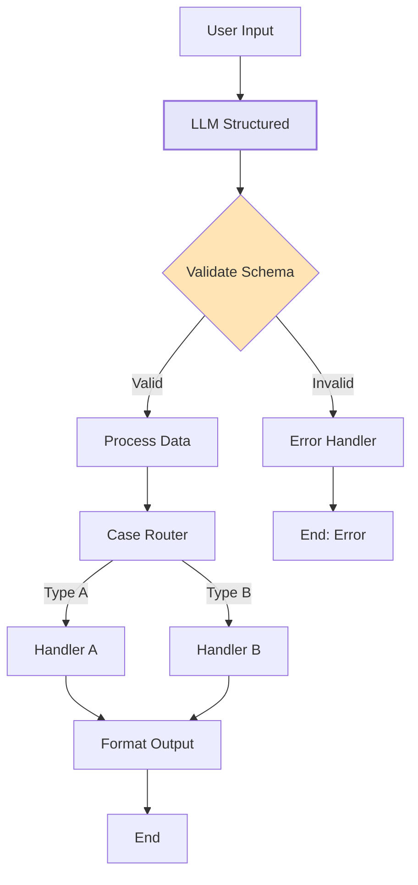

import { Card, CardHeader, CardTitle, CardDescription } from '@site/src/components/Card';
import { Callout } from '@site/src/components/Callout';
import { Features, Feature } from '@site/src/components/Features';
import { CollapsibleCodeBlock, InlineCodeCard } from '@site/src/components/CodeBlock';
import Tabs from '@theme/Tabs';
import TabItem from '@theme/TabItem';
import CodeBlock from '@theme/CodeBlock';

# LLM Structured Element

The LLM Structured element generates structured data according to a defined schema using large language models. Unlike LLM Text which produces free-form text, this element ensures outputs conform to specific JSON structures, making it ideal for data extraction, classification, and structured content generation.

<Card>
  <CardHeader>
    <CardTitle>Element Overview</CardTitle>
  </CardHeader>
  

    <table>
      <tbody>
        <tr>
          <td><strong>Type</strong></td>
          <td><code>llm_structured</code></td>
        </tr>
        <tr>
          <td><strong>Category</strong></td>
          <td>AI Elements</td>
        </tr>
        <tr>
          <td><strong>Output Type</strong></td>
          <td>Structured JSON (schema-defined)</td>
        </tr>
        <tr>
          <td><strong>Default Model</strong></td>
          <td>llama-3.3-70b</td>
        </tr>
        <tr>
          <td><strong>Schema Validation</strong></td>
          <td>Enforced</td>
        </tr>
      </tbody>
    </table>
  

</Card>

## Purpose

<Features>
  <Feature title="Structured Output" icon="/img/icons/docs.svg">
    Generate data that conforms to predefined schemas
  </Feature>
  <Feature title="Data Extraction" icon="/img/icons/database.svg">
    Extract structured information from unstructured text
  </Feature>
  <Feature title="Type Safety" icon="/img/icons/success.svg">
    Ensure outputs match expected data types and structure
  </Feature>
</Features>

## Element Schema

<CollapsibleCodeBlock
  title="Complete Element Definition"
  description="L1 element template for LLM Structured"
  language="yaml"
  defaultCollapsed={false}
>
{`type: llm_structured
element_id: null  # Auto-generated at L2
name: null  # Set by L2
node_description: Generates structured data according to a schema using a language model
description: null  # Customizable by L2
input_schema:
  prompt:
    type: string
    description: The prompt for the LLM
    required: true
  context:
    type: list
    description: Previous conversation context
    required: false
  additional_data:
    type: json
    description: Additional data for the LLM
    required: false
output_schema: {}  # Defined by L2 developer
parameter_schema_structure:
  model:
    type: string
  temperature:
    type: float
    min: 0.0
    max: 1.0
  max_tokens:
    type: int
  wrapper_prompt:
    type: string
  llm_hidden_prompt:
    type: string
parameters:
  model: llama-3.3-70b
  temperature: 0.3  # Lower default for structured output
  max_tokens: 1000
  wrapper_prompt: ""
  llm_hidden_prompt: ""
processing_message: AI is generating structured response...
tags:
  - ai
  - llm
  - structured-output
layer: null
hyperparameters:
  type:
    access: fixed
  element_id:
    access: fixed
  name:
    access: edit
  description:
    access: edit
  input_schema:
    access: fixed
  output_schema:
    access: edit  # L2 defines the structure
  parameters.model:
    access: fixed
  parameters.temperature:
    access: edit
  parameters.max_tokens:
    access: edit
  parameters.wrapper_prompt:
    access: edit
  parameters.llm_hidden_prompt:
    access: hidden
  parameters.api_key:
    access: hidden
  processing_message:
    access: edit
  tags:
    access: append
  layer:
    access: edit`}
</CollapsibleCodeBlock>

## Key Differences from LLM Text

<Card>
  <CardHeader>
    <CardTitle>LLM Text vs LLM Structured</CardTitle>
  </CardHeader>
  

    <table>
      <thead>
        <tr>
          <th>Feature</th>
          <th>LLM Text</th>
          <th>LLM Structured</th>
        </tr>
      </thead>
      <tbody>
        <tr>
          <td><strong>Output Type</strong></td>
          <td>Free-form string</td>
          <td>Schema-validated JSON</td>
        </tr>
        <tr>
          <td><strong>Output Schema</strong></td>
          <td>Fixed (llm_output: string)</td>
          <td>Customizable by L2</td>
        </tr>
        <tr>
          <td><strong>Default Temperature</strong></td>
          <td>0.7 (creative)</td>
          <td>0.3 (deterministic)</td>
        </tr>
        <tr>
          <td><strong>Use Case</strong></td>
          <td>Conversations, content</td>
          <td>Data extraction, classification</td>
        </tr>
        <tr>
          <td><strong>Validation</strong></td>
          <td>None</td>
          <td>Schema enforced</td>
        </tr>
      </tbody>
    </table>
  

</Card>

## Output Schema Definition

The power of LLM Structured lies in its customizable output schema. L2 developers define exactly what structure the AI should generate:

<CollapsibleCodeBlock
  title="Output Schema Examples"
  description="Common schema patterns"
  language="yaml"
>
{`# Example 1: Sentiment Analysis
output_schema:
  sentiment:
    type: string
    enum: ["positive", "negative", "neutral"]
    required: true
  confidence:
    type: float
    minimum: 0.0
    maximum: 1.0
    required: true
  keywords:
    type: list
    required: false

# Example 2: Entity Extraction
output_schema:
  entities:
    type: list
    required: true
    items:
      type: json
      properties:
        type:
          type: string
          enum: ["person", "organization", "location", "date"]
        value:
          type: string
        confidence:
          type: float
          
# Example 3: Classification with Details
output_schema:
  category:
    type: string
    enum: ["technical", "billing", "general", "complaint"]
    required: true
  subcategory:
    type: string
    required: false
  priority:
    type: string
    enum: ["low", "medium", "high", "urgent"]
    required: true
  summary:
    type: string
    max_length: 200
    required: true
  action_required:
    type: bool
    required: true
    
# Example 4: Complex Nested Structure
output_schema:
  analysis:
    type: json
    required: true
    properties:
      main_topic:
        type: string
      sentiment_scores:
        type: json
        properties:
          positive: 
            type: float
          negative:
            type: float
          neutral:
            type: float
      extracted_data:
        type: list
        items:
          type: json
  metadata:
    type: json
    required: false`}
</CollapsibleCodeBlock>

## Usage Examples

### Intent Classification

<CollapsibleCodeBlock
  title="Customer Intent Classifier"
  description="Classify customer queries into intents"
  language="yaml"
>
{`flow_definition:
  nodes:
    user_input:
      type: chat_input
      name: "Customer Query"
      
    intent_classifier:
      type: llm_structured
      element_id: intent_classifier
      name: "Classify Intent"
      description: "Analyzes customer intent and extracts key information"
      output_schema:
        primary_intent:
          type: string
          enum: ["purchase", "support", "refund", "inquiry", "complaint", "other"]
          required: true
        confidence:
          type: float
          minimum: 0.0
          maximum: 1.0
          required: true
        entities:
          type: json
          required: false
          properties:
            product_name:
              type: string
            order_number:
              type: string
            issue_type:
              type: string
        urgency:
          type: string
          enum: ["low", "medium", "high"]
          required: true
        suggested_action:
          type: string
          required: false
      parameters:
        temperature: 0.2  # Low for consistency
        max_tokens: 500
        wrapper_prompt: |
          Analyze the following customer query and extract structured information.
          
          Customer Query: {prompt}
          
          Classify the intent and extract any relevant entities.
      processing_message: "Analyzing customer intent..."
      tags:
        - ai
        - llm
        - structured-output
        - intent-classification
      layer: "ai-processing"
      
  connections:
    - from_id: user_input
      to_id: intent_classifier
      from_output: "user_input:chat_input"
      to_input: "intent_classifier:prompt"`}
</CollapsibleCodeBlock>

### Data Extraction

<CollapsibleCodeBlock
  title="Information Extractor"
  description="Extract structured data from text"
  language="yaml"
>
{`nodes:
  text_input:
    type: chat_input
    name: "Text to Analyze"
    
  data_extractor:
    type: llm_structured
    name: "Extract Information"
    output_schema:
      contact_info:
        type: json
        required: true
        properties:
          name:
            type: string
            required: false
          email:
            type: string
            pattern: "^[a-zA-Z0-9._%+-]+@[a-zA-Z0-9.-]+\\.[a-zA-Z]{2,}$"
            required: false
          phone:
            type: string
            required: false
          company:
            type: string
            required: false
      dates_mentioned:
        type: list
        required: true
        items:
          type: json
          properties:
            date:
              type: string
            context:
              type: string
      monetary_amounts:
        type: list
        required: true
        items:
          type: json
          properties:
            amount:
              type: float
            currency:
              type: string
            context:
              type: string
      key_points:
        type: list
        required: true
        max_items: 5
    parameters:
      temperature: 0.1  # Very low for accurate extraction
      wrapper_prompt: |
        Extract structured information from the following text.
        Be precise and only include information explicitly mentioned.
        
        Text: {prompt}`}
</CollapsibleCodeBlock>

### Multi-Step Analysis

<CollapsibleCodeBlock
  title="Complex Analysis Pipeline"
  description="Chained structured outputs for comprehensive analysis"
  language="yaml"
>
{`nodes:
  # Step 1: Initial Classification
  initial_analyzer:
    type: llm_structured
    name: "Initial Analysis"
    output_schema:
      document_type:
        type: string
        enum: ["email", "report", "article", "conversation", "other"]
        required: true
      language:
        type: string
        required: true
      topics:
        type: list
        max_items: 3
        required: true
      requires_detailed_analysis:
        type: bool
        required: true
    parameters:
      temperature: 0.3
      wrapper_prompt: |
        Analyze this document: {prompt}
        
  # Step 2: Detailed Analysis (conditional)
  detailed_analyzer:
    type: llm_structured
    name: "Detailed Analysis"
    output_schema:
      summary:
        type: string
        max_length: 500
        required: true
      key_insights:
        type: list
        required: true
        items:
          type: json
          properties:
            insight:
              type: string
            importance:
              type: string
              enum: ["low", "medium", "high"]
            evidence:
              type: string
      recommendations:
        type: list
        required: false
        items:
          type: json
          properties:
            action:
              type: string
            priority:
              type: int
              minimum: 1
              maximum: 5
            rationale:
              type: string
      sentiment_analysis:
        type: json
        required: true
        properties:
          overall:
            type: string
            enum: ["very_negative", "negative", "neutral", "positive", "very_positive"]
          confidence:
            type: float
          aspects:
            type: json
    parameters:
      temperature: 0.4
      max_tokens: 1500
      wrapper_prompt: |
        Provide a detailed analysis of this {document_type} document.
        Topics identified: {topics}
        
        Document: {prompt}`}
</CollapsibleCodeBlock>

## Common Patterns

### Pattern 1: Form Processing

<CollapsibleCodeBlock
  title="Structured Form Data Extraction"
  description="Extract form-like data from natural language"
  language="yaml"
>
{`nodes:
  form_extractor:
    type: llm_structured
    name: "Extract Form Data"
    output_schema:
      personal_info:
        type: json
        required: true
        properties:
          first_name:
            type: string
            required: false
          last_name:
            type: string
            required: false
          date_of_birth:
            type: string
            pattern: "\\d{4}-\\d{2}-\\d{2}"
            required: false
          gender:
            type: string
            enum: ["male", "female", "other", "prefer_not_to_say"]
            required: false
      contact_details:
        type: json
        required: true
        properties:
          email:
            type: string
            required: false
          phone:
            type: string
            required: false
          address:
            type: json
            properties:
              street:
                type: string
              city:
                type: string
              state:
                type: string
              zip:
                type: string
              country:
                type: string
      preferences:
        type: json
        required: false
        properties:
          communication_method:
            type: string
            enum: ["email", "phone", "sms", "mail"]
          language:
            type: string
          timezone:
            type: string
      additional_notes:
        type: string
        required: false
    parameters:
      temperature: 0.1  # Very deterministic
      wrapper_prompt: |
        Extract form data from the following text. Only include explicitly stated information.
        For dates, use YYYY-MM-DD format.
        
        Text: {prompt}`}
</CollapsibleCodeBlock>

### Pattern 2: Decision Support

<CollapsibleCodeBlock
  title="AI Decision Analysis"
  description="Structured decision-making support"
  language="yaml"
>
{`nodes:
  decision_analyzer:
    type: llm_structured
    name: "Decision Analysis"
    output_schema:
      decision_summary:
        type: json
        required: true
        properties:
          situation:
            type: string
            max_length: 200
          options:
            type: list
            min_items: 2
            max_items: 5
            items:
              type: json
              properties:
                option_name:
                  type: string
                description:
                  type: string
                feasibility:
                  type: string
                  enum: ["low", "medium", "high"]
      pros_cons_analysis:
        type: list
        required: true
        items:
          type: json
          properties:
            option:
              type: string
            pros:
              type: list
              items:
                type: string
            cons:
              type: list
              items:
                type: string
            score:
              type: int
              minimum: 1
              maximum: 10
      recommendation:
        type: json
        required: true
        properties:
          recommended_option:
            type: string
          confidence:
            type: float
            minimum: 0.0
            maximum: 1.0
          reasoning:
            type: string
          risks:
            type: list
            items:
              type: string
          next_steps:
            type: list
            items:
              type: string
    parameters:
      temperature: 0.4
      max_tokens: 2000
      wrapper_prompt: |
        Analyze the following decision scenario and provide structured guidance.
        
        Scenario: {prompt}
        
        Provide a balanced analysis with clear recommendations.`}
</CollapsibleCodeBlock>

### Pattern 3: Content Categorization

<CollapsibleCodeBlock
  title="Multi-Label Content Tagger"
  description="Categorize content with multiple attributes"
  language="yaml"
>
{`nodes:
  content_categorizer:
    type: llm_structured
    name: "Categorize Content"
    output_schema:
      primary_category:
        type: string
        enum: [
          "technology", "business", "health", "education", 
          "entertainment", "sports", "politics", "science", "other"
        ]
        required: true
      secondary_categories:
        type: list
        max_items: 3
        required: false
        items:
          type: string
          enum: [
            "technology", "business", "health", "education",
            "entertainment", "sports", "politics", "science"
          ]
      content_type:
        type: string
        enum: ["news", "opinion", "tutorial", "review", "analysis", "other"]
        required: true
      target_audience:
        type: string
        enum: ["general", "professional", "academic", "youth", "senior"]
        required: true
      tone:
        type: string
        enum: ["formal", "informal", "neutral", "humorous", "serious"]
        required: true
      tags:
        type: list
        min_items: 3
        max_items: 10
        required: true
        items:
          type: string
      seo_metadata:
        type: json
        required: false
        properties:
          meta_title:
            type: string
            max_length: 60
          meta_description:
            type: string
            max_length: 160
          focus_keywords:
            type: list
            max_items: 5
            items:
              type: string
    parameters:
      temperature: 0.3
      wrapper_prompt: |
        Analyze and categorize the following content:
        
        {prompt}
        
        Provide accurate categorization for content management.`}
</CollapsibleCodeBlock>

## Advanced Schema Patterns

### Conditional Fields

<CollapsibleCodeBlock
  title="Schema with Conditional Logic"
  description="Different fields based on conditions"
  language="yaml"
>
{`# Note: Actual conditional logic handled in wrapper prompt
output_schema:
  transaction_type:
    type: string
    enum: ["payment", "refund", "transfer", "inquiry"]
    required: true
  # Payment-specific fields
  payment_details:
    type: json
    required: false  # Only when transaction_type = "payment"
    properties:
      amount:
        type: float
      recipient:
        type: string
      payment_method:
        type: string
        enum: ["credit_card", "debit_card", "bank_transfer", "crypto"]
  # Refund-specific fields
  refund_details:
    type: json
    required: false  # Only when transaction_type = "refund"
    properties:
      original_transaction_id:
        type: string
      refund_amount:
        type: float
      reason:
        type: string
  # Common fields
  status:
    type: string
    enum: ["pending", "processing", "completed", "failed"]
    required: true
  timestamp:
    type: string
    required: true

# Wrapper prompt enforces conditional logic
wrapper_prompt: |
  Analyze this transaction: {prompt}
  
  Based on the transaction_type:
  - If "payment": fill payment_details
  - If "refund": fill refund_details
  - Otherwise: leave specific details null`}
</CollapsibleCodeBlock>

### Recursive Structures

<CollapsibleCodeBlock
  title="Nested and Recursive Schemas"
  description="Complex hierarchical data structures"
  language="yaml"
>
{`output_schema:
  document_structure:
    type: json
    required: true
    properties:
      title:
        type: string
        required: true
      sections:
        type: list
        required: true
        items:
          type: json
          properties:
            section_title:
              type: string
              required: true
            content_summary:
              type: string
              max_length: 200
              required: true
            subsections:
              type: list
              required: false
              items:
                type: json
                properties:
                  subsection_title:
                    type: string
                  key_points:
                    type: list
                    items:
                      type: string
            importance:
              type: string
              enum: ["critical", "important", "supplementary"]
              required: true
  outline_depth:
    type: int
    minimum: 1
    maximum: 5
    required: true
  total_sections:
    type: int
    required: true`}
</CollapsibleCodeBlock>

## Best Practices

<Callout type="success" title="LLM Structured Best Practices">
✅ **Define Clear Schemas**: Be explicit about required fields and types
✅ **Use Enums**: Constrain options for consistent categorization
✅ **Low Temperature**: Use 0.1-0.4 for deterministic outputs
✅ **Validation Rules**: Add patterns, min/max values for data quality
✅ **Descriptive Fields**: Use clear field names and descriptions
✅ **Test Edge Cases**: Verify behavior with ambiguous inputs
✅ **Fallback Values**: Consider optional fields for uncertain data
✅ **Schema Documentation**: Document the purpose of each field
</Callout>

## Error Handling

### Schema Validation Errors

<Card>
  <CardHeader>
    <CardTitle>Common Schema Issues</CardTitle>
  </CardHeader>
  

    <table>
      <thead>
        <tr>
          <th>Error Type</th>
          <th>Cause</th>
          <th>Solution</th>
        </tr>
      </thead>
      <tbody>
        <tr>
          <td>Type Mismatch</td>
          <td>LLM returns wrong type</td>
          <td>Adjust prompt clarity, add examples</td>
        </tr>
        <tr>
          <td>Missing Required</td>
          <td>Required field not generated</td>
          <td>Emphasize requirements in prompt</td>
        </tr>
        <tr>
          <td>Invalid Enum</td>
          <td>Value not in allowed list</td>
          <td>List valid options in prompt</td>
        </tr>
        <tr>
          <td>Format Error</td>
          <td>Pattern mismatch (dates, emails)</td>
          <td>Provide format examples</td>
        </tr>
        <tr>
          <td>Range Violation</td>
          <td>Number outside min/max</td>
          <td>Specify ranges in prompt</td>
        </tr>
      </tbody>
    </table>
  

</Card>

### Robust Error Handling

<CollapsibleCodeBlock
  title="Schema Validation and Fallback"
  description="Handle potential schema errors gracefully"
  language="yaml"
>
{`nodes:
  structured_generator:
    type: llm_structured
    name: "Generate Structured Data"
    output_schema:
      status:
        type: string
        enum: ["success", "partial", "failed"]
        required: true
      data:
        type: json
        required: false
      errors:
        type: list
        required: false
        items:
          type: string
          
  validator:
    type: custom
    name: "Validate Output"
    code: |
      structured_output = inputs.get('structured_output', {})
      
      # Check for required fields
      if not structured_output.get('status'):
          output['valid'] = False
          output['error'] = 'Missing required status field'
          output['fallback_data'] = {
              'status': 'failed',
              'errors': ['Output validation failed']
          }
      else:
          output['valid'] = True
          output['data'] = structured_output
          
      # Additional validation logic
      if structured_output.get('status') == 'partial':
          output['needs_retry'] = True
      else:
          output['needs_retry'] = False`}
</CollapsibleCodeBlock>

## Performance Optimization

### Schema Complexity vs Performance

<Features>
  <Feature title="Simple Schemas" icon="/img/icons/hpc.svg">
    Flat structures with basic types process faster
  </Feature>
  <Feature title="Nested Structures" icon="/img/icons/network.svg">
    Deep nesting requires more tokens and time
  </Feature>
  <Feature title="Enum Constraints" icon="/img/icons/success.svg">
    Enums improve accuracy but may slow generation
  </Feature>
</Features>

### Optimization Strategies

<CollapsibleCodeBlock
  title="Optimized Schema Design"
  description="Balance complexity and performance"
  language="yaml"
>
{`# Instead of deeply nested:
bad_schema:
  user:
    type: json
    properties:
      profile:
        type: json
        properties:
          personal:
            type: json
            properties:
              name:
                type: json
                properties:
                  first: { type: string }
                  last: { type: string }
                  
# Use flatter structure:
good_schema:
  user_first_name:
    type: string
    required: true
  user_last_name:
    type: string
    required: true
  profile_data:
    type: json
    required: false
    
# For better performance with lists:
optimized_list_schema:
  # Limit list sizes
  items:
    type: list
    max_items: 10  # Prevent excessive generation
    required: true
    items:
      type: json
      properties:
        id:
          type: string
        value:
          type: string
        # Keep item structure simple`}
</CollapsibleCodeBlock>

## Integration Examples

### With Flow Control

<CollapsibleCodeBlock
  title="Structured Output for Routing"
  description="Use structured data to control flow"
  language="yaml"
>
{`nodes:
  request_analyzer:
    type: llm_structured
    name: "Analyze Request"
    output_schema:
      request_type:
        type: string
        enum: ["simple", "complex", "urgent"]
        required: true
      confidence:
        type: float
        required: true
      requires_human:
        type: bool
        required: true
      estimated_time_minutes:
        type: int
        required: false
        
  case_router:
    type: case
    name: "Route by Type"
    parameters:
      cases:
        - simple_case:
            variable1: request_type
            variable2: "simple"
            compare: "=="
        - complex_case:
            variable1: request_type
            variable2: "complex"
            compare: "=="
        - urgent_case:
            variable1: request_type
            variable2: "urgent"
            compare: "=="
            
connections:
  - from_id: request_analyzer
    to_id: case_router
    from_output: "request_analyzer:request_type"
    to_input: "case_router:variables.request_type"`}
</CollapsibleCodeBlock>

### Data Pipeline

<CollapsibleCodeBlock
  title="Structured Data Processing Pipeline"
  description="Chain structured outputs through processing"
  language="yaml"
>
{`nodes:
  # Extract structured data
  data_extractor:
    type: llm_structured
    name: "Extract Data"
    output_schema:
      entities:
        type: list
        required: true
        items:
          type: json
          properties:
            name: { type: string }
            type: { type: string }
            attributes: { type: json }
            
  # Enrich with additional data
  data_enricher:
    type: rest_api
    name: "Enrich Entities"
    parameters:
      url: "https://api.example.com/enrich"
      method: "POST"
      
  # Generate final structured report
  report_generator:
    type: llm_structured
    name: "Generate Report"
    output_schema:
      report:
        type: json
        required: true
        properties:
          summary: { type: string }
          total_entities: { type: int }
          enriched_data: { type: list }
          insights: { type: list }
          recommendations: { type: list }`}
</CollapsibleCodeBlock>

## Hidden Prompts

The `llm_hidden_prompt` parameter allows L1 developers to add instructions invisible to L2/L3:

<Callout type="info" title="About Hidden Prompts">
The `llm_hidden_prompt` parameter is marked with `access: hidden` in hyperparameters. This allows L1 developers to:
- Add system-level instructions
- Enforce security guidelines
- Include compliance requirements
- Set behavioral constraints

These prompts are concatenated with user prompts but remain invisible to flow developers and users.
</Callout>

## Visual Flow Example

## Comparison with LLM Text

<CollapsibleCodeBlock
  title="When to Use Each"
  description="Choosing between LLM Text and Structured"
  language="yaml"
>
{`# Use LLM Text for:
conversation_ai:
  type: llm_text
  use_cases:
    - Natural conversations
    - Creative writing
    - Explanations
    - Free-form responses
  output: "Single string response"
  
# Use LLM Structured for:
data_processor:
  type: llm_structured
  use_cases:
    - Data extraction
    - Classification
    - Form filling
    - API responses
    - Decision support
  output_schema:
    # Multiple typed fields
    category: { type: string }
    confidence: { type: float }
    metadata: { type: json }`}
</CollapsibleCodeBlock>

## Related Elements

  <Card>
    <CardHeader>
      <CardTitle>LLM Text</CardTitle>
      <CardDescription>
        For free-form text generation
      </CardDescription>
    </CardHeader>
    

      <a href="./01-llm-text" style={{ textDecoration: 'none' }}>
        Compare with LLM Text →
      </a>
    

  </Card>
  
  <Card>
    <CardHeader>
      <CardTitle>Case Element</CardTitle>
      <CardDescription>
        Route based on structured output
      </CardDescription>
    </CardHeader>
    

      <a href="../02-flow-control/03-case" style={{ textDecoration: 'none' }}>
        Use with routing →
      </a>
    

  </Card>
  
  <Card>
    <CardHeader>
      <CardTitle>Custom Element</CardTitle>
      <CardDescription>
        Process structured data with code
      </CardDescription>
    </CardHeader>
    

      <a href="../07-custom-elements/01-custom" style={{ textDecoration: 'none' }}>
        Process outputs →
      </a>
    

  </Card>

## Summary

The LLM Structured element enables reliable structured data generation by:
- **Enforcing schemas** defined by L2 developers
- **Validating outputs** against type constraints
- **Enabling data extraction** from unstructured text
- **Supporting complex structures** with nested schemas
- **Providing type safety** for downstream processing

Use LLM Structured when you need predictable, schema-compliant outputs for data processing, classification, or integration with other systems.