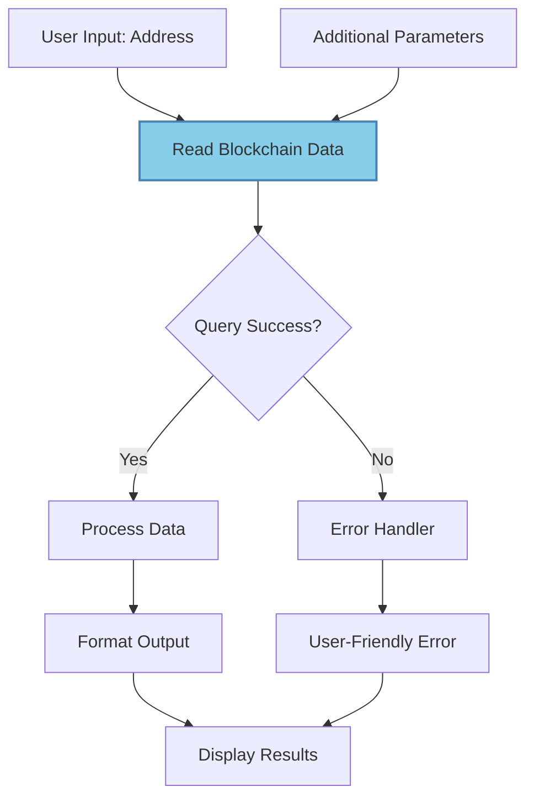

import { Card, CardHeader, CardTitle, CardDescription } from '@site/src/components/Card';
import { Callout } from '@site/src/components/Callout';
import { Features, Feature } from '@site/src/components/Features';
import { CollapsibleCodeBlock, InlineCodeCard } from '@site/src/components/CodeBlock';
import Tabs from '@theme/Tabs';
import TabItem from '@theme/TabItem';
import CodeBlock from '@theme/CodeBlock';

# Read Blockchain Data Element

The Read Blockchain Data element enables querying and reading data from blockchain networks. It supports reading smart contract states, account balances, transaction history, and other on-chain data, primarily focused on the SUI blockchain but extensible to other networks.

<Card>
  <CardHeader>
    <CardTitle>Element Overview</CardTitle>
  </CardHeader>
  

    <table>
      <tbody>
        <tr>
          <td><strong>Type</strong></td>
          <td><code>read_blockchain_data</code></td>
        </tr>
        <tr>
          <td><strong>Category</strong></td>
          <td>Blockchain Elements</td>
        </tr>
        <tr>
          <td><strong>Primary Network</strong></td>
          <td>SUI</td>
        </tr>
        <tr>
          <td><strong>Operation</strong></td>
          <td>Read-only blockchain queries</td>
        </tr>
        <tr>
          <td><strong>Gas Required</strong></td>
          <td>No (read operations)</td>
        </tr>
      </tbody>
    </table>
  

</Card>

## Purpose

<Features>
  <Feature title="State Queries" icon="/img/icons/blockchain.svg">
    Read smart contract states and object data
  </Feature>
  <Feature title="Balance Checks" icon="/img/icons/database.svg">
    Query account balances and coin holdings
  </Feature>
  <Feature title="Transaction History" icon="/img/icons/network.svg">
    Fetch transaction records and events
  </Feature>
</Features>

## Element Schema

<CollapsibleCodeBlock
  title="Complete Element Definition"
  description="L1 element template for Read Blockchain Data"
  language="yaml"
  defaultCollapsed={false}
>
{`type: read_blockchain_data
element_id: null  # Auto-generated at L2
name: null  # Set by L2
node_description: Reads data from blockchain networks including contract states, balances, and transaction history
description: null  # Customizable by L2
input_schema:
  query_type:
    type: string
    description: Type of blockchain query to perform
    enum: ["balance", "object", "transaction", "events", "contract_call"]
    required: true
  address:
    type: string
    description: Wallet address or object ID to query
    required: false
  parameters:
    type: json
    description: Additional parameters specific to query type
    required: false
output_schema:
  data:
    type: json
    description: Query result data
    required: true
  success:
    type: bool
    description: Whether the query succeeded
    required: true
  error:
    type: string
    description: Error message if query failed
    required: false
  metadata:
    type: json
    description: Additional metadata about the query
    required: false
parameter_schema_structure:
  node_url:
    type: string
    description: RPC endpoint URL
  network:
    type: string
    enum: ["mainnet", "testnet", "devnet"]
  api_key:
    type: string
    description: API key for RPC provider
parameters:
  node_url: "https://fullnode.mainnet.sui.io"
  network: "mainnet"
  api_key: ""
processing_message: Reading blockchain data...
tags:
  - blockchain
  - sui
  - read-only
layer: null
hyperparameters:
  type:
    access: fixed
  element_id:
    access: fixed
  name:
    access: edit
  description:
    access: edit
  input_schema:
    access: fixed
  output_schema:
    access: fixed
  parameters.node_url:
    access: edit
  parameters.network:
    access: edit
  parameters.api_key:
    access: hidden
  processing_message:
    access: edit
  tags:
    access: append
  layer:
    access: edit`}
</CollapsibleCodeBlock>

## Query Types

<Tabs>
  <TabItem value="balance" label="Balance Query" default>
    

      <Card>
        <CardHeader>
          <CardTitle>Account Balance Query</CardTitle>
        </CardHeader>
        

          
Query SUI or token balances for a wallet address.

          
          <CollapsibleCodeBlock
            title="Balance Query Example"
            language="yaml"
          >
{`nodes:
  balance_reader:
    type: read_blockchain_data
    name: "Check Wallet Balance"
    parameters:
      network: "mainnet"
      node_url: "https://fullnode.mainnet.sui.io"
    # Input
    input:
      query_type: "balance"
      address: "0x742d35Cc6634C0532925a3b844Bc9e7595f6E123"
      parameters:
        coin_type: "0x2::sui::SUI"  # Optional, defaults to SUI
        
    # Output
    output:
      data:
        balance: "1500000000000"  # In MIST (1 SUI = 10^9 MIST)
        balance_in_sui: "1500.0"
        coin_type: "0x2::sui::SUI"
        coins: [
          {
            coin_object_id: "0xabc...",
            value: "1000000000000"
          },
          {
            coin_object_id: "0xdef...",
            value: "500000000000"
          }
        ]
      success: true`}
          </CollapsibleCodeBlock>
        

      </Card>
    

  </TabItem>
  
  <TabItem value="object" label="Object Query">
    

      <Card>
        <CardHeader>
          <CardTitle>SUI Object Query</CardTitle>
        </CardHeader>
        

          
Read data from specific SUI objects or NFTs.

          
          <CollapsibleCodeBlock
            title="Object Query Example"
            language="yaml"
          >
{`nodes:
  object_reader:
    type: read_blockchain_data
    name: "Read NFT Data"
    # Input
    input:
      query_type: "object"
      address: "0x5678abcd..."  # Object ID
      parameters:
        show_content: true
        show_owner: true
        show_type: true
        
    # Output
    output:
      data:
        object_id: "0x5678abcd..."
        version: "12345"
        digest: "7WHz..."
        owner: {
          AddressOwner: "0x742d35..."
        }
        type: "0x2::example::NFT"
        content: {
          fields: {
            id: { id: "0x5678abcd..." },
            name: "Awesome NFT #123",
            description: "A rare digital collectible",
            url: "https://example.com/nft/123.png",
            attributes: {
              rarity: "legendary",
              power: 9500
            }
          }
        }
      success: true`}
          </CollapsibleCodeBlock>
        

      </Card>
    

  </TabItem>
  
  <TabItem value="transaction" label="Transaction Query">
    

      <Card>
        <CardHeader>
          <CardTitle>Transaction History Query</CardTitle>
        </CardHeader>
        

          
Fetch transaction details and history.

          
          <CollapsibleCodeBlock
            title="Transaction Query Example"
            language="yaml"
          >
{`nodes:
  tx_reader:
    type: read_blockchain_data
    name: "Get Transaction Details"
    # Input for specific transaction
    input:
      query_type: "transaction"
      address: "B3HxF..."  # Transaction digest
      parameters:
        show_input: true
        show_effects: true
        show_events: true
        
    # Output
    output:
      data:
        digest: "B3HxF..."
        transaction: {
          data: {
            sender: "0x742d35...",
            gas_budget: "10000000",
            transactions: [{
              TransferObjects: {
                objects: ["0xabc..."],
                recipient: "0x987..."
              }
            }]
          }
        }
        effects: {
          status: { success: true },
          gas_used: {
            computation_cost: "1500000",
            storage_cost: "2000000"
          },
          created: [],
          mutated: [...],
          deleted: []
        }
        events: [{
          type: "0x2::coin::Transfer",
          contents: {
            amount: "100000000000",
            recipient: "0x987..."
          }
        }]
      success: true`}
          </CollapsibleCodeBlock>
        

      </Card>
    

  </TabItem>
  
  <TabItem value="events" label="Events Query">
    

      <Card>
        <CardHeader>
          <CardTitle>Event History Query</CardTitle>
        </CardHeader>
        

          
Query blockchain events by various filters.

          
          <CollapsibleCodeBlock
            title="Events Query Example"
            language="yaml"
          >
{`nodes:
  event_reader:
    type: read_blockchain_data
    name: "Monitor Transfer Events"
    # Input
    input:
      query_type: "events"
      parameters:
        event_type: "0x2::coin::Transfer<0x2::sui::SUI>"
        sender: "0x742d35..."  # Optional filter
        recipient: null  # Optional filter
        limit: 10
        descending_order: true
        
    # Output
    output:
      data:
        events: [
          {
            id: { tx_digest: "ABC...", event_seq: 0 },
            type: "0x2::coin::Transfer<0x2::sui::SUI>",
            parsed_json: {
              amount: "500000000000",
              sender: "0x742d35...",
              recipient: "0x123..."
            },
            timestamp_ms: "1706355200000"
          },
          # ... more events
        ],
        next_cursor: "event_cursor_xyz"  # For pagination
      success: true`}
          </CollapsibleCodeBlock>
        

      </Card>
    

  </TabItem>
  
  <TabItem value="contract" label="Contract Call">
    

      <Card>
        <CardHeader>
          <CardTitle>Smart Contract Read</CardTitle>
        </CardHeader>
        

          
Call view functions on smart contracts.

          
          <CollapsibleCodeBlock
            title="Contract Call Example"
            language="yaml"
          >
{`nodes:
  contract_reader:
    type: read_blockchain_data
    name: "Read DEX Price"
    # Input
    input:
      query_type: "contract_call"
      address: "0xdex_package_id..."
      parameters:
        module: "pool"
        function: "get_spot_price"
        type_arguments: [
          "0x2::sui::SUI",
          "0xusdc_package::coin::USDC"
        ]
        arguments: [
          "0xpool_object_id..."
        ]
        
    # Output
    output:
      data:
        result: {
          price_x_to_y: "3250000000",  # 1 SUI = 3.25 USDC
          price_y_to_x: "307692307",   # 1 USDC = 0.307692 SUI
          fee_rate: "3000",  # 0.3%
          last_update: "1706355200000"
        }
      success: true`}
          </CollapsibleCodeBlock>
        

      </Card>
    

  </TabItem>
</Tabs>

## Usage Examples

### Wallet Balance Checker

<CollapsibleCodeBlock
  title="Complete Balance Checking Flow"
  description="Check multiple token balances for a wallet"
  language="yaml"
>
{`flow_definition:
  nodes:
    user_input:
      type: chat_input
      name: "Enter Wallet Address"
      
    # Check SUI balance
    sui_balance:
      type: read_blockchain_data
      element_id: sui_balance
      name: "Check SUI Balance"
      description: "Reads native SUI balance"
      parameters:
        network: "mainnet"
        node_url: "https://fullnode.mainnet.sui.io"
      processing_message: "Checking SUI balance..."
      tags:
        - blockchain
        - sui
        - balance-check
      layer: "blockchain-queries"
      
    # Check custom token balance
    token_balance:
      type: read_blockchain_data
      element_id: token_balance
      name: "Check USDC Balance"
      description: "Reads USDC token balance"
      parameters:
        network: "mainnet"
      
    # Format the response
    balance_formatter:
      type: custom
      name: "Format Balance Display"
      code: |
        sui_data = inputs.get('sui_balance', {})
        usdc_data = inputs.get('usdc_balance', {})
        
        sui_amount = float(sui_data.get('balance_in_sui', '0'))
        usdc_amount = float(usdc_data.get('balance', '0')) / 1e6  # USDC has 6 decimals
        
        output['formatted_text'] = f"""
💰 Wallet Balance Summary
        
SUI: {sui_amount:,.2f} SUI
USDC: {usdc_amount:,.2f} USDC

Total Value (USD): \$\{(sui_amount * 3.25 + usdc_amount):,.2f}
"""
        
  connections:
    # Pass wallet address to balance checkers
    - from_id: user_input
      to_id: sui_balance
      from_output: "user_input:chat_input"
      to_input: "sui_balance:address"
      
    - from_id: user_input
      to_id: token_balance
      from_output: "user_input:chat_input"
      to_input: "token_balance:address"
      
    # Send balance data to formatter
    - from_id: sui_balance
      to_id: balance_formatter
      from_output: "sui_balance:data"
      to_input: "balance_formatter:sui_balance"
      
    - from_id: token_balance
      to_id: balance_formatter
      from_output: "token_balance:data"
      to_input: "balance_formatter:usdc_balance"`}
</CollapsibleCodeBlock>

### NFT Collection Reader

<CollapsibleCodeBlock
  title="NFT Collection Explorer"
  description="Read and display NFT collection data"
  language="yaml"
>
{`nodes:
  collection_address:
    type: chat_input
    name: "NFT Collection Address"
    
  # Get collection objects
  collection_reader:
    type: read_blockchain_data
    name: "Read Collection Data"
    parameters:
      network: "mainnet"
    # Uses events query to find all NFTs
    
  # Read individual NFT details
  nft_details_reader:
    type: read_blockchain_data
    name: "Read NFT Details"
    parameters:
      network: "mainnet"
      
  # Process and display
  nft_processor:
    type: llm_structured
    name: "Analyze NFT Collection"
    output_schema:
      collection_summary:
        type: json
        required: true
        properties:
          total_count:
            type: int
          unique_owners:
            type: int
          rarity_distribution:
            type: json
          floor_price:
            type: float
          trending_attributes:
            type: list
      featured_nfts:
        type: list
        max_items: 5
        items:
          type: json
          properties:
            name:
              type: string
            rarity_score:
              type: float
            current_owner:
              type: string
            last_sale_price:
              type: float`}
</CollapsibleCodeBlock>

### Transaction Monitor

<CollapsibleCodeBlock
  title="Real-Time Transaction Monitor"
  description="Monitor specific types of transactions"
  language="yaml"
>
{`nodes:
  monitor_config:
    type: constants
    name: "Monitor Configuration"
    parameters:
      data:
        monitored_address: "0x742d35Cc..."
        event_types: [
          "0x2::coin::Transfer",
          "0x2::coin::Mint",
          "0xdex::swap::SwapEvent"
        ]
        alert_threshold: 1000  # SUI
        
  # Poll for recent events
  event_monitor:
    type: read_blockchain_data
    name: "Check Recent Events"
    # Query events with filters
    
  # Analyze transactions
  tx_analyzer:
    type: llm_structured
    name: "Analyze Transaction Pattern"
    output_schema:
      suspicious_activity:
        type: bool
        required: true
      transaction_summary:
        type: json
        properties:
          total_volume:
            type: float
          transaction_count:
            type: int
          unique_addresses:
            type: int
          largest_transaction:
            type: json
      alert_level:
        type: string
        enum: ["none", "low", "medium", "high"]
        
  # Generate alerts
  alert_generator:
    type: case
    name: "Alert Router"
    parameters:
      cases:
        - high_alert:
            variable1: alert_level
            variable2: "high"
            compare: "=="
        - medium_alert:
            variable1: alert_level
            variable2: "medium"
            compare: "=="`}
</CollapsibleCodeBlock>

## Common Patterns

### Pattern 1: Multi-Network Queries

<CollapsibleCodeBlock
  title="Cross-Network Balance Check"
  description="Query balances across multiple networks"
  language="yaml"
>
{`nodes:
  # Mainnet balance
  mainnet_balance:
    type: read_blockchain_data
    name: "Mainnet Balance"
    parameters:
      network: "mainnet"
      node_url: "https://fullnode.mainnet.sui.io"
      
  # Testnet balance
  testnet_balance:
    type: read_blockchain_data
    name: "Testnet Balance"
    parameters:
      network: "testnet"
      node_url: "https://fullnode.testnet.sui.io"
      
  # Aggregate results
  balance_aggregator:
    type: custom
    name: "Aggregate Network Balances"
    code: |
      mainnet = inputs.get('mainnet_data', {})
      testnet = inputs.get('testnet_data', {})
      
      output['total_balance'] = {
          'mainnet': mainnet.get('balance_in_sui', 0),
          'testnet': testnet.get('balance_in_sui', 0),
          'total': mainnet.get('balance_in_sui', 0) + testnet.get('balance_in_sui', 0),
          'primary_network': 'mainnet' if mainnet.get('balance_in_sui', 0) > 0 else 'testnet'
      }`}
</CollapsibleCodeBlock>

### Pattern 2: Historical Analysis

<CollapsibleCodeBlock
  title="Transaction History Analysis"
  description="Analyze wallet transaction patterns"
  language="yaml"
>
{`nodes:
  # Get transaction history
  tx_history_reader:
    type: read_blockchain_data
    name: "Fetch Transaction History"
    # Query last 100 transactions
    
  # Analyze patterns
  pattern_analyzer:
    type: llm_structured
    name: "Analyze Trading Patterns"
    output_schema:
      trading_profile:
        type: json
        properties:
          trader_type:
            type: string
            enum: ["holder", "trader", "degen", "whale"]
          avg_transaction_size:
            type: float
          favorite_tokens:
            type: list
          trading_frequency:
            type: string
            enum: ["daily", "weekly", "monthly", "rare"]
      risk_assessment:
        type: json
        properties:
          risk_score:
            type: int
            minimum: 0
            maximum: 100
          risk_factors:
            type: list
          recommendations:
            type: list`}
</CollapsibleCodeBlock>

### Pattern 3: Smart Contract State Monitor

<CollapsibleCodeBlock
  title="DeFi Protocol Monitor"
  description="Monitor DeFi protocol states"
  language="yaml"
>
{`nodes:
  # Read liquidity pool state
  pool_state_reader:
    type: read_blockchain_data
    name: "Read Pool State"
    input:
      query_type: "contract_call"
      address: "0xdex_package..."
      parameters:
        module: "pool"
        function: "get_pool_state"
        
  # Read user position
  position_reader:
    type: read_blockchain_data
    name: "Read User Position"
    input:
      query_type: "contract_call"
      parameters:
        module: "pool"
        function: "get_user_position"
        
  # Calculate metrics
  defi_calculator:
    type: custom
    name: "Calculate DeFi Metrics"
    code: |
      pool_state = inputs.get('pool_state', {})
      position = inputs.get('position', {})
      
      # Calculate APY, impermanent loss, etc.
      total_liquidity = pool_state.get('reserve_x', 0) + pool_state.get('reserve_y', 0)
      user_share = position.get('lp_tokens', 0) / pool_state.get('total_lp_tokens', 1)
      
      output['metrics'] = {
          'pool_tvl': total_liquidity,
          'user_share_percent': user_share * 100,
          'estimated_apr': calculate_apr(pool_state),
          'impermanent_loss': calculate_il(pool_state, position)
      }`}
</CollapsibleCodeBlock>

## Error Handling

<Card>
  <CardHeader>
    <CardTitle>Common Errors and Solutions</CardTitle>
  </CardHeader>
  

    <table>
      <thead>
        <tr>
          <th>Error</th>
          <th>Cause</th>
          <th>Solution</th>
        </tr>
      </thead>
      <tbody>
        <tr>
          <td>RPC Connection Failed</td>
          <td>Network issues or invalid URL</td>
          <td>Verify node URL and network connectivity</td>
        </tr>
        <tr>
          <td>Object Not Found</td>
          <td>Invalid object ID or deleted object</td>
          <td>Verify object exists on specified network</td>
        </tr>
        <tr>
          <td>Invalid Address Format</td>
          <td>Malformed SUI address</td>
          <td>Ensure address starts with 0x and is valid length</td>
        </tr>
        <tr>
          <td>Rate Limited</td>
          <td>Too many requests</td>
          <td>Implement request throttling or use API key</td>
        </tr>
        <tr>
          <td>Function Not Found</td>
          <td>Wrong module/function name</td>
          <td>Verify contract ABI and function signature</td>
        </tr>
      </tbody>
    </table>
  

</Card>

### Robust Error Handling Pattern

<CollapsibleCodeBlock
  title="Safe Blockchain Reading"
  description="Handle potential blockchain query errors"
  language="yaml"
>
{`nodes:
  safe_reader:
    type: read_blockchain_data
    name: "Safe Balance Check"
    
  error_handler:
    type: custom
    name: "Handle Read Errors"
    code: |
      result = inputs.get('blockchain_data', {})
      
      if not result.get('success', False):
          error = result.get('error', 'Unknown error')
          
          # Provide user-friendly error messages
          error_messages = {
              'INVALID_ADDRESS': 'The wallet address format is invalid. Please check and try again.',
              'NETWORK_ERROR': 'Unable to connect to the blockchain. Please try again later.',
              'OBJECT_NOT_FOUND': 'The requested data was not found on the blockchain.',
              'RATE_LIMITED': 'Too many requests. Please wait a moment and try again.'
          }
          
          output['has_error'] = True
          output['user_message'] = error_messages.get(error, f'An error occurred: {error}')
          output['data'] = None
      else:
          output['has_error'] = False
          output['data'] = result.get('data')
          output['user_message'] = None
          
  case_router:
    type: case
    name: "Route by Error State"
    parameters:
      cases:
        - error_path:
            variable1: has_error
            variable2: true
            compare: "=="
        - success_path:
            variable1: has_error
            variable2: false
            compare: "=="`}
</CollapsibleCodeBlock>

## Best Practices

<Callout type="success" title="Blockchain Reading Best Practices">
✅ **Validate Addresses**: Always validate address format before querying
✅ **Handle Network Delays**: Implement appropriate timeouts
✅ **Cache When Possible**: Cache static data to reduce RPC calls
✅ **Use Correct Network**: Ensure network parameter matches your use case
✅ **Error Recovery**: Always include error handling for network issues
✅ **Rate Limiting**: Respect RPC provider limits
✅ **Batch Queries**: Combine multiple queries when possible
✅ **Monitor Gas Prices**: Even read operations may have compute costs on some networks
</Callout>

## Performance Optimization

<Features>
  <Feature title="Batch Operations" icon="/img/icons/hpc.svg">
    Combine multiple queries into single requests when possible
  </Feature>
  <Feature title="Caching Strategy" icon="/img/icons/database.svg">
    Cache immutable data like historical transactions
  </Feature>
  <Feature title="Selective Queries" icon="/img/icons/settings.svg">
    Only request needed fields to reduce response size
  </Feature>
</Features>

### Optimization Example

<CollapsibleCodeBlock
  title="Optimized Multi-Query Pattern"
  description="Efficient blockchain data fetching"
  language="yaml"
>
{`nodes:
  # Batch multiple queries
  batch_reader:
    type: custom
    name: "Prepare Batch Query"
    code: |
      addresses = inputs.get('address_list', [])
      
      # Instead of N individual queries, prepare batch
      output['batch_query'] = {
          'method': 'sui_multiGetObjects',
          'params': [
              addresses,
              {
                  'showContent': true,
                  'showOwner': true,
                  'showType': true
              }
          ]
      }
      
  # Single batched read
  batch_blockchain_read:
    type: read_blockchain_data
    name: "Batch Read Objects"
    # Processes all objects in one request
    
  # Process results
  result_processor:
    type: custom
    name: "Process Batch Results"
    code: |
      results = inputs.get('batch_results', [])
      
      # Process all results at once
      processed = []
      for obj in results:
          if obj.get('error'):
              processed.append({'error': obj['error']})
          else:
              processed.append({
                  'id': obj['data']['objectId'],
                  'owner': obj['data']['owner'],
                  'type': obj['data']['type'],
                  'content': obj['data']['content']
              })
              
      output['processed_objects'] = processed`}
</CollapsibleCodeBlock>

## Integration with Other Elements

### Reading Before Transaction

<CollapsibleCodeBlock
  title="Pre-Transaction Validation"
  description="Validate state before building transaction"
  language="yaml"
>
{`nodes:
  # Check current state
  state_reader:
    type: read_blockchain_data
    name: "Check Current State"
    
  # Validate conditions
  validator:
    type: case
    name: "Validate Transaction Conditions"
    parameters:
      cases:
        - sufficient_balance:
            variable1: balance
            variable2: required_amount
            compare: ">="
        - correct_owner:
            variable1: owner
            variable2: expected_owner
            compare: "=="
            
  # Build transaction only if valid
  tx_builder:
    type: build_transaction_json
    name: "Build Transaction"
    # Only executes if validation passes`}
</CollapsibleCodeBlock>

## Visual Flow Example

## Related Elements

  <Card>
    <CardHeader>
      <CardTitle>Build Transaction JSON</CardTitle>
      <CardDescription>
        Build transactions based on read data
      </CardDescription>
    </CardHeader>
    

      <a href="./02-build-transaction-json" style={{ textDecoration: 'none' }}>
        Build transactions →
      </a>
    

  </Card>
  
  <Card>
    <CardHeader>
      <CardTitle>Custom Element</CardTitle>
      <CardDescription>
        Process blockchain data with custom logic
      </CardDescription>
    </CardHeader>
    

      <a href="../07-custom-elements/01-custom" style={{ textDecoration: 'none' }}>
        Process data →
      </a>
    

  </Card>
  
  <Card>
    <CardHeader>
      <CardTitle>Case Element</CardTitle>
      <CardDescription>
        Route based on blockchain data
      </CardDescription>
    </CardHeader>
    

      <a href="../02-flow-control/03-case" style={{ textDecoration: 'none' }}>
        Conditional routing →
      </a>
    

  </Card>

## Summary

The Read Blockchain Data element provides comprehensive blockchain querying capabilities:
- **Multiple query types** for different blockchain data needs
- **Network flexibility** supporting mainnet, testnet, and custom networks
- **Read-only safety** with no gas requirements
- **Rich data access** including balances, objects, transactions, and events
- **Smart contract integration** for reading contract states

Use this element whenever you need to fetch on-chain data for display, validation, or decision-making in your flows.