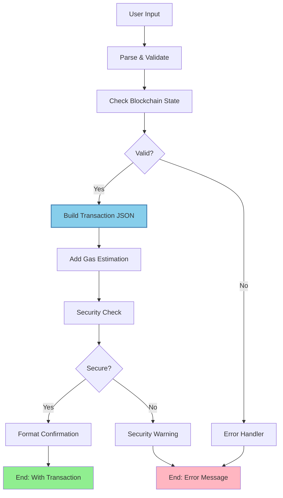

import { Card, CardHeader, CardTitle, CardDescription } from '@site/src/components/Card';
import { Callout } from '@site/src/components/Callout';
import { Features, Feature } from '@site/src/components/Features';
import { CollapsibleCodeBlock, InlineCodeCard } from '@site/src/components/CodeBlock';
import Tabs from '@theme/Tabs';
import TabItem from '@theme/TabItem';
import CodeBlock from '@theme/CodeBlock';

# Build Transaction JSON Element

The Build Transaction JSON element creates transaction payloads for blockchain interactions. It constructs properly formatted transaction objects that can be signed and executed on blockchain networks, primarily focused on the SUI blockchain but adaptable to other chains.

<Card>
  <CardHeader>
    <CardTitle>Element Overview</CardTitle>
  </CardHeader>
  

    <table>
      <tbody>
        <tr>
          <td><strong>Type</strong></td>
          <td><code>build_transaction_json</code></td>
        </tr>
        <tr>
          <td><strong>Category</strong></td>
          <td>Blockchain Elements</td>
        </tr>
        <tr>
          <td><strong>Primary Network</strong></td>
          <td>SUI</td>
        </tr>
        <tr>
          <td><strong>Operation</strong></td>
          <td>Transaction construction</td>
        </tr>
        <tr>
          <td><strong>Output</strong></td>
          <td>Transaction payload (requires signing)</td>
        </tr>
      </tbody>
    </table>
  

</Card>

## Purpose

<Features>
  <Feature title="Transaction Building" icon="/img/icons/blockchain.svg">
    Construct valid blockchain transaction payloads
  </Feature>
  <Feature title="Smart Contract Calls" icon="/img/icons/code.svg">
    Build function calls with proper encoding
  </Feature>
  <Feature title="Safe Construction" icon="/img/icons/security.svg">
    Validate parameters before transaction creation
  </Feature>
</Features>

## Element Schema

<CollapsibleCodeBlock
  title="Complete Element Definition"
  description="L1 element template for Build Transaction JSON"
  language="yaml"
  defaultCollapsed={false}
>
{`type: build_transaction_json
element_id: null  # Auto-generated at L2
name: null  # Set by L2
node_description: Creates a transaction payload for blockchain interaction
description: null  # Customizable by L2
input_schema: {}  # Flexible input based on transaction type
output_schema:
  transaction_json:
    type: json
    description: The transaction payload ready for signing
    required: true
parameter_schema_structure:
  node_url:
    type: string
    description: RPC endpoint URL for the blockchain
  contract_address:
    type: string
    description: Smart contract address (package ID for SUI)
  function_name:
    type: string
    description: Function to call (module::function format for SUI)
  function_args:
    type: list
    description: Arguments to pass to the function
parameters:
  node_url: ""
  contract_address: ""
  function_name: ""
  function_args: []
processing_message: Building transaction...
tags:
  - blockchain
  - transaction
layer: null
hyperparameters:
  type:
    access: fixed
  element_id:
    access: fixed
  name:
    access: edit
  description:
    access: edit
  input_schema:
    access: edit  # L2 can define custom inputs
  output_schema:
    access: fixed
  parameters.node_url:
    access: edit
  parameters.contract_address:
    access: edit
  parameters.function_name:
    access: edit
  parameters.function_args:
    access: edit
  processing_message:
    access: edit
  tags:
    access: append
  layer:
    access: edit`}
</CollapsibleCodeBlock>

## Transaction Types

<Tabs>
  <TabItem value="transfer" label="Token Transfer" default>
    

      <Card>
        <CardHeader>
          <CardTitle>SUI Token Transfer</CardTitle>
        </CardHeader>
        

          
Build a simple SUI token transfer transaction.

          
          <CollapsibleCodeBlock
            title="Transfer Transaction Example"
            language="yaml"
          >
{`nodes:
  transfer_builder:
    type: build_transaction_json
    name: "Build SUI Transfer"
    input_schema:
      recipient:
        type: string
        description: Recipient wallet address
        required: true
      amount:
        type: string
        description: Amount in MIST (1 SUI = 10^9 MIST)
        required: true
      gas_budget:
        type: string
        description: Maximum gas to spend
        required: false
        default: "10000000"
    parameters:
      node_url: "https://fullnode.mainnet.sui.io"
      # For simple transfers, we use the coin module
      contract_address: "0x2"
      function_name: "coin::transfer"
      
    # Example input
    input:
      recipient: "0x123abc..."
      amount: "1000000000"  # 1 SUI
      gas_budget: "10000000"
      
    # Output transaction
    output:
      transaction_json:
        sender: "0x742d35Cc..."  # Will be filled by wallet
        transaction: {
          kind: "Call",
          data: {
            package: "0x2",
            module: "coin",
            function: "transfer",
            type_arguments: ["0x2::sui::SUI"],
            arguments: [
              { Input: 0 },  # Coin object
              { Pure: "0x123abc..." }  # Recipient
            ]
          }
        }
        inputs: [
          {
            kind: "Input",
            value: {
              Object: {
                SharedObject: {
                  id: "0xcoin...",
                  initial_shared_version: 1,
                  mutable: true
                }
              }
            },
            type: "object"
          }
        ]
        gas:
          budget: "10000000"
          price: "1000"
          payment: []  # Will be filled by wallet`}
          </CollapsibleCodeBlock>
        

      </Card>
    

  </TabItem>
  
  <TabItem value="nft" label="NFT Operations">
    

      <Card>
        <CardHeader>
          <CardTitle>NFT Minting Transaction</CardTitle>
        </CardHeader>
        

          
Build transaction to mint a new NFT.

          
          <CollapsibleCodeBlock
            title="NFT Mint Transaction Example"
            language="yaml"
          >
{`nodes:
  nft_mint_builder:
    type: build_transaction_json
    name: "Build NFT Mint"
    input_schema:
      name:
        type: string
        required: true
      description:
        type: string
        required: true
      image_url:
        type: string
        required: true
      attributes:
        type: json
        required: false
      recipient:
        type: string
        required: true
    parameters:
      node_url: "https://fullnode.mainnet.sui.io"
      contract_address: "0xnft_package_id..."
      function_name: "nft::mint"
      
    # Example input
    input:
      name: "Awesome NFT #42"
      description: "A unique digital collectible"
      image_url: "https://example.com/nft/42.png"
      attributes:
        rarity: "rare"
        power: 85
        element: "fire"
      recipient: "0x742d35..."
      
    # Output transaction
    output:
      transaction_json:
        transaction: {
          kind: "Call",
          data: {
            package: "0xnft_package_id...",
            module: "nft",
            function: "mint",
            type_arguments: [],
            arguments: [
              { Pure: "Awesome NFT #42" },
              { Pure: "A unique digital collectible" },
              { Pure: "https://example.com/nft/42.png" },
              { Pure: '{"rarity":"rare","power":85,"element":"fire"}' },
              { Pure: "0x742d35..." }
            ]
          }
        }
        gas:
          budget: "50000000"  # Higher for minting`}
          </CollapsibleCodeBlock>
        

      </Card>
    

  </TabItem>
  
  <TabItem value="defi" label="DeFi Operations">
    

      <Card>
        <CardHeader>
          <CardTitle>DeFi Swap Transaction</CardTitle>
        </CardHeader>
        

          
Build a DEX swap transaction.

          
          <CollapsibleCodeBlock
            title="DEX Swap Transaction Example"
            language="yaml"
          >
{`nodes:
  swap_builder:
    type: build_transaction_json
    name: "Build Swap Transaction"
    input_schema:
      pool_id:
        type: string
        description: Liquidity pool object ID
        required: true
      amount_in:
        type: string
        description: Amount of input token
        required: true
      min_amount_out:
        type: string
        description: Minimum output amount (slippage protection)
        required: true
      token_in_type:
        type: string
        description: Input token type
        required: true
      token_out_type:
        type: string
        description: Output token type
        required: true
    parameters:
      node_url: "https://fullnode.mainnet.sui.io"
      contract_address: "0xdex_package..."
      function_name: "pool::swap_exact_input"
      
    # Example input - Swap SUI for USDC
    input:
      pool_id: "0xpool_object..."
      amount_in: "1000000000"  # 1 SUI
      min_amount_out: "3200000"  # 3.2 USDC (6 decimals)
      token_in_type: "0x2::sui::SUI"
      token_out_type: "0xusdc::coin::USDC"
      
    # Output transaction
    output:
      transaction_json:
        transaction: {
          kind: "Call",
          data: {
            package: "0xdex_package...",
            module: "pool",
            function: "swap_exact_input",
            type_arguments: [
              "0x2::sui::SUI",
              "0xusdc::coin::USDC"
            ],
            arguments: [
              { Input: 0 },  # Pool object
              { Input: 1 },  # Coin to swap
              { Pure: "1000000000" },
              { Pure: "3200000" }
            ]
          }
        }`}
          </CollapsibleCodeBlock>
        

      </Card>
    

  </TabItem>
  
  <TabItem value="staking" label="Staking Operations">
    

      <Card>
        <CardHeader>
          <CardTitle>Staking Transaction</CardTitle>
        </CardHeader>
        

          
Build a SUI staking transaction.

          
          <CollapsibleCodeBlock
            title="Staking Transaction Example"
            language="yaml"
          >
{`nodes:
  stake_builder:
    type: build_transaction_json
    name: "Build Staking Transaction"
    input_schema:
      validator_address:
        type: string
        description: Validator to stake with
        required: true
      amount:
        type: string
        description: Amount to stake in MIST
        required: true
    parameters:
      node_url: "https://fullnode.mainnet.sui.io"
      contract_address: "0x3"  # SUI system package
      function_name: "sui_system::request_add_stake"
      
    # Example input
    input:
      validator_address: "0xvalidator..."
      amount: "100000000000"  # 100 SUI
      
    # Output transaction
    output:
      transaction_json:
        transaction: {
          kind: "Call",
          data: {
            package: "0x3",
            module: "sui_system",
            function: "request_add_stake",
            type_arguments: [],
            arguments: [
              { Input: 0 },  # SUI system object
              { Input: 1 },  # Coin to stake
              { Pure: "0xvalidator..." }
            ]
          }
        }
        gas:
          budget: "20000000"`}
          </CollapsibleCodeBlock>
        

      </Card>
    

  </TabItem>
  
  <TabItem value="batch" label="Batch Operations">
    

      <Card>
        <CardHeader>
          <CardTitle>Batch Transaction</CardTitle>
        </CardHeader>
        

          
Build multiple operations in a single transaction.

          
          <CollapsibleCodeBlock
            title="Batch Transaction Example"
            language="yaml"
          >
{`nodes:
  batch_builder:
    type: build_transaction_json
    name: "Build Batch Transaction"
    input_schema:
      operations:
        type: list
        description: List of operations to batch
        required: true
        items:
          type: json
          properties:
            type:
              type: string
              enum: ["transfer", "mint", "call"]
            params:
              type: json
    parameters:
      node_url: "https://fullnode.mainnet.sui.io"
      
    # Example input - Multiple operations
    input:
      operations: [
        {
          type: "transfer",
          params: {
            recipient: "0xabc...",
            amount: "500000000"  # 0.5 SUI
          }
        },
        {
          type: "transfer",
          params: {
            recipient: "0xdef...",
            amount: "300000000"  # 0.3 SUI
          }
        },
        {
          type: "call",
          params: {
            package: "0xgame...",
            module: "player",
            function: "level_up"
          }
        }
      ]
      
    # Output transaction with multiple commands
    output:
      transaction_json:
        transaction: {
          kind: "ProgrammableTransaction",
          commands: [
            {
              TransferObjects: {
                objects: [{ Input: 0 }],
                recipient: { Pure: "0xabc..." }
              }
            },
            {
              TransferObjects: {
                objects: [{ Input: 1 }],
                recipient: { Pure: "0xdef..." }
              }
            },
            {
              MoveCall: {
                package: "0xgame...",
                module: "player",
                function: "level_up"
              }
            }
          ]
        }`}
          </CollapsibleCodeBlock>
        

      </Card>
    

  </TabItem>
</Tabs>

## Usage Examples

### Complete Token Transfer Flow

<CollapsibleCodeBlock
  title="User-Friendly Transfer Flow"
  description="Complete flow from input to transaction"
  language="yaml"
>
{`flow_definition:
  nodes:
    user_input:
      type: chat_input
      name: "Transfer Details"
      
    # Parse natural language input
    input_parser:
      type: llm_structured
      name: "Parse Transfer Request"
      output_schema:
        recipient:
          type: string
          pattern: "^0x[a-fA-F0-9]{64}$"
          required: true
        amount:
          type: float
          required: true
        token:
          type: string
          enum: ["SUI", "USDC", "USDT"]
          required: true
      parameters:
        temperature: 0.1
        wrapper_prompt: |
          Extract transfer details from: {prompt}
          Ensure recipient is a valid SUI address.
          
    # Convert to MIST
    amount_converter:
      type: custom
      name: "Convert to MIST"
      code: |
        amount = inputs.get('amount', 0)
        token = inputs.get('token', 'SUI')
        
        # Different decimals for different tokens
        decimals = {
            'SUI': 9,
            'USDC': 6,
            'USDT': 6
        }
        
        decimal_places = decimals.get(token, 9)
        amount_in_smallest_unit = str(int(amount * (10 ** decimal_places)))
        
        output['amount_mist'] = amount_in_smallest_unit
        output['display_amount'] = f"{amount} {token}"
        
    # Check balance before building transaction
    balance_checker:
      type: read_blockchain_data
      name: "Check Balance"
      
    # Validate sufficient balance
    balance_validator:
      type: case
      name: "Validate Balance"
      parameters:
        cases:
          - sufficient:
              variable1: available_balance
              variable2: required_amount
              compare: ">="
              
    # Build transaction
    transfer_builder:
      type: build_transaction_json
      element_id: transfer_builder
      name: "Build Transfer Transaction"
      description: "Creates SUI transfer transaction"
      parameters:
        node_url: "https://fullnode.mainnet.sui.io"
        contract_address: "0x2"
        function_name: "coin::transfer"
      processing_message: "Building transfer transaction..."
      tags:
        - blockchain
        - transaction
        - transfer
      layer: "transaction-building"
      
    # Format confirmation message
    confirmation_formatter:
      type: llm_text
      name: "Format Confirmation"
      parameters:
        temperature: 0.3
        wrapper_prompt: |
          Create a friendly confirmation message for this transfer:
          Amount: {display_amount}
          Recipient: {recipient}
          
          Include:
          - Clear summary
          - Safety reminder
          - Next steps
          
  connections:
    # Parse input
    - from_id: user_input
      to_id: input_parser
      
    # Convert amount
    - from_id: input_parser
      to_id: amount_converter
      from_output: "input_parser:amount"
      to_input: "amount_converter:amount"
      
    # Check balance
    - from_id: amount_converter
      to_id: balance_checker
      
    # Validate
    - from_id: balance_checker
      to_id: balance_validator
      
    # Build transaction if valid
    - from_id: balance_validator
      to_id: transfer_builder
      
    # Pass parsed data to builder
    - from_id: input_parser
      to_id: transfer_builder
      from_output: "input_parser:recipient"
      to_input: "transfer_builder:recipient"
      
    - from_id: amount_converter
      to_id: transfer_builder
      from_output: "amount_converter:amount_mist"
      to_input: "transfer_builder:amount"`}
</CollapsibleCodeBlock>

### Smart Contract Interaction

<CollapsibleCodeBlock
  title="Custom Contract Call Builder"
  description="Build complex smart contract interactions"
  language="yaml"
>
{`nodes:
  # Get contract details
  contract_info:
    type: constants
    name: "Game Contract Info"
    parameters:
      data:
        package_id: "0xgame_package..."
        admin_cap: "0xadmin_cap_id..."
        
  # User action input
  action_input:
    type: llm_structured
    name: "Parse Game Action"
    output_schema:
      action:
        type: string
        enum: ["buy_item", "upgrade_character", "join_guild", "claim_rewards"]
      parameters:
        type: json
        
  # Build appropriate transaction
  game_tx_builder:
    type: build_transaction_json
    name: "Build Game Transaction"
    input_schema:
      action:
        type: string
        required: true
      action_params:
        type: json
        required: true
    parameters:
      node_url: "https://fullnode.mainnet.sui.io"
      contract_address: "0xgame_package..."
      # function_name set dynamically based on action
      
  # Dynamic function mapping
  function_mapper:
    type: custom
    name: "Map Action to Function"
    code: |
      action = inputs.get('action')
      params = inputs.get('parameters', {})
      
      function_map = {
          'buy_item': {
              'function': 'shop::purchase_item',
              'args': [
                  params.get('item_id'),
                  params.get('quantity', 1)
              ]
          },
          'upgrade_character': {
              'function': 'character::upgrade',
              'args': [
                  params.get('character_id'),
                  params.get('stat_to_upgrade')
              ]
          },
          'join_guild': {
              'function': 'guild::join',
              'args': [
                  params.get('guild_id')
              ]
          },
          'claim_rewards': {
              'function': 'rewards::claim_daily',
              'args': []
          }
      }
      
      mapping = function_map.get(action, {})
      output['function_name'] = mapping.get('function')
      output['function_args'] = mapping.get('args', [])`}
</CollapsibleCodeBlock>

### Multi-Step Transaction Builder

<CollapsibleCodeBlock
  title="Complex Multi-Step Transaction"
  description="Build transactions with multiple steps"
  language="yaml"
>
{`nodes:
  # Step 1: Approve spending
  approval_builder:
    type: build_transaction_json
    name: "Build Approval"
    parameters:
      contract_address: "0xtoken_package..."
      function_name: "token::approve"
      
  # Step 2: Execute main action
  main_action_builder:
    type: build_transaction_json
    name: "Build Main Action"
    parameters:
      contract_address: "0xprotocol_package..."
      function_name: "protocol::execute"
      
  # Combine into batch
  batch_combiner:
    type: custom
    name: "Combine Transactions"
    code: |
      approval_tx = inputs.get('approval_tx', {})
      main_tx = inputs.get('main_tx', {})
      
      # Combine into a single programmable transaction
      output['combined_transaction'] = {
          'kind': 'ProgrammableTransaction',
          'commands': [
              approval_tx['transaction']['data'],
              main_tx['transaction']['data']
          ],
          'gas': {
              'budget': str(int(approval_tx['gas']['budget']) + int(main_tx['gas']['budget'])),
              'price': '1000'
          }
      }`}
</CollapsibleCodeBlock>

## Common Patterns

### Pattern 1: Safe Transfer with Validation

<CollapsibleCodeBlock
  title="Validated Transfer Pattern"
  description="Ensure all conditions are met before building"
  language="yaml"
>
{`nodes:
  # Comprehensive validation
  transfer_validator:
    type: custom
    name: "Validate Transfer"
    code: |
      recipient = inputs.get('recipient', '')
      amount = inputs.get('amount', '0')
      sender_balance = inputs.get('balance', '0')
      
      errors = []
      
      # Validate recipient address
      if not recipient.startswith('0x') or len(recipient) != 66:
          errors.append('Invalid recipient address format')
          
      # Validate amount
      try:
          amount_int = int(amount)
          if amount_int <= 0:
              errors.append('Amount must be positive')
          if amount_int > int(sender_balance):
              errors.append('Insufficient balance')
      except ValueError:
          errors.append('Invalid amount format')
          
      # Check for same address
      sender = inputs.get('sender_address', '')
      if sender == recipient:
          errors.append('Cannot transfer to same address')
          
      output['is_valid'] = len(errors) == 0
      output['errors'] = errors
      output['validation_summary'] = {
          'recipient_valid': recipient.startswith('0x'),
          'amount_valid': amount_int > 0,
          'balance_sufficient': amount_int <= int(sender_balance)
      }
      
  # Only build if valid
  conditional_builder:
    type: case
    name: "Build if Valid"
    parameters:
      cases:
        - valid_transfer:
            variable1: is_valid
            variable2: true
            compare: "=="`}
</CollapsibleCodeBlock>

### Pattern 2: Gas Estimation

<CollapsibleCodeBlock
  title="Dynamic Gas Estimation"
  description="Calculate appropriate gas budget"
  language="yaml"
>
{`nodes:
  gas_estimator:
    type: custom
    name: "Estimate Gas"
    code: |
      transaction_type = inputs.get('transaction_type')
      complexity = inputs.get('complexity', 'simple')
      
      # Base gas costs (in MIST)
      base_gas = {
          'transfer': 10000000,      # 0.01 SUI
          'nft_mint': 50000000,      # 0.05 SUI
          'defi_swap': 30000000,     # 0.03 SUI
          'contract_call': 20000000,  # 0.02 SUI
          'batch': 100000000         # 0.10 SUI
      }
      
      # Complexity multipliers
      complexity_multiplier = {
          'simple': 1.0,
          'medium': 1.5,
          'complex': 2.0
      }
      
      base = base_gas.get(transaction_type, 20000000)
      multiplier = complexity_multiplier.get(complexity, 1.0)
      
      estimated_gas = int(base * multiplier)
      
      # Add safety margin
      safe_gas_budget = int(estimated_gas * 1.2)
      
      output['gas_budget'] = str(safe_gas_budget)
      output['estimated_cost_sui'] = safe_gas_budget / 1e9
      
  # Use estimated gas in builder
  tx_builder_with_gas:
    type: build_transaction_json
    name: "Build with Dynamic Gas"`}
</CollapsibleCodeBlock>

### Pattern 3: Transaction Templates

<CollapsibleCodeBlock
  title="Reusable Transaction Templates"
  description="Common transaction patterns"
  language="yaml"
>
{`nodes:
  template_selector:
    type: flow_select
    name: "Select Transaction Template"
    parameters:
      flows_to_switch:
        - simple_transfer_template
        - token_swap_template
        - nft_interaction_template
        - staking_template
        
  # Simple Transfer Template
  simple_transfer_template:
    type: build_transaction_json
    name: "Simple Transfer"
    parameters:
      contract_address: "0x2"
      function_name: "coin::transfer"
    input_schema:
      recipient:
        type: string
        required: true
      amount:
        type: string
        required: true
        
  # Token Swap Template
  token_swap_template:
    type: build_transaction_json
    name: "Token Swap"
    parameters:
      contract_address: "\${DEX_PACKAGE_ID}"
      function_name: "router::swap_exact_input"
    input_schema:
      token_in:
        type: string
        required: true
      token_out:
        type: string
        required: true
      amount_in:
        type: string
        required: true
      min_amount_out:
        type: string
        required: true`}
</CollapsibleCodeBlock>

## Error Handling

<Card>
  <CardHeader>
    <CardTitle>Common Errors and Solutions</CardTitle>
  </CardHeader>
  

    <table>
      <thead>
        <tr>
          <th>Error</th>
          <th>Cause</th>
          <th>Solution</th>
        </tr>
      </thead>
      <tbody>
        <tr>
          <td>Invalid Package ID</td>
          <td>Wrong contract address format</td>
          <td>Verify package exists on network</td>
        </tr>
        <tr>
          <td>Function Not Found</td>
          <td>Incorrect module or function name</td>
          <td>Check contract ABI for correct names</td>
        </tr>
        <tr>
          <td>Type Argument Mismatch</td>
          <td>Wrong generic types</td>
          <td>Verify required type parameters</td>
        </tr>
        <tr>
          <td>Argument Count Error</td>
          <td>Wrong number of arguments</td>
          <td>Match function signature exactly</td>
        </tr>
        <tr>
          <td>Gas Budget Too Low</td>
          <td>Insufficient gas allocation</td>
          <td>Increase gas budget appropriately</td>
        </tr>
      </tbody>
    </table>
  

</Card>

### Robust Error Handling

<CollapsibleCodeBlock
  title="Transaction Building Error Handler"
  description="Handle potential building errors"
  language="yaml"
>
{`nodes:
  safe_tx_builder:
    type: build_transaction_json
    name: "Build Transaction Safely"
    
  tx_validator:
    type: custom
    name: "Validate Built Transaction"
    code: |
      tx_json = inputs.get('transaction_json', {})
      
      # Validate transaction structure
      if not tx_json:
          output['valid'] = False
          output['error'] = 'No transaction generated'
          output['user_message'] = 'Failed to create transaction. Please check your inputs.'
      elif 'transaction' not in tx_json:
          output['valid'] = False
          output['error'] = 'Invalid transaction structure'
          output['user_message'] = 'Transaction format error. Please try again.'
      elif not tx_json.get('gas', {}).get('budget'):
          output['valid'] = False
          output['error'] = 'Missing gas budget'
          output['user_message'] = 'Gas estimation failed. Please try again.'
      else:
          output['valid'] = True
          output['transaction'] = tx_json
          output['summary'] = {
              'type': tx_json['transaction'].get('kind'),
              'gas_budget_sui': int(tx_json['gas']['budget']) / 1e9,
              'ready_to_sign': True
          }
          
  error_formatter:
    type: llm_text
    name: "Format Error Message"
    parameters:
      temperature: 0.3
      wrapper_prompt: |
        Create a helpful error message for this transaction error:
        Error: {error}
        
        Be friendly and suggest next steps.`}
</CollapsibleCodeBlock>

## Best Practices

<Callout type="success" title="Transaction Building Best Practices">
✅ **Validate Inputs**: Always validate addresses and amounts before building
✅ **Check Balances**: Ensure sufficient funds including gas
✅ **Use Templates**: Create reusable patterns for common transactions
✅ **Estimate Gas**: Calculate appropriate gas budgets dynamically
✅ **Test on Testnet**: Always test new transaction types on testnet first
✅ **Handle Errors**: Provide clear error messages for users
✅ **Security First**: Never expose private keys or sensitive data
✅ **Document Functions**: Keep track of contract ABIs and function signatures
</Callout>

## Security Considerations

<Features>
  <Feature title="Input Validation" icon="/img/icons/security.svg">
    Validate all inputs to prevent injection attacks
  </Feature>
  <Feature title="Gas Limits" icon="/img/icons/warning.svg">
    Set reasonable gas limits to prevent excessive costs
  </Feature>
  <Feature title="Address Verification" icon="/img/icons/success.svg">
    Always verify recipient addresses before building
  </Feature>
</Features>

### Security Pattern

<CollapsibleCodeBlock
  title="Secure Transaction Building"
  description="Security-focused transaction construction"
  language="yaml"
>
{`nodes:
  security_checker:
    type: custom
    name: "Security Validation"
    code: |
      recipient = inputs.get('recipient', '')
      amount = inputs.get('amount', '0')
      contract = inputs.get('contract_address', '')
      
      security_issues = []
      
      # Check for known malicious addresses
      blacklist = load_blacklist()  # Pseudo-code
      if recipient in blacklist:
          security_issues.append('Recipient address is blacklisted')
          
      # Check for unusual amounts
      amount_int = int(amount)
      if amount_int > 1000 * 1e9:  # > 1000 SUI
          security_issues.append('Unusually large transaction amount')
          
      # Verify contract is verified
      if not is_verified_contract(contract):
          security_issues.append('Unverified contract')
          
      # Check for reentrancy patterns
      if has_reentrancy_risk(inputs.get('function_name')):
          security_issues.append('Potential reentrancy risk')
          
      output['secure'] = len(security_issues) == 0
      output['security_issues'] = security_issues
      output['risk_level'] = 'high' if security_issues else 'low'`}
</CollapsibleCodeBlock>

## Integration with Other Elements

### Complete Transaction Flow

<CollapsibleCodeBlock
  title="End-to-End Transaction Flow"
  description="From user input to executed transaction"
  language="yaml"
>
{`nodes:
  # 1. User Input
  user_request:
    type: chat_input
    name: "Transaction Request"
    
  # 2. Parse Intent
  intent_parser:
    type: llm_structured
    name: "Parse Transaction Intent"
    
  # 3. Read Current State
  state_reader:
    type: read_blockchain_data
    name: "Check Current State"
    
  # 4. Validate Conditions
  validator:
    type: case
    name: "Validate Transaction"
    
  # 5. Build Transaction
  tx_builder:
    type: build_transaction_json
    name: "Build Transaction"
    
  # 6. Final Confirmation
  confirmation:
    type: llm_text
    name: "Generate Confirmation"
    
  # 7. Return to End
  transaction_end:
    type: end
    name: "Complete with Transaction"
    
connections:
  # Transaction flows to end element
  - from_id: tx_builder
    to_id: transaction_end
    from_output: "tx_builder:transaction_json"
    to_input: "transaction_end:proposed_transaction"
    
  - from_id: confirmation
    to_id: transaction_end
    from_output: "confirmation:llm_output"
    to_input: "transaction_end:text_input"`}
</CollapsibleCodeBlock>

## Visual Flow Example

## Performance Tips

<Card>
  <CardHeader>
    <CardTitle>Optimization Strategies</CardTitle>
  </CardHeader>
  

    <ul>
      <li><strong>Cache Contract ABIs</strong>: Store frequently used contract interfaces</li>
      <li><strong>Batch Similar Transactions</strong>: Combine multiple operations when possible</li>
      <li><strong>Pre-validate Offline</strong>: Check conditions before building transactions</li>
      <li><strong>Use Transaction Templates</strong>: Reduce building overhead with templates</li>
      <li><strong>Optimize Gas Usage</strong>: Right-size gas budgets to avoid overpayment</li>
    </ul>
  

</Card>

## Related Elements

  <Card>
    <CardHeader>
      <CardTitle>Read Blockchain Data</CardTitle>
      <CardDescription>
        Check state before building transactions
      </CardDescription>
    </CardHeader>
    

      <a href="./01-read-blockchain-data" style={{ textDecoration: 'none' }}>
        Read blockchain →
      </a>
    

  </Card>
  
  <Card>
    <CardHeader>
      <CardTitle>End Element</CardTitle>
      <CardDescription>
        Return transactions to users
      </CardDescription>
    </CardHeader>
    

      <a href="../02-flow-control/02-end" style={{ textDecoration: 'none' }}>
        Complete flows →
      </a>
    

  </Card>
  
  <Card>
    <CardHeader>
      <CardTitle>LLM Structured</CardTitle>
      <CardDescription>
        Parse transaction parameters
      </CardDescription>
    </CardHeader>
    

      <a href="../05-ai-elements/02-llm-structured" style={{ textDecoration: 'none' }}>
        Parse inputs →
      </a>
    

  </Card>

## Summary

The Build Transaction JSON element enables secure blockchain transaction construction by:
- **Building valid transaction payloads** for various blockchain operations
- **Supporting multiple transaction types** from simple transfers to complex DeFi
- **Providing flexible configuration** for different contracts and functions
- **Ensuring security** through validation and gas estimation
- **Integrating seamlessly** with other flow elements

Use this element whenever you need to create blockchain transactions that users will sign and execute, ensuring all parameters are properly formatted and validated.