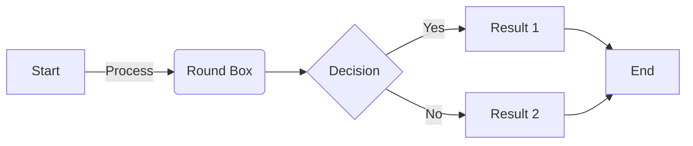
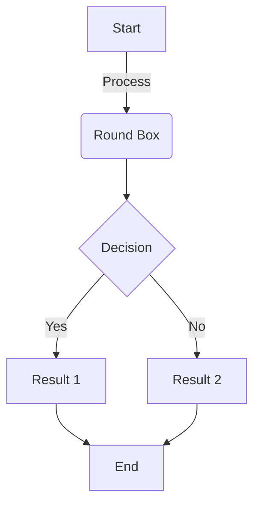
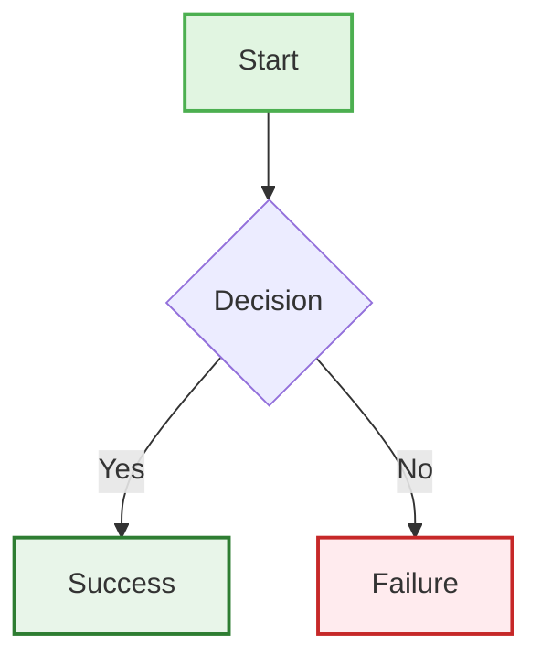

import { CustomMermaid, MermaidDiagram } from '@site/src/components/elements';
import CodeBlock from '@theme/CodeBlock';
import Tabs from '@theme/Tabs';
import TabItem from '@theme/TabItem';
import { Callout } from '@site/src/components/elements/Callout';

import FlowchartSource from '!!raw-loader!./assets/flowchart.mermaid';

# Mermaid Diagrams

The Mermaid diagram component provides interactive viewing capabilities for complex diagrams with pan, zoom, and fullscreen features.

## Features

- 🔍 **Multi-level Zoom**: From bird's eye view (0.01x) to detailed inspection (10x)
- 🖱️ **Pan & Drag**: Click and drag to navigate large diagrams
- 📱 **Touch Support**: Pinch to zoom on mobile devices
- 🖼️ **Fullscreen Mode**: Maximize diagrams for better visibility
- 🎯 **Smart Controls**: Fit to container, reset view, smooth zoom
- 🌓 **Theme Aware**: Automatically adapts to light/dark mode

## Import

```javascript
import { CustomMermaid, MermaidDiagram } from '@site/src/components/elements';
```

## Basic Usage

### Inline Diagrams

<CustomMermaid 
  value={`graph TD
    A[Start] --> B{Decision}
    B -->|Yes| C[Process 1]
    B -->|No| D[Process 2]
    C --> E[End]
    D --> E`}
/>

```jsx
<CustomMermaid 
  value={`graph TD
    A[Start] --> B{Decision}
    B -->|Yes| C[Process 1]
    B -->|No| D[Process 2]
    C --> E[End]
    D --> E`}
/>
```

### With Title and Description

<CustomMermaid 
  title="User Authentication Flow"
  description="Shows the complete authentication process including 2FA"
  value={`sequenceDiagram
    participant U as User
    participant C as Client
    participant S as Server
    participant DB as Database
    
    U->>C: Enter credentials
    C->>S: POST /auth/login
    S->>DB: Verify credentials
    DB-->>S: User found
    S->>S: Generate 2FA code
    S-->>C: Request 2FA
    C-->>U: Show 2FA prompt
    U->>C: Enter 2FA code
    C->>S: POST /auth/verify
    S-->>C: JWT token
    C-->>U: Login successful`}
/>

```jsx
<CustomMermaid 
  title="User Authentication Flow"
  description="Shows the complete authentication process including 2FA"
  value={`sequenceDiagram
    participant U as User
    participant C as Client
    participant S as Server
    participant DB as Database
    
    U->>C: Enter credentials
    C->>S: POST /auth/login
    S->>DB: Verify credentials
    DB-->>S: User found
    S->>S: Generate 2FA code
    S-->>C: Request 2FA
    C-->>U: Show 2FA prompt
    U->>C: Enter 2FA code
    C->>S: POST /auth/verify
    S-->>C: JWT token
    C-->>U: Login successful`}
/>
```

## File-Based Diagrams

Load diagrams from external `.mermaid` files using raw-loader:

<MermaidDiagram 
  content={FlowchartSource}
  filename="flowchart.mermaid"
  title="User Flow Diagram"
  description="Complete user journey from login to logout"
/>

```jsx
import FlowchartSource from '!!raw-loader!./assets/flowchart.mermaid';

<MermaidDiagram 
  content={FlowchartSource}
  filename="flowchart.mermaid"
  title="User Flow Diagram"
  description="Complete user journey from login to logout"
/>
```

## Diagram Types

### Flowchart

<Tabs>
<TabItem value="lr" label="Left to Right">

<CustomMermaid 
  value={`flowchart LR
    A[Start] -->|Process| B(Round Box)
    B --> C{Decision}
    C -->|Yes| D[Result 1]
    C -->|No| E[Result 2]
    D --> F[End]
    E --> F`}
/>



</TabItem>
<TabItem value="td" label="Top Down">

<CustomMermaid 
  value={`flowchart TD
    A[Start] -->|Process| B(Round Box)
    B --> C{Decision}
    C -->|Yes| D[Result 1]
    C -->|No| E[Result 2]
    D --> F[End]
    E --> F`}
/>



</TabItem>
</Tabs>

### Sequence Diagram

<CustomMermaid 
  value={`sequenceDiagram
    actor Alice
    actor Bob
    Alice->>John: Hello John, how are you?
    loop HealthCheck
        John->>John: Fight against hypochondria
    end
    Note right of John: Rational thoughts <br/>prevail!
    John-->>Alice: Great!
    John->>Bob: How about you?
    Bob-->>John: Jolly good!`}
/>

```jsx
<CustomMermaid 
  value={`sequenceDiagram
    actor Alice
    actor Bob
    Alice->>John: Hello John, how are you?
    loop HealthCheck
        John->>John: Fight against hypochondria
    end
    Note right of John: Rational thoughts <br/>prevail!
    John-->>Alice: Great!
    John->>Bob: How about you?
    Bob-->>John: Jolly good!`}
/>
```

### Gantt Chart

<CustomMermaid 
  value={`gantt
    title Project Development Timeline
    dateFormat YYYY-MM-DD
    
    section Planning
    Requirements Analysis    :done,    des1, 2024-01-01, 2024-01-07
    Design Phase            :done,    des2, 2024-01-08, 2024-01-14
    Technical Spec          :active,  des3, 2024-01-15, 5d
    
    section Development
    Backend Development     :         dev1, after des3, 20d
    Frontend Development    :         dev2, after des3, 20d
    API Integration        :         dev3, after dev1, 10d
    
    section Testing
    Unit Testing           :         test1, after dev1, 5d
    Integration Testing    :         test2, after dev3, 5d
    UAT                   :         test3, after test2, 7d
    
    section Deployment
    Production Deploy      :         dep1, after test3, 2d
    Monitoring Setup      :         dep2, after dep1, 3d`}
/>

```jsx
<CustomMermaid 
  value={`gantt
    title Project Development Timeline
    dateFormat YYYY-MM-DD
    
    section Planning
    Requirements Analysis    :done,    des1, 2024-01-01, 2024-01-07
    Design Phase            :done,    des2, 2024-01-08, 2024-01-14
    Technical Spec          :active,  des3, 2024-01-15, 5d
    
    section Development
    Backend Development     :         dev1, after des3, 20d
    Frontend Development    :         dev2, after des3, 20d
    API Integration        :         dev3, after dev1, 10d
    
    section Testing
    Unit Testing           :         test1, after dev1, 5d
    Integration Testing    :         test2, after dev3, 5d
    UAT                   :         test3, after test2, 7d
    
    section Deployment
    Production Deploy      :         dep1, after test3, 2d
    Monitoring Setup      :         dep2, after dep1, 3d`}
/>
```

### State Diagram

<CustomMermaid 
  value={`stateDiagram-v2
    [*] --> Idle
    Idle --> Processing : Start Process
    Processing --> Success : Process Complete
    Processing --> Error : Process Failed
    Success --> Idle : Reset
    Error --> Idle : Reset
    Error --> Processing : Retry
    Success --> [*] : End
    
    state Processing {
        [*] --> Validating
        Validating --> Executing
        Executing --> Finalizing
        Finalizing --> [*]
    }`}
/>

```jsx
<CustomMermaid 
  value={`stateDiagram-v2
    [*] --> Idle
    Idle --> Processing : Start Process
    Processing --> Success : Process Complete
    Processing --> Error : Process Failed
    Success --> Idle : Reset
    Error --> Idle : Reset
    Error --> Processing : Retry
    Success --> [*] : End
    
    state Processing {
        [*] --> Validating
        Validating --> Executing
        Executing --> Finalizing
        Finalizing --> [*]
    }`}
/>
```

### Entity Relationship Diagram

<CustomMermaid 
  value={`erDiagram
    CUSTOMER ||--o{ ORDER : places
    ORDER ||--|{ LINE-ITEM : contains
    CUSTOMER }|..|{ DELIVERY-ADDRESS : uses
    PRODUCT ||--o{ LINE-ITEM : "appears in"
    
    CUSTOMER {
        string name
        string customerNumber
        string email
    }
    ORDER {
        string orderNumber
        date orderDate
        string status
    }
    LINE-ITEM {
        number quantity
        number price
    }
    PRODUCT {
        string productCode
        string name
        number unitPrice
    }
    DELIVERY-ADDRESS {
        string street
        string city
        string zipCode
    }`}
/>

```jsx
<CustomMermaid 
  value={`erDiagram
    CUSTOMER ||--o{ ORDER : places
    ORDER ||--|{ LINE-ITEM : contains
    CUSTOMER }|..|{ DELIVERY-ADDRESS : uses
    PRODUCT ||--o{ LINE-ITEM : "appears in"
    
    CUSTOMER {
        string name
        string customerNumber
        string email
    }
    ORDER {
        string orderNumber
        date orderDate
        string status
    }
    LINE-ITEM {
        number quantity
        number price
    }
    PRODUCT {
        string productCode
        string name
        number unitPrice
    }
    DELIVERY-ADDRESS {
        string street
        string city
        string zipCode
    }`}
/>
```

### Pie Chart

<CustomMermaid 
  value={`pie title Technology Stack Distribution
    "JavaScript" : 45
    "Python" : 25
    "Go" : 15
    "Rust" : 10
    "Other" : 5`}
/>

```jsx
<CustomMermaid 
  value={`pie title Technology Stack Distribution
    "JavaScript" : 45
    "Python" : 25
    "Go" : 15
    "Rust" : 10
    "Other" : 5`}
/>
```

## Controls Guide

### Zoom Controls

| Control | Action | Description |
|---------|--------|-------------|
|  | Max Zoom Out | Bird's eye view (0.01x) |
|  | Zoom Out | Decrease zoom (hold for smooth) |
|  | Zoom In | Increase zoom (hold for smooth) |
|  | Max Zoom In | Detail view (5x) |

### View Controls

| Control | Action | Description |
|---------|--------|-------------|
|  | Fit to Container | Auto-scale to fit |
|  | Reset View | Return to default |
|  | Fullscreen | Maximize diagram |

### Interaction Methods

- **Mouse Wheel**: Hold `Ctrl/Cmd` + scroll to zoom
- **Drag**: Click and drag to pan around
- **Touch**: Pinch to zoom, drag to pan
- **Smooth Zoom**: Hold zoom buttons for continuous zoom

## Complex Architecture Example

<CustomMermaid 
  title="NeuraLabs Platform Architecture"
  description="Complete system architecture with all components"
  value={`graph TB
    subgraph "Client Layer"
        Web[Web App<br/>React + TypeScript]
        Mobile[Mobile App<br/>React Native]
        CLI[CLI Tool<br/>Node.js]
    end
    
    subgraph "Gateway Layer"
        LB[Load Balancer<br/>Nginx]
        Gateway[API Gateway<br/>Kong]
        Auth[Auth Service<br/>JWT + OAuth2]
    end
    
    subgraph "Application Layer"
        subgraph "Core Services"
            UserSvc[User Service<br/>Node.js]
            AgentSvc[Agent Service<br/>Python]
            WorkflowSvc[Workflow Service<br/>Go]
        end
        
        subgraph "AI Services"
            MLEngine[ML Engine<br/>TensorFlow]
            NLPService[NLP Service<br/>SpaCy]
            VectorDB[Vector DB<br/>Pinecone]
        end
    end
    
    subgraph "Blockchain Layer"
        SmartContracts[Smart Contracts<br/>Move]
        NFTRegistry[NFT Registry]
        TokenService[Token Service]
    end
    
    subgraph "Data Layer"
        subgraph "Databases"
            PostgresMain[(PostgreSQL<br/>Main DB)]
            PostgresAnalytics[(PostgreSQL<br/>Analytics)]
            Redis[(Redis<br/>Cache)]
        end
        
        subgraph "Storage"
            S3[S3 Compatible<br/>Object Storage]
            IPFS[IPFS<br/>Distributed Storage]
        end
    end
    
    subgraph "Infrastructure"
        K8s[Kubernetes<br/>Container Orchestration]
        Prometheus[Prometheus<br/>Monitoring]
        Grafana[Grafana<br/>Visualization]
    end
    
    %% Client connections
    Web --> LB
    Mobile --> LB
    CLI --> LB
    
    %% Gateway connections
    LB --> Gateway
    Gateway --> Auth
    Auth --> Redis
    
    %% Service connections
    Gateway --> UserSvc
    Gateway --> AgentSvc
    Gateway --> WorkflowSvc
    
    UserSvc --> PostgresMain
    AgentSvc --> PostgresMain
    WorkflowSvc --> PostgresMain
    
    AgentSvc --> MLEngine
    AgentSvc --> NLPService
    MLEngine --> VectorDB
    NLPService --> VectorDB
    
    %% Blockchain connections
    AgentSvc --> SmartContracts
    WorkflowSvc --> NFTRegistry
    UserSvc --> TokenService
    
    %% Storage connections
    MLEngine --> S3
    SmartContracts --> IPFS
    
    %% Analytics
    PostgresMain -.->|ETL| PostgresAnalytics
    
    %% Monitoring
    K8s -.-> Prometheus
    Prometheus -.-> Grafana
    
    style Web fill:#e1f5e1
    style Mobile fill:#e1f5e1
    style CLI fill:#e1f5e1
    style Gateway fill:#ffe1e1
    style Auth fill:#ffe1e1
    style MLEngine fill:#e1e1ff
    style NLPService fill:#e1e1ff
    style SmartContracts fill:#fff1e1
    style NFTRegistry fill:#fff1e1
    style TokenService fill:#fff1e1`}
/>

## File Organization

Organize your diagram files alongside your documentation:

```
docs/
└── component-usage/
    └── 07-visualization/
        ├── 01-mermaid-diagram.mdx
        └── assets/
            ├── flowchart.mermaid
            ├── sequence.mermaid
            └── architecture.mermaid
```

## Props Reference

### CustomMermaid Props

| Prop | Type | Default | Description |
|------|------|---------|-------------|
| `value` | `string` | - | **Required.** Mermaid diagram definition |
| `title` | `string` | - | Optional title above the diagram |
| `description` | `string` | - | Optional description below title |

### MermaidDiagram Props

| Prop | Type | Default | Description |
|------|------|---------|-------------|
| `content` | `string` | - | **Required.** Diagram content from raw-loader |
| `filename` | `string` | - | Filename for display purposes |
| `title` | `string` | filename | Title displayed above diagram |
| `description` | `string` | `Source: {filename}` | Description below title |

## Best Practices

<Callout type="success" title="Do's">

1. **Use meaningful node IDs** for better readability
   ```mermaid
   graph TD
       UserLogin[User Login] --> AuthCheck{Authentication}
       AuthCheck -->|Success| Dashboard[Show Dashboard]
       AuthCheck -->|Failure| ErrorMsg[Show Error]
   ```

2. **Keep diagrams focused** - One concept per diagram
3. **Use subgraphs** for logical grouping
4. **Add descriptive labels** to edges and nodes
5. **Test in both themes** - Ensure readability in light/dark mode

</Callout>

<Callout type="warning" title="Don'ts">

1. **Avoid overly complex diagrams** - Break into smaller parts
2. **Don't use too many colors** - Let theme handle styling
3. **Avoid deep nesting** - Maximum 3-4 levels
4. **Don't mix diagram types** - Use appropriate type for content

</Callout>

## Troubleshooting

<Callout type="info" title="Common Issues">

**Diagram not rendering:**
- Check Mermaid syntax - use [Mermaid Live Editor](https://mermaid.live/)
- Ensure diagram type is supported
- Look for unclosed quotes or brackets

**Performance issues:**
- Simplify complex diagrams
- Use subgraphs to organize
- Start with zoom-out view

**Theme issues:**
- Avoid hardcoded colors
- Use Mermaid's theme variables
- Test in both light/dark modes

</Callout>

## Advanced Configuration

### Custom Styling

While the component handles most styling, you can add custom classes:

<CustomMermaid 
  value={`graph TD
    A[Start]:::startClass --> B{Decision}
    B -->|Yes| C[Success]:::successClass
    B -->|No| D[Failure]:::errorClass
    
    classDef startClass fill:#e1f5e1,stroke:#4caf50,stroke-width:2px
    classDef successClass fill:#e8f5e9,stroke:#2e7d32,stroke-width:2px
    classDef errorClass fill:#ffebee,stroke:#c62828,stroke-width:2px`}
/>



### Creating Reusable Diagram Templates

```javascript
// diagramTemplates.js
export const flowchartTemplate = `graph TD
    Start[🚀 Start] --> Process{Process Data}
    Process -->|Valid| Success[✅ Success]
    Process -->|Invalid| Error[❌ Error]
    Error --> Retry{Retry?}
    Retry -->|Yes| Process
    Retry -->|No| End[End]
    Success --> End`;

export const sequenceTemplate = `sequenceDiagram
    participant Client
    participant API
    participant Database
    
    Client->>API: Request
    API->>Database: Query
    Database-->>API: Result
    API-->>Client: Response`;
```

Then use in your MDX:

```jsx
import { flowchartTemplate } from './diagramTemplates';

<CustomMermaid value={flowchartTemplate} />
```

## Summary

The Mermaid diagram component provides a powerful way to create interactive, zoomable diagrams in your documentation. With support for multiple diagram types, file-based loading, and extensive customization options, it's perfect for technical documentation, architecture diagrams, and process flows.