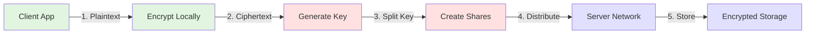

import { Card, CardHeader, CardTitle } from "@site/src/components/elements";
import { Callout } from "@site/src/components/elements";
import { Features, Feature } from '@site/src/components/elements/Features';
import CodeBlock from '@theme/CodeBlock';

# Introduction to Neuralock

## The Problem with Traditional Encryption

Traditional encryption systems face fundamental challenges when deployed in modern distributed applications:

  <Card>
    <CardHeader>
      <CardTitle>🎯 Single Points of Failure</CardTitle>
    </CardHeader>
    
Centralized key servers create vulnerability. If the server is compromised or goes offline, all encrypted data becomes inaccessible.

  </Card>
  
  <Card>
    <CardHeader>
      <CardTitle>🔐 Complex Key Management</CardTitle>
    </CardHeader>
    
Applications must handle key generation, storage, rotation, and distribution - adding complexity and security risks.

  </Card>
  
  <Card>
    <CardHeader>
      <CardTitle>🤝 Trust Requirements</CardTitle>
    </CardHeader>
    
Users must trust application operators with their encryption keys, creating privacy concerns and regulatory challenges.

  </Card>

## The Neuralock Solution

Neuralock addresses these challenges by combining two powerful technologies:

### 1. Shamir's Secret Sharing

Instead of storing encryption keys in one place, Neuralock splits them into multiple shares using Shamir's Secret Sharing algorithm. This mathematical technique ensures that:

- Individual shares reveal nothing about the original key
- Any k shares (threshold) can reconstruct the key
- Fewer than k shares cannot reconstruct anything
- System remains secure even if some servers are compromised

<CodeBlock language="text">
{`Example: 3-of-5 threshold
Original Key: K
Shares: S1, S2, S3, S4, S5

Any 3 shares can reconstruct K:
- S1 + S2 + S3 → K ✓
- S2 + S4 + S5 → K ✓
- S1 + S3 + S4 → K ✓

But 2 or fewer cannot:
- S1 + S2 → ? ✗
- S3 + S4 → ? ✗`}
</CodeBlock>

### 2. Blockchain-Based Access Control

Smart contracts define and enforce who can access encrypted data:

<CodeBlock language="solidity">
{`interface INeuralock {
    // Returns access level for user on object
    // 0: No access, 1: Read, 2: Write, 3: Read+Write
    function neuralock(address user, bytes32 objectId) 
        external view returns (uint8);
}`}
</CodeBlock>

This provides:
- **Transparency**: Access rules are public and verifiable
- **Immutability**: Permissions can't be changed without a trace
- **Decentralization**: No central authority controls access
- **Programmability**: Complex access logic through smart contracts

## Core Concepts

### Distributed Key Management

<Callout type="info">
  Neuralock servers never see your plaintext data or complete encryption keys. All sensitive cryptographic operations happen on the client side.
</Callout>

The system distributes trust across multiple independent servers:

1. **Client-Side Encryption**: Data is encrypted locally before leaving the client
2. **Share Distribution**: Each server receives only one share of the key
3. **Permission Verification**: Servers check blockchain before storing/returning shares
4. **Threshold Reconstruction**: Client needs minimum k shares to decrypt

### Flexible Security Models

Neuralock adapts to different security requirements:

<Features>
  <Feature 
    icon="🧪" 
    title="Development Mode (1-of-1)" 
    description="Single server for testing and development. Quick setup, instant operations."
  />
  <Feature 
    icon="🏢" 
    title="Standard Mode (2-of-3)" 
    description="Balance of security and availability. Tolerates one server failure."
  />
  <Feature 
    icon="🏛️" 
    title="High Security (3-of-5)" 
    description="Maximum security for sensitive data. Requires majority consensus."
  />
</Features>

### End-to-End Encryption Flow

## Benefits Over Traditional Systems

### Versus Centralized KMS

| Aspect | Traditional KMS | Neuralock |
|--------|----------------|-----------|
| Single Point of Failure | Yes | No |
| Vendor Lock-in | High | None |
| Trust Requirements | Full | Distributed |
| Availability | Limited | High |
| Cost Model | Subscription | Transaction-based |

### Versus Hardware Security Modules (HSM)

| Aspect | HSM | Neuralock |
|--------|-----|-----------|
| Initial Cost | Very High | Low |
| Scalability | Limited | Unlimited |
| Geographic Distribution | Complex | Native |
| Maintenance | High | Low |
| Flexibility | Low | High |

## Real-World Applications

### Document Management Systems
Encrypt sensitive documents with granular access control. Share specific documents with specific users without exposing your entire vault.

### Healthcare Records
Patients control their medical data while granting time-limited access to healthcare providers. Compliant with HIPAA and GDPR requirements.

### Financial Applications
Secure storage of trading strategies, API keys, and sensitive financial data. Implement multi-party approval workflows.

### IoT Device Management
Distribute device credentials and configuration securely. Update access permissions without touching devices.

<Callout type="success" title="Ready to Get Started?">
  Now that you understand the core concepts, explore the [architecture](/neuralock/overview/architecture) to see how all the pieces fit together, or jump straight to the [quick start guide](/neuralock/getting-started/quick-start) to begin implementation.
</Callout>

## Key Takeaways

1. **No Single Point of Failure**: Distributed architecture ensures availability
2. **True Privacy**: End-to-end encryption with no key escrow
3. **Flexible Security**: Adapt threshold to your security requirements
4. **Blockchain Transparency**: Immutable, verifiable access control
5. **Easy Integration**: Simple SDKs hide complexity

## Next Steps

- **[Architecture Overview](/neuralock/overview/architecture)** - Deep dive into system components
- **[How It Works](/neuralock/overview/how-it-works)** - Detailed protocol explanation
- **[Quick Start Guide](/neuralock/getting-started/quick-start)** - Start building immediately