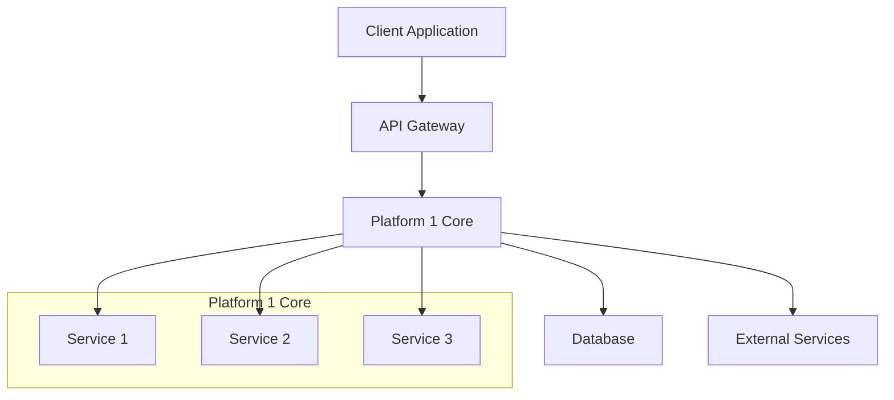

# Platform 1 Architecture

This section provides a detailed overview of Platform 1's architecture and design principles.

## System Overview

Describe the high-level architecture of your platform:

- **Component A**: Description and role
- **Component B**: Description and role
- **Component C**: Description and role

## Architecture Diagram

## Core Components

### Component A
Detailed description of Component A:
- Responsibilities
- Key features
- Integration points

### Component B
Detailed description of Component B:
- Responsibilities  
- Key features
- Integration points

### Component C
Detailed description of Component C:
- Responsibilities
- Key features
- Integration points

## Data Flow

Explain how data flows through your system:

1. **Input**: How data enters the system
2. **Processing**: How data is processed
3. **Storage**: How data is stored
4. **Output**: How data is returned

## Security Architecture

Describe your security model:
- Authentication mechanisms
- Authorization patterns
- Data encryption
- Network security

## Scalability & Performance

Explain how your platform handles:
- High load scenarios
- Horizontal scaling
- Performance optimization
- Resource management

## Integration Points

Document how other systems can integrate:
- API endpoints
- Webhooks
- Event streams
- SDK libraries

## Deployment Architecture

Describe deployment options:
- Cloud deployment
- On-premises deployment
- Hybrid scenarios
- Container orchestration