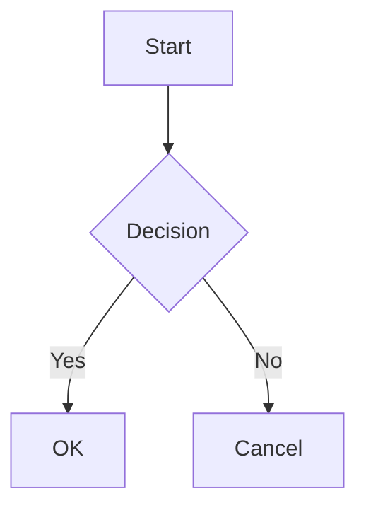

# Renderer

**Folder:** `src/parsers/renderers/`

The renderer converts preprocessed markdown into HTML using the Marked library, with syntax highlighting powered by Shiki and built-in diagram support.

## Role in the Pipeline

```
          ┌───────────────────────┼───────────────────────┐
          ▼                       ▼                       ▼
┌─────────────────┐     ┌─────────────────┐     ┌─────────────────┐
│  PREPROCESSORS  │     │    RENDERERS    │     │ POSTPROCESSORS  │
│                 │ ──▶ │  (YOU ARE HERE) │ ──▶ │                 │
│                 │     │  • marked.ts    │     │                 │
│                 │     │   (MD → HTML)   │     │                 │
└─────────────────┘     └─────────────────┘     └─────────────────┘
```

## Renderer Files

| File | Purpose |
|------|---------|
| `marked.ts` | Markdown renderer with Shiki highlighting and diagram handling |
| `index.ts` | Module exports |

## Overview

```
Preprocessed Markdown
         │
         ▼
┌─────────────────┐
│     Marked      │
│                 │
│  - Parsing      │
│  - Tokenizing   │
│  - Rendering    │
│  ┌────────────┐ │
│  │   Shiki    │ │  ← Syntax highlighting (build-time)
│  │ dual-theme │ │
│  └────────────┘ │
│  ┌────────────┐ │
│  │  Diagrams  │ │  ← mermaid/dot/graphviz → container divs
│  └────────────┘ │
└────────┬────────┘
         │
         ▼
    Raw HTML
```

## Syntax Highlighting

Code blocks are highlighted at **build time** using [Shiki](https://shiki.style/) with dual themes — no client-side JavaScript required.

### How It Works

The renderer uses `createMarkdownRendererAsync()` which initializes a shared Shiki highlighter instance. A custom `code()` renderer in Marked passes code blocks through Shiki's `codeToHtml()`:

```typescript
const highlighter = await createHighlighter({
  themes: ['github-light', 'github-dark'],
  langs: ['javascript', 'typescript', 'python', /* ... */],
});
```

### Dual-Theme Support

Shiki generates HTML with CSS custom properties for both themes:

```html
<pre class="shiki shiki-themes github-light github-dark">
  <code>
    <span style="--shiki-light:#D73A49;--shiki-dark:#F97583;">const</span>
    <span style="--shiki-light:#005CC5;--shiki-dark:#79B8FF;"> x</span>
    ...
  </code>
</pre>
```

CSS in `markdown.css` handles theme switching. Light mode uses the inline styles set by Shiki directly. Dark mode overrides via CSS custom properties:

```css
/* Light mode: uses Shiki's inline color and background-color directly */
/* (no override needed — inline styles are the light theme values) */

/* Dark mode: switch to --shiki-dark custom properties */
[data-theme="dark"] .markdown-content .shiki,
[data-theme="dark"] .markdown-content .shiki span {
  color: var(--shiki-dark) !important;
  background-color: var(--shiki-dark-bg) !important;
}
```

Theme switching is instant — no re-rendering needed.

### Supported Languages

The following languages are loaded by default:

| Category | Languages |
|----------|-----------|
| Web | `javascript`, `typescript`, `jsx`, `tsx`, `html`, `css`, `scss` |
| Data | `json`, `yaml`, `toml`, `xml`, `graphql`, `sql` |
| Systems | `rust`, `go`, `java`, `c`, `cpp` |
| Scripting | `python`, `bash`, `shell`, `sh`, `ruby`, `php` |
| Mobile | `swift`, `kotlin` |
| Other | `dockerfile`, `markdown` |

Unsupported languages fall back to plain text rendering (no highlighting, no errors).

## Diagram Code Blocks

The renderer intercepts `mermaid`, `dot`, and `graphviz` fenced code blocks and outputs diagram container divs instead of highlighted code:

````markdown

````

Renders to:

```html
<div class="diagram diagram-mermaid">graph TD
    A[Start] --> B{Decision}
    B -->|Yes| C[OK]
    B -->|No| D[Cancel]</div>
```

Both `dot` and `graphviz` language tags produce `<div class="diagram diagram-graphviz">`.

These containers are picked up by the client-side `diagrams.ts` script which lazily loads Mermaid or Graphviz libraries to render SVG diagrams. See the diagrams section below.

## Usage

```typescript
import { createMarkdownRendererAsync } from '@parsers/renderers';

// Create async renderer with syntax highlighting (recommended)
const render = await createMarkdownRendererAsync();
const html = render(markdownContent);

// Sync renderer without highlighting (for quick operations)
import { createMarkdownRenderer, defaultRenderer } from '@parsers/renderers';
const render = createMarkdownRenderer();
const html = defaultRenderer(markdownContent);
```

The `BaseContentParser` uses the async renderer automatically — the highlighter is initialized once and shared across all parse calls.

## Configuration

```typescript
const render = await createMarkdownRendererAsync({
  gfm: true,           // GitHub Flavored Markdown (default: true)
  breaks: false,       // Require blank line for new paragraph (default: false)
  extensions: [],      // Custom Marked extensions
});
```

## Supported Syntax

### GitHub Flavored Markdown

| Feature | Syntax |
|---------|--------|
| Tables | `\| col \| col \|` |
| Strikethrough | `~~text~~` |
| Task Lists | `- [x] item` |
| Autolinks | `https://example.com` |
| Fenced Code | ` ``` ` |

### Standard Markdown

- **Headings**: `# H1` through `###### H6`
- **Emphasis**: `*italic*`, `**bold**`, `***bold italic***`
- **Lists**: Ordered and unordered
- **Links**: `[text](url)` and `[text][ref]`
- **Images**: ``
- **Blockquotes**: `> quote`
- **Code**: Inline `` `code` `` and fenced blocks

## Performance

- **Shiki highlighter** is initialized once (lazy, shared singleton) and reused across all renders
- **Build-time highlighting** means zero client-side JS for syntax coloring
- **Dual-theme CSS variables** allow instant theme switching without re-rendering
- **Diagram languages** are excluded from Shiki processing — they output raw containers for client-side rendering
