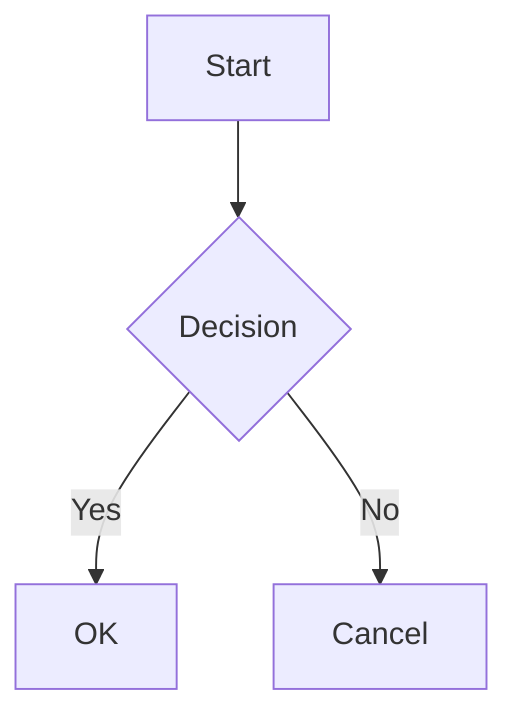
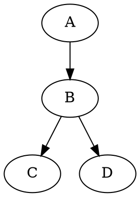
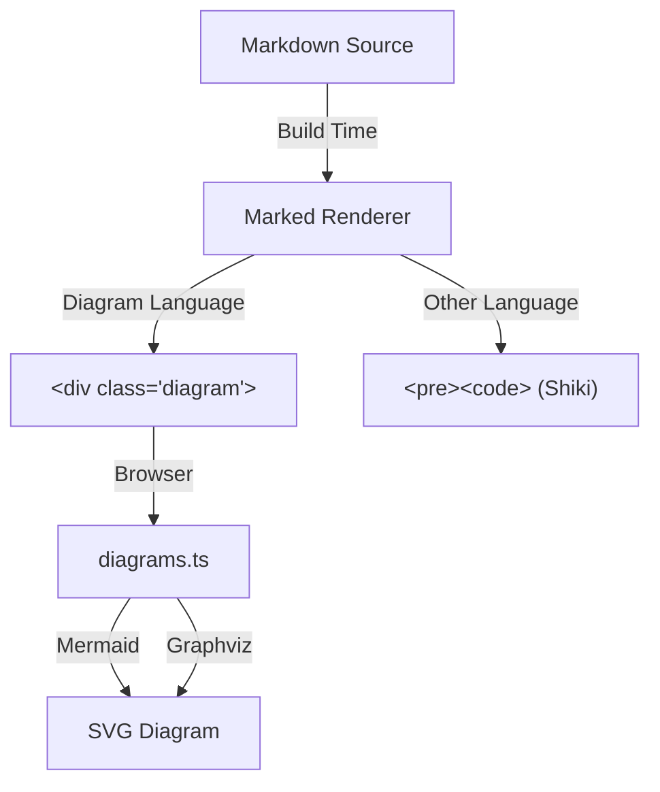
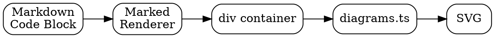

# Diagrams Script

**File:** `src/scripts/diagrams.ts`

Renders `mermaid`, `dot`, and `graphviz` fenced code blocks into SVG diagrams. Libraries are lazy-loaded from npm (Vite code-splits them) — pages without diagrams load zero extra JavaScript.

## How It Works

1. The markdown renderer (`marked.ts`) converts diagram code blocks into `<div class="diagram diagram-{type}">` containers with the raw source text
2. This script finds those containers and renders them into SVGs using the appropriate library

```
Build time:    ```mermaid ... ```  →  <div class="diagram diagram-mermaid">source</div>
Browser:       <div class="diagram diagram-mermaid">source</div>  →  <svg>...</svg>
```

## Supported Languages

| Code Block Language | Renderer | Library |
|---------------------|----------|---------|
| `mermaid` | Mermaid | `mermaid` (npm) |
| `dot` | Graphviz | `@hpcc-js/wasm-graphviz` (npm) |
| `graphviz` | Graphviz | `@hpcc-js/wasm-graphviz` (npm) |

## Usage

````markdown



````

## Example





## Dark Mode

Mermaid diagrams automatically re-render when the theme changes. The script watches the `data-theme` attribute on `<html>` via a `MutationObserver`:

- **Light mode:** `theme: 'default'`
- **Dark mode:** `theme: 'dark'`

The original diagram source is stored in a `data-source` attribute on each container so it can be re-rendered without losing the source text.

## CSS

Diagram styles are in `src/styles/markdown.css`:

```css
.markdown-content .diagram {
  text-align: center;
  margin: var(--spacing-lg) 0;
  padding: var(--spacing-md);
  background-color: var(--color-bg-secondary);
  border-radius: var(--border-radius-md);
  border: 1px solid var(--color-border-light);
  overflow-x: auto;
}

.markdown-content .diagram-rendered {
  background: none;
  border: none;
}

.markdown-content .diagram svg {
  max-width: 100%;
  height: auto;
}
```

## Events

| Event | Direction | Purpose |
|-------|-----------|---------|
| `diagrams:rendered` | Dispatches | Notifies other scripts (lightbox) that SVGs are ready |
| `diagrams:render` | Listens | Re-renders unprocessed diagrams (used by live editor) |
