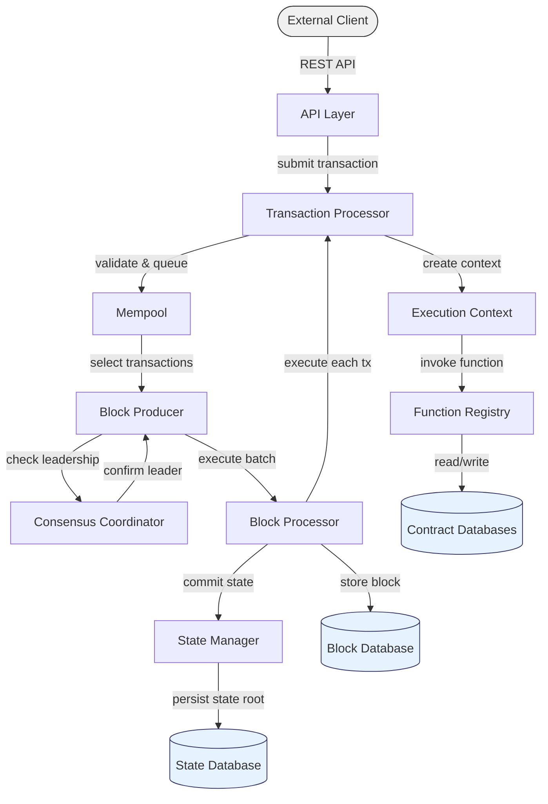

# Diagrams Script

**File:** `src/scripts/diagrams.ts`

Renders `mermaid`, `dot`, and `graphviz` fenced code blocks into SVG diagrams. Libraries are lazy-loaded from npm (Vite code-splits them) — pages without diagrams load zero extra JavaScript.

## How It Works

1. The markdown renderer (`marked.ts`) converts diagram code blocks into `<div class="diagram diagram-{type}">` containers with the raw source text
2. This script finds those containers and renders them into SVGs using the appropriate library

```
Build time:    ```mermaid ... ```  →  <div class="diagram diagram-mermaid">source</div>
Browser:       <div class="diagram diagram-mermaid">source</div>  →  <svg>...</svg>
```

## Supported Languages

| Code Block Language | Renderer | Library |
|---------------------|----------|---------|
| `mermaid` | Mermaid | `mermaid` (npm) |
| `dot` | Graphviz | `@hpcc-js/wasm-graphviz` (npm) |
| `graphviz` | Graphviz | `@hpcc-js/wasm-graphviz` (npm) |

## Usage

````markdown


````

## Example




## Dark Mode

Diagrams are always rendered with Mermaid's `default` (light) theme. Dark mode is handled entirely via CSS using `filter: invert(1) hue-rotate(180deg)` on the rendered SVG container.

**Why CSS instead of Mermaid's dark theme?**

Mermaid diagrams support inline `style` directives (e.g., `style Client fill:#f0f0f0,stroke:#333`). These user-defined colors override Mermaid's theme — so switching to `theme: 'dark'` changes the text color to white but leaves the fill as-is, resulting in white text on a light background (invisible).

The CSS filter approach inverts **all** colors uniformly — fills, strokes, and text — so contrast is always preserved regardless of inline styles.

```css
[data-theme="dark"] .markdown-content .diagram-rendered {
  filter: invert(1) hue-rotate(180deg);
}
```

| Filter | Effect |
|--------|--------|
| `invert(1)` | Flips all colors (light → dark, dark → light) |
| `hue-rotate(180deg)` | Rotates hues back so colors stay recognizable (blue stays blue, not orange) |

This also works for Graphviz diagrams — no special handling needed.

## CSS

Diagram styles are in `src/styles/markdown.css`:

```css
/* Container before rendering */
.markdown-content .diagram {
  text-align: center;
  margin: var(--spacing-lg) 0;
  padding: var(--spacing-md);
  background-color: var(--color-bg-secondary);
  border-radius: var(--border-radius-md);
  border: 1px solid var(--color-border-light);
  overflow-x: auto;
}

/* After rendering — remove container styling */
.markdown-content .diagram-rendered {
  background: none;
  border: none;
}

.markdown-content .diagram svg {
  max-width: 100%;
  height: auto;
}

/* Dark mode — invert all diagram colors uniformly */
[data-theme="dark"] .markdown-content .diagram-rendered {
  filter: invert(1) hue-rotate(180deg);
}
```

## Events

| Event | Direction | Purpose |
|-------|-----------|---------|
| `diagrams:rendered` | Dispatches | Notifies other scripts (lightbox) that SVGs are ready |
| `diagrams:render` | Listens | Re-renders unprocessed diagrams (used by live editor) |
